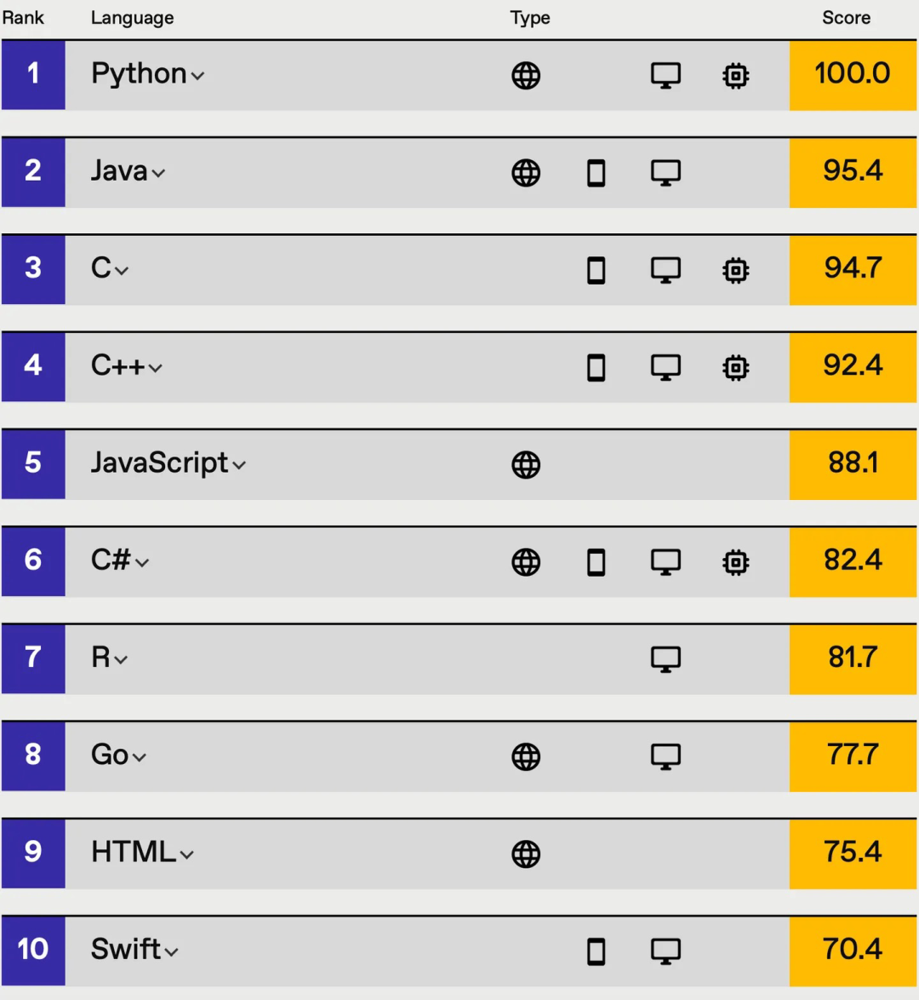
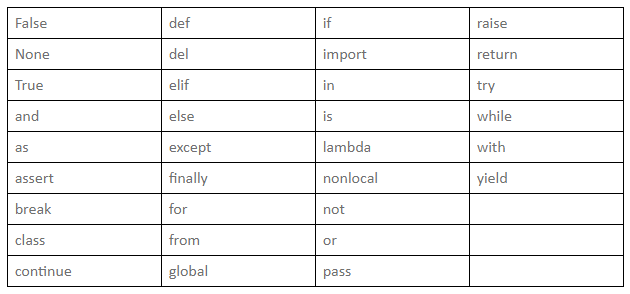

# Python 简介与语法基础

## 为什么选择Python

### Python 简史

1989年圣诞节，荷兰人 Guido van Rossum 闲着没事，决定开发一门新语言。他想做一门既像C语言那样强大，又像 shell 脚本那样简单易用的语言。于是 Python 诞生了（Python 单词本意是蟒蛇，因为 Guido 当时正在看蒙提·派森的喜剧《Monty Python》）。


1991年，Python 的第一个公开发行版问世。那时候估计没人想到，30多年后，这门语言会成为全球最受欢迎的编程语言之一。从2004年开始，Python 的使用率一路飙升，2010年拿下 TIOBE 年度语言，2017-2021年更是连续五年霸榜 IEEE Spectrum 编程语言排行榜。



### Python 版本

Python 主要分两大版本：
- **Python 2.x**：2000年发布，2020年1月1日正式停止维护，已经成为历史
- **Python 3.x**：2008年发布，是目前的主流版本

**注意**：本教程使用 Python 3.8+ 版本，请务必安装 Python 3.x，不要再用 Python 2 了。

### Python 特点

网上流传着一句话："人生苦短，我用 Python"。为什么这么说？

**1. 语法简单**
别的语言写个"Hello World"可能要好几行，Python 只需要一行：
```python
print("Hello World")
```

**2. 应用广泛**
- 网站开发（YouTube、Instagram 后端都是 Python）
- 数据分析（pandas、numpy 是标配）
- 人工智能（TensorFlow、PyTorch 都用 Python）
- 自动化运维、爬虫、游戏开发...

**3. 生态丰富**
Python 有海量的第三方库，你想做什么，大概率有人已经写好了。就像搭积木，拿来就用。

**4. 跨平台**
Windows、Mac、Linux 都能跑，写一次代码，到处运行。

### Python 能做什么

说白了，Python 几乎无所不能：

| 领域 | 实际应用 | 常用库/框架 |
|------|---------|------------|
| **Web开发** | 搭建网站、API接口 | Django、Flask、FastAPI |
| **数据分析** | 处理Excel、CSV，做可视化 | pandas、matplotlib |
| **人工智能** | 图像识别、自然语言处理 | TensorFlow、PyTorch |
| **自动化运维** | 批量管理服务器、定时任务 | Ansible、Fabric |
| **网络爬虫** | 抓取网页数据 | requests、Scrapy |
| **游戏开发** | 小游戏、游戏脚本 | Pygame、Panda3D |
| **办公自动化** | 自动处理Excel、Word | openpyxl、python-docx |

本教程主要聚焦在**办公自动化**和**游戏自动化**两个方向，学完后你能写出真正实用的脚本，解放双手。

## Python 语言基础

### 注释

写代码时，注释就是给代码加的"批注"，解释这段代码是干嘛的。Python 会完全忽略注释内容，所以不会影响程序运行。

Python 有三种注释方式：

**1. 单行注释** - 用 `#` 开头
```python
# 这是单行注释
x = 10  # 这也是注释，写在代码后面
```

**2. 多行注释** - 用三个引号 `'''` 或 `"""`
```python
'''
这是多行注释
可以写很多行
'''
```

**注意**：如果三引号用在变量赋值或函数定义里，它就不是注释，而是字符串。比如：
```python
name = """渣男教父"""  # 这是字符串，不是注释
```

### 缩进

Python 最特别的地方就是**用缩进来表示代码块**，而不是像其他语言那样用大括号 `{}`。

**为什么这样设计？**
据说 Guido 觉得大括号太丑了，而且代码里到处都是括号看着头疼。用缩进的话，代码看起来整齐清爽，强迫症患者狂喜。

**缩进规则：**
1. 同一代码块的语句必须有相同的缩进量
2. 一般用 **4个空格** 作为一级缩进（Tab键也可以，但不要混用）
3. 冒号 `:` 后面通常要换行缩进，比如 `if`、`for`、`def` 后面

**示例：**
```python
# 正确的缩进
if x > 0:
    print("x是正数")      # 这行缩进了4个空格
    print("大于零")       # 和上面同级，也要缩进4个空格
else:
    print("x不是正数")    # else 里的代码也要缩进

# 定义函数也要缩进
def add(a, b):
    result = a + b      # 函数体内的代码缩进
    return result       # 同一级，同样的缩进
```

**常见错误：**
```python
# 错误1：忘记缩进
if x > 0:
print("x是正数")    # 报错！这里必须缩进

# 错误2：缩进不一致
if x > 0:
    print("第一行")
        print("第二行")  # 报错！缩进量不一样

# 错误3：混用Tab和空格（肉眼看不出来，但Python会报错）
```

**小技巧**：在 PyCharm 里，输入冒号 `:` 后按回车，会自动帮你缩进，省心！

### 命名规范

写代码就像给变量、函数起名字，起得好不好直接影响代码的可读性。Python 有一套约定俗成的命名规则：

| 类型 | 命名规则 | 示例 |
|------|---------|------|
| **变量/函数** | 全小写，单词用下划线分隔 | `user_name`, `get_data()` |
| **类名** | 每个单词首字母大写（大驼峰） | `UserInfo`, `DataManager` |
| **常量** | 全大写，单词用下划线分隔 | `MAX_SIZE`, `PI` |
| **私有变量** | 双下划线开头 | `__private_var` |
| **模块名** | 全小写，尽量简短 | `utils.py`, `data_helper.py` |

**命名建议：**
- 名字要有意义，见名知意。比如用 `user_age` 而不是 `x`
- 不要用拼音，更不要用拼音缩写。`yong_hu_ming` 不如 `username`
- 避免使用单个字母（循环变量 i, j, k 除外）
- 常量就是值不会变的变量，Python 没有专门的常量关键字，约定俗成全大写

### 关键字

关键字是 Python 预留的特殊单词，有特定含义，**不能用作变量名或函数名**。

**常见关键字：**

| 类别 | 关键字 |
|------|--------|
| **条件判断** | `if`, `elif`, `else` |
| **循环** | `for`, `while`, `break`, `continue` |
| **函数/类** | `def`, `class`, `return`, `lambda` |
| **逻辑** | `and`, `or`, `not`, `True`, `False` |
| **其他** | `import`, `from`, `as`, `try`, `except` |

**完整关键字列表：**
```
False   await   else    import  pass
None    break   except  in      raise
True    class   finally is      return
and     continue for    lambda  try
as      def     from    nonlocal while
assert  del     global  not     with
async   elif    if      or      yield
```

**怎么查看所有关键字？**
```python
import keyword
print(keyword.kwlist)  # 打印所有关键字
print(keyword.iskeyword('if'))  # 判断是否是关键字，返回 True
```

**注意**：如果你不小心用关键字做了变量名，比如 `if = 10`，Python 会直接报错，连运行都不会让你运行。

### 标识符

标识符就是给变量、函数、类起的名字。起名字有规矩，不是想怎么起就怎么起。

**命名规则：**

1. **只能包含**：字母（包括中文）、数字、下划线 `_`
2. **不能以数字开头**：`2name` 不行，`name2` 可以
3. **不能用关键字**：`if`、`for` 这些都不行
4. **区分大小写**：`name` 和 `Name` 是两个不同的变量

**示例：**

```python
# 合法的标识符
name = "张三"
user_name = "李四"
_age = 18
名字 = "可以用中文，但不推荐"

# 不合法的标识符
2name = "报错！数字开头"
my-name = "报错！不能用减号"
my name = "报错！不能有空格"
class = "报错！class是关键字"
```

**大小写敏感：**
```python
name = "小写"
Name = "大写首字母"
NAME = "全大写"

print(name)   # 输出：小写
print(Name)   # 输出：大写首字母
print(NAME)   # 输出：全大写
# 这是三个完全不同的变量
```



### 变量

变量就是用来存数据的"盒子"，给它起个名字，以后就能通过名字找到这个数据。

**赋值语法：**
```python
变量名 = 值
```

注意这里的 `=` 不是数学里的"等于"，而是"把右边的值赋给左边的变量"。

**示例：**
```python
# 基本赋值
x = 10          # 把10赋给变量x
name = "张三"    # 把字符串赋给name
pi = 3.14159    # 把浮点数赋给pi

# 变量可以反复赋值（这就是为什么叫"变量"）
x = 10
print(x)    # 输出：10
x = 20
print(x)    # 输出：20（原来的10被覆盖了）

# 变量之间可以运算
a = 5
b = 3
c = a + b   # c = 8
```

**动态类型：**
Python 是动态类型语言，变量的类型可以随时变：
```python
x = 10          # x是整数
print(type(x))  # <class 'int'>

x = "hello"     # 现在x变成字符串了
print(type(x))  # <class 'str'>

x = 3.14        # 又变成浮点数了
print(type(x))  # <class 'float'>
```

**重要提醒：**
1. 使用变量前必须先赋值，否则会报错 `NameError`
2. 变量名要符合标识符规则（不能以数字开头，不能用关键字）
3. 变量名区分大小写，`name` 和 `Name` 是不同的变量

## Python 新手常犯的6个错误

Python 语法虽然简单，但有些坑新手几乎都会踩一遍。提前了解，少走弯路。

### 错误1：缩进不对

Python 用缩进表示代码块，缩进错了程序就会乱套。

```python
# 错误示例1：忘记缩进
if x > 0:
print("x是正数")    # 报错！if下面必须缩进

# 错误示例2：缩进不一致
if x > 0:
    print("第一行")
        print("第二行")  # 报错！和第一行缩进不一样

# 错误示例3：混用Tab和空格（肉眼看不出来，但Python会报错）
```

### 错误2：忘记写冒号

`if`、`for`、`def` 这些语句后面必须加冒号 `:`

```python
# 错误
if x > 0
    print("x是正数")    # 报错！少了冒号

# 正确
if x > 0:
    print("x是正数")
```

### 错误3：用了中文符号

编程必须用英文符号，中文符号会报错。

```python
# 错误（用了中文冒号）
if x > 0：
    print("x是正数")

# 错误（用了中文括号）
print（"hello"）

# 正确
if x > 0:
    print("hello")
```

**怎么区分？** 中文符号占两个字符宽度，英文符号占一个。

### 错误4：变量没定义就用

```python
# 错误
print(age)    # 报错！age是什么？

# 正确
age = 20
print(age)
```

### 错误5：用 `=` 做比较

`=` 是赋值，`==` 才是比较是否相等。

```python
# 错误
if x = 5:     # 报错！这里应该用 ==
    print("x等于5")

# 正确
if x == 5:
    print("x等于5")
```

### 错误6：字符串和数字直接相加

```python
# 错误
age = 18
print("我今年" + age + "岁")    # 报错！字符串和数字不能相加

# 正确做法1：把数字转成字符串
print("我今年" + str(age) + "岁")

# 正确做法2：用格式化字符串（推荐）
print(f"我今年{age}岁")
```

### 5、用 "=" 做等值比较

```python
animal = 'dog'
if animal = 'cat':
    print("这是一只猫")
if animal = 'dog':
    print("这是一条狗")
# 等值比较用 = 是错误的，应该改为 ==
animal = 'dog'
if animal == 'cat':
    print("这是一只猫")
if animal == 'dog':
    print("这是一条狗")
```

### 6、字符串非字符串连接

```python
num = 1
string = '2'
result = num + string
# 数字类型和字符串类型相加在Python 中是不可以的
# 应该改成
num = 1
string = '2'
result = num + int(string)
# 或者
num = 1
string = '2'
result = str(num) + string
# 可以自己尝试运行两段代码，看看有什么不一样
```

## ✏️ 练手时间

来验收一下学习成果吧！

1. （单选）Python 单行注释的符号是（）。
   - A. //
   - B. #
   - C. '''…'''
   - D. """…"""

2. （单选）下列说法错误的是（）。
   - A. Python 的代码块不使用大括号 {} 来控制类、函数以及其他逻辑判断
   - B. Python 利用冒号和代码缩进来决定代码块范围
   - C. 一个代码块语句内必须包含等量的缩进空白
   - D. Python 代码的缩进量只能是4个空格或1个Tab键及其整数倍，不可随意缩进

3. （单选）下面哪个不是合法的 Python 变量名？
   - A. _300cm
   - B. user_
   - C. 119Fire
   - D. qwer110

4. （多选）下列哪些不是 Python 的合法标识符？
   - A. int32
   - B. 300dt
   - C. and
   - D. beautiful

---

🔑 **答案揭秘**：

<details>
<summary>点击查看答案</summary>

**答案**：
1. **B** - `#` 是Python的单行注释符号
2. **D** - Python缩进量没有强制要求必须是4个空格，只要是统一的缩进即可
3. **C** - `119Fire` 以数字开头，不符合变量名命名规则
4. **B、C** - `300dt` 以数字开头；`and` 是Python关键字

**解析**：
- 第1题：Python用 `#` 做单行注释，`//` 是其他语言的注释符号，三引号是多行字符串（也可当注释用）
- 第2题：Python缩进只要统一就行，没有强制4个空格的要求（虽然PEP8推荐4个空格）
- 第3题：变量名不能以数字开头，`119Fire` 违反了这条规则
- 第4题：标识符不能以数字开头，也不能用关键字。`int32` 和 `beautiful` 都是合法的

</details>