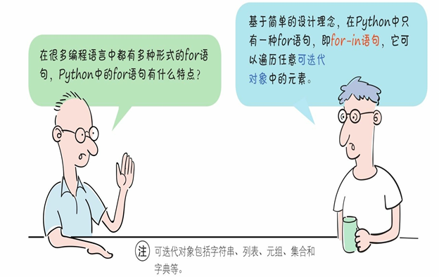
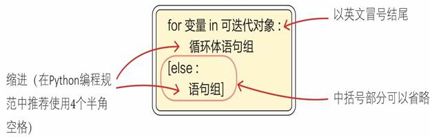
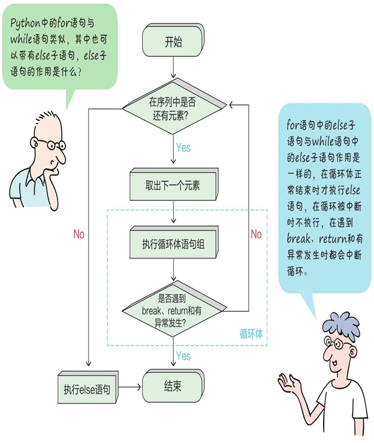
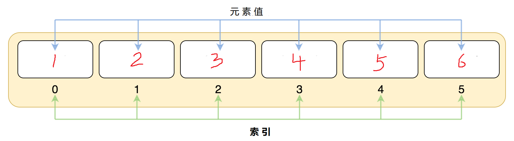
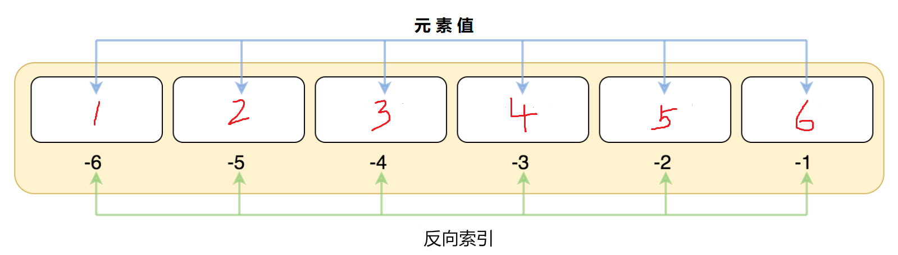
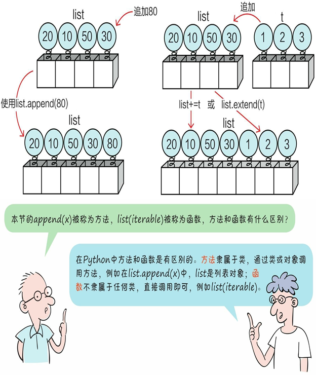
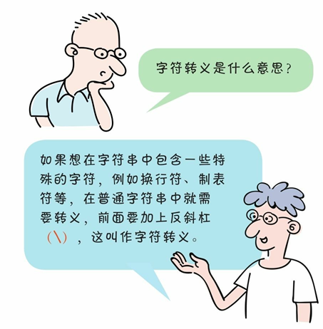
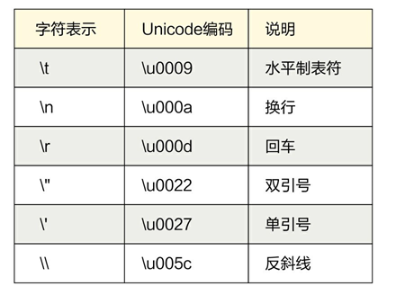

# 数值类型与条件分支

## 🎯 内容回顾

光看不练假把式，来几道题热热身！

阅读前先温习一下，上一篇的内容还记得吗：

1. 学习了Python的数值类型(Numbers)，不同数值类型之间的转换和相关运算。
2. 学习了四类常用运算符的使用。
3. 学习了条件分支语句，并编写了一个猜数字游戏。

在前面文档的基础上继续Python学习征途，本文档的主要内容如下：

1. 学习 for 循环，并通过 for 循环计算从1到100所有整数的相加的和。
2. 学习Python字符串
3. 学习Python列表

---

上代码，搞起来！

<details>
<summary>点击查看参考代码</summary>

```python
# 参考代码（待补充）

```

**思路解析**：

（解析待补充）

</details>

## for 循环

我们有个特点，就是不喜欢做重复的事情，而工作中那些重复的事情又不得不做，我想大多数人都会有同样的感受，反复地做同样的事情很枯燥。

面对这个问题，接触学习了编程之后，发现计算机非常擅长去做重复繁琐的事情，既然如此，为什么不让计算机来为我们完成这些重复的事情呢？

接下来我们带大家学习如何让计算机去完成那些重复的事情。

首先我们来理解循环（looping）的概念：循环就是让计算机程序周而复始地重复执行同样的步骤，循环主要分为两种类型：

- 第一种：重复一定次数的循环，称为计数循环（counting loop），这种循环用在Python中用 for 来完成非常的方便。比如计算1到100所有整数的和，1+2+3+...+99+100，重复的相加动作，而且重复的次数是确定的，总共累加99次；
- 第二种：重复直至发生某种情况时结束的循环，称为条件循环（conditional loop），因为只要条件为真，这种循环会一直持续下去。比如上一篇我们编写的猜数字游戏，我们一次次的输入数字去匹配谜底数字，如果没有猜对，就重复不断的输入数字去匹配，直到匹配成功为止。完成这种重复工作，在Python中使用 while 循环非常的方便（while循环会在后面的文档中详细讲解）。

所以我们根据对循环概念的理解分析，通常会说第一种循环称为for循环或计数循环。第二种循环称为while循环或条件循环。

今天我们重点来学习 for 循环。

### for 语法

for 语句的一般格式如下：

for 循环的执行流程图如下：





### 示例讲解

了解了 for 循环的语法和执行流程，赶紧来编码实现功能：计算1到100所有整数的和，1+2+3+...+99+100。

咱们来一步步实现。

第一步、通过for语句的语法，in 后面是一个可迭代对象，1 到 100 这100个数要怎么表示成可迭代对象呢？

在Python中可以使用列表（后面马上会学到）表示，比如1到5的列表可以表示成 [1, 2, 3, 4, 5]，通过可迭代的列表先上手使用一下 for 循环，结合列表简单的打印出5次 "晚上好"，上代码：



有没有发现其实很简单，下面升级一下：计算列表 [1, 2, 3, 4, 5] 各项相加之和，也就是1 到 5 各数相加之和，继续上代码：

搞定了1到5各数的相加，那么搞定1到100各数相加也应该是分分钟的事情，修改一下整数列表就OK了吗，修改整数列表的时候发现，这从1敲到100需要花费大量时间手动输入，如果这样重复的事情要手动去敲，就没有发挥循环的优势了，能有好的办法吗？

对于这个问题，Python早就默默的为我们想到了，这里用到了一个超级重要的对象就是 range()。

range()是一个内置函数，它可以为指定的整数生成一个数字序列（也就是可迭代对象），range()语法如下：

```python
integer_list = [1, 2, 3, 4, 5]
for i in integer_list:
    print('晚上好')

# 运行结果
晚上好
晚上好
晚上好
晚上好
晚上好

integer_list = [1, 2, 3, 4, 5]
total = 0
for i in integer_list:
    total += i
print("1 到 5 各数相加之和 =", total)

# 运行结果
1 到 5 各数相加之和 = 15
```

range 和 for的关系非常的亲密，它们两个经常会同时出现。关于range()的三种用法，但无论选择哪一种，它的参数只能是整数。

通过代码我们来熟悉一下 range() 函数：

```python
range(stop)   # 第一种用法是只有一个参数的情况，它会生成从0到stop的数字，但是不包含stop。
range(start, stop)   # 第二种用法除了指定结束数值，还指定了开始数值。
range(start, stop, step)  # 第三种用法还允许指定步长，这个值默认是1，即生成的数字序列中，每个元素的间隔为1。这个步长除了可以是正整数，还可以是负整数。

for i in range(5):
    print(i)

for i in range(1, 5):
    print(i)

for i in range(0, 5, 2):
    print(i)
```

对照输出结果，你是不是有疑惑：为什么没有 5 呢？

关于 range() 函数需要注意的一点是，它会提供一个数字列表，从给定的第一个数开始，在给定的最后一个数之前结束。编写代码的时候必须要考虑到这一点，正确的调整范围来得到想要的循环次数。

有了 range 实现 1到100各数相加的和已经没有任何阻碍了，看代码：

```python
total = 0
for i in range(100):
    total += i
print('1到100各数相加的和 = ', total)

# 运行结果
1到100各数相加的和 =  4950
```

咦，你有没有发现什么不对的地方，求得的和好像不对。要将 range(100) 改成 range(101)，这是问题在平时的编程中尤其要重点注意，改进代码如下：

```python
total = 0
for i in range(101):
    total += i
print('1到100各数相加的和 = ', total)

# 运行结果
1到100各数相加的和 =  5050
```

range() 可以说是跟for循环"如胶似漆"，但 for循环可并不只有range() 一个小伙伴，它还可以跟其他很多的小伙伴配合，完成各种重复的工作，下面马上就来讲一讲 for 循环的两个小伙伴列表和字符串。

## 列表

在Python中，可包含其他对象的对象，称之为"容器"。容器是一种数据结构。

常用的容器主要划分为两种：
- 序列（如：列表、元组等）
- 映射（如：字典）

序列中，每个元素都有下标，它们是有序的。序列有通用的操作方法：索引、长度、组合（序列相加）、重复（乘法）、分片、检查成员、遍历、最小值和最大值。

映射中，每个元素都有名称（又称"键"），它们是无序的。

注意：除了序列和映射之外，还有一种需要注意的容器——"集合"。

列表(list) 是 Python 最基本的数据结构之一，咱们一起重点学习使用它。

列表具有如下特点：

- 有序的数据结构：可以通过索引（也称下标）访问内部数据。
- 可变的数据类型：可以随意添加、删除和更新列表内的数据，列表对象会自动伸缩，确保内部数据无缝隙有序排列。
- 内部数据统称为元素，元素的值可以重复，可以为任意类型的数据，如数字、字符串、列表、元组、字典和集合等。

列表的字面值使用中括号 ( [] ) 包含所有元素，元素之间使用英文逗号 ( , ) 分隔。

### 创建列表

创建列表有两种方法：

1. `list(iterable)` 类型构造函数：参数 iterable 是可迭代对象（字符串、列表、元组、集合和字典等）。
2. `[元素1，元素2，元素3，⋯]`：指定具体的列表元素，元素之间以逗号分隔，列表元素需要使用英文中括号 [] 括起来。

比如：

```python
list1 = [1, 2, 3, 4, 5, 6]  # 使用英文中括号 [] 创建列表
list2 = ['youbafu', 32, True]  # 元素类型可以不一样
list3 = list('youbafu')  # 字符串转字符列表

print(list1)
print(list2)
print(list3)

# 运行结果
[1, 2, 3, 4, 5, 6]
['youbafu', 32, True]
['y', 'o', 'u', 'b', 'a', 'f', 'u']
```



### 常用操作

我们以上面 '列表1' 为例，列表下标从 0 开始，第二个下标是 1，依此类推。索引也可以从尾部开始，最后一个元素的索引为 -1，往前一位为 -2，以此类推。

认识了列表的下标，一起跟着代码来学习一下列表的常用操作方法：

```python
num_list = [1, 2, 3, 4, 5, 6]

# 按下标取值
print(num_list[0], num_list[5])
print(num_list[-6], num_list[-1])

# 使用 index()方法获取 2在列表 num_list 中首次出现的下标
index = num_list.index(2)
print(index)

# 使用count()方法获取 2 在列表 num_list 中出现的次数
count = num_list.count(2)
print(count)

# 使用 len()方法获取列表判断长度
length = len(num_list)
print(length)

# 当且仅当列表为空，在if条件中被判断为False
if num_list:
    print("列表num_list不为空")

lst0 = []
if not lst0:
    print("列表lst0为空")

# 列表是否包含某个元素
# 使用 in 关键字可以检测一个列表中是否存在指定的值，如果存在，则返回 True；否则返回 False。
# 使用 not in 关键字也可以检测一个值，返回值与 in 关键字相反。
print(2 in num_list, 6 not in num_list)

# 使用min() 和 max() 方法获取最小值和最大值
print(min(num_list), max(num_list))

# 运行结果可以发现结果是一样的
1 6
1
1
6
列表num_list不为空
列表lst0为空
True False
```



除了按指定索引获取列表元素，还可以通过前面学过的随机模块 random 中的 choice() 方法可以从列表中随机获取一个元素，结合上一篇的猜数字游戏，假如我们得谜底数字不是0 到10之间，是指定列表中的一个值，来看看如何实现：

```python
# 导入随机模块
import random

secret_value_list = [2, 5, 9, 10, 100]
secret_number = random.choice(secret_value_list)
print(secret_number)

# 运行结果
9
```

### 更新、添加

**更新元素**：通过索引来对列表的元素进行修改或更新。

**添加元素**：append() 方法、extend() 方法、insert() 方法、+ 运算符、*运算符

append() 方法、extend() 方法、+ 运算符、*运算符对列表添加元素，都是往列表的末尾添加数据。insert() 方法则可以添加元素到指定位置，insert()方法有两个参数：第一个参数指定待插入的位置（索引值），第二个参数是待插入的元素值。

#### 更新元素

```python
my_list = [1, 2, 3, 4, 5]
my_list[0] = 20  # 将列表第一个元素改成20
print('更新列表第一个元素后', my_list)

# 运行结果
更新列表第一个元素后 [20, 2, 3, 4, 5]
```



#### append() 方法

列表对象的 append() 方法用于在列表的末尾追加元素，语法如下：

```python
list_name.append(obj)
```

其中，list_name 为要添加元素的列表名称，obj 为要添加到列表末尾的对象。比如:

```python
my_list = [20, 10, 50, 30]
my_list.append(80)
print(my_list)

# 运行结果
[20, 10, 50, 30, 80]
```

#### extend() 方法

append() 方法是向列表中添加一个元素，如果想要将一个迭代对象中的全部元素添加当前列表对象的尾部，可以使用列表对象的 extend() 方法实现，用法如下：

```python
list_name.extend(seq)
```

其中，list_name 为当前列表；seq 为要添加的迭代对象。语句执行后，seq 的内容将追加到 list_name 的后面，比如：

```python
my_list = [20, 10, 50, 30]
my_list.extend([1, 2, 3])
print(my_list)

# 运行结果
[20, 10, 50, 30, 1, 2, 3]
```

#### insert() 方法

使用列表对象的 insert() 方法可以将元素添加到指定下标位置。语法格式如下：

```python
list_name.insert(index, obj)
```

参数 index 表示插入的索引位置；obj 表示要插入列表中的对象。该方法没有返回值，只是在原列表指定位置插入对象。 上代码：

```python
my_list = [1, 2, 3, 4, 5]
my_list.insert(0, 6)
print(my_list)

# 运行结果
[6, 1, 2, 3, 4, 5]
```

#### + 运算符

与 extend() 方法功能类似，使用 + 运算符可以将两个列表对象合并为一个新的列表对象。

注意：+ 运算符实际上并不是在原列表中添加元素，而是创建了一个新列表，并将原列表中的元素和参数对象依次复制到新列表中。由于涉及大量元素的复制，该操作速度较慢，在涉及大量元素添加时不建议使用该方法。 上代码：

```python
my_list = [20, 10, 50, 30]
my_list = my_list + [1, 2, 3]
print(my_list)

# 运行结果
[20, 10, 50, 30, 1, 2, 3]
```

#### * 运算符

使用 * 运算符可以扩展列表对象，将列表与整数相乘，生成一个新列表，新列表是原列表中元素的重复。 上代码：

```python
my_list = [1, 2, 3, 4, 5]
my_list = my_list * 3
print(my_list)

# 运行结果
[1, 2, 3, 4, 5, 1, 2, 3, 4, 5, 1, 2, 3, 4, 5]
```

### 删除

从列表中删除元素，可以有三种方法实现：del 命令、pop() 方法、remove()方法、clear()方法

删除元素主要有两种情况：一种是根据索引删除；另一种是根据元素值进行删除。

#### remove() 方法

使用列表对象的 remove() 方法可以删除首次出现的指定元素。语法格式如下：

```python
list_name.remove(obj)
```

参数 obj 表示列表中要移除的对象，即列表元素的值。该方法没有返回值，如果列表中不存在要删除的元素，则抛出异常。 上代码：

```python
num_list = [1, 2, 2, 3, 4]
num_list.remove(2)  # 删除首次出现的2
print(num_list)

# 运行结果
[1, 2, 3, 4]
```

#### pop() 方法

使用列表的 pop() 方法可以删除并返回指定位置上的元素。语法格式如下：

```python
list_name.pop([index=-1])
```

参数 index 表示要移除列表元素的索引值，默认值为-1，即删除最后一个列表值。如果给定的索引值超出了列表的范围，将抛出异常。 上代码：

```python
num_list = [1, 2, 2, 3, 4]
num_list.pop()  # 默认删除列表最后一个元素
print(num_list)
num_list.pop(0)  # 删除列表第一个元素
print(num_list)

# 运行结果
[1, 2, 2, 3]
[2, 2, 3]
```

#### del 命令

可以使用 del 命令来删除列表指定位置的的元素。 上代码：

```python
num_list = [1, 2, 3, 4]
del num_list[0]
print(num_list)

# 运行结果
[2, 3, 4]
```

#### clear() 方法

使用列表对象的 clear() 方法可以删除列表中所有的元素。该方法没有参数，也没有返回值。 上代码：

```python
num_list = [1, 2, 3, 4]
num_list.clear()
print(num_list)

# 运行结果
[]
```

**列表删除方法的总结：**

- pop() 方法是删除索引对应的值，remove() 方法是删除列表对象中最左边的一个值。
- pop() 方法针对的是元素的索引进行操作，remove() 方法针对的是元素的值进行操作。
- del 是一条命令，而不是方法，使用频率不及 pop() 和 remove() 方法。

### 遍历

我们可以直接遍历列表内容，当需要获取元素值和对应下标的时候更推荐使用 enumerate() 函数，enumerate() 函数用于将一个可遍历的数据对象(如列表、元组或字符串)组合为一个索引序列，同时列出数据和数据下标，一般用在 for 循环当中，比如：

```python
lst = list('Python')

for i in lst:
    print(i)

# 输出结果
P
y
t
h
o
n

for i, v in enumerate(lst):
    print(i, v)

# 输出结果
0 P
1 y
2 t
3 h
4 o
5 n
```

### 排序

使用列表对象的 sort() 方法可以进行自定义排序，此时列表对象本身被修改，list_name.sort() 方法包含 2个可选参数（设定比较关键字，应用情况较为复杂，暂时不用理解），先学习设定排序方式，默认是升序，想要降序排列时，添加参数 reverse=True 即可，sort() 方法无返回值。 上代码：

```python
num_list = [2, 32, 344, 6, 56, 876]
num_list.sort()  # 默认升序
print(num_list)
num_list.sort(reverse=True)  # 降序
print(num_list)

# 运行结果
[2, 6, 32, 56, 344, 876]
[876, 344, 56, 32, 6, 2]
```

### 切片

切片（slice）语法的引入，使得Python的列表真正地走向了高端。切片让我们能够非常方便的来处理列表元素。

现在要求将列表list1中的三个元素取出来，放到列表list2里面。学了前面的知识，可以使用基础方法来实现：

```python
num_list = [1, 2, 3, 4, 5]
num_list2 = [num_list[0], num_list[1], num_list[2]]
print("新列表：", num_list2)

# 运行结果
新列表： [1, 2, 3]
```

如果我们学会了切片，会大大地简化了这种操作，赶紧来试试：

```python
num_list = [1, 2, 3, 4, 5]
num_list2 = num_list[0:3]
print("切片出来的列表：", num_list2)

# 运行结果
切片出来的列表： [1, 2, 3]
```

很简单对吧？只不过是用一个冒号隔开两个索引值，左边是开始位置，右边是结束位置。这里要注意的一点是：结束位置上的元素是不包含的（如上面例子中，4的索引值也是4，我们写的是list[0:3]，便不能将其包含进来）。

使用列表切片也可以"偷懒"，之前提到过Python是以简洁而闻名于世，所以你能想到的"便捷方案"，Python的作者以及Python社区的小伙伴们都已经想到了，并付诸实践，你要做的就是验证一下是否可行：

```python
list = [1, 2, 3, 4, 5, 6]
print(list[:3])
print(list[3:])
print(list[:])   # 复制列表
print(list[::-1])  # 翻转列表

# 运行结果
[1, 2, 3]
[4, 5, 6]
[1, 2, 3, 4, 5, 6]
[6, 5, 4, 3, 2, 1]
```

如果省略了开始位置，Python会从0这个位置开始。同样道理，如果要得到从指定索引值到列表末尾的所有元素，把结束位置也省去即可。如果啥都没有，只有一个冒号，Python将返回整个列表的拷贝。

注意：列表切片并不会修改列表自身的组成结构和数据，它其实是为列表创建一个新的拷贝（副本）并返回。

## 字符串

编程学习者接触到的第一条语句 `print('hello world')` 就已经认识和使用字符串了，字符串几乎是所有编程语言在项目开发过程中，涉及最多的一块内容。大部分项目的运行结果，都需要以文本的形式展示给客户，比如财务系统的总账报表；电子游戏的比赛结果，火车站的列车时刻表等。这些都是经过程序精密的计算、判断和梳理，将我们想要的内容以文本形式直观地展示出来。

有人曾调侃说，程序员开发一个项目，基本上就是在不断地处理字符串。虽然有点夸张，但也足够说明字符串的应用广泛。今天我们来详细的讲解一下Python的字符串。

字符串使用单引号包裹起来的内容，也可以使用双引号，但务必要成对编写，不能一边是单引号而另一边是双引号。

### 常用表示方式

字符串有三种表示方式：普通字符串、原始字符串和长字符串。

#### 普通字符串

普通字符串指用单引号（'）或双引号（"）括起来的字符串。

在使用单引号定义的字符串中，可以直接包含双引号，而不必进行转义；而在使用双引号定义的字符串中，可以直接包含单引号，而不必进行转义。即外单内双，外双内单。所以在使用普通字符串中重点需要注意的就是转义，什么是转义呢，看下图：


编码中比较常见的转义符如下：





简单的来看看代码：

```python
s = 'Hi Python'
print(s)

s = 'Hi \'" \n Python'  # 了解转义符
print(s)

# 运行结果
Hi Python
Hi '" 
 Python
```

#### 原始字符串

原生字符串的出现目的：解决在字符串中显示特殊字符。在原生字符串里，所有的字符都直接按照字面的意思来使用，不支持转义序列和非打印的字符。

