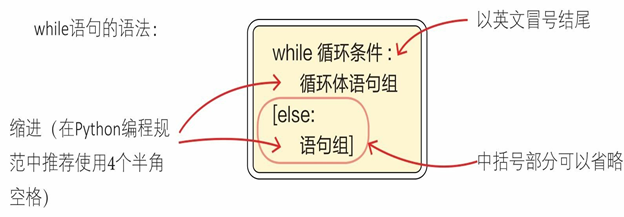
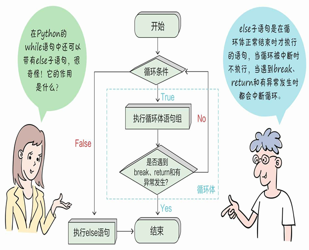
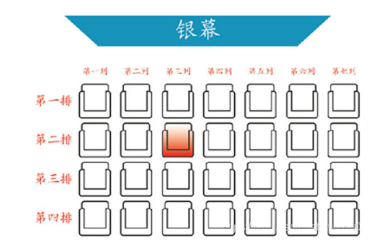
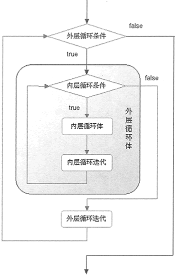
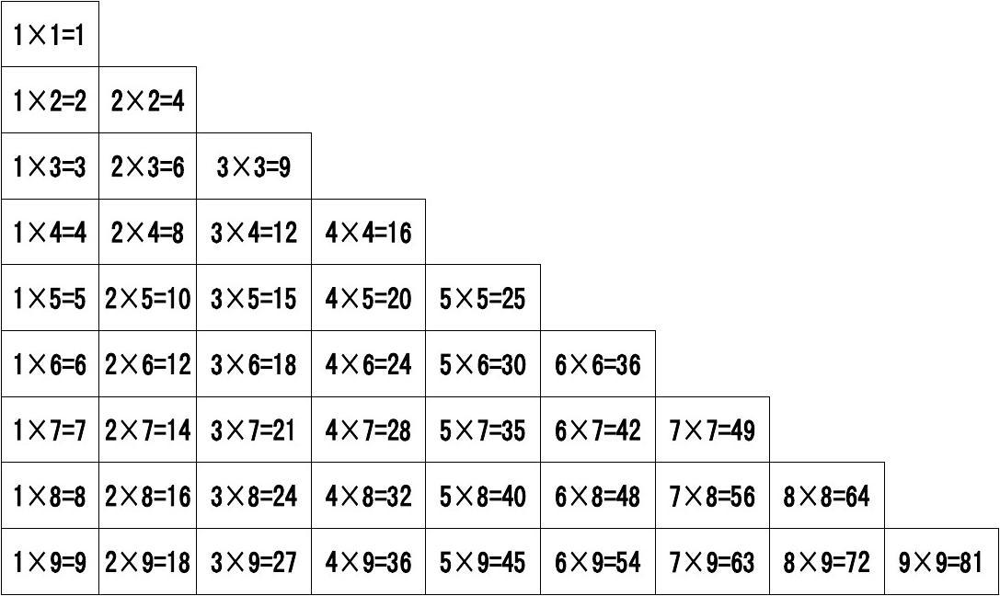

# while 循环与循环嵌套

## 🎯 内容回顾

是时候展示真正的技术了！

在上一节课，我们学习了for循环、列表和字符串的定义、语法和一些常用方法。今天课程主要内容如下：

1. 学习 while 条件循环，改进猜数字游戏。
2. 学习循环嵌套，打印九九乘法表。

## while 循环

上堂课我们学习循环的时候讲到了Python的循环有两种形式，一种计数循环也就是学过的 for 循环，那么还有另一种条件循环，就是我们今天要学习的 while 循环。

while 循环其实与 if 条件分支有些相似，它们语法结构都是关键字后面接条件表达式，当条件表达式为 True 时，就执行下方的代码块，它们都可以接 else。不同的地方是，条件表达式为 True 时，if 只会执行一次，而 while 会执行完整个代码块之后，又会返回来继续判断条件表达式，一直循环反复。

来看看 while 循环的语法。

### while 语法

结合 while 语法来学习一下执行顺序：



### 示例讲解

前面的课程中我们了解到：循环就是让计算机程序周而复始地重复执行同样的步骤，并且使用 for 循环实现了1到100各整数相加的和，既然都是循环，for 循环能完成的事情，while 循环应该也是完成的吧，带大家一起来尝试一下：

开始之前，首先来整理一下思路，while 循环和 for 循环不同，它没有确定的循环次数，需要一个表达式的计算结果来控制是否继续执行，那么要求和，我们先设定总和 = 0，加数为1，然后用加数 + 总和的值再赋值给总和，同时将加数 +1，不断重复前面的动作，直到加数 > 100 停止相加。

现在来将思路转换成代码：

```python
total = 0
addend = 1
while addend <= 100:
    total += addend
    addend += 1
print('1到100各数相加的和 = ', total)

# 运行结果
1到100各数相加的和 =  5050
```



你有没有发现，虽然 while 循环和 for 循环都完成了1到100各整数相加的和，但是它们的逻辑处理是截然不同的。所以我们在以后遇到需要用循环来处理的时候，应该先思考一下，循环次数是不是明确的，或者是有明确的达成条件，根据问题情况来选择使用的具体的循环结构。

有些情况使用 for 循环或 while 循环差别不大。

比如：打印所有的水仙花数（一个三位数，其各位数字立方和等于该数本身）。

因为需要解决的问题中有明确的计算区间（100 - 999），同样也很方便的用条件表达式来确定执行次数，跟着来编码实现一下：

```python
# while 循环计算水仙花数
num = 100
while num <= 999:
    i = num // 100  # 整除取百分位
    j = (num % 100) // 10
    k = num % 100 % 10
    if i ** 3 + j ** 3 + k ** 3 == i * 100 + j * 10 + k:
        print(num)
    num += 1

# for 循环计算水仙花数
for n in range(100, 1000):
    i = n // 100  # 整除取百分位
    j = (n % 100) // 10
    k = n % 10  # 比较 n % 100 % 10 区别
    if i ** 3 + j ** 3 + k ** 3 == i * 100 + j * 10 + k:
        print(n)
```

计算水仙花数使用 while 循环或 for 循环感觉差不多，但有些情况还是有较大的区别。

比如在第二堂课中我们使用 if 条件分支编写了一个简单的猜数字游戏，但那是个一次性的游戏，可玩性太差了，我们想结合循环来改造一下，如果输入数字没有猜对，我们提示猜大了或猜小了，重复的执行输入、判断、输出，直到猜对了结束游戏。分析这个猜测过程中，几次能猜对是不确定的，但结束条件又非常的明确，所有这个时候 while 循环的优势就体现出来了。

结合 while 循环来一起升级一下猜数字游戏，让游戏变得有趣一些。

改进的思路是随机设定谜底数字，如果输入的数字和谜底数字相等则打印 "大吉大利，今晚吃鸡"，否则重复输入数字继续和谜底数字进行比较。

来，上代码：

```python
# 改进猜数字游戏
import random
secret_number = random.randint(0, 10)
input_string = input("设了个数字，你来猜猜看:")
guess_number = int(input_string)
while guess_number != secret_number:
    if guess_number > secret_number:
        print("不好意思，您猜大了")
    else:
        print("您猜的有点小")
    input_string = input("设了个数字，你来猜猜看:")
    guess_number = int(input_string)
else:   # 注意这里的 else 执行的条件和次数
    print("大吉大利，今晚吃鸡")
```

猜数字游戏加入循环之后，可玩性强了不少，说完猜数字游戏，我们来一起看看 while 循环一种特殊情况。

### 无限循环

while 循环是根据条件表达式的结果来判断是否执行循环体，设想有这么一种情况，如果while 表达式永远为 True 会怎么样？

我们写个代码来试试看：

```python
while 1 > 0:  # 表达式永远为 True
    num = input("说点啥呗  :")
    print("你刚刚输入了: ", num)
print("说够了，能停下来吗？")
```

执行上述代码你可以重复不断的输入内容，只要你电脑不死机，不断电，输入到天荒地老也停不下来，想要结束只能强行终止。

无限循环（有时候也称死循环）虽然很多时候看起来无用且耗费资源，但是在特定的程序中，无限循环又是必不可少的特性。比如网络服务器，负责网络收发的程序必须7×24小时待命，随时准备接收新的请求并分派给相关的进程，毕竟通常的网站是没有"打烊"一说的。再如游戏开发，通常也是放置一个死循环，只要游戏没结束，就会不断地接收用户的操作命令，并做出响应。

了解了无限循环，又改进了猜数字游戏，接下来我们尝试编写实现打印出九九乘法表，你来思考一下，简单的用一个 for 循环或 while 循环能否实现呢？

我没有用一个 for 循环或 while循环实现过九九乘法表，为什么呢？因为用循环嵌套简单的很，一起来学习一下吧。

## 循环嵌套

前面我们学习过 if 的嵌套，回想一下 if 嵌套是什么样子的？

类似 if 的嵌套，循环嵌套就是在一个 for 循环体或 while 循环体中嵌入另一个 for 循环或 while 循环体，多层循环体组合这称之为循环嵌套。

举个栗子，在电影院找座位号，需要知道第几排第几列才能准确找到自己的座位号，假如我买了一张二排三列的座位，要找到座位，首先找到第二排，然后在第二排的基础上再找到第三列，这个寻找座位的过程就类似于循环嵌套。

循环嵌套执行流程图如下：





### 打印九九乘法表

学习了循环嵌套，我们一起来尝试使用循环嵌套打印出九九乘法表，九九乘法表在小学就已经学过了，两个乘数都是1到9之间，是不是两层循环就可以实现了呢？

赶紧写代码来实现一下：

```python
for i in range(1, 10):
    for j in range(1, 10):
        print(f'{j} * {i} = {i * j}', end='  ')
    print()

# 输出结果
1 * 1 = 1  2 * 1 = 2  3 * 1 = 3  4 * 1 = 4  5 * 1 = 5  6 * 1 = 6  7 * 1 = 7  8 * 1 = 8  9 * 1 = 9
1 * 2 = 2  2 * 2 = 4  3 * 2 = 6  4 * 2 = 8  5 * 2 = 10  6 * 2 = 12  7 * 2 = 14  8 * 2 = 16  9 * 2 = 18
...
```

这个结果好像没有错，但又和小学学的不太一样，我们来看看我们以前学的九九乘法表的样子，如下图：

我们打印出来的结果有很多是重复的，该怎么去掉那些重复的呢？

我们需要更改一下第二层循环，把第二层循环的循环次数结合第一层循环来确定，看下面代码：

```python
# 九九乘法表
for i in range(1, 10):
    for j in range(1, i + 1):
        print(f'{j} * {i} = {i * j}', end='  ')
    print()

# 运行结果
1 * 1 = 1
1 * 2 = 2  2 * 2 = 4
1 * 3 = 3  2 * 3 = 6  3 * 3 = 9
...
```

搞定。

通过两层 for 循环嵌套很便捷的实现了九九乘法表的打印输出，打印出来的结果和样式都基本正确，不知道有没有同学发现，第三列和第四列的在对齐上有一点小的瑕疵，要想解决这个问题并不难，结合上堂课学过的字符串格式化很容易就能解决掉，实现思想就是指定乘法的结果整数的宽度和对齐方式。具体的用法可以参照下表:



数字 | 格式 | 输出 | 描述
---|---|---|---
3.1415926 | {:.2f} | 3.14 | 保留小数点后两位
3.1415926 | {:+.2f} | +3.14 | 带符号保留小数点后两位
-1 | {:+.2f} | -1.00 | 带符号保留小数点后两位
2.71828 | {:.0f} | 3 | 不带小数
5 | {:0>2d} | 05 | 数字补零 (填充左边, 宽度为2)
5 | {:x<4d} | 5xxx | 数字补x (填充右边, 宽度为4)
10 | {:x<4d} | 10xx | 数字补x (填充右边, 宽度为4)
1000000 | {:,} | 1,000,000 | 以逗号分隔的数字格式
0.25 | {:.2%} | 25.00% | 百分比格式
1000000000 | {:.2e} | 1.00e+09 | 指数记法
13 | {:>10d} | 13 | 右对齐 (默认, 宽度为10)
13 | {:<10d} | 13 | 左对齐 (宽度为10)
13 | {:^10d} | 13 | 中间对齐 (宽度为10)
11 | {:b}'.format(11) | 1011 | 二进制
11 | {:d}'.format(11) | 11 | 十进制
11 | {:o}'.format(11) | 13 | 八进制
11 | {:x}'.format(11) | b | 十六进制
11 | {:#x}'.format(11) | 0xb | 十六进制带前缀
11 | {:#X}'.format(11) | 0XB | 十六进制带前缀大写

^, <, > 分别是居中、左对齐、右对齐，后面带宽度，: 号后面带填充的字符，只能是一个字符，不指定则默认是用空格填充。
+ 表示在正数前显示 +，负数前显示 -；
（空格）表示在正数前加空格
b、d、o、x 分别是二进制、十进制、八进制、十六进制。

结合指定整数的宽度和对齐方式，很容易实现我们的对齐需求，来一起看看代码：

```python
for i in range(1, 10):
    for j in range(1, i+1):
        print(f'{j} * {i} = {i * j:^2d}', end='  ')
    print()
```

### 改进猜数字游戏

在学习 while 循环的时候我们对第二堂课学过的猜数字进行了改进，使得可玩性有了提升，但是在真正的使用过程中会出现一些不符合程序预期的情况，比如说我们设定和希望是，输入的都是数字，可实际情况中玩家可能会输入字母或符号，那怎么办呢？这就需要我们对程序进一步的升级和改造，面对一些不符合预期的情况，可以给出提示，让程序继续的执行下去，而不是直接报错停止，也就是所谓提升程序的健壮性。

结合循环嵌套和字符串的使用，我们可以对猜数字游戏进行输入情况进行判断和提示，比如，输入了字母而非数字，这个时候游戏应该提示：请输入正确的数字。

有了改进思路，赶紧跟着一起来升级代码吧。 上代码：

```python
import random
secret_number = random.randint(0, 10)
input_string = input("设了个数字，你来猜猜看:")
while not input_string.isdigit():
    input_string = input("您输入了非数字字符，请输入正确的数字：")
else:
    guess_number = int(input_string)
while guess_number != secret_number:
    if guess_number > secret_number:
        print("不好意思，您猜大了")
    else:
        print("您猜的有点小")
    input_string = input("设了个数字，你来猜猜看:")
    while not input_string.isdigit():
        input_string = input("您输入了非数字字符，请输入正确的数字：")
    else:
        guess_number = int(input_string)
else:
    print("大吉大利，今晚吃鸡")
```

猜数字游戏经过两次改进，游戏的可玩性和健壮性有了很大的提示。但是从开发编码的角度来查看代码，虽然代码总体量不大，其中却有着不少的重复代码，这些重复代码可以通过定义函数来解决。

在后续的课程内容中，我们会继续会学习，如何优化该游戏代码。

## 文档总结

本节课我们重点学习了 while 循环的用法，并带领大家使用 while 循环替代 for 循环计算 1 到 100 的整数相加之和。接着又分别使用了 while 循环和 for 循环来计算水仙花数，帮助大家来理解两者的区别和联系。

猜数字游戏在 while 无限循环的使用下，可玩性提高了很多，并且通过循环嵌套，对输入的字符串进行判断和提示，减少了运行时崩溃的可能性，提高了程序的健壮性。

在打印九九乘法表的时候，我们使用双重 for 循环嵌套，方便又简单的实现了功能，那么留给一道思考题：如果用 while 循环双重嵌套打印九九乘法表，代码该怎么写呢？

来挑战一下吧，欢迎在社群中分享你的代码！

## 练习题

### 选择题（都为单选题）

1、托尼老弟想要学好 Python，他写了一段代码，鞭策自己好好学习，如果输入 y 则继续，否则退出，看看他写的对吗？（）

```python
tag = 'y'
for tag == 'y':
    print('好好学习Python')
    tag = input('是否继续学习？ y/n')
```

A. 1 行改成 tag=y
B. 2 行 for 改成 while
C. 3 行改成 print(我要好好学习)
D. 没有错误

2、托尼老弟最近跟着学 Python，他写了一组代码，想要输出10行10列的*，帮他看看有什么错误吧？

```python
for i in range(1, 10):
    for j in range(1, 11):
        print('*', end='')
    print()
```

A、1行10改成11
B、2行11改成10
C、2行 range 改成 random
D、正确，可以输出

3、托尼老弟想使用两重循环找出100以内的两位数，满足条件：所有十位数数字比个位数数字小的数。看看他写的哪里错了吧？（）

```python
for x in [1, 2, 3, 4, 5, 6, 7, 8, 9]:
    for y in [0, 1, 2, 3, 4, 5, 6, 7, 8, 9]:
        if x < y:
            print(f'十位数数字比个位数数字小的数：{x + y}')
```

A、1 行 for 改成 while
B、3 行去掉最后的冒号 :
C、4 行改成 print(f'十位数数字比个位数数字小的数：{x * 10  + y}')
D、没有错误

### 编程题

4、求10-300以内同时能被7,8整除的整数。

5、打印出1-100以内含有6的数（思路提示：将数字转换成字符串再处理）。

6、有1 2 3 4 这四个数字，能组成多少个互不相同且无重复数字的三位数？各是多少？

7、输入一个小于10的正整数n，根据n的值的不同，输出相应的形状:

n = 5 时
```
    *
   ***
  *****
 *******
*********
```

8、输入一个小于10的正整数n，根据n的值的不同，输出相应的形状：

n = 4
```
*
**
***
****
```

9、输入一个小于10的正整数n，根据n的值的不同，输出相应的回文数:

n = 4
```
    1
   121
  12321
 1234321
```

n = 5
```
    1
   121
  12321
 1234321
123454321
```

n = 6
```
     1
    121
   12321
  1234321
 123454321
12345654321
```