# break、continue 与函数

## 🎯 课前回顾

来验收一下学习成果吧！

上节课我们玩转了 while 循环，并使用 while 循环替代 for 循环计算 1 到 100 的整数相加之和，然后又分别使用了 while 循环和 for 循环来计算水仙花数。通过使用 while 无限循环和循环嵌套，对猜数字游戏进行了再一次的升级改造。

上节课留了一道思考题：用 while 循环双重嵌套打印九九乘法表，有人做出来吗？

## break 和 continue

上堂课我们学习无限循环（也称死循环），关于死循环有人就说："死循环一旦跑起来，就再也没有回头路了……"。想一想真的只能这样吗？

在没学习 break 的时候，确实是有点不知道怎么结束它，除了强行停止程序，或者关掉电脑。但是在掌握了break语句后，就可以让随时跳出循环的枷锁。除此之外还有 return 语句，不过 return 语句多用于函数中，稍后会讲解到。

循环中 break 和 continue 语句可以改变循环的执行逻辑顺序。

举个栗子（关于break）：托尼老弟在美容美发店里上班，每天都得上班，就好比无限循环一样，忽然一天托尼老弟买的彩票中了5000万，托尼老弟拿着中奖的彩票说，我可以再也不用上班啦！break 就像中奖的彩票，可以让托尼老弟再也不用上班了。

再来个 continue 的比方：托尼老弟还是在美容美发店里上班，每天都还得上班，今天气温骤降让托尼老弟感冒了，导致今天不得不向老板请一天的假，明天还得继续上班，continue 就好比今天的感冒，让托尼老弟可以跳过今天的工作，但明天还得继续。

通过生活中的例子了解了概念，一起来看看语法的具体使用。

### break 语句

break 语句的语法比较简单，只需要在相应的 while 或 for 循环体语句中加入即可。break 语句一般会与 if 语句搭配使用，表示在某种条件下，跳出循环。如果使用嵌套循环，break 语句将跳出其所在层的循环。

在 while 语句中使用 break 语句的形式如下：

```python
while 条件表达式1:
    执行代码
    if 条件表达式2:
        break
```

其中条件表达式2用于判断何时调用 break 语句跳出循环。在 while 语句中使用 break 语句的流程如图所示：

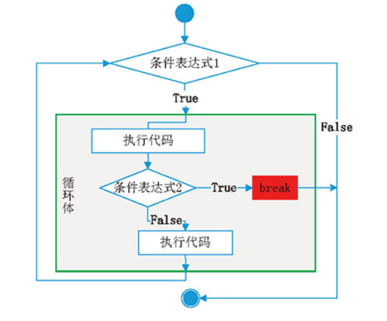

在 for 语句中使用 break 语句的形式如下：

```python
for 迭代变量 in 对象:
    if 条件表达式:
        break
```

其中，条件表达式用于判断何时调用 break 语句跳出循环。在 for 语句中使用 break 语句的流程如图所示。

美容店上班的托尼老弟工作甚是辛苦，想跟着学习 Python 来改变生活，我跟托尼老弟说，只要你每天坚持认真学习 Python，三个月后，你就可以不用去美发店上班了。此时托尼老弟现在已经学习80天了，实例结合代码来看一看：

```python
study_days = 80
while True:
    study_days += 1
    print(f'美发店上班，晚上坚持学习Python 第 {study_days} 天')
    if study_days > 90:
        print('Python 已学成， 不再去美发店上班了。')
        break
```

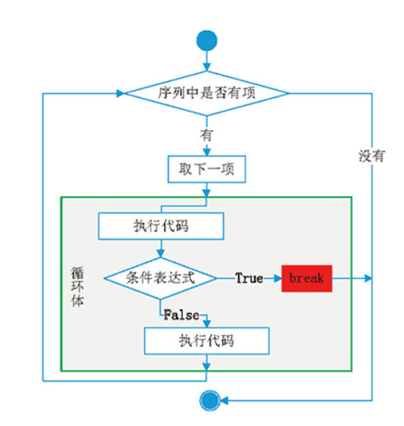

### continue 语句

continue 语句的语法也比较简单，只需要在相应的 while 或 for 循环体语句中加入即可。continue 语句一般也会与 if 语句搭配使用，表示在某种条件下，跳过当前循环的剩余语句，然后继续进行下一轮循环。如果使用嵌套循环，continue 语句将只跳过其所在层循环中的剩余语句。

在 while 语句中使用 continue 语句的形式如下：

```python
while 条件表达式1:
    执行代码
    if 条件表达式2:
        continue
```

其中，条件表达式2用于判断何时调用 continue 语句跳出循环。在 while 语句中使用 continue 语句的流程如图所示。

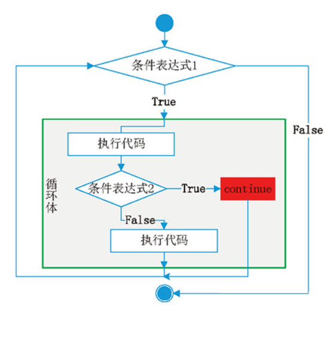

在 for 语句中使用 continue 语句的形式如下：

```python
for 迭代变量 in 对象:
    if 条件表达式:
        continue
```

其中，条件表达式用于判断何时调用 continue 语句跳出循环。在 for 语句中使用 continue 语句的流程如图所示。

托尼老弟在学习 Python 中，第88天感冒了，不能去美发店上班，要被老板扣掉工资，感冒的老弟更加难受了，我们结合 continue 来看看如何使用：

```python
study_days = 80
while True:
    study_days += 1
    if study_days == 88:
        print('老弟今天感冒了， 不能去美发店上班了。')
        continue
    if 学习天数 > 90:
        print('Python 已学成， 不再去美发店上班了。')
        break
    print(f'美发店上班，晚上坚持学习Python 第 {学习天数} 天')
```

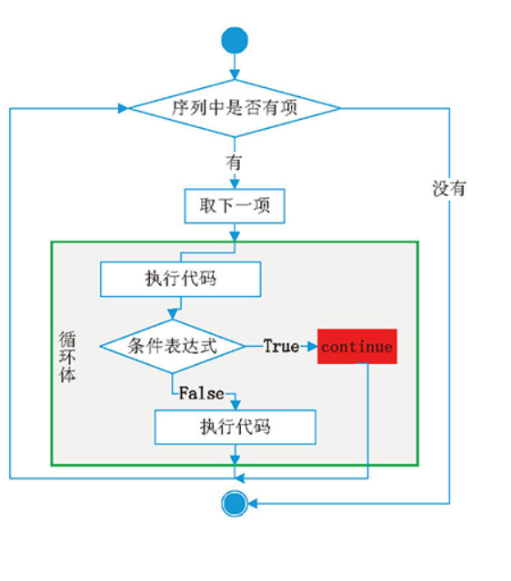

关于 break 和 continue 需要注意的一点是：如果在循环嵌套中使用了 break 或 continue，则只会作用于具体的循环层。

## 函数

乐高积木相信大家都比较熟悉吧，它提供了许多的设定好的组件，只要通过想象和创意，就可以用它拼凑出很多神奇的东西。

随着学习Python的深入，编写的代码量将会不断增加，程序结构也日益复杂，那么我们需要找一个好的方法对这些复杂的代码进行梳理重构。回想一下上堂课最后讲到改进后的猜数字游戏中判断输入值有两段代码是完全相同的，今天学习函数后就可以利用函数实现降低代码结构的复杂性和冗杂度，并且能够提升代码的可读性，下面简单总结了函数的作用和优点：

**函数的作用**：将具有独立功能的代码块包装成一个整体使用函数，使用是主要分为两个步骤。

1. 定义函数（将具有独立功能的代码包装起来）
2. 调用函数（执行包装的代码）

**函数的优点**：

1. 更方便的使用功能
2. 减少重复代码，避免代码的冗余
3. 有利于代码重构

函数是Python编程中超级重要基础内容，Python 自身提供了许多内置函数，比如 print()、max()、min()、abs()、str()、list() 等等，内置函数非常的丰富，我们可以参考学习，同样也可以自定义实现其功能。要学好函数，应在课堂中保持和老师同步，课后多练习。

### 定义、调用函数

自定义函数的语法格式如下：以英文半角冒号结尾

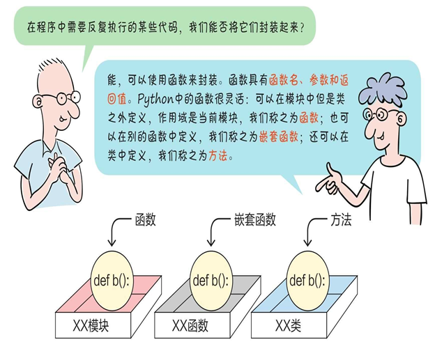

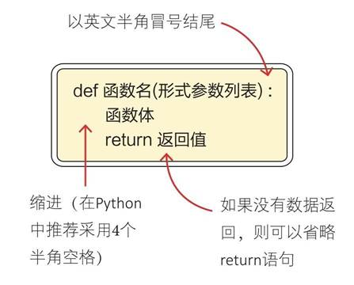

比如我们定义一个求两个数的最大值的函数：

结合函数定义，我们先来学习一下 pass 空语句，Python 中的 pass 语句，表示空语句，它将不做任何事情，一般起到占位作用，比如我们想实现一个求和函数，但是具体实现思路还没有整理好，但我们又不想让函数代码报错，这个时候 pass 就可以很好的来解决，代码如下：

```python
def 求和(x,y):
    pass
```

了解完 pass 语句，下面来定义一个简单功能的函数。

举个栗子，非常喜欢和大家一起上课的时光，每次上课的时候都想说上10遍，"大家好，想死你们了"，结合函数来实现一下（函数的定义虽然有输入参数和返回值，但也不一定是必须的）：

```python
def 打招呼():
    for i in range(10):
        print('大家好，想死你们了')

打招呼()

# 运行结果
大家好，想死你们了
大家好，想死你们了
大家好，想死你们了
大家好，想死你们了
大家好，想死你们了
大家好，想死你们了
大家好，想死你们了
大家好，想死你们了
大家好，想死你们了
大家好，想死你们了
```

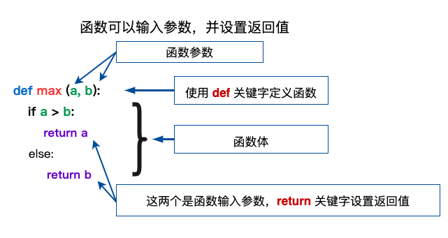

### 参数和返回值

#### 认识参数和返回值

了解了简单的函数定义和调用，我们给大家带来了一个有意思的例子来学习理解一下函数的参数和返回值。

例子是这样的：假如你的女朋友就是一个函数，你给她的关心，买的礼物都属于输入参数，你女朋友的反馈就属于 return 返回值，当函数执行到 return 时，表示函数已经执行完成，即 return 后的语句不再执行，从当前函数退出。

你可以对你女朋友没有任何表示，这个函数也是成立的，所以函数的输入参数也是可以为空的，你可以给你女朋友口头关心，也可以买礼物，所以输入参数可以是一个或是多个。

对于你给予女朋友的不同的礼物，女朋友可能默不作声，也可能给你反手一巴掌，这都是反馈，所以return可以返回值，也可以不返回，或是不存在。

代码如下：

```python
def girlfriend(gift=None):
    if gift is None:
        print("啥都不送，还想要我表示")
    elif gift == 'LV':
        return "I LOVE YOU"
    else:
        print("滚滚滚")
        return

print(girlfriend())
print(girlfriend("多喝热水"))
print(girlfriend('LV'))

# 运行结果
啥都不送，还想要我表示
None
滚滚滚
None
I LOVE YOU
```

运行结果：可以看到只有当你送LV的时候，女朋友才给你了一个 I LOVE YOU 的反馈（return）, 其他情况都是内心戏，什么都没返回给你，就是个空（None）。

#### 形参和实参

关于参数，这里需要理解一下关于函数 "形式参数" 和 "实际参数" 的概念。

结合例子来看，比如我们定义一个计算长方形面积的函数：

```python
def rect_area(width, height):
    area = width * height
    return area

r_area = rect_area(320, 480)
print("{0} × {1} 长方形的面积:{2:.2f}".format(320, 480, r_area))

# 运行结果
320 × 480 长方形的面积:153600.00
```

函数定义的形参一般称作位置参数，在调用函数时传递的实参与定义函数时的形参顺序一致，这是调用函数的基本形式。

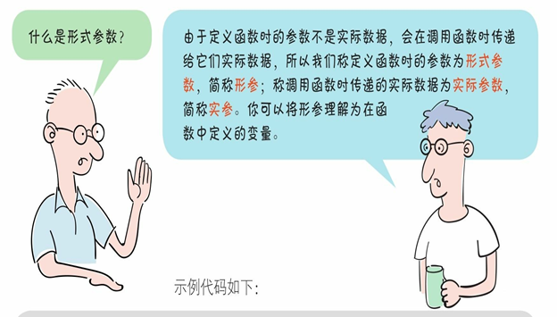

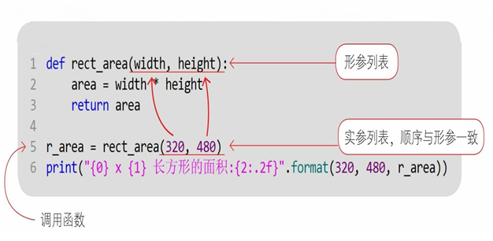

#### 关键字参数

一般情况下实参列表的数量、顺序和形参保持一致，那有人可能要问，实参的顺序是否可以在调用的时候更改，我们可以肯定的告诉大家，是可以更改实参顺序，不过前提条件也是有的，就是需要加上形参定义时的名称，来接着计算长方形面积的函数来看：

```python
def rect_area(width, height):
    area = width * height
    return area

r_area = rect_area(width=320, height=480)
print("{0} × {1} 长方形的面积:{2:.2f}".format(320, 480, r_area))

r_area = rect_area(height=480, width=320)
print("{0} × {1} 长方形的面积:{2:.2f}".format(320, 480, r_area))

# 运行结果
320 × 480 长方形的面积:153600.00
320 × 480 长方形的面积:153600.00
```

可以结合下面的图解来学习理解。

#### 参数默认值

刚刚我们了解了使用关键字可以改变实参的顺序，有没有办法让实参和形参的数量也不一样呢？我们可以肯定的告诉大家，也是可以的，不过也是有前提条件的，条件就是需要在定义形参的时候需要指定参数的默认值，继续以计算长方形面积的函数来讲解，假设有这么一种情况，就是我们要计算的长方形的高都是一样的，而宽不同，那么我们可以如下定义函数：

```python
def rect_area(width, height=480):
    area = width * height
    return area

r_area = rect_area(320)  # 调用的时候带上关键字效果一样 rect_area(width=320)
print("{0} × {1} 长方形的面积:{2:.2f}".format(320, 480, r_area))

# 运行结果
320 × 480 长方形的面积:153600.00
```

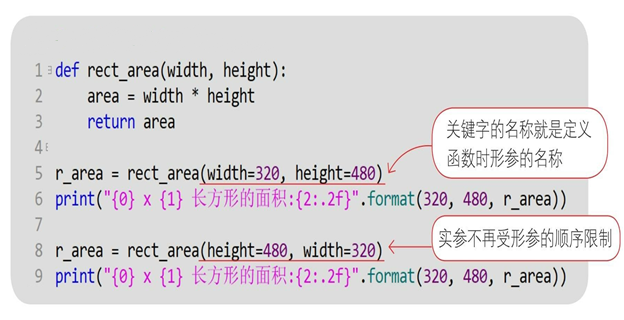

学习了参数默认值，现在应该可以很好的理解 print() 函数中的 end 参数了吧，print() 函数中 end 参数的默认值是 \n 换行，在实际使用中我们可以结合关键字参数来对 end 参数进行重新传值。

关于函数的参数和返回值还有更多、更有意思的用法，会在接下来学习了元组之后结合元组进行讲解。

### 优化猜数字游戏

学习了函数的参数和返回值，现在可以使用函数来优化上堂课的猜数字游戏了，先回顾一下上堂课最后猜数字游戏代码的样子。 上代码：

```python
import random
secret_number = random.randint(0, 10)

input_string = input("设了个数字，你来猜猜看:")
while not input_string.isdigit():
    input_string = input("您输入了非数字字符，请输入正确的数字：")
else:
    guess_number = int(input_string)

while guess_number != secret_number:
    if guess_number > secret_number:
        print("不好意思，您猜大了")
    else:
        print("您猜的有点小")
    input_string = input("设了个数字，你来猜猜看:")
    while not input_string.isdigit():
        input_string = input("您输入了非数字字符，请输入正确的数字：")
    else:
        guess_number = int(input_string)
else:
    print("大吉大利，今晚吃鸡")
```

上面的代码重复出现了两次，我么可以将其定义成一个函数，来看看代码如何实现：

```python
import random

secret_number = random.randint(0, 10)

def get_valid_input():
    input_string = input("设了个数字，你来猜猜看:")
    while not input_string.isdigit():
        input_string = input("您输入了非数字字符，请输入正确的数字：")
    else:
        guess_number = int(input_string)
        return guess_number

guess_number = get_valid_input()
while guess_number != secret_number:
    if guess_number > secret_number:
        print("不好意思，您猜大了")
    else:
        print("您猜的有点小")
    guess_number = get_valid_input()
else:
    print("大吉大利，今晚吃鸡")
```

通过调用函数，有效减少了重复代码，提高了可读性。

### 内置函数

Python 解释器自带的函数叫做内置函数，这些函数可以直接使用，不需要导入某个模块，详细介绍可以看官方文档：内置函数 — Python 3.8.12 文档

比如我们用的最多的 print() 函数就是 Python 内置函数中的其中一个，下表列出了 Python3 的内置函数：

| 函数 | 函数 | 函数 | 函数 | 函数 |
|---|---|---|---|---|
| abs() | delattr() | hash() | memoryview() | set() |
| all() | dict() | help() | min() | setattr() |
| any() | dir() | hex() | next() | slicea() |
| ascii() | divmod() | id() | object() | sorted() |
| bin() | enumerate() | input() | oct() | staticmethod() |
| bool() | eval() | int() | open() | str() |
| breakpoint() | exec() | isinstance() | ord() | sum() |
| bytearray() | filter() | issubclass() | pow() | super() |
| bytes() | float() | iter() | print() | tuple() |
| callable() | format() | len() | property() | type() |
| chr() | frozenset() | list() | range() | vars() |
| classmethod() | getattr() | locals() | repr() | zip() |
| compile() | globals() | map() | reversed() | import() |
| complex() | hasattr() | max() | round() | |

我们拿 max() 来举例说明一下：max() 函数返回给定参数的最大值，参数可以为序列。 上代码：

```python
print(f"max(60, 100, 1000) : {max(60, 100, 1000)}")
print(f"max([-20, 100, 600]) : {max([-20, 100, 600])}")

# 运行结果
max(60, 100, 1000) : 1000
max([-20, 100, 600]) : 600
```

Python 其他内置函数的使用可以查看官方文档，或者相关社区查看内置函数使用的文章，每个内置函数都有说明和示例用法。

## 元组

前面的课程我们学习了列表，元组和列表都属于序列，它们的关系就像表亲一样，有很多的相似点。

**列表和元组的相同点**：

- 均具有序列的特性，均可以进行序列通用的操作。
- 定义元组与定义列表的方式相似（但是语法表示不同，元组使用小括号表示，而列表使用中括号表示），且括号内的元素以逗号分隔值出现，数据项均不需要具有相同的类型。
- 元组的元素与列表的元素一样按定义的次序进行排序。元组的正索引与列表一样从0开始，负索引表示尾部开始计数，倒数第1个元素为-1。
- 均包含 max、min 和 len 内置方法。
- 与列表一样也可以使用切片。当分隔一个元组时，也会得到一个新的元组。
- 可以使用 in 或 not in 运算符查看一个元素是否存在于元组或列表中。
- 列表和元组可以互相转换，简单的理解就是：元组可以冻结一个列表，而列表可以解冻一个元组。

**除了相同点以外，元组和列表不同点表现在**：

- 元组只可读，不可写。列表可以任意修改（插入／删除）列表中的元素，这对于元组来说这些操作是不行的，元组只可以被访问，不能被修改。
- 创建列表用的是中括号 [] ，而创建元组使用的是小括号 () 。

### 创建元组

创建元组时有两种方法。

1. 使用 tuple(iterable) 函数：参数 iterable 是可迭代对象（字符串、列表、range 对象、集合和字典等）,使用 tuple() 函数可以将列表、range 对象、字符串或者其他类型的可迭代数据转换为元组。
2. 使用 () 将 (元素1，元素2，元素3，⋯) 来指定具体的元组元素，元素之间以逗号分隔，语法如下：

```python
tuple_name = (元素1, 元素2, 元素3, …, 元素n)
```

其中，tuple_name 表示元组的名称，可以是任何符合 Python 命名规则的标识符；元素1、元素2、元素3、... 、元素n 表示元组中的元素，个数没有限制，并且只要是 Python 支持的数据类型就可以。

**重点注意**：如果元组只有一个元素 (youbafu,)，元素后面必须加上一个逗号 ',' 。

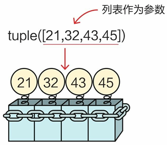

元组和列表一样都属于容器类型，存储的元素类型可以是任何类型的数据。

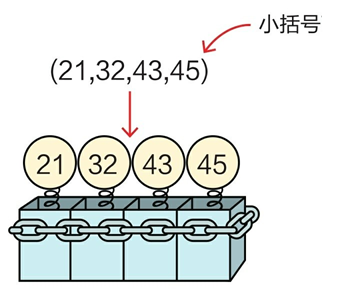

### 打包和拆包

在Python中可迭代对象都可以进行打包和拆包，而在使用过程中元组的打包和拆包操作使用最多，特别是结合函数的可变参数和多返回值，所以这里使用元组来讲解打包和拆包操作。

创建元组，并将多个数据放到元组中，这个过程被称为元组打包。与元组打包相反的操作是拆包，就是将元组中的元素取出，分别赋值给不同的变量。结合图解和代码一起来学习使用。 上代码：

```python
bafu_info = ('渣男教父', 33, True, 'Game、Python')

# 拆包(解包)：变量数量 = 元素数量，元素会自动一一对应赋值
name, age, married, hobby = bafu_info
print(f'{bafu_info} 拆包后的结果是：{name},{age},{married},{hobby}')

# 打包（组包）： = 号右边有多个数据时，会自动包装成元组
info = name, hobby, age, married
print(f'{name},{hobby} ,{age},{married} 打包后结果是：{info}')

# 运行结果
('渣男教父', 33, True, 'Game、Python') 拆包后的结果是：渣男教父,33,True,Game、Python
渣男教父,Game、Python ,33,True 打包后结果是：('渣男教父', 'Game、Python', 33, True)
```

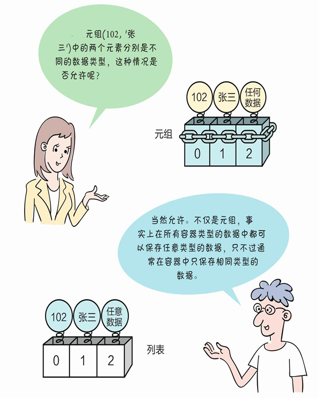

### 函数可变参数

刚刚我们提到了元组的打包和解包与函数使用联系非常紧密，比如定义函数的参数个数是不确定的，可以在定义函数的形参前面加上 * 号将其转化为可变参数，这样就可以很方便的调整实参的个数，在调用函数时会自动将传入的实参打包成一个元组。

当函数有多个返回值时，可以直接 return x,y,z ，所有返回值会自动打包成一个元组。

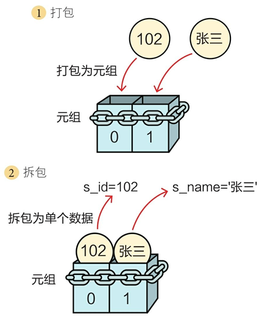

举个栗子来看看，定义一个函数，可以接收多个整数且整数个数不确定，函数可以计算出传入整数中所有奇数和偶数相加的和，并返回。

从上面的例子中可以发现 Python 中的函数使用非常的灵活，今天对函数的介绍都是很基础的内容，后续的课程中会更多的用到函数，在使用过程中结合实例讲解函数嵌套使用、函数变量的作用域、匿名函数和函数式编程等。

## 课程总结

这节课我们学习了控制循环的两种方式：break 和 continue，它们的用法大家都搞清楚了吗？函数是我们迈向高阶编程的垫脚石，大家一定要通过多多编码练习来加强理解和运用。配合对元组打包和拆包的运用，在处理函数的传参和返回值时可以更加灵活。

## 课后习题