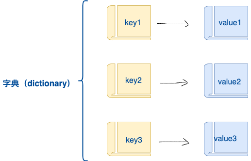
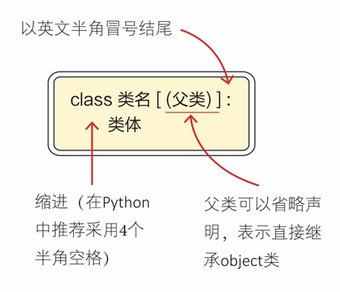

# 📚 字典、集合与类对象——Python高阶数据结构大揭秘！

## 🎯 上集回顾

先来验收一下咱们的学习成果！

上一集我们掌握了控制循环的两大神器：
- 💥 `break` —— 说停就停，彻底退出循环
- ⏭️ `continue` —— 跳过本次，继续下一轮

还学会了函数的**定义**、**调用**、**传参**和**返回值**。函数是我们迈向高阶编程的必经之路，一定要多敲代码巩固！

> 💡 **温故知新**：你还记得 `*args` 可变参数和元组拆包怎么用吗？不记得的话赶紧回去复习一下！

---

## 🗂️ 字典与集合——两个神奇的数据结构

### 📖 字典（dict）——键值对的"查字典"游戏

#### 🤔 什么是字典？

还记得学生时代的新华字典吗？你想查一个字，先找音节表（比如 "ba"），然后就能找到对应的汉字和解释。

**Python 的字典就是这个原理！**

- 📇 **键（key）** = 音节表（查找的索引）
- 📝 **值（value）** = 汉字解释（实际内容）
- 🔗 **键值对** = key 和 value 的组合

**语法格式**：
```python
字典名 = {键1: 值1, 键2: 值2, 键3: 值3}
```



---

#### 🎭 字典的五大特征

| 特征 | 说明 | 形象比喻 |
|------|------|----------|
| 🔑 **键值映射** | 通过 key 找 value | 像查字典，输入拼音找汉字 |
| 🌀 **无序性** | 没有固定顺序（Python 3.7+ 实际有序，但不要依赖）| 像散落的扑克牌，没有编号 |
| ✏️ **可变且可嵌套** | 能增删改，value 可以是列表/字典 | 像俄罗斯套娃，一层套一层 |
| ⚠️ **键必须唯一** | 重复的键，后面的覆盖前面的 | 身份证号，一人一个 |
| 🚫 **键必须不可变** | key 只能是字符串、数字、元组 | 像房产证，不能涂改 |

> 💡 **一句话总结**：字典就是**键值对**的集合，用 `{}` 包裹，用 `:` 连接 key 和 value！

#### ✍️ 创建字典的两种方式

**方式1：花括号 `{}` 直接创建（最常用）**

```python
# 创建一个"渣男教父"的信息档案
youbafu = {
    'name': '渣男教父',
    'sex': '男',
    'age': 30,
    'married': True,
    'hobby': '游戏和Python'
}
print(youbafu)
```

**方式2：`dict()` 函数创建**

```python
# 注意：用 dict() 时，key 不需要加引号！
youbafu2 = dict(
    name='渣男教父',
    sex='男',
    age=30,
    married=True,
    hobby='游戏和Python'
)
print(youbafu2)
```

**🎉 两种方式的运行结果一样：**
```
{'name': '渣男教父', 'sex': '男', 'age': 30, 'married': True, 'hobby': '游戏和Python'}
```

> 💡 **选择建议**：
> - 简单的字典用 `{}` 更直观
> - 动态创建或 key 是变量时用 `dict()` 更方便

#### 🔍 获取字典的值——两种方法大PK

想获取字典里的值？有两种方法，但差别很大！

```python
youbafu = {'name': '渣男教父', 'sex': '男', 'age': 30, 'married': True, 'hobby': '游戏和Python'}

# 方法1：用 get() 方法（推荐⭐）
hobby = youbafu.get('hobby')
print(f'爱好：{hobby}')  # 爱好：游戏和Python

# 方法2：用方括号 []（有风险⚠️）
hobby = youbafu['hobby']
print(f'爱好：{hobby}')  # 爱好：游戏和Python
```

---

**⚡ 关键区别：key不存在时怎么办？**

```python
# get() 方法：key不存在，返回 None（安全）
print(youbafu.get('身高'))  # None，程序不会崩溃

# 方括号 []：key不存在，直接报错（危险）
print(youbafu['身高'])  # KeyError: '身高'，程序直接挂掉！
```

**🎯 get() 的高级用法——设置默认值：**

```python
# 如果 key 不存在，返回指定的默认值
height = youbafu.get('身高', '未知')
print(f"身高：{height}")  # 身高：未知

# 如果 key 存在，返回实际的值
name = youbafu.get('name', '匿名')
print(f"姓名：{name}")  # 姓名：渣男教父
```

| 方法 | key存在 | key不存在 | 推荐指数 |
|------|---------|-----------|----------|
| `dict.get(key)` | 返回值 | 返回 `None` | ⭐⭐⭐ |
| `dict.get(key, default)` | 返回值 | 返回 `default` | ⭐⭐⭐⭐⭐ |
| `dict[key]` | 返回值 | 报错 `KeyError` | ⭐⭐ |

> 💡 **最佳实践**：优先使用 `get()` 方法，尤其是处理不确定key是否存在的情况！

#### 🔄 字典遍历——三种方式任你选

字典遍历有三种常用方式，根据你的需求选择：

```python
youbafu = {'name': '渣男教父', 'sex': '男', 'age': 30, 'married': True, 'hobby': '游戏和Python'}
```

**方式1：只遍历键（keys）**

```python
print("📇 所有的键：")
for key in youbafu.keys():
    print(f"  - {key}")

# 简写形式（直接遍历字典，默认就是遍历键）
for key in youbafu:
    print(f"  - {key}")
```

**方式2：只遍历值（values）**

```python
print("📝 所有的值：")
for val in youbafu.values():
    print(f"  - {val}")
```

**方式3：遍历键值对（items）⭐最常用**

```python
print("🔗 所有的键值对：")
for key, val in youbafu.items():
    print(f"  {key}: {val}")

# items() 返回的是元组，也可以这样写
for item in youbafu.items():
    print(f"  键={item[0]}, 值={item[1]}")
```

**🎉 运行结果：**
```
📇 所有的键：
  - name
  - sex
  - age
  - married
  - hobby
📝 所有的值：
  - 渣男教父
  - 男
  - 30
  - True
  - 游戏和Python
🔗 所有的键值对：
  name: 渣男教父
  sex: 男
  age: 30
  married: True
  hobby: 游戏和Python
```

| 方法 | 返回内容 | 使用场景 |
|------|----------|----------|
| `dict.keys()` | 所有 key | 只需要键的时候 |
| `dict.values()` | 所有 value | 只需要值的时候 |
| `dict.items()` | 所有 (key, value) 元组 | 同时需要键和值（最常用）|

> 💡 **小技巧**：`items()` 配合元组拆包，是遍历字典的标配写法！

#### 🧰 字典内置方法速查表

字典有很多实用的内置方法，不需要死记硬背，先有个印象，用的时候再来查！

| 方法 | 功能说明 | 示例 |
|------|----------|------|
| `dict.clear()` | 清空字典（变成空字典） | `youbafu.clear()` |
| `dict.copy()` | 复制字典（浅拷贝） | `new_dict = youbafu.copy()` |
| `dict.get(key, default)` | 安全获取值 | `youbafu.get('age', 0)` |
| `key in dict` | 判断key是否存在 | `'name' in youbafu` → `True` |
| `dict.items()` | 获取所有键值对 | `for k, v in youbafu.items()` |
| `dict.keys()` | 获取所有键 | `youbafu.keys()` |
| `dict.values()` | 获取所有值 | `youbafu.values()` |
| `dict.update(dict2)` | 合并另一个字典 | `youbafu.update(new_info)` |
| `dict.pop(key)` | 删除指定key并返回值 | `age = youbafu.pop('age')` |
| `dict.popitem()` | 删除最后一对键值 | `youbafu.popitem()` |
| `dict.setdefault(k, v)` | key不存在则添加 | `youbafu.setdefault('city', '北京')` |

---

**🎯 常用方法实战演示：**

```python
youbafu = {'name': '渣男教父', 'age': 30, 'city': '上海'}

# 1. 添加/更新数据
youbafu['job'] = '程序员'  # 添加新键值对
youbafu['age'] = 31       # 更新已有值

# 2. 合并字典
new_info = {'hobby': 'Python', 'married': True}
youbafu.update(new_info)

# 3. 安全删除
age = youbafu.pop('age', '未知')  # 删除并返回值，key不存在返回'未知'

# 4. 判断key是否存在
if 'name' in youbafu:
    print(f"姓名：{youbafu['name']}")

print(youbafu)
# {'name': '渣男教父', 'city': '上海', 'job': '程序员', 'hobby': 'Python', 'married': True}
```

> 💡 **学习建议**：字典是 Python 中使用频率最高的数据结构之一，多练习才能熟练掌握！

### 🔢 集合（set）——自动去重的"数学集合"

#### 🤔 什么是集合？

集合就像数学课上学过的集合概念：
- ✅ **无序** —— 没有顺序，不能通过下标访问
- ✅ **不重复** —— 相同的元素只保留一个（自动去重）
- ✅ **可迭代** —— 可以用 for 循环遍历

**集合的三大用途**：
1. 🧹 **去重** —— 把列表变成集合，重复元素自动消失
2. 🔍 **成员检测** —— 快速判断元素是否在集合中
3. ➕ **数学运算** —— 并集、交集、差集等操作

---

#### ✍️ 创建集合

**方式1：花括号 `{}`（注意：非空才能用）**

```python
student_ids = {1001, 1002, 1003, 1004, 1005, 1006, 1007, 1007}  # 有重复！
print(student_ids)  # {1001, 1002, 1003, 1004, 1005, 1006, 1007} 自动去重！
```

**方式2：`set()` 函数（推荐，特别是从其他类型转换）**

```python
lst = [1001, 1002, 1003, 1004, 1005, 1006, 1007, 1007, 1001]
print(f"原列表：{lst}")
print(f"转集合：{set(lst)}")  # 自动去重！
```

**⚠️ 重要陷阱：空集合只能用 `set()`！**

```python
empty_set = set()      # ✅ 正确！这是空集合
empty_dict = {}        # ❌ 错误！这是空字典，不是集合！

print(type(empty_set))  # <class 'set'>
print(type(empty_dict)) # <class 'dict'>
```

**🎉 运行结果对比：**
```
原列表：[1001, 1002, 1003, 1004, 1005, 1006, 1007, 1007, 1001]
转集合：{1001, 1002, 1003, 1004, 1005, 1006, 1007}
```

> 💡 **记忆口诀**：集合去重有一手，列表转 set 重复走！

#### 访问集合

#### 🔍 访问集合元素

集合是无序的，**不能用下标访问**，但有其他方式：

```python
student_ids = {1001, 1002, 1003, 1004, 1005, 1006, 1007}

# 方式1：遍历集合
print("📋 所有学号：")
for sid in student_ids:
    print(f"  {sid}")

# 方式2：成员检测（超级快！）
print(f"1001 在集合中吗？{1001 in student_ids}")   # True
print(f"2001 在集合中吗？{2001 in student_ids}")   # False
```

> 💡 **性能提示**：集合的 `in` 操作比列表快得多！数据量大时优势明显。

---

#### 🧮 集合的数学运算（并集、交集、差集）

这是集合最酷的功能！就像数学课上学的一样：

```python
A = {1, 2, 3, 4, 5}
B = {4, 5, 6, 7, 8}

# 并集（A 或 B 中的元素）
print(A | B)           # {1, 2, 3, 4, 5, 6, 7, 8}
print(A.union(B))      # 同上

# 交集（A 和 B 共有的元素）
print(A & B)           # {4, 5}
print(A.intersection(B))  # 同上

# 差集（在A中但不在B中）
print(A - B)           # {1, 2, 3}
print(A.difference(B)) # 同上

# 对称差集（只在A或只在B中）
print(A ^ B)           # {1, 2, 3, 6, 7, 8}
```

---

#### 🧰 集合常用方法速查

| 方法 | 功能 | 示例 |
|------|------|------|
| `set.add(x)` | 添加元素 | `s.add(100)` |
| `set.remove(x)` | 删除元素（不存在会报错） | `s.remove(100)` |
| `set.discard(x)` | 删除元素（不存在不报错） | `s.discard(100)` |
| `set.pop()` | 随机删除并返回一个元素 | `x = s.pop()` |
| `set.clear()` | 清空集合 | `s.clear()` |
| `set.update(s2)` | 合并另一个集合 | `s.update({1,2,3})` |

> 💡 **一句话总结**：集合 = 自动去重 + 数学运算 + 快速成员检测！

## 🏗️ 类与对象——面向对象编程入门

### 🤯 为什么需要类？

很多初学者听到"类"和"面向对象"就头大——什么封装、继承、多态……听起来好复杂！

**其实类的概念很简单**：当你发现**多个函数在反复操作同一组数据**时，就该考虑用类了！

> 💡 **一句话理解类**：类就是一个"模具"，根据这个模具可以造出很多"产品"（对象），每个产品都有自己的数据，但功能都一样。

---

### 🎯 从实际问题出发理解类

**场景**：做一个三角形计算器，输入三条边，能计算三个角、面积、周长。

**不用类的写法**（函数式）：

```python
import math

def angleA(a, b, c):
    return math.acos((b**2 + c**2 - a**2) / (2*b*c))

def angleB(a, b, c):
    return math.acos((c**2 + a**2 - b**2) / (2*a*c))

def angleC(a, b, c):
    return math.acos((a**2 + b**2 - c**2) / (2*a*b))

def square(a, b, c):
    p = (a + b + c) / 2
    return math.sqrt(p * (p-a) * (p-b) * (p-c))

def circle(a, b, c):
    return a + b + c

# 计算三角形1
a1, b1, c1 = 6, 7, 8
print(angleA(a1, b1, c1))   # 0.81...
print(square(a1, b1, c1))   # 20.33...

# 计算三角形2——又要传一遍参数！
a2, b2, c2 = 8, 9, 10
print(angleA(a2, b2, c2))   # 0.72...
print(square(a2, b2, c2))   # 34.19...
```

**😫 问题暴露**：
1. 每次计算都要传三个参数，繁琐！
2. 参数多了容易写错（比如上面 `circle(6,7,9)` 最后一个写错成9）
3. 数据和函数分离，容易出错

---

### 💡 类的解决方案——把数据和函数"打包"

**理想的使用方式**：

```python
# 创建一个三角形对象（传入一次数据）
t1 = Triangle(6, 7, 8)

# 对象自己知道边长，计算时不需要再传参数！
print(t1.angleA())   # 0.81...
print(t1.square())   # 20.33...
print(t1.circle())   # 21

# 再创建一个三角形
t2 = Triangle(8, 9, 10)
print(t2.square())   # 34.19...

# 比较两个三角形
print(t2.square() - t1.square())  # 13.86...
```

**这就是类的威力**：
- 📦 **封装**：把数据（边长）和函数（计算方法）打包在一起
- 🎯 **复用**：创建多个对象，每个对象有自己的数据
- 🔒 **安全**：数据只传一次，避免重复传参的错误

---

### 🏗️ 用类实现三角形计算器

上代码！看看类是怎么工作的：

```python
import math

class Triangle:  # 定义类（类名通常用大写字母开头）
    """三角形类——输入三条边，可以计算角度、面积、周长"""
    
    def __init__(self, a, b, c):  # 构造方法，创建对象时自动调用
        """初始化三角形的三条边"""
        self.a = a  # self.a 表示这个对象的 a 属性
        self.b = b  # self.b 表示这个对象的 b 属性
        self.c = c  # self.c 表示这个对象的 c 属性
    
    def angleA(self):  # 类的方法（函数）
        """计算角A"""
        return math.acos((self.b**2 + self.c**2 - self.a**2) / (2*self.b*self.c))
    
    def angleB(self):
        """计算角B"""
        return math.acos((self.c**2 + self.a**2 - self.b**2) / (2*self.a*self.c))
    
    def angleC(self):
        """计算角C"""
        return math.acos((self.a**2 + self.b**2 - self.c**2) / (2*self.a*self.b))
    
    def area(self):
        """计算面积（海伦公式）"""
        p = (self.a + self.b + self.c) / 2
        return math.sqrt(p * (p-self.a) * (p-self.b) * (p-self.c))
    
    def perimeter(self):
        """计算周长"""
        return self.a + self.b + self.c


# 🎉 使用类创建对象（实例化）
t1 = Triangle(6, 7, 8)  # 创建一个边长为6,7,8的三角形

# 访问对象的属性
print(f"边长: a={t1.a}, b={t1.b}, c={t1.c}")

# 调用对象的方法
print(f"角A: {t1.angleA():.4f} 弧度")
print(f"面积: {t1.area():.2f}")
print(f"周长: {t1.perimeter()}")

# 创建另一个三角形
t2 = Triangle(8, 9, 10)
print(f"\n三角形2的面积: {t2.area():.2f}")
print(f"面积差: {t2.area() - t1.area():.2f}")
```



---

### 📚 类的核心概念

**一个类 = 属性（数据）+ 方法（函数）**

| 概念 | 说明 | 例子中的对应 |
|------|------|-------------|
| **类（Class）** | 对象的"设计图纸" | `class Triangle` |
| **对象（Object）** | 根据类创建的"实例" | `t1 = Triangle(6,7,8)` |
| **属性（Attribute）** | 对象的数据 | `self.a`, `self.b`, `self.c` |
| **方法（Method）** | 对象的函数 | `angleA()`, `area()` |
| **`__init__`** | 构造方法，创建对象时自动执行 | 初始化三条边 |
| **`self`** | 代表对象本身，必须放在第一个参数 | 访问自己的属性和方法 |

---

### 🎯 `__init__` 和 `self` 详解

**`__init__` 是构造方法**：
- 创建对象时**自动调用**
- 用于**初始化对象的属性**
- 两边的下划线各两个：`__init__`

**`self` 是对象自己**：
- 类的方法第一个参数必须是 `self`
- 通过 `self.属性名` 访问对象的数据
- 通过 `self.方法名()` 调用对象的其他方法

```python
class Dog:
    def __init__(self, name, age):  # 构造方法
        self.name = name  # 给对象添加 name 属性
        self.age = age    # 给对象添加 age 属性
    
    def bark(self):
        print(f"{self.name} says: 汪汪汪！")
    
    def introduce(self):
        print(f"我是{self.name}，今年{self.age}岁")
        self.bark()  # 调用自己的另一个方法

# 创建两只狗
dog1 = Dog("旺财", 3)
dog2 = Dog("来福", 2)

dog1.introduce()  # 我是旺财，今年3岁 \n 旺财 says: 汪汪汪！
dog2.introduce()  # 我是来福，今年2岁 \n 来福 says: 汪汪汪！
```

> 💡 **一句话总结**：类是模具，对象是产品；`__init__` 是初始化，`self` 是自己！

---

## 📝 文档总结

### 一、核心知识点回顾

#### 1. 字典（dict）——键值对的映射

**核心特征**：
- 🔑 通过 key 访问 value，查找速度极快
- 🌀 无序（Python 3.7+ 实际有序但不应依赖）
- ✏️ 可变，支持增删改和嵌套
- ⚠️ key 必须唯一且不可变（字符串、数字、元组）

**常用操作速查**：

| 操作 | 代码示例 | 说明 |
|------|----------|------|
| 创建 | `d = {'a': 1}` 或 `dict(a=1)` | 花括号或 dict() 函数 |
| 访问 | `d.get('a', default)` | 安全访问，推荐！ |
| 添加/修改 | `d['b'] = 2` | key 存在则修改，不存在则添加 |
| 删除 | `d.pop('a')` | 删除并返回值 |
| 遍历 | `for k, v in d.items()` | 遍历键值对 |
| 合并 | `d.update(d2)` | 将 d2 合并到 d |
| 判断存在 | `'a' in d` | 判断 key 是否存在 |

---

#### 2. 集合（set）——自动去重的容器

**核心特征**：
- 🧹 自动去重，元素唯一
- 🌀 无序，不能通过下标访问
- ➕ 支持数学运算：并集、交集、差集

**常用操作速查**：

| 操作 | 代码示例 | 说明 |
|------|----------|------|
| 创建 | `s = {1, 2, 3}` 或 `set([1,2,2,3])` | 自动去重 |
| 添加 | `s.add(4)` | 添加单个元素 |
| 删除 | `s.remove(4)` / `s.discard(4)` | remove 不存在会报错 |
| 并集 | `s1 \| s2` 或 `s1.union(s2)` | 两个集合的所有元素 |
| 交集 | `s1 & s2` 或 `s1.intersection(s2)` | 两个集合共有的元素 |
| 差集 | `s1 - s2` 或 `s1.difference(s2)` | 在 s1 但不在 s2 |
| 成员检测 | `x in s` | 比列表快得多！ |

> 💡 **应用场景**：去重、成员检测、集合运算

---

#### 3. 类与对象——面向对象编程基础

**核心概念**：

| 概念 | 比喻 | 代码体现 |
|------|------|----------|
| **类（Class）** | 设计图纸 | `class Dog:` |
| **对象（Object）** | 根据图纸造的产品 | `dog1 = Dog("旺财", 3)` |
| **属性** | 对象的特征/数据 | `self.name`, `self.age` |
| **方法** | 对象的行为/函数 | `def bark(self):` |
| **构造方法** | 出厂设置 | `def __init__(self, ...):` |
| **self** | 对象自己 | 访问自己的属性和方法 |

**类的基本结构**：

```python
class 类名:                           # 定义类
    def __init__(self, 参数):         # 构造方法
        self.属性 = 参数               # 初始化属性
    
    def 方法名(self, 参数):            # 定义方法
        # 使用 self.属性 访问数据
        # 使用 self.方法名() 调用其他方法
        return 结果

对象 = 类名(参数)                      # 创建对象（实例化）
对象.属性                             # 访问属性
对象.方法名()                          # 调用方法
```

**什么时候用类？**
- 多个函数需要反复操作同一组数据
- 需要创建多个具有相同特征但不同数据的"东西"
- 代码需要更好的组织和封装

---

### 二、三种容器类型对比

| 特性 | 列表 list | 元组 tuple | 字典 dict | 集合 set |
|------|-----------|------------|-----------|----------|
| **语法** | `[1, 2, 3]` | `(1, 2, 3)` | `{'a': 1}` | `{1, 2, 3}` |
| **有序** | ✅ | ✅ | ❌ (3.7+实际有序) | ❌ |
| **可变性** | ✅ 可变 | ❌ 不可变 | ✅ 可变 | ✅ 可变 |
| **访问方式** | 下标 `lst[0]` | 下标 `t[0]` | 键 `d['a']` | 不可下标访问 |
| **元素要求** | 任意 | 任意 | key 不可变 | 必须可哈希（不可变） |
| **重复元素** | 允许 | 允许 | key 唯一 | 自动去重 |
| **适用场景** | 有序序列 | 固定数据 | 键值映射 | 去重、集合运算 |

---

### 三、学习建议

1. **字典是重中之重**：Python 中最常用的数据结构，务必熟练掌握
2. **集合去重要牢记**：`list(set(lst))` 是最简单的去重方式
3. **类要理解思想**：不要死记语法，理解"封装"和"复用"的思想
4. **多动手实践**：自己设计一个简单的类（如学生类、图书类）

---

### 四、下篇预告

下一篇我们将学习：
- 文件读写操作（IO）
- 异常处理（try-except）
- 模块和包的使用

这些都是实际编程中必不可少的技能，敬请期待！

---

## 🎮 动手练一练

光看不练假把式！下面几道题目帮你巩固今天学到的知识，建议先自己思考，再看参考答案。

### 选择题

**1. 以下关于字典的描述，错误的是？**
- A. 字典通过键来访问值
- B. 字典的键必须是不可变类型
- C. 字典的键可以重复，值不能重复
- D. 可以使用 `dict.get(key)` 安全地获取值

<details>
<summary>💡 答案解析（点击展开）</summary>

**正确答案：C**

**详细解析**：
- 选项 A 正确：字典的核心特性就是通过 key 查找 value，时间复杂度 O(1)。
- 选项 B 正确：字典的 key 必须是不可变类型（字符串、数字、元组），因为字典内部使用哈希表实现，需要 key 的哈希值不变。
- 选项 C **错误**：字典的 **key 必须唯一**，如果重复赋值，后面的会覆盖前面的；但 **value 可以重复**，没有限制。
  ```python
  d = {'a': 1, 'b': 1, 'a': 2}  # key 'a' 重复，最终值为 2
  print(d)  # {'a': 2, 'b': 1}，value 都是 1 没问题
  ```
- 选项 D 正确：`get()` 方法在 key 不存在时返回 None 或默认值，不会报错，是安全访问的首选方式。

**记忆技巧**：字典就像身份证号系统——每人（key）只有一个号，但不同人可以有相同的住址（value）。

</details>

---

**2. 以下代码的输出结果是？**
```python
s = {1, 2, 2, 3, 3, 3}
print(len(s))
```
- A. 6
- B. 3
- C. 1
- D. 报错

<details>
<summary>💡 答案解析（点击展开）</summary>

**正确答案：B**

**详细解析**：
- 集合（set）的核心特性是**自动去重**，重复的元素只会保留一个。
- 代码中 `s = {1, 2, 2, 3, 3, 3}`，虽然有 6 个元素，但去重后只剩下 `{1, 2, 3}`。
- `len(s)` 返回集合中元素的数量，所以结果是 3。

**代码验证**：
```python
s = {1, 2, 2, 3, 3, 3}
print(s)       # {1, 2, 3}
print(len(s))  # 3
```

**延伸知识**：这也是集合最常用的功能——去重！比如 `set([1,1,2,2,3])` 可以快速去除列表中的重复元素。

</details>

---

**3. 关于 Python 类中的 `self`，以下说法正确的是？**
- A. `self` 是一个关键字，必须叫 self
- B. `self` 代表类本身
- C. `self` 代表对象实例，用于访问对象的属性和方法
- D. 方法中不需要 `self` 参数

<details>
<summary>💡 答案解析（点击展开）</summary>

**正确答案：C**

**详细解析**：
- 选项 A 错误：`self` 不是关键字，只是**约定俗成**的写法，可以用其他名字（如 `me`、`this`），但不推荐。
- 选项 B 错误：`self` 代表**对象实例**（根据类创建的具体对象），而不是类本身。类本身用 `cls` 或类名表示。
- 选项 C 正确：`self` 就是**对象自己**，通过 `self.属性名` 访问自己的数据，`self.方法名()` 调用自己的方法。
  ```python
  class Dog:
      def __init__(self, name):
          self.name = name  # self 就是这个狗对象自己
      
      def bark(self):
          print(f"{self.name} 汪汪汪！")  # 访问自己的 name 属性
  ```
- 选项 D 错误：实例方法的**第一个参数必须是 `self`**（虽然调用时不用传），这是 Python 的语法规定。

**形象理解**：`self` 就像每个人口中的"我"——我说"我的名字"，指的就是我自己的名字。

</details>

---

### 编程题

**1. 编写一个函数，统计一段文本中每个单词出现的次数，返回字典。**

> 💡 **提示**：使用字符串的 `split()` 方法分割单词，用字典记录每个单词的出现次数。

<details>
<summary>🔑 参考答案与解析（点击展开）</summary>

**解题思路**：
1. 将文本按空格分割成单词列表
2. 遍历每个单词，使用字典记录出现次数
3. 如果单词已在字典中，计数+1；否则添加到字典，计数为1
4. 返回统计结果字典

**代码实现**：

```python
def count_words(text):
    """
    统计文本中每个单词出现的次数
    
    参数:
        text: 输入的文本字符串
    返回:
        dict: 单词 -> 出现次数 的字典
    """
    # 初始化空字典
    word_count = {}
    
    # 将文本转为小写并分割成单词列表
    words = text.lower().split()
    
    # 遍历每个单词
    for word in words:
        # 去除标点符号（简单处理）
        word = word.strip(".,!?;:'\"")
        
        if word:  # 确保单词不为空
            # 方法1：使用 get()
            word_count[word] = word_count.get(word, 0) + 1
            
            # 方法2：使用 setdefault()
            # word_count.setdefault(word, 0)
            # word_count[word] += 1
    
    return word_count


# 测试
text = "hello world hello python hello coding"
result = count_words(text)
print(result)
# {'hello': 3, 'world': 1, 'python': 1, 'coding': 1}

# 更复杂的测试
text2 = "The quick brown fox jumps over the lazy dog. The fox was quick!"
result2 = count_words(text2)
for word, count in sorted(result2.items(), key=lambda x: x[1], reverse=True):
    print(f"{word}: {count}")
```

**知识点总结**：
- 字典的 `get(key, default)` 方法非常适合这种计数场景
- `split()` 默认按空白字符分割字符串
- `sorted()` 配合 `key=lambda x: x[1]` 可以按值排序

**进阶思考**：如何处理更多标点符号？可以使用正则表达式 `re.findall(r'\b\w+\b', text.lower())`

</details>

---

**2. 有两个列表，找出它们共同的元素（交集）和不同的元素（差集）。**

> 💡 **提示**：利用集合的数学运算，可以非常简洁地解决这个问题。

<details>
<summary>🔑 参考答案与解析（点击展开）</summary>

**解题思路**：
1. 将两个列表转换为集合
2. 使用 `&` 运算符或 `intersection()` 方法求交集
3. 使用 `-` 运算符或 `difference()` 方法求差集
4. 如果需要对称差集（只在其中一个集合中的元素），使用 `^` 运算符

**代码实现**：

```python
def compare_lists(list1, list2):
    """
    比较两个列表，找出共同元素和不同元素
    
    参数:
        list1, list2: 两个列表
    返回:
        dict: 包含交集、差集等信息的字典
    """
    # 转换为集合
    set1 = set(list1)
    set2 = set(list2)
    
    # 计算各种集合运算
    result = {
        'list1_unique': list(set1 - set2),      # 只在 list1 中的元素
        'list2_unique': list(set2 - set1),      # 只在 list2 中的元素
        'common': list(set1 & set2),            # 共同元素（交集）
        'all_unique': list(set1 | set2),        # 所有不重复元素（并集）
        'symmetric_diff': list(set1 ^ set2),    # 对称差集（只在一个列表中的）
    }
    
    return result


# 测试
list1 = [1, 2, 3, 4, 5, 5, 5]  # 有重复元素
list2 = [4, 5, 6, 7, 8]

result = compare_lists(list1, list2)

print(f"列表1: {list1}")
print(f"列表2: {list2}")
print(f"\n只在列表1中的: {result['list1_unique']}")       # [1, 2, 3]
print(f"只在列表2中的: {result['list2_unique']}")       # [8, 6, 7]
print(f"共同元素: {result['common']}")                  # [4, 5]
print(f"所有不重复元素: {result['all_unique']}")        # [1, 2, 3, 4, 5, 6, 7, 8]
print(f"对称差集: {result['symmetric_diff']}")          # [1, 2, 3, 6, 7, 8]
```

**集合运算符号速查**：

| 运算符 | 方法 | 含义 |
|--------|------|------|
| `\|` | `union()` | 并集：在 A 或 B 中 |
| `&` | `intersection()` | 交集：同时在 A 和 B 中 |
| `-` | `difference()` | 差集：在 A 但不在 B 中 |
| `^` | `symmetric_difference()` | 对称差集：只在 A 或只在 B 中 |

**实际应用场景**：
- 找出两个班级的共同学生
- 比较两篇文章的共同关键词
- 数据去重和比对

</details>

---

**3. 设计一个学生类（Student），包含姓名、年龄、成绩等属性，以及显示信息、判断是否及格等方法。**

> 💡 **提示**：及格线设为60分，类的方法中可以使用 `self` 访问对象的属性。

<details>
<summary>🔑 参考答案与解析（点击展开）</summary>

**解题思路**：
1. 定义 `Student` 类，在 `__init__` 中初始化姓名、年龄、成绩属性
2. 添加 `show_info()` 方法显示学生信息
3. 添加 `is_passed()` 方法判断是否及格（>=60分）
4. 添加 `get_grade()` 方法返回等级（A:90+, B:80+, C:70+, D:60+, F:<60）
5. 创建多个学生对象进行测试

**代码实现**：

```python
class Student:
    """学生类"""
    
    def __init__(self, name, age, score):
        """
        初始化学生对象
        
        参数:
            name: 姓名
            age: 年龄
            score: 成绩（0-100）
        """
        self.name = name
        self.age = age
        # 确保成绩在合理范围
        self.score = max(0, min(100, score))
    
    def show_info(self):
        """显示学生信息"""
        status = "及格" if self.is_passed() else "不及格"
        print(f"【{self.name}】 年龄:{self.age} 成绩:{self.score} 等级:{self.get_grade()} ({status})")
    
    def is_passed(self):
        """判断是否及格（>=60分）"""
        return self.score >= 60
    
    def get_grade(self):
        """根据成绩返回等级"""
        if self.score >= 90:
            return 'A'
        elif self.score >= 80:
            return 'B'
        elif self.score >= 70:
            return 'C'
        elif self.score >= 60:
            return 'D'
        else:
            return 'F'
    
    def __str__(self):
        """字符串表示，print对象时自动调用"""
        return f"Student(name='{self.name}', age={self.age}, score={self.score})"


# 测试：创建学生列表
students = [
    Student("张三", 18, 85),
    Student("李四", 19, 92),
    Student("王五", 18, 55),
    Student("赵六", 20, 78),
]

print("=" * 50)
print("学生信息表")
print("=" * 50)

# 显示所有学生信息
for student in students:
    student.show_info()

# 统计信息
print("\n" + "=" * 50)
print("统计信息")
print("=" * 50)

total_score = sum(s.score for s in students)
passed_count = sum(1 for s in students if s.is_passed())

print(f"总人数: {len(students)}")
print(f"及格人数: {passed_count}")
print(f"不及格人数: {len(students) - passed_count}")
print(f"平均分: {total_score / len(students):.2f}")

# 找出最高分学生
top_student = max(students, key=lambda s: s.score)
print(f"最高分: {top_student.name} ({top_student.score}分)")
```

**运行结果**：
```
==================================================
学生信息表
==================================================
【张三】 年龄:18 成绩:85 等级:B (及格)
【李四】 年龄:19 成绩:92 等级:A (及格)
【王五】 年龄:18 成绩:55 等级:F (不及格)
【赵六】 年龄:20 成绩:78 等级:C (及格)

==================================================
统计信息
==================================================
总人数: 4
及格人数: 3
不及格人数: 1
平均分: 77.50
最高分: 李四 (92分)
```

**知识点延伸**：
- `__str__` 方法：定义对象的字符串表示，方便调试
- `max()` 配合 `key` 参数：可以找出特定条件下的最值
- 列表推导式和生成器表达式：简洁高效的数据处理

**进阶挑战**：
- 添加课程属性（一个学生有多门课成绩）
- 添加班级类（Class），管理多个学生
- 实现成绩排序功能

</details>