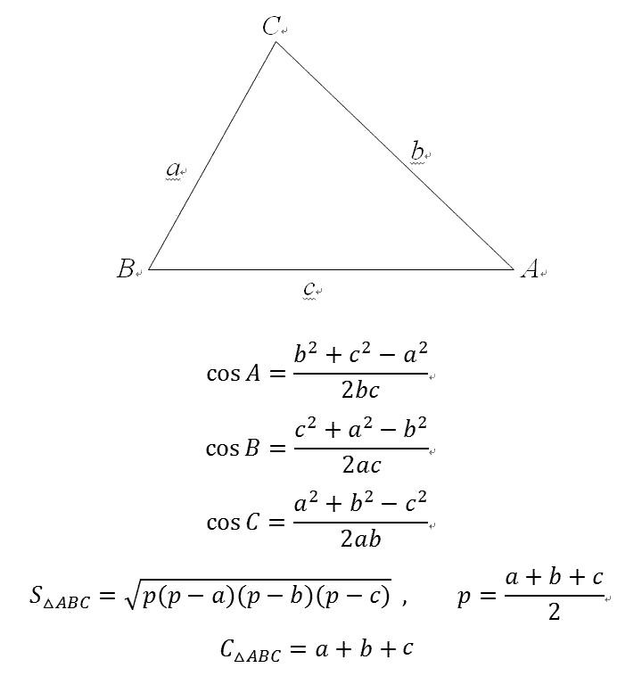

# 字典与集合

## 🎯 课前回顾

来验收一下学习成果吧！

上节课我们搞懂了控制循环的两种方式：break 和 continue，它们的区别大家都还记得吗？另外我们还学习了函数的定义、调用、传参和范围值，函数的数量运用是我们迈向高阶编程的垫脚石，大家一定要通过多多编码练习来加强理解和运用。

## 字典与集合

### 字典

#### 认识字典

在前面学习列表的时候就已经提到了字典，列表和字典都属于容器（可包含其他对象的对象），Python 字典属于映射类型，是可迭代的、通过键（key）来访问元素的可变的容器类型。

字典中习惯将各元素对应的索引称为键（key），每个键对应的元素称为值（value），键及其关联的值称为"键值对"。字典的每个键值对 key=>value 用冒号 : 分割，每个键值对之间用英文逗号 , 分割，整个字典包括在花括号 {} 中，格式如下所示：

```python
dict0 = {key1 : value1, key2 : value2, key3 : value3 }
```


字典类型很像学生时代常用的新华字典。我们知道，通过新华字典中的音节表，可以快速找到想要查找的汉字。其中，字典里的音节表就相当于字典类型中的键，而对应音节表的汉字则相当于值。

字典类型不同于列表，具有以下特征：

| 主要特征 | 解释 |
|---------|------|
| 通过键获取元素 | 字典通过键将对应值联系起来的，这样就可以通过键从字典中获取指定项。 |
| 无序集合 | 而字典中的元素是无序的，不能像列表通过下标来获取元素。（无序是指，不能人为重新排序。） |
| 内容可变且可以任意嵌套 | 字典的元素可以添加、更改或删除，并且它支持任意深度的嵌套，即字典的值也可以是列表或其它的字典。 |
| 键必须唯一 | 字典中，不支持同一个键出现多次，否则只会保留最后一个键值对。 |
| 键必须不可变 | 字典中每个键值对的键是不可变的，可以用数字、字符串或者元组，不能用列表或字典。 |

#### 创建字典

创建字典和创建列表差不多，都很简单，通常有下面两种方法。

1. `{key1：value1，key2：value2，...，key_n：value_n}`：指定具体的字典键值对，键值对之间以英文逗号分隔，最后用大括号 {} 括起来。
2. 使用 `dict()` 函数：参数中每个键值对以键=值的方式表示，如：one=1, two=2, three=3。

跟着代码来尝试一下：

```python
# 使用 {} 创建字典
youbafu = {'name': '渣男教父', 'sex': '男', 'age': 30, 'married': True, 'hobby': '游戏和Python'}
print(youbafu)

# 使用 dict() 创建字典
# 注意啦，键的位置不用加上表示字符串的引号
youbafu2 = dict(name='渣男教父', sex='男', age=30, married=True, hobby='游戏和Python')
print(youbafu2)

# 运行结果
{'name': '渣男教父', 'sex': '男', 'age': 30, 'married': True, 'hobby': '游戏和Python'}
{'name': '渣男教父', 'sex': '男', 'age': 30, 'married': True, 'hobby': '游戏和Python'}
```

#### 获取字典键的值

以创建的字典 youbafu 为例，想获取爱好，非常的简单可以通过 youbafu.get() 方法或 youbafu['hobby'] 获得，来看代码：

```python
# 使用 {} 创建字典
youbafu = {'name': '渣男教父', 'sex': '男', 'age': 30, 'married': True, 'hobby': '游戏和Python'}

hobby = youbafu.get('hobby')
print(f'爱好：{hobby}')

hobby = youbafu['hobby']
print(f'爱好：{hobby}')

print(f'获取不存在的键：{youbafu.get("身高")}')  # 使用 get 方法获取不存在的键时，返回None
print(f'获取不存在的键：{youbafu["身高"]}')  # 使用 ['键名'] 当键不存在时，会报错

# 运行结果
爱好：游戏和Python
爱好：游戏和Python
获取不存在的键：None
Traceback (most recent call last):
  File "字典.py", line 11, in <module>
    print(f'获取不存在的键：{youbafu["身高"]}')
KeyError: '身高'
```

#### 字典遍历

字典由键值对组成，在遍历字典的时候可以遍历字典的键、可以遍历字典的值，还可以遍历字典的键值对，跟着代码一起来学习：

```python
# 使用 {} 创建字典
youbafu = {'name': '渣男教父', 'sex': '男', 'age': 30, 'married': True, 'hobby': '游戏和Python'}

for key in youbafu.keys():
    print(key)

for val in youbafu.values():
    print(val)

for key, val in youbafu.items():
    print(f'键 = {key} : 值 = {val}')

# item 是一个元组（下标0 是键、下标1 是值）
for item in youbafu.items():
    print(item)

# 运行结果
name
sex
age
married
hobby
渣男教父
男
30
True
游戏和Python
键 = name : 值 = 渣男教父
键 = sex : 值 = 男
键 = age : 值 = 30
键 = married : 值 = True
键 = hobby : 值 = 游戏和Python
('name', '渣男教父')
('sex', '男')
('age', 30)
('married', True)
('hobby', '游戏和Python')
```

#### 内置方法

字典还包含了以下一些内置方法，这些内置方法不需要我们一定记住，当然能记住最好了，记不住也没有关系，先了解有这么些方法能实现哪些功能，有个大概的印象，编码需要的时候我们可以回头再来看也是没有问题的。

下表中的youbafu表示字典对象的变量。

| 方法名 | 方法及描述 |
|--------|-----------|
| youbafu.clear() | 删除字典内所有元素 |
| youbafu.copy() | 返回一个字典的浅拷贝 |
| fromkeys(seq[, value]) | 创建一个新字典，以序列seq中元素做字典的键，val为字典所有键对应的初始值 |
| youbafu.get(key, default=None) | 返回指定键的值，如果键不在字典中返回 default 设置的默认值 |
| key in youbafu | 如果键在字典 youbafu 里返回true，否则返回false |
| youbafu.items() | 以列表返回键值对 |
| youbafu.keys() | 返回所有键的列表 |
| setdefault(key, default=None) | 和get()类似, 但如果键不存在于字典中，将会添加键并将值设为 default |
| youbafu.update(dict2) | 把字典dict2的键/值对更新到 youbafu 里 |
| youbafu.values() | 返回所有值的列表 |
| youbafu.pop(key[,default]) | 删除字典给定键 key 所对应的值，返回值为被删除的值。key值必须给出。否则，返回default值。 |
| youbafu.popitem() | 随机返回并删除字典中的最后一对键和值。 |

字典，和列表一样是Python中超级重要的数据类型，在后续的学习和编码过程中会经常使用到。

### 集合

集合（set）是一种可迭代的、无序的、不包含重复元素的容器类型。

由于集合中的元素不能出现多次，这使得集合在很大程度上能够高效地从列表或元组中删除重复值，并执行取并集、交集等常见的的数学操作。

#### 创建集合

创建集合有和字典很相似，有两种方法。

1. 使用 set（iterable）函数：参数 iterable 是可迭代对象（字符串、列表、元组和字典等）。
2. 使用 {元素1，元素2，元素3，⋯}：指定具体的集合元素，元素之间以逗号分隔。对于集合元素，需要使用大括号括起来。

**重点注意**：可以使用大括号 { } 或者 set() 函数创建集合，注意：创建一个空集合必须用 set() 而不是 { }，因为 { } 是用来创建一个空字典。 上代码：

```python
# 能够自动去重
student_ids = {1001, 1002, 1003, 1004, 1005, 1006, 1007, 1007}
print(student_ids)

lst = [1001, 1002, 1003, 1004, 1005, 1006, 1007, 1007, 1001]
print(lst)

# 能够自动去重
print(set(lst))

# 运行结果
{1001, 1002, 1003, 1004, 1005, 1006, 1007}
[1001, 1002, 1003, 1004, 1005, 1006, 1007, 1007, 1001]
{1001, 1002, 1003, 1004, 1005, 1006, 1007}
```

#### 访问集合

由于集合中的元素是无序的，所以并不能像序列那样用下标来进行访问，

- 第一种：遍历集合中的数据把一个个元素读取出来。
- 第二种：使用 in 和 not in 判断一个元素是否在集合中已经存在。 上代码：

```python
# 能够自动去重
student_ids = {1001, 1002, 1003, 1004, 1005, 1006, 1007, 1007}

for i in student_ids:
    print(i)

print(1001 in student_ids, 2001 in student_ids)

# 运行结果
1001
1002
1003
1004
1005
1006
1007
True False
```

#### 内置方法

集合内置方法完整列表如下：

| 方法 | 描述 |
|------|------|
| add() | 为集合添加元素 |
| clear() | 移除集合中的所有元素 |
| copy() | 拷贝一个集合 |
| difference() | 返回多个集合的差集 |
| difference_update() | 移除集合中的元素，该元素在指定的集合也存在。 |
| discard() | 删除集合中指定的元素 |
| intersection() | 返回集合的交集 |
| intersection_update() | 返回集合的交集。 |
| isdisjoint() | 判断两个集合是否包含相同的元素，如果没有返回 True，否则返回 False。 |
| issubset() | 判断指定集合是否为该方法参数集合的子集。 |
| issuperset() | 判断该方法的参数集合是否为指定集合的子集 |
| pop() | 随机移除元素 |
| remove() | 移除指定元素 |
| symmetric_difference() | 返回两个集合中不重复的元素集合。 |
| symmetric_difference_update() | 移除当前集合中在另外一个指定集合相同的元素，并将另外一个指定集合中不同的元素插入到当前集合中。 |
| union() | 返回两个集合的并集 |
| update() | 给集合添加元素 |

集合类型主要用于3个场景：容器是否包含元素、元素去重和删除数据项。

因此，如果需要对一维数据进行去重或数据重复处理时，一般可以通过集合来完成。

## 类与对象

大部分初学编程的人，在开始接触到"类"的时候，可能会感到有些困惑。想搞清楚"类"到底是个什么东西，是用来干嘛的？然后就去网上搜索，看书，大部分的回答都是定义式的解释面向对象的概念，等等。

既然 python 的作者设计了"类"这个东西，那肯定是在编程的时候有这种需求的。那我们什么时候需要用到类呢？当然，编程中用到类的地方有很多很多，先来认识一下类是什么。

### 认识类

现在还没有太多的编码经验，我们来简单的概括一下：

**如果多个函数需要反复使用同一组数据，如果使用类来处理，会很方便。**

举个中学学过的例子：解三角形。

比如解三角形需要实现以下功能：输入能够组成三角形的三条边长a，b，c ，计算出该三角形三个角的角度，以及该三角形的面积、周长，并返回具体的值。



有人会说，这很简单啊，定义几个函数就可以简单的实现，假如输入三角形的边长为 6，7，8：

```python
# 参照公式把五个函数定义出来，公式如果忘记了（也没有关系，这不是重点），或者可以去翻翻中学课本
import math  # 计算反三角函数要用到

def angleA(a, b, c):
    agA = math.acos((b ** 2 + c ** 2 - a ** 2) / (2 * b * c))
    return agA

def angleB(a, b, c):
    agB = math.acos((c ** 2 + a ** 2 - b ** 2) / (2 * a * c))
    return agB

def angleC(a, b, c):
    agC = math.acos((a ** 2 + b ** 2 - c ** 2) / (2 * a * b))
    return agC

def square(a, b, c):
    p = (a + b + c) / 2
    s = math.sqrt(p * (p - a) * (p - b) * (p - c))
    return s

def circle(a, b, c):
    cz = a + b + c
    return cz

# 然后调用定义好的函数，传入边长数据
angleA(6,7,8)  # 计算角A ->0.8127555613686607  # 注意返回值为弧度
angleB(6,7,8)  # 计算角B ->1.0107210205683146
angleC(6,7,8)  # 计算角C ->1.318116071652818
square(6,7,8)  # 计算面积 ->20.33316256758894
circle(6,7,9)  # 计算周长，额，好像有个数字写错了 ->22  # 计算结果当然也就错了
```

三下五除二，把计算需要用到的五个函数依次定义出来，然后调就好了。

但大家仔细观察一下，这样写有什么不太好的地方？

应该都发现了，这是同一个三角形，每次计算角度、面积、周长的时候，都要把三条边的长度传进去，一方面这样做会重复且繁琐，另一方面，万一有一个不小心写错了，那么那条结果当然也就错了啊。

根据三角形全等的条件可以知道，三角形的三条边确定了，那么它的三个角、面积、周长，也都随之确定了。所以对于同一个三角形，最好只需要传一次数据就可以了。

根据上面的需求，很容易实现，把它们都写在一个函数里不就得了：

```python
def calculate(a, b, c):
    angleA = math.acos((b ** 2 + c ** 2 - a ** 2) / (2 * b * c))
    angleB = math.acos((c ** 2 + a ** 2 - b ** 2) / (2 * a * c))
    angleC = math.acos((a ** 2 + b ** 2 - c ** 2) / (2 * a * b))
    p = (a + b + c) / 2
    square = math.sqrt(p * (p - a) * (p - b) * (p - c))
    circle = a + b + c
    return {'角A': angleA, '角B': angleB, '角C': angleC, '面积': square, '周长': circle}

result = calculate(6, 7, 8)
print(result)

# 运行结果
{'角A': 0.8127555613686607, '角B': 1.0107210205683146, '角C': 1.318116071652818, '面积': 20.33316256758894, '周长': 21}
```

轻松搞定，表面上看起来挺好的，没有什么问题。

请想一想，假如我只需要计算"角A"和"面积"，用上面的方法，也只返回了这两个结果，但实际上，函数在执行的时候，实际上把五个值都求了一遍。这种函数的冗余计算，当数量少的时候没什么问题，但数量多起来，效率方面就会大受影响。

那要怎么改进呢？有人可能会想到，可不可以在函数里加入第四个参数d，用来标记需要计算哪个，然后函数中插入 if 语句判断……

其实，按这个思路代码不太合适，为什么呢？

因为原来很简单清晰的逻辑需求，已经被弄的很繁复了。

一要使用简便，二要效率高，三还要逻辑清晰，会不会觉得要求有点太高了！

刚刚的思路不行，换个思路重新想一想，没想明白之前可以随意脑洞，天马行空都行。

我们希望函数能够保持单一的功能，最好能有个东西来管理定义的函数，又同时能够传递给函数共有的参数值，先假定刚刚设想的东西叫 "三角形生成器"，能把这些函数包括进来。使用的时候将参数直接传给 "三角形生成器"，然后三角形生成器会根据传入的边长生成一个个具体的三角形，生成的三角形除了具有输入进来的边长数据外，还可以自己计算自己的三个角、面积、周长。也就是，我们希望能够实现以下的效果：

```python
# 想要一个三角形生成器的东西
... ... ...
# 一番神奇的操作，然后
triangle1 = triangle_generator(6,7,8)  # 把三条边长传给这个"三角形生成器"，然后将结果赋值给"triangle1"的变量

triangle1.a ->6
triangle1.b ->7
triangle1.c ->8
```

代码中，我们把边长数值传给了三角形生成器()，生成了一个三角形，然后赋值给变量三角形1。此时的三角形1，就代表着边长为6，7，8的具体三角形。

然后，我们希望很方便地查看这个三角形三边的边长（也就是刚才传进来的数据）：

计算并查看三个角的角度：

```python
triangle1.angleA() ->0.8127555613686607
triangle1.angleB() ->1.0107210205683146
triangle1.angleC() ->1.318116071652818
```

计算并查看它的面积与周长：

```python
triangle1.square() ->20.33316256758894
triangle1.circle() ->21
```

又来了一个边长为8，9，10的三角形：

```python
triangle2 = triangle_generator(8,9,10)  # 生成另外一个triangle2
```

计算这两个三角形的面积差：

```python
triangle2.square() - triangle1.square()  # triangle2 是新生成的三角形，原来的triangle1 还在呢没删掉
->13.863876777945055
```

觉得这种想法怎么样？很大胆吧，可是能够怎么实现吗？

可以肯定的告诉大家，大胆的想法完全可以实现的，请出重点角色：**类**。

其实在 python 中，万物皆对象，我们操作字符串、列表、字典、文件IO等内置对象的时候，用到的方法，和我们刚刚设想的其实原理是相通的。不同的是我们得"三角形生成器"是我们自己定义的而已。

讲到这里，我们简单来总结一下：**类，其实就是提供了自定义对象的能力。**

话不多说了，跟着一起来实现上面的想法，结合代码来看具体效果：

```python
import math  # 计算反三角函数要用到

class 三角形生成器:  # 定义类：三角形生成器
    def __init__(self, a, b, c):  # 初始化函数，声明需要与外部交互的参数（类的属性）
        self.a = a
        self.b = b
        self.c = c

    def angleA(self):  # 计算函数（类的方法）
        agA = math.acos((self.b ** 2 + self.c ** 2 - self.a ** 2) / (2 * self.b * self.c))
        return agA

    def angleB(self):
        agB = math.acos((self.c ** 2 + self.a ** 2 - self.b ** 2) / (2 * self.a * self.c))
        return agB

    def angleC(self):
        agC = math.acos((self.a ** 2 + self.b ** 2 - self.c ** 2) / (2 * self.a * self.b))
        return agC

    def square(self):
        p = (self.a + self.b + self.c) / 2
        s = math.sqrt(p * (p - self.a) * (p - self.b) * (p - self.c))
        return s

    def circle(self):
        cz = self.a + self.b + self.c
        return cz

triangle1 = triangle_generator(6, 7, 8)

print(triangle1.a)
print(triangle1.b)
print(triangle1.c)
print(triangle1.angleA())
print(triangle1.angleB())
print(triangle1.angleC())
print(triangle1.square())
print(triangle1.circle())

# 输出结果
6
7
8
0.8127555613686607
1.0107210205683146
1.318116071652818
20.33316256758894
21
```


### 如何自定义类

综合上面的思路分析，来总结一下，所有的对象，不管是 python 内置的，还是我们自己用类定义然后实例化的，可以发现一些规律，它们都是由两部分组成：

- 一部分是像a、b、c这样的数据，它们决定这个对象是什么。
- 另一部分是像angleA()、angleB()、angleC()这样的函数，他们用来表示用这些数据做什么。

在面向对象的编程中：

- 一个对象的数据，称之为对象的**属性**；
- 一个对象拥有的函数，称之为对象的**方法**。

大家以前可能听说过这两个名词，也可能没听说过，在学习了面向对象编程之后，这些名字就会经常被用到，哪怕是其他的编程语言，面向对象作为一种思想，原理都是相通的。

结合我们定义的三角形生成器来详细讲解其中的代码：

#### 初始化方法 __init__

第一个方法 `def __init__()` 是干什么的？

顾名思义，init 是初始化的意思，`__init__` 方法，也就是初始化方法（也称构造方法）。

意思就是，当实例化类的时候，自动运行的方法，如果我们实例化的时候给类传了参数，参数也是呈交给`__init__` 方法来处理的。所以，你可以在 `__init__` 方法里写上任何你希望实例化的时候就自动执行的方法，比如像print('实例化已完成') 什么的都是可以的。

大部分时候，实例化的时候，需要把数据传给类的属性啊，所以绝大部分情况下，`__init__` 方法都充当了构造方法的作用，我们可以在这里面写明把传来的数据赋予谁，或经过怎样的预处理后再赋予谁。

就拿那个三角形生成器来说，我们希望在生成三角形（实例化）的时候，就给三角形生成器（类）传入三条边长，而不是实例化完了之后，再三角形1.a=6，三角形1.b=7 这样的一个个赋值。所以我们直接就在 `__init__` 方法里写明了参数的传递规则。

在传入参数实例化后，除了可以查看，也是可以再次修改的：

有了类的思想，跟着语法操作就是了，先声明包含的参数，然后再写包含的函数就行了。

具体语法规则如下：

有了类，即有了自定义对象的规则，按规则传入数据，再根据规则生成具体的对象（称之为实例化）即可，代码如下：

根据三角形的生成规则，传入的三条边长，生成的具体三角形，然后那些边长计算、角度计算、面积计算才会有意义。

## 课程总结