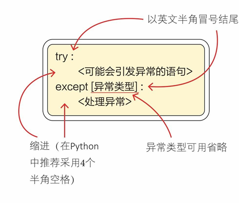
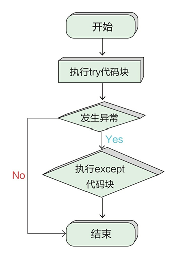
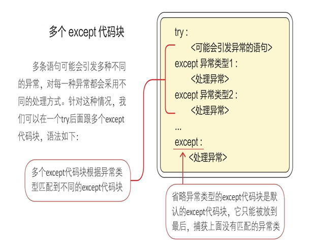
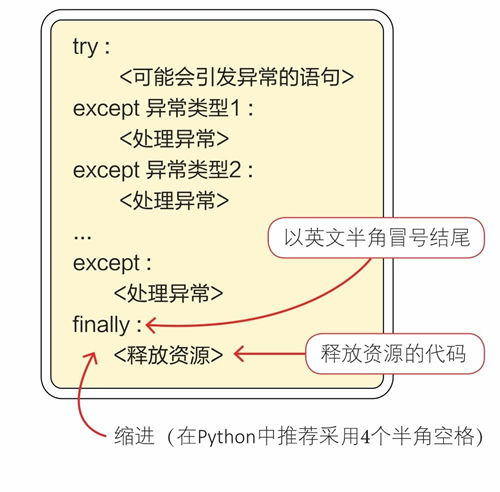
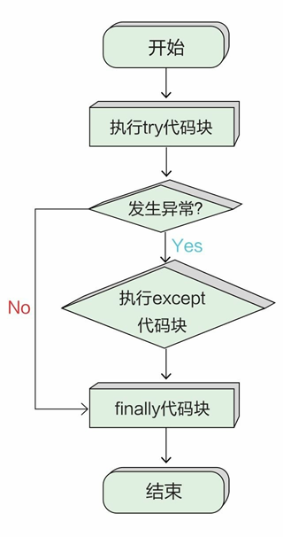

# 模块和包

## 🎯 内容回顾

别急着走，练几道题再走！

上节课我们玩转了字典和集合这两种常用的数据结构，然后重点学习了类和对象的概念。大家在课后有没有进行练习来加深印象和理解呢？为了更好地掌握 Python 这门编程语言，希望大家多多动脑动手。

## 模块和包

今天我们来学习模块和包的相关知识，模块可以理解为是高级的封装。有关封装，可以先结合前面课程学过的知识来简单整理一下：

- 容器（列表、元组、字符串、字典、集合等），是对数据的封装。
- 函数，是对语句的封装。
- 类，是对方法和属性的封装，也就是对函数和数据的封装。

那本节学习的模块，又是怎样一种封装形式呢？

用一句话理解模块：**模块就是程序**。模块就是平时写的任何代码，保存的每一个.py结尾的文件，都是一个独立的模块。

拿我们以前写过的猜数字游戏为例：

```python
import random

def get_valid_input():
    input_string = input("设了个数字，你来猜猜看:")
    while not input_string.isdigit():
        input_string = input("您输入了非数字字符，请输入正确的数字：")
    else:
        guess_number = int(input_string)
        return guess_number

def game():
    secret_number = random.randint(0, 10)
    guess_number = get_valid_input()
    while guess_number != secret_number:
        if guess_number > secret_number:
            print("不好意思，您猜大了")
        else:
            print("您猜的有点小")
        guess_number = get_valid_input()
    else:
        print("大吉大利，今晚吃鸡")
```

我们将其命名为 "猜数字.py"，其实在程序中我们已近用到了系统模块 random，这里先暂时不讲 random，来学习一下如果在另外的 py 文件中使用猜数字.py 里面的函数，其实非常的简单，来看代码：

定义一个 "玩猜数字.py" 文件，和 "猜数字.py" 放在同一个目录（文件夹）下，然后写入如下代码：

```python
import 猜数字
猜数字.游戏()
```

这样就可以实现玩猜数字游戏了。

### 模块的特性

1. 在 Python 中，一个以 .py 为扩展名的文件就叫作一个模块(Module)，每一个模块在 Python 里都是一个独立的文件。
2. 模块可以被其他模块、脚本，甚至是交互式解析器导入(import) 使用，也可以被其他程序引用。
3. 使用模块的好处：
   - 提高代码的可维护性。
   - 提高代码的重用性。
   - 避免命名冲突，避免代码污染。
4. Python 模块分为3种类型：
   - 内置标准模块，又称为标准库，如 sys、time、math、json 模块等。内置 Python 模块一般都位于安装目录下 Lib 文件夹中。
   - 第三方开源模块。这类模块一般通过 pip install 模块名进行在线安装。如果 pip 安装失败，也可以直接访问模块所在官网下载安装包，在本地离线安装。
   - 自定义模块。由开发者自己开发的模块，方便在其他程序或脚本中使用。
5. 自定义的模块名称不能与系统模块重名，否则有覆盖掉内置模块的风险。比如，自定义一个 sys.py 模块后，就不能再使用系统的 sys 模块。并且自定义模块名必须要符合 Python 标识符的命名规则。
6. 当 Python 解释器在源代码中解析到 import 关键字时，会自动在搜索路径中寻找对应的模块，如果发现就会立即导入。导入成功，会运行这个模块的源码并进行初始化，然后就可以使用该模块了。
7. 模块的搜索路径：`import sys; sys.path` 查看。模块搜索顺序：当前目录 ⇒ PYTHONPATH(环境变量)下的每个目录 ⇒ Python 安装目录

### 命名空间

什么是命名空间呢？命名空间（namespace）表示标识符（identifier）的可见范围。一个标识符可在多个命名空间中定义，它在不同命名空间中的含义是互不相干的。

举个栗子：太阳希望小学1班里有个叫小花的同学，2班也恰好有个叫小花的同学，由于她们在两个不同的班级，所以老师上课点名直接叫小花是没有问题的。但如果是期末统考，那么学校整个年级的成绩排名就分不清到底是哪个班的小花排在前面了。那怎么办呢？解决的方法很简单，就是在名字的前面写上相应的班级就可以了。在这个例子中，班级就是命名空间。

在Python中，每个模块都会维护一个独立的命名空间，应该将模块名加上，才能够正常使用模块中的函数：

```python
import 猜数字
猜数字.游戏()
```

接下来的模块导入会继续讲到。

### 模块的导入

```python
import 模块名
from 模块名 import 函数名
import 模块名 as 新名字
```

**as 定义别名**。如果模块名字比较长，在导入模块时可以给它起一个别名。 上代码：

```python
import 猜数字 as cai
cai.游戏()
```

### 第三方模块

除了使用 Python 内置的标准模块外，也可以使用第三方模块。访问 https://pypi.org/，可以查看 Python 开源模块库。

使用 pip 命令安装语法格式：

```bash
pip install 模块名
```

默认连接在国外的 Python 官方服务器下载。 上代码：

```bash
# Windows 中权限不够可以使用命令：
pip install --user 模块名  # (不能用于虚拟环境)

# 提高下载速度可以使用命令：
pip install --user -i http://pypi.douban.com/simple --trusted-host pypi.douban.com 模块名

pip uninstall 模块名  # 卸载指定模块
pip list  # 显示已经安装的第三方模块
```

**离线安装**：

1. 对于二进制文件，直接使用 pip 命令进行安装，安装时把模块名替换为二进制安装文件即可。注意：在命令行下要改变当前目录到安装文件的目录下。
2. 对于源代码压缩包，先解压，并进入目录，然后执行下面的命令完成安装。
   - 编译源码：`python setup.py build`
   - 安装源码：`python setup.py install`

### 包

包将有联系的模块组织在一起，即放到同一个文件夹下，并且在这个文件夹创建一个名字为 `__init__.py` 文件，那么这个文件夹就称之为包。

导入方式如下：

```python
import 包名.模块名
包名.模块名.目标
from 包名 import *
模块名.目标
```

**概念说明**：

这里厘清python中模块、库、包之间的概念差异：

- **模块(module)**：其实就是py文件，里面定义了一些函数、类、变量等
- **包(package)**：是多个模块的聚合体形成的文件夹，里面可以是多个py文件，也可以嵌套文件夹
- **库**：是参考其他编程语言的说法，是指完成一定功能的代码集合，在python中的形式就是模块和包

## 文件读写

文件是数据的载体，程序可以从文件中读取数据，也可以将数据写入文件中，接下来学习如何在 Python中进行文件读写。

我们在使用文件之前要先将文件打开，这通过 `open()` 函数实现。

### open() 函数

`open()` 函数——打开文件并返回文件对象。`open()` 函数用于打开文件，返回一个文件读写对象，然后可以对文件进行相应读写操作。

语法格式如下：

```python
open(filename, mode='r', buffering=-1, encoding=None, errors=None, newline=None, closefd=True, opener=None)
```

`open()`这个函数有很多参数，但作为初学者，只需要先关注第一个和第二个参数即可。第一个参数是传入的文件名，如果只有文件名，不带路径的话，那么Python会在当前文件夹中去找到该文件并打开；第二个参数指定文件打开模式。

我们在使用文件的时候，当文件打开了，使用完之后还得对应将其关闭（调用文件对象的 `.close()` 方法），在Python中我们可以使用 `with` 语句来简化代码，而且再也不用担心出现文件打开了忘记关闭的问题了（with会自动帮助关闭文件）。

举个栗子，我们想把九九乘法表写到文件中去，我们可以用以下代码实现：

```python
with open('九九乘法表.txt','w') as jiu:
    for i in range(1, 10):
        for j in range(1, i+1):
            jiu.write(f'{j} * {i} = {i * j:^2d}  ')
        jiu.write('\n')
```


#### open()函数参数说明

1. **filename**：必需参数，文件路径，表示需要打开文件的相对路径(相对于程序所在路径，比如，要创建或打开程序所在路径下的 test.txt 文件，则可以直接写成相对路径 test.txt ，如果是程序所在路径下的 soft 子路径下的 test.txt 文件，则可写成 soft/test.txt 或者绝对路径 (需要输入包含盘符的完整文件路径，如 D:/test.txt )。文件路径注意需要使用单引号或双引号括起来。

2. **mode**：可选参数，用于指定文件的打开模式。常见的打开模式有 r(以只读模式打开)、w(以只写模式打开)、a(以追加模式打开)，默认的打开模式为只读(即 r)。实际调用的时候可以根据情况进行组合，mode 参数的参数值及说明如下表所示。

| 模式 | 功能 | 说明 |
|------|------|------|
| 't' | 文本模式 | 默认，以文本模式打开文件。一般用于文本文件 |
| 'b' | 二进制模式 | 以二进制格式打开文件。一般用于非文本文件，如图片等。 |
| 'r' | 只读模式 | 默认。以只读方式打开一个文件，文件指针被定位到文件头的位置。如果该文件不存在，则会报错 |
| 'w' | 只写模式 | 打开一个文件只用于写入，如果该文件已存在，则打开文件，清空文件内容，并把文件指针定位到文件头位置开始编辑。如果该文件不存在，则创建新文件，打开并编辑。 |
| 'a' | 追加模式 | 打开一个文件用于追加，仅有只写权限，无权读操作。如果该文件已存在，文件指针定位到文件尾新内容被写入到原内容之后。如果该文件不存在，则创建新文件并写入。 |
| '+' | 更新模式 | 打开一个文件进行更新，具有可读、可写权限。注意，该模式不能单独使用，需要与r、w、a模式组合使用。打开文件后，文件指针的位置由r、w、a组合模式决定。 |
| 'x' | 只写模式 | 新建一个文件，打开并写入内容，如果该文件已存在，则会报错。 |
| 'r+' | 文本格式读写 | 打开文件后，可以读取文件内容，也可以写入新的内容覆盖原有内容(从文件开头进行覆盖)如果该文件不存在，则会报错。 |
| 'rb' | 二进制格式只读 | 以二进制格式打开文件，并且采用只读模式。文件的指针将会放在文件的开头。一般用于非文本文件，如图片、声音等。如果该文件不存在，则会报错。 |
| 'rb+' | 二进制格式读写 | 以二进制格式打开文件，并且采用读写模式。文件的指针将会放在文件的开头。一般用于非文本文件，如图片、声音等。如果该文件不存在，则会报错。 |
| 'w+' | 文本格式读写 | 打开文件后，先清空原有内容，使其变为一个空的文件，对这个空文件有读写权限 |
| 'wb' | 二进制格式只写 | 以二进制格式打开文件，并且采用只写模式。一般用于非文本文件，如图片、声音等 |
| 'wb+' | 二进制格式读写 | 以二进制格式打开文件，并且采用读写模式。一般用于非文本文件，如图片、声音等 |
| 'a+' | 文本格式读写 | 以读写模式打开文件。如果该文件已经存在，文件指针将放在文件的末尾（即新内容会被写入到已有内容之后），否则，创建新文件用于读写 |
| 'ab' | 二进制格式只写 | 以二进制格式打开文件，并且采用追加模式。如果该文件已经存在，文件指针将放在文件的末尾（即新内容会被写入到已有内容之后），否则，创建新文件用于写入 |
| 'ab+' | 二进制格式读写 | 以二进制格式打开文件，并且采用追加模式。如果该文件已经存在，文件指针将放在文件的末尾（即新内容会被写入到已有内容之后），否则，创建新文件用于读写 |

3. **buffering**：可选参数，用于指定读写文件的缓冲模式，值为 0 表示不缓冲，直接写入磁盘；值为 1 表示缓冲(默认为缓冲模式)，缓冲区碰到 `\n` 换行符时写入磁盘；如果大于 1，则缓冲区文件大小达到该数字大小时，写入磁盘。
4. **encoding**：表示读写文件时所使用的文件编码格式，一般使用 UTF-8。
5. **errors**：表示读写文件时碰到错误的报错级别。
6. **newline**：表示用于区分换行符(只对文本模式有效，可以取的值有 None、`\n`、`\r`、`\r\n`)
7. **closefd**：表示传入的 file 参数类型(缺省为True)，传入文件路径时一定为 True，传入文件句柄则为 False。
8. **opener**：传递可调用对象。

### 文件操作的常用方法

打开文件后对文件读取操作通常有三种方法：`read()` 方法表示读取全部内容；`readline()` 方法表示逐行读取；`readlines()` 方法表示读取所有行内容。下面分别进行介绍。

1. **read() 方法**。读取文件的全部或部分内容，对于连续的面向行的读取，则不使用该方法。

   语法如下：
   ```python
   fp.read([size])
   ```
   其中，size 为可选参数，用于指定要读取文件内容的字符数(所有字符均按一个计算，包括汉字，如 name：无的字符数为 6)，如 read(8)，表示读取前 8 个字符。如果省略，则返回整个文件的内容。注意：使用 read() 方法读取文件内容时，如果文件大于可用内存，则不能实现文件的读取，而是返回空字符串。

2. **readline() 方法**。返回文件中一行的内容。

   具体语法为：
   ```python
   file.readline([size])
   ```
   其中，size为可选参数，用于指定读取一行内容的范围，如 readline(8)，表示指读取一行中前8个字符的内容。如果省略，则返回整行的内容。

3. **readlines() 方法**。返回一个列表，列表中每个元素为文件中的一行数据。

   语法如下：
   ```python
   file.readlines()
   ```

除了对文件读取操作，还可以对文件进行写入、获取文件指针位置和关闭文件等操作。具体方法如下：

4. **write() 方法**。将内容写入文件。

   语法如下：
   ```python
   f.write(obj)
   ```
   其中，obj 为要写入的内容。

5. **tell() 方法**。返回一个整数，表示文件指针的当前位置，即在二进制模式下距离文件头的字节数。

   语法如下：
   ```python
   f.tell()
   ```
   说明：使用 tell() 方法返回的位置与为 read() 方法指定的 size 参数不同。tell() 方法返回的不是字符的个数，而是字节数，其中汉字所占的字节数根据其采用的编码有所不同，如果采用 GBK 编码，则一个汉字按两个字符计算；如果采用 UTF-8 编码，则一个汉字按 3 个字符计算。

6. **seek() 方法**。将文件的指针移动到新的位置，位置通过字节数进行指定。这里的数值与tell()方法返回的数值的计算方法一致。

   语法如下：
   ```python
   file.seek(offset[, whence])
   ```
   参数说明：
   - file：表示已经打开的文件对象；
   - offset：用于指定移动的字符个数，其具体位置与whence有关；
   - whence：用于指定从什么位置开始计算。值为 0 表示从文件头开始计算，1 表示从当前位置开始计算，2 表示从文件尾开始计算，默认为 0。

7. **close() 方法**。关闭打开的文件。

   语法如下：
   ```python
   file.close()
   ```

## 异常处理

为增强程序的健壮性，我们也需要考虑异常处理方面的内容。比如，在读取文件时需要考虑文件不存在、文件格式不正确等异常情况。

既然程序不定哪里会出问题，我们应该学会用适当的方法去解决问题。程序出现逻辑错误或者用户输入不合法都会引发异常，但这些异常并不是致命的，不会导致程序崩溃死掉。可以利用Python提供的异常处理机制，在异常出现的时候及时捕获，并从内部自我消化掉。

比如在数学中，任何整数都不能除以0，如果在计算机程序中将整数除以0，则会引发异常。 上代码：

```python
dividend = int(input("请输入被除数："))
divisor = int(input("请输入数除数："))
result = dividend / divisor
print(f'{dividend} 除以 {divisor} 等于 {result} ')

# 运行结果
请输入被除数：9
请输入数除数：0
Traceback (most recent call last):
  File "E:/异常.py", line 13, in <module>
    result = dividend / divisor
ZeroDivisionError: division by zero
```

### 捕获异常

我们不能防止用户输入0，但在出现异常后我们能捕获并处理异常，不至于让程序发生终止并退出。亡羊补牢，为时未晚。

### try-except语句

异常捕获是通过try-except语句实现的，基本的try-except语句的语法如下。



在try代码块中包含在执行过程中可能引发异常的语句，如果没有发生异常，则跳到except代码块执行，这就是异常捕获。

我们将上面的除数为0的情况使用异常捕获进行改造如下：

```python
dividend = int(input("请输入被除数："))
divisor = int(input("请输入数除数："))
try:
    result = dividend / divisor
    print(f'{dividend} 除以 {divisor} 等于 {result} ')
except:
    print("除数不能为0")
```




### 多个except代码块

多条语句可能会引发多种不同的异常，对每一种异常都会采用不同的处理方式。针对这种情况，我们可以在一个try后面跟多个except代码块，语法如下：



### 多重异常捕获

上面的我们只对除数为零的情况进行了简单捕获，并没有捕获输入非数字的情况，所以我们多捕获下异常输入，可以这样写：

```python
try:
    dividend = int(input("请输入被除数："))
    divisor = int(input("请输入数除数："))
    result = dividend / divisor
    print(f'{dividend} 除以 {divisor} 等于 {result} ')
except ZeroDivisionError:
    print("除数不能为0")
except ValueError:
    print("输入类型不正确")
except:
    print("出错了")
```

### 使用finally代码块释放资源

有时在try-except语句中会占用一些资源，比如打开的文件、网络连接、打开的数据库及数据结果集等都会占用计算机资源，需要程序员释放这些资源。为了确保这些资源能够被释放，可以使用finally代码块。

在try-except语句后面还可以跟一个finally代码块，语法如下。


无论是try代码块正常结束还是except代码块异常结束，都会执行finally代码块。



我们根据上面的代码再完善下：

```python
try:
    dividend = int(input("请输入被除数："))
    divisor = int(input("请输入数除数："))
    result = dividend / divisor
    print(f'{dividend} 除以 {divisor} 等于 {result} ')
except ZeroDivisionError:
    print("除数不能为0")
except ValueError:
    print("输入类型不正确")
except:
    print("出错了")
finally:
    print("正确与否都来报道")
```



### 抛出异常

在Python 中可以使用 raise 语句抛出一个指定的异常。

raise语法格式如下：

```python
raise [Exception [, args [, traceback]]]
```

唯一的一个参数指定了要被抛出的异常。它必须是一个异常的实例或者是异常的类（也就是 Exception 的子类）。

如果你只想知道这是否抛出了一个异常，并不想去处理它，那么一个简单的 raise 语句就可以再次把它抛出。

## 文档总结

这篇文档我们学了模块和包的概念和使用，模块里的命名空间有效了解决了取名的困扰问题。文件读写是编程中非常常见的需求，大家一定要掌握。优秀的程序也往往离不开对异常的妥善处理，编程时一定要养成边界思维，多加练习，才能写出更健壮的代码。

## 练习题