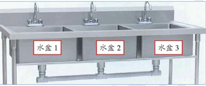

# 进程和线程

## 🎯 课前回顾

别急着走，练几道题再走！

上节课我们掌握了模块和包的概念和使用，也了解了模块里的命名空间的作用，接着又学习了编程中常用的文件读写操作，再教了大家如何处理异常，写出更健壮的代码，更优秀的程序。

## 进程和线程

### 概念

现代PC操作系统比如Mac OS X，UNIX，Linux，Windows等，都是支持"多任务"的操作系统。

什么叫"多任务"呢？说白了，就是操作系统可以同时运行多个任务。举个栗子，你一边在用浏览器上网，一边在听MP3，一边在用Word赶作业，这就是多任务，至少同时有3个任务正在运行。还有很多任务悄悄地在后台同时运行着，只是桌面上没有显示而已。

现在，多核CPU已经非常普及了，但是，即使过去的单核CPU，也可以执行多任务。由于CPU执行代码都是顺序执行的，那么，单核CPU是怎么执行多任务的呢？

答案就是操作系统轮流让各个任务交替执行，任务1执行0.01秒，切换到任务2，任务2执行0.01秒，再切换到任务3，执行0.01秒……这样反复执行下去。表面上看，每个任务都是交替执行的，但是，由于CPU的执行速度实在是太快了，我们感觉就像所有任务都在同时执行一样。

真正的并行执行多任务只能在多核CPU上实现，但是，由于任务数量远远多于CPU的核心数量，所以，操作系统也会自动把很多任务轮流调度到每个核心上执行。

对于操作系统来说，一个任务就是一个进程（Process），比如打开一个浏览器就是启动一个浏览器进程，打开一个记事本就启动了一个记事本进程，打开两个记事本就启动了两个记事本进程，打开一个Word就启动了一个Word进程。

有些进程还不止同时干一件事，比如Word，它可以同时进行打字、拼写检查、打印等事情。在一个进程内部，要同时干多件事，就需要同时运行多个"子任务"，我们把进程内的这些"子任务"称为线程（Thread）。

由于每个进程至少要干一件事，所以，一个进程至少有一个线程。当然，像Word这种复杂的进程可以有多个线程，多个线程可以同时执行，多线程的执行方式和多进程是一样的，也是由操作系统在多个线程之间快速切换，让每个线程都短暂地交替运行，看起来就像同时执行一样。当然，真正地同时执行多线程需要多核CPU才可能实现。

我们前面编写的所有的Python程序，都是执行单任务的进程，也就是只有一个线程。如果我们要同时执行多个任务怎么办？

来总结一下就是，多任务的实现有3种方式：

1. **多进程模式**：启动多个进程，每个进程虽然只有一个线程，但多个进程可以一块执行多个任务。
2. **多线程模式**：启动一个进程，在一个进程内启动多个线程，这样，多个线程也可以一块执行多个任务。
3. **多进程 + 多线程模式**：启动多个进程，每个进程再启动多个线程，这样同时执行的任务就更多了，当然这种模型更复杂，实际很少采用。

同时执行多个任务通常各个任务之间并不是没有关联的，而是需要相互通信和协调，有时，任务1必须暂停等待任务2完成后才能继续执行，有时，任务3和任务4又不能同时执行，所以，多进程和多线程的程序的复杂度要远远高于我们前面写的单进程单线程的程序。

因为复杂度高，调试困难，所以，不是迫不得已，我们也不想编写多任务。但是，有很多时候，没有多任务还真不行。想想在电脑上看电影，就必须由一个线程播放视频，另一个线程播放音频，否则，单线程实现的话就只能先把视频播放完再播放音频，或者先把音频播放完再播放视频，这显然是不行的。

Python既支持多进程，又支持多线程，接下来我们就来学习如何编写这两种多任务程序。

### 使用multiprocessing

启动多进程可以同时完成多任务，同时执行的任务数量受电脑CPU的核心数量限制。

比如有一个任务，执行完成一次需要2秒钟，任务需要执行16次，以我们之前所学的知识来完成的话，只能依次重复执行16次，需要32秒才能完成。

而使用多进程可以重复利用电脑CPU资源，可以成倍的提升任务执行效率。

要在python中实现真正的并行执行，而不是以多个线程并发的形式构建程序，在Python中有多个模块可以创建进程，比较常用的有os.fork()函数、multiprocessing包和Pool进程池。由于os.fork()函数只适用于Unix/Linux/Mac系统上运行，在Windows操作系统中不可用，所以接下来我们重点学习multiprocessing包和Pool进程池这2个跨平台模块。

使用多进程完成上面的多任务非常的简单，先来看看实现代码：

```python
import multiprocessing
import time

# 任务
def task():
    print(f' {time.strftime("%H:%M:%S")} 执行任务...')
    time.sleep(2)

if __name__ == "__main__":
    # 小建议：
    # 在写代码的时候，最好是加上判断是否是主模块 (你要执行哪个py文件，哪个py文件就叫做主模块)
    # 原因:
    # 1.防止别人导入的时候，执行相关的代码
    # 2.在创建进程的时候，在Windows系统中会拷贝主进程中的
    # 所有代码，所以会造成递归创建子进程，形成死递归，报错。
    
    for i in range(16):
        task_process = multiprocessing.Process(target=task)
        # 3.启动进程执行对应的任务
        task_process.start()
    # 注意: 进程执行是无序的，具体哪个先执行是由操作系统调度所决定的
```

multiprocessing提供了一个Process类来代表一个进程对象，语法如下:

```python
Process([group [, target [, name [, args [, kwargs]]]]])
```

Process类的参数说明如下:

- **group**: 表示进程组，目前只能设置为None，一般不需要进行设置。
- **target**：表示当前进程启动时执行的可调用对象。即进程执行的目标任务，一般是函数名或者是方法名
- **name**: 为当前进程实例的别名。如果不设置，默认为Process-1, Process-2,…Process-N
- **args**: 表示传递给target函数的参数元组。
- **kwargs**: 表示传递给target函数的参数字典。

上述代码中，先实例化Process类，然后使用`start()`方法启动子进程，开始task()函数。

Process的实例常用的方法除start()外，还有如下常用方法:

- `is_alive()`: 判断进程实例是否还在执行。
- `join([timeout])`: 是否等待进程实例执行结束，或等待多少秒。
- `start()`: 启动进程实例(创建子进程)。
- `run()`: 如果没有给定target参数，对这个对象调用start()方法时，就将执行对象中的run()方法。
- `terminate()`: 不管任务是否完成，立即终止。

Process类还有如下常用属性:

- **name**: 当前进程实例别名，默认为Process-N, N为从1开始递增的整数。
- **pid**: 当前进程实例的PID值。

刚刚我们执行的任务函数是没有参数的，根据上面的语法规则，添加函数参数也非常的简单，来看代码：

```python
import multiprocessing
import random
import time

# 任务
def task2(sec):
    print(f' {time.strftime("%H:%M:%S")} 执行任务 {sec}...')
    time.sleep(sec)

if __name__ == "__main__":
    for i in range(8):
        task_process = multiprocessing.Process(target=task2, args=(random.randint(1, 3),))  # 注意元组只有一个元素的时候需要加上逗号
        task_process.start()
```

### 使用进程池Pool创建进程

使用multiprocessing模块提供的Pool类，即Pool进程池，可以更加方便的创建进程。为了更好的理解进程池，可以将进程池比作水池，如图所示。



我们需要完成放满10个水盆的水的任务，而在这个水池中，最多可以安放3个水盆接水，也就是同时可以执行3个任务，即开启3个进程。为更快完成任务，现在打开3个水龙头开始放水，当有一个水盆的水接满时，即该进程完成1个任务，我们就将这个水盆的水倒入水桶中，然后继续接水，即执行下一个任务。如果3个水盆每次同时装满水，那么在放满第9盆水后，系统会随机分配1个水盆接水，另外2个水盆空闲。简单理解就是说：重复的进行了进程资源利用，不用频繁地创建进程，消耗系统资源。

接下来，先来了解一下Pool类的常用方法。常用方法及说明如下:

- `apply_async(func[, args[, kwds]])`: 使用非阻塞方式调用func()函数(并行执行，堵塞方式必须等待上一个进程退出才能执行下一个进程)，args为传递给func()函数的参数列表，kwds为传递给func()函数的关键字参数列表。
- `apply(func[, args[, kwds]])`: 使用阻塞方式调用func()函数。
- `close()`: 关闭Pool, 使其不再接受新的任务。
- `terminate()`: 不管任务是否完成，立即终止。
- `join()`: 主进程阻塞，等待子进程的退出，必须在close或terminate之后使用。

在上面的方法提到`apply_async()`使用非阻塞方式调用函数，而`apply()`使用阻塞方式调用函数。那么什么又是阻塞和非阻塞呢?在图中，分别使用阻塞方式和非阻塞方式执行3个任务。如果使用阻塞方式，必须等待上一个进程退出才能执行下一个进程，而使用非阻塞方式，则可以并行执行3个进程。

下面通过一个示例演示一下如何使用进程池创建多进程。这里模拟水池放水的场景，定义一个进程池，设置最大进程数为3。然后使用非阻塞方式执行16个任务，查看每个进程执行的任务。具体代码如下:

```python
from multiprocessing import Pool  # 导入
import os
import time

def task(name):
    print(f"子进程 {os.getpid()} 执行 task{name} ...")
    time.sleep(2)

if __name__ == "__main__":
    # 1.创建进程池最大进程数为3
    pool = Pool(3)
    # 2.从0开始执行10次
    for i in range(16):
        # 使用非阻塞方式调用task()函数
        pool.apply_async(task, args=(i,))
    print("等待所有子进程结束...")
    pool.close()  # 关闭进程池，关闭后pool不再接受新的任务请求
    pool.join()  # 等待子进程结束, 没有这句代码，程序会直接结束
    print("所有子进程结束.")
```


**代码解读**：

对Pool对象调用`join()`方法会等待所有子进程执行完毕，调用`join()`之前必须先调用`close()`，调用`close()`之后就不能继续添加新的Process了。

请注意输出的结果，task 0，1，2是立刻执行的，而task 3要等待前面某个task完成后才执行，这是因为Pool的最大进程数为3，因此，最多同时执行3个进程。这是Pool有意设计的限制，并不是操作系统的限制。如果改成：

```python
p = Pool(5)
```

就可以同时跑5个进程。这里有一点需要注意Pool的默认大小是电脑的CPU核数。

多进程还可以结合队列进行使用，后续会结合实战案例进行讲解。

### 多线程

多任务可以由多进程完成，也可以由一个进程内的多线程完成。

我们前面提到了进程是由若干线程组成的，一个进程至少有一个线程。

由于线程是操作系统直接支持的执行单元，因此，高级语言通常都内置多线程的支持，Python也不例外，并且，Python的线程是真正的Posix Thread，而不是模拟出来的线程。

Python的标准库提供了两个模块：_thread和threading，_thread是低级模块，threading是高级模块，对_thread进行了封装。绝大多数情况下，我们只需要使用threading这个高级模块。

启动一个线程就是把一个函数传入并创建Thread实例，然后调用start()开始执行，我们用多线程来实现一下上面的任务：

```python
import threading  # 1.导入线程模块
import time

# 任务
def task():
    print(f' {time.strftime("%H:%M:%S")} 执行任务...')
    time.sleep(2)

if __name__ == '__main__':
    # 获取当前线程
    print("main_thread:", threading.current_thread())
    for i in range(16):
        # 1.创建子线程
        task_thread = threading.Thread(target=task, name="task_thread")
        # 2.启动子线程执行对应的任务
        task_thread.start()
```

threading模块提供了一个Thread类来代表一个线程对象，语法如下:

```python
Thread([group [, target [, name [, args [, kwargs]]]]])
```

Thread类的参数说明如下:

- **group**: 值为None，为以后版本而保留。
- **target**: 表示一个可调用对象，线程启动时，run()方法将调用此对象，默认值为None，表示不调用任何内容。
- **name**: 表示当前线程名称，默认创建一个"Thread-N"格式的唯一名称。
- **args**: 表示传递给target()函数的参数元组。
- **kwargs**: 表示传递给target()函数的参数字典。

对比发现，Thread类和前面讲解的Process类的方法基本相同，调用带参数的函数和进程使用语法类似，可以在课后进行编码测试。

而多线程和多进程最大的不同在于，多进程中，同一个变量，各自有一份拷贝存在于每个进程中，互不影响，而多线程中，所有变量都由所有线程共享，所以，任何一个变量都可以被任何一个线程修改，因此，线程之间共享数据最大的危险在于多个线程同时改一个变量，把内容给改乱了，所以在使用多线程的时候尤其要注意这个问题。

### 分析对比

我们学习了多进程和多线程，这是实现多任务最常用的两种方式。现在，我们来讨论一下这两种方式的优缺点。

首先，要实现多任务，通常我们会设计Master-Worker模式，Master负责分配任务，Worker负责执行任务，因此，多任务环境下，通常是一个Master，多个Worker。

如果用多进程实现Master-Worker，主进程就是Master，其他进程就是Worker。

如果用多线程实现Master-Worker，主线程就是Master，其他线程就是Worker。

多进程模式最大的优点就是稳定性高，因为一个子进程崩溃了，不会影响主进程和其他子进程。（当然主进程挂了所有进程就全挂了，但是Master进程只负责分配任务，挂掉的概率低）著名的Apache最早就是采用多进程模式。

多进程模式的缺点是创建进程的代价大，在Unix/Linux系统下，用fork调用还行，在Windows下创建进程开销巨大。另外，操作系统能同时运行的进程数也是有限的，在内存和CPU的限制下，如果有几千个进程同时运行，操作系统连调度都会成问题。

多线程模式通常比多进程快一点，但是也快不到哪去，而且，多线程模式致命的缺点就是任何一个线程挂掉都可能直接造成整个进程崩溃，因为所有线程共享进程的内存。在Windows上，如果一个线程执行的代码出了问题，你经常可以看到这样的提示："该程序执行了非法操作，即将关闭"，其实往往是某个线程出了问题，但是操作系统会强制结束整个进程。

在Windows下，多线程的效率比多进程要高，所以微软的IIS服务器默认采用多线程模式。由于多线程存在稳定性的问题，IIS的稳定性就不如Apache。为了缓解这个问题，IIS和Apache现在又有多进程+多线程的混合模式，这使得架构变得更加复杂。

## 课程总结

进程和线程是很多初学者容易混淆的概念，我们需要多看多想，才能更好地理解其不同的含义。多线程编程是迈向高阶水平的必备技能，希望大家多多练习。

## 课后习题

### 选择题（单选）

1、在Python中下面哪种方式不能实现多任务：
- A、多进程模式
- B、单线程模式
- C、多线程模式
- D、多进程 + 多线程模式

2、使用Pool创建进程池，`pool = Pool()`，进程池的最大进程数量是多少？
- A、4
- B、2
- C、16
- D、CPU核数

3、现有函数 `task(score)`，下面能正确创建子线程的语句是？
- A、`task_thread = threading.Thread(target=task, name="task_thread")`
- B、`task_thread = threading.Thread(target=task，args=(99,))`
- C、`task_thread = threading.Thread(target=task，args=99)`
- D、`task_thread = threading.Thread(target=task, kwargs=99)`

### 编程题

4、创建两个线程，分别调用music(name)函数和movie(name)函数，name为传入参数，music函数播放传入的歌曲名 [中国红]，启动后输出当前时间与正在播放的音乐名，休息1秒后再次输出，共持续3秒，movie函数播放传入的视频名 [长津湖]，启动后输出当前时间与正在播放的视频名，休息2秒后再次输出，共持续10秒，输出格式如下：

```
16:40:37: 正在播放音乐[中国红]
16:40:37: 正在播放视频[长津湖]
16:40:38: 正在播放音乐[中国红]
16:40:39: 正在播放视频[长津湖]
16:40:39: 正在播放音乐[中国红]
16:40:41: 正在播放视频[长津湖]
16:40:43: 正在播放视频[长津湖]
16:40:45: 正在播放视频[长津湖]
```