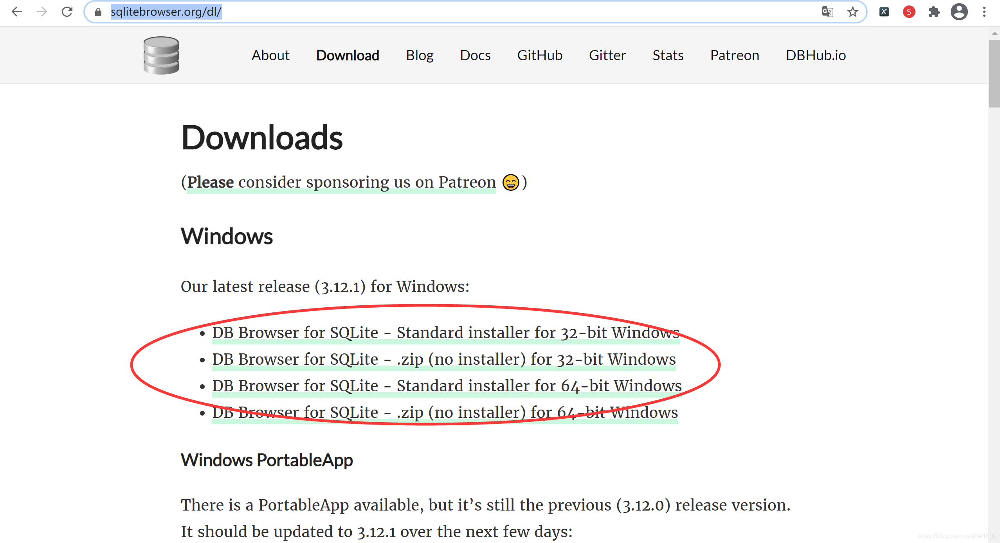
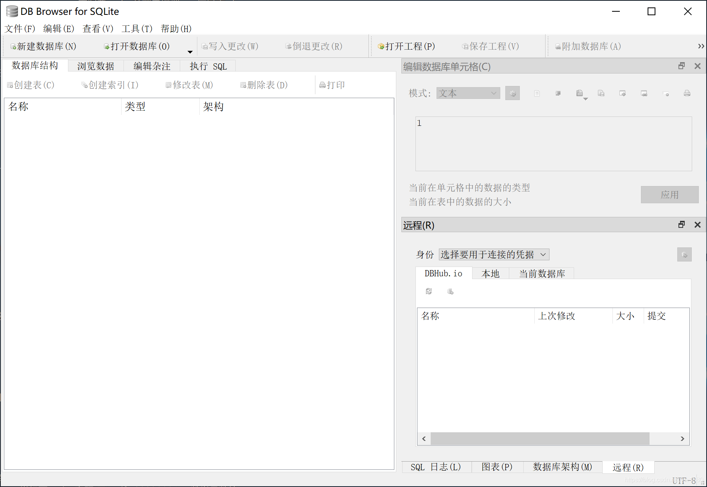
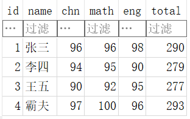

# 访问数据库

## 🎯 内容回顾

学完不练等于白学，动手试试！

上一篇我们玩转了进程和线程，这是很多初学者容易混淆的概念，有没有在课后多去编码练练呢？只有多动手写多调试，才能更好地理解其不同的含义和使用场景。掌握多线程编程，是迈向高阶水平的必备技能。

## 访问数据库

### 数据库概述

#### 为什么要使用数据库

程序运行的时候，数据都是在内存中的。当程序终止的时候，通常都需要将数据保存到磁盘上，无论是保存到本地磁盘，还是通过网络保存到服务器上，最终都会将数据写入磁盘文件。

而如何定义数据的存储格式就是一个大问题。如果我们自己来定义存储格式，比如保存一个班级所有学生的成绩单：

你可以用一个文本文件保存，一行保存一个学生，用`,`隔开：
```
张三,99
李四,85
王五,59
赵六,87
```

你还可以用JSON格式保存，也是文本文件：
```json
[
  {"name":"张三","score":99},
  {"name":"李四","score":85},
  {"name":"王五","score":59},
  {"name":"赵六","score":87}
]
```

你还可以定义各种保存格式，但是问题来了：

- 存储和读取需要自己实现，JSON还是标准，自己定义的格式就各式各样了；
- 不能做快速查询，只有把数据全部读到内存中才能自己遍历，但有时候数据的大小远远超过了内存（比如蓝光电影，40GB的数据），根本无法全部读入内存。

为了便于程序保存和读取数据，而且，能直接通过条件快速查询到指定的数据，就出现了数据库（Database）这种专门用于集中存储和查询的软件。我们现在广泛使用的关系数据库是20世纪70年代基于关系模型的基础上诞生的。

#### NoSQL

你也许还听说过NoSQL数据库，即非关系数据库，很多NoSQL宣传其速度和规模远远超过关系数据库，所以很多人觉得有了NoSQL是否就不需要SQL了呢？建议先掌握SQL的基础，再学习NoSQL会更加容易理解。所以我们先从关系数据库开始学起。

#### 数据库类别

既然我们要使用关系数据库，就必须选择一个关系数据库。目前广泛使用的关系数据库也就这么几种：

**付费的商用数据库**：
- Oracle，典型的高富帅；
- SQL Server，微软自家产品，Windows定制专款；
- DB2，IBM的产品，听起来挺高端；
- Sybase，曾经跟微软是好基友，后来关系破裂，现在家境惨淡。

这些数据库都是不开源而且付费的，最大的好处是花了钱出了问题可以找厂家解决，不过在Web的世界里，常常需要部署成千上万的数据库服务器，当然不能把大把大把的银子扔给厂家，所以，无论是Google、Facebook，还是国内的BAT，无一例外都选择了免费的开源数据库：

- MySQL，大家都在用，一般错不了；
- PostgreSQL，学术气息有点重，其实挺不错，但知名度没有MySQL高；
- sqlite，嵌入式数据库，适合桌面和移动应用。

作为Python开发工程师，选择哪个免费数据库呢？看自己的需求，能够简单方便的满足使用就是最合理的，当然数据库的入门学习当属sqlite莫属了。

### 操作 SQLite 数据库

#### 认识SQLite

SQLite 是一个开源、小巧、零配置的关系型数据库，支持多种平台，包括 Windows、Mac OS X、Linux、Android、iOS 等，现在运行 Android、iOS 等系统的设备基本都使用 SQLite 数据库作为本地存储方案。尽管 Python 语言在很多场景用于开发服务端应用，使用的是网络关系型数据库或 NoSQL 数据库，但有一些数据是需要保存到本地的，虽然可以用 XML、JSON 等格式保存这些数据，但对数据检索很不方便，因此将数据保存到 SQLite 数据库中，是本地存储的最佳方案。可以通过点击此处访问 SQLite 官网。

SQLite 数据库的管理工具很多，SQLite 官方提供了一个命令行工具用于管理 SQLite 数据库，不过这个命令行工具需要输入大量的命令才能操作 SQLite 数据库，并不建议使用。因此，本节将介绍一款跨平台的 SQLite 数据库管理工具 DB Browser for SQLite，这是一款免费开源的 SQLite 数据库管理工具。可以通过点击此处访问官网。进入 DB Browser for SQLite 官网后，选择对应的版本下载即可，如下图所示：





安装好 DB Browser for SQLite 后，直接启动即可看到如下图所示的主界面。

DB Browser for SQLite 在操作上非常简便，课后可以尝试体验使用。

通过 sqlite3 模块提供的函数可以操作 SQLite 数据库，sqlite3 模块是 Python 语言内置的，不需要安装，直接导入该模块即可。sqlite3 模块提供的丰富函数可以对 SQLite 数据库进行各种操作，不过在对数据进行增、删、改、查以及其他操作之前，先要使用 connect() 函数打开 SQLite 数据库，通过该函数的参数指定 SQLite 数据库的文件名。打开数据库后，通过 cursor 方法获取 sqlite3.Cursor 对象，然后通过 sqlite3.Cursor 对象的 execute 方法执行各种 SQL 语句，如创建表、创建视图、删除记录、插入记录、查询记录等。如果执行的是查询 SQL 语句 (SELECT 语句)，那么 execute 方法会返回 sqlite3.Cursor 对象，需要对该对象进行迭代，才能获取查询结果的值。

本例使用 connect 函数在当前目录创建一个名为 data.sqlite 的 SQLite 数据库，并在该数据库中建立一个 persons 表，然后插入若干条记录，最后查询 persons 表的所有记录，并将查询结果输出到控制台。示例代码如下：

```python
# -*- coding: UTF-8 -*-
import sqlite3
import os
import json

dbPath = "data.sqlite"
# 只有data.sqlite文件不存在时才创建该文件
if not os.path.exists(dbPath):
    # 创建 SQLite数据库
    conn = sqlite3.connect(dbPath)
    # 获取 sqlite3.Cursor 对象
    cursor = conn.cursor()
    # 创建 Persons 表
    cursor.execute("""CREATE TABLE persons (
        id INT PRIMARY KEY NOT NULL,
        name TEXT NOT NULL,
        age INT NOT NULL,
        address CHAR(50),
        salary REAL
    ); """)
    # 关闭游标
    cursor.close()
    # 修改数据库后必须调用 commit 方法提交才能生效
    conn.commit()
    # 关闭数据库连接
    conn.close()
    print("创建数据库成功")

conn = sqlite3.connect(dbPath)
c = conn.cursor()
# 删除 persons 表中的所有数据
c.execute("delete from persons;")
# 下面的 4 条语句向 persons表中插入4条记录
c.execute("INSERT INTO persons(id,name,age,address,salary) VALUES(1,'张三',32,'北京',50000.00)")
c.execute("INSERT INTO persons(id,name,age,address,salary) VALUES(2,'李四',25,'上海',15000.00)")
c.execute("INSERT INTO persons(id,name,age,address,salary) VALUES(3,'王五',23,'深圳',20000.00)")
c.execute("INSERT INTO persons(id,name,age,address,salary) VALUES(4,'渣男教父',25,'长沙',60000.00)")
#  必须提交才能生效
conn.commit()  # 提交事务
print("插入数据成功")

# 查询 persons 表中的所有记录，并按age升序排列
c.execute("SELECT name,age,address,salary from persons order by age")
# 利用fetchall()可以拿到结果集。结果集是一个list，每个元素都是一个tuple，对应一行记录
persons = c.fetchall()
print(type(persons))
for person in persons:
    print(type(person), person)

# 将查询结果转换为字符串形式，如果要将数据通过网络传输，就需要首先转换为字符串形式才能传输
resultStr = json.dumps(persons)
print(type(resultStr))
print(resultStr)
c.close()
conn.close()
```

Python操作SQLite数据库非常的简单，使用Python的DB-API时，只要搞清楚Connection 和Cursor 对象，打开后一定记得关闭，就可以放心地使用。

使用Cursor 对象执行insert，update，delete 语句时，执行结果由rowcount 返回影响的行数，就可以拿到执行结果。

使用Cursor 对象执行select 语句时，通过fetchall() 可以拿到结果集。结果集是一个list，每个元素都是一个tuple，对应一行记录。

SQLite支持常见的标准SQL语句以及几种常见的数据类型，下面简单介绍一下最基本的增删改查SQL语句，有关更详细的文档可以参阅SQLite官方网站。

#### 查询数据 SELECT

**1、查询所有 persons 信息**

查询表中所有数据的sql语句写法：`select *` （* 表示查询所有列） from 表名 [order by 列名]

order by 默认按列名升序排列，如果需要降序排列后面加上 desc

```python
# 导入sqlite3模块
from sqlite3 import Error
import sqlite3

# try-except:防止因连接失败导致程序崩溃
try:
    # 数据库文件路径
    db_file = 'data.sqlite'
    # 连接数据库
    conn = sqlite3.connect(db_file)
    # 创建游标
    cour = conn.cursor()
    # 查询语句sql：select 列名(*-所有列) from 表名 [where 条件] [order by 列名]
    sql = 'select * from persons order by age desc'
    # 执行sql语句
    cour.execute(sql)
    # 打印查询结果
    print(cour.fetchall())
    # 关闭游标
    cour.close()
    # 关闭连接
    conn.close()
except Error as e:
    print('连接失败')
```

**2. 按条件查询 persons 信息**

按条件查询语句sql：`select 列名` (* 可以表示所有列) from 表名 [where 条件]

因为条件查询需要传入条件参数，如果SQL语句带有参数，那么需要把参数按照位置传递给 execute() 方法，语句中有几个`?`占位符就必须对应几个参数（传入数据为元组），比如：

```python
# 导入sqlite3模块
from sqlite3 import Error
import sqlite3

# try-except:防止因连接失败导致程序崩溃
try:
    # 数据库文件路径
    db_file = 'data.sqlite'
    # 连接数据库
    conn = sqlite3.connect(db_file)
    # 创建游标
    cour = conn.cursor()
    # 编写sql语句
    # 查询语句sql：select 列名(*-所有列) from 表名 [where 条件]
    # ?-占位符，在cour.execute()参数中，传入数据元组
    sql = 'select * from persons where name=?'
    # 构建数据元组
    name = ('渣男教父',)
    # 执行sql语句
    cour.execute(sql, name)
    # 打印查询结果
    print(cour.fetchall())
    # 关闭游标
    cour.close()
    # 关闭连接
    conn.close()
except Error as e:
    print('连接失败')

cursor.execute('SELECT name,age,address,salary from persons where name=?', ('渣男教父',))
```

#### 增加数据 INSERT

**1、增加单条 persons 信息**

添加数据的sql语句：`INSERT INTO 表名 (列名) VALUES (<列1的值>,[<列2的值>,<列3的值>]);`

?-占位符，在cour.execute()参数中，传入数据元组

```python
# 导入sqlite3模块
from sqlite3 import Error
import sqlite3

# try-except:防止因连接失败导致程序崩溃
try:
    # 数据库文件路径
    db_file = 'data.sqlite'
    # 连接数据库
    conn = sqlite3.connect(db_file)
    # 创建游标
    cour = conn.cursor()
    # 编写sql语句
    # 添加语句sql：INSERT INTO 表名(列名)
    # VALUES (<列1的值>,[<列2的值>,<列3的值>]);
    # ?-占位符，在cour.execute()参数中，传入数据元组
    # 主键id也可设置为自增，自增的列可以不需要传入
    sql = 'INSERT INTO persons(id,name,age,address,salary) VALUES(?,?,?,?,?)'
    # 构建数据元组
    p_data = (5, '托尼老弟', 35, '长沙', 6000.00)
    # 执行sql语句
    cour.execute(sql, p_data)
    # 提交数据-同步到数据库文件-增删改查，除了查询以外有需要进行提交
    conn.commit()
    # 打印受影响的行数
    print(cour.rowcount)
    # 关闭游标
    cour.close()
    # 关闭连接
    conn.close()
except Error as e:
    print('连接失败')
```

**2、增加多条 persons 信息**

```python
# 导入sqlite3模块
from sqlite3 import Error
import sqlite3

# try-except:防止因连接失败导致程序崩溃
try:
    # 数据库文件路径
    db_file = 'data.sqlite'
    # 连接数据库
    conn = sqlite3.connect(db_file)
    # 创建游标
    cour = conn.cursor()
    # 编写sql语句
    # 添加语句sql：INSERT INTO 表名(列名)
    # VALUES (<列1的值>,[<列2的值>,<列3的值>]);
    # ?-占位符，在cour.execute()参数中，传入数据元组
    sql = 'INSERT INTO persons(id,name,age,address,salary) VALUES(?,?,?,?,?)'
    # 构建数据元组列表
    p_data = [
        (6, '张三', 32, '北京', 50000.00),
        (7, '李四', 25, '上海', 15000.00),
        (8, '王五', 23, '深圳', 20000.00)
    ]
    # 执行sql语句
    cour.executemany(sql, p_data)
    # 提交数据-同步到数据库文件-增删改查，除了查询以外有需要进行提交
    conn.commit()
    # 打印受影响的行数
    print(cour.rowcount)
    # 关闭游标
    cour.close()
    # 关闭连接
    conn.close()
except Error as e:
    print('连接失败')
```

#### 修改数据 UPDATE

**修改 persons 数据**

修改语句sql：`UPDATE <表名> SET <列名1>=<值1>[,<列名2>=<值2>] [WHERE <条件>];`

?-占位符，在cour.execute()参数中，传入数据元组

```python
# 导入sqlite3模块
from sqlite3 import Error
import sqlite3

# try-except:防止因连接失败导致程序崩溃
try:
    # 数据库文件路径
    db_file = 'data.sqlite'
    # 连接数据库
    conn = sqlite3.connect(db_file)
    # 创建游标
    cour = conn.cursor()
    # 编写sql语句
    # 修改语句sql：UPDATE  <表名>
    # SET  <列名1>=<值1>[,<列名2>=<值2>]
    # [WHERE <条件>];
    # ?-占位符，在cour.execute()参数中，传入数据元组
    sql = 'update persons set salary=? where name=?'
    # 构建数据元组
    p_data = (106000, '渣男教父')
    # 执行sql语句
    cour.execute(sql, p_data)
    # 提交数据-同步到数据库文件-增删改查，除了查询以外有需要进行提交
    conn.commit()
    # 打印受影响的行数
    print(cour.rowcount)
    # 关闭游标
    cour.close()
    # 关闭连接
    conn.close()
except Error as e:
    print('连接失败')
```

#### 删除数据 DELETE

**1、删除单条 persons 信息**

删除语句sql：`DELETE FROM 表名 WHERE <列名1>=<值1>`

?-占位符，在cour.execute()参数中，传入数据元组

```python
# 导入sqlite3模块
from sqlite3 import Error
import sqlite3

# try-except:防止因连接失败导致程序崩溃
try:
    # 数据库文件路径
    db_file = 'data.sqlite'
    # 连接数据库
    conn = sqlite3.connect(db_file)
    # 创建游标
    cour = conn.cursor()
    # 编写sql语句
    # 删除语句sql：DELETE FROM 表名
    # WHERE <列名1>=<值1>
    # ?-占位符，在cour.execute()参数中，传入数据元组
    sql = 'delete from persons where id=?'
    # 构建数据元组
    p_data = (1,)
    # 执行sql语句
    cour.execute(sql, p_data)
    # 提交数据-同步到数据库文件-增删改查，除了查询以外有需要进行提交
    conn.commit()
    # 打印受影响的行数
    print(cour.rowcount)
    # 关闭游标
    cour.close()
    # 关闭连接
    conn.close()
except Error as e:
    print('连接失败')
```

**2. 删除多条 persons 信息**

```python
# 导入sqlite3模块
from sqlite3 import Error
import sqlite3

# try-except:防止因连接失败导致程序崩溃
try:
    # 数据库文件路径
    db_file = 'data.sqlite'
    # 连接数据库
    conn = sqlite3.connect(db_file)
    # 创建游标
    cour = conn.cursor()
    # 编写sql语句
    # 删除语句sql：DELETE FROM 表名
    # WHERE <列名1>=<值1>
    # ?-占位符，在cour.execute()参数中，传入数据元组
    sql = 'delete from persons where id=?'
    # 构建数据元组列表
    p_data = [(2,), (3,)]
    # 执行sql语句
    cour.executemany(sql, p_data)
    # 提交数据-同步到数据库文件-增删改查，除了查询以外有需要进行提交
    conn.commit()
    # 打印受影响的行数
    print(cour.rowcount)
    # 关闭游标
    cour.close()
    # 关闭连接
    conn.close()
except Error as e:
    print('连接失败')
```

#### 操作数据库注意事项

在Python中操作数据库时，要先导入数据库对应的驱动，然后，通过Connection 对象和Cursor 对象操作数据。

要确保打开的Connection 对象和Cursor 对象都正确地被关闭，否则，资源就会泄露。

如何才能确保出错的情况下也关闭掉Connection 对象和Cursor 对象呢？请回忆 try:...except:...finally:... 的用法。

## 文档总结

数据库是编程中数据存取时经常用到的，这篇文档我们通过SQLite这个非常方便的本地存储数据库，学习了关系型数据库的概念和数据库的连接、表的创建、记录查询和关闭连接。

虽然SQLite非常小巧但却非常实用，所使用SQL语句也是通用的。我们学习了增（Insert）、删（delete）、查（select）、改（update）这四个关键语句后，已经能够帮助我们实现大部分的数据操作需求了。希望大家结合之前课程的内容，多多动手练习编码，掌握好 Python 的基础，为后面实战内容奠定坚实的基础。

## 练习题

### 选择题（单选）

1、数据库中有一个student表，里面保存了学生信息，学生成绩的列名叫score，现在需要查询所有学生的信息并按成绩从高到低排列，下面那句SQL语句可以完成？
- A、`select score from student`
- B、`select * from student`
- C、`select * from student order by score desc`
- D、`select * from student order by score`

2、修改数据库中的数据使用什么SQL语句？
- A、SELECT
- B、INSERT
- C、UPDATE
- D、DELETE

3、要查询课堂示例数据库的persons表中张三的工资，cursor表示游标对象，下面那句语句可以完成？
- A、`cursor.execute('SELECT salary from persons where name=?', ('渣男教父',))`
- B、`cursor.execute('SELECT salary from persons where name=?', ('张三'))`
- C、`cursor.execute('SELECT salary from persons where id=?', ('张三',))`
- D、`cursor.execute('SELECT salary from persons where name=?', ('张三',))`

4、使用Python的DB-API时，下面说法不正确的是？
- A、使用Cursor 对象执行select 语句时，通过fetchall() 可以拿到结果集。结果集是一个list，每个元素都是一个tuple，对应一行记录。
- B、使用Cursor 对象执行insert，update，delete 语句时，执行结果由rowcount 返回影响的行数，就可以拿到执行结果。
- C、使用Connection 和Cursor 对象，打开后可以不用关闭。
- D、使用Connection 和Cursor 对象，打开后必须进行关闭。

### 编程题

5. 有学生成绩数据如下：

| 学号 | 姓名 | 语文 | 数学 | 英语 | 总分 |
|------|------|------|------|------|------|
| id | name | chn | math | eng | total |
| (1, '张三', 96, 96, 98, 0) |
| (2, '李四', 94, 95, 90, 0) |
| (3, '王五', 90, 92, 95, 0) |
| (4, '渣男教父', 97, 100, 96, 0) |

要求：利用代码在students.sqlite数据库下创建一张students表，表包含 id（INT类型，主键）、name（TEXT类型）、chn（INT类型）、math（INT类型）、eng（INT类型）、total（INT类型）六列，使用代码插入上面4行数据，然后更新表中所有人的total，total= chn + math + eng，最终数据库中students表数据如下图：

