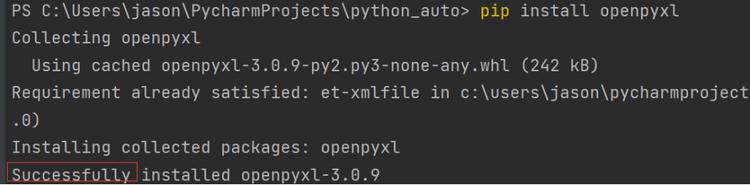
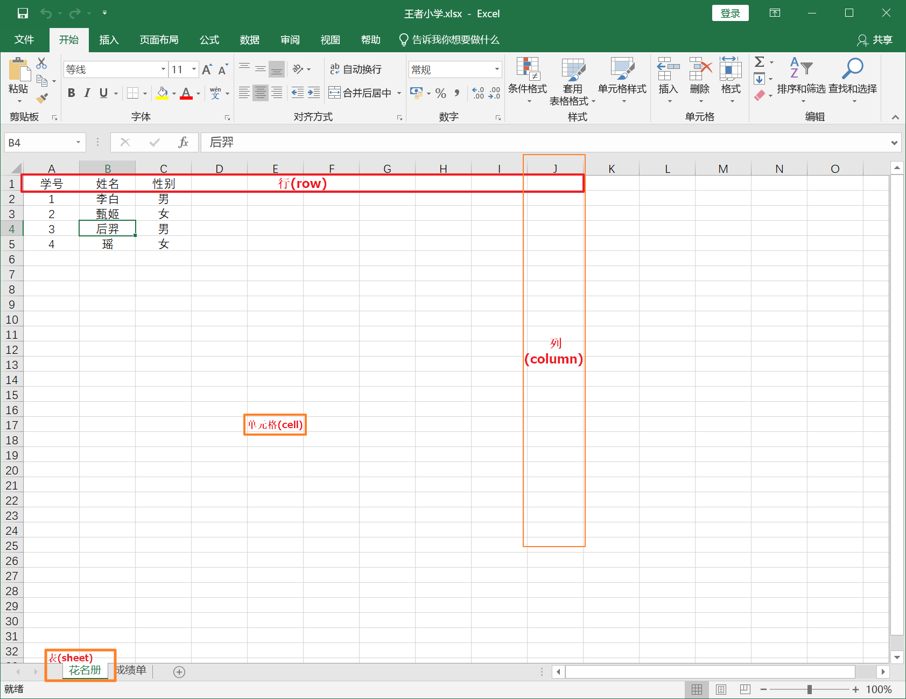
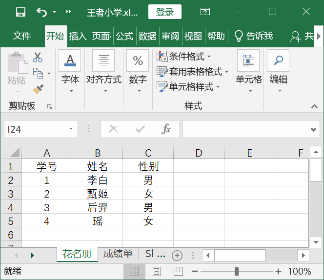
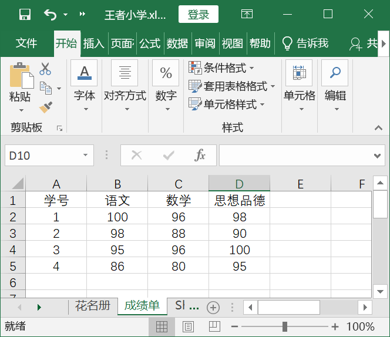
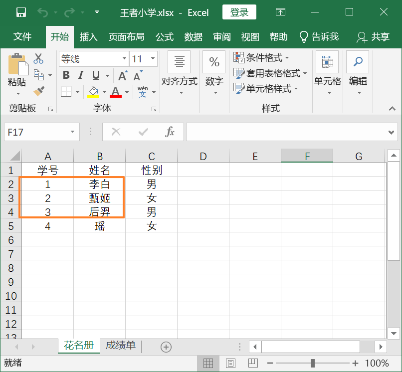
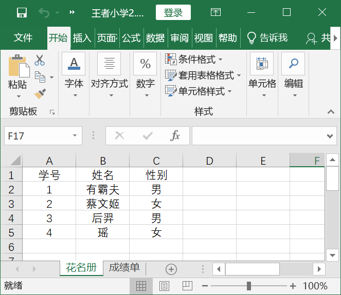
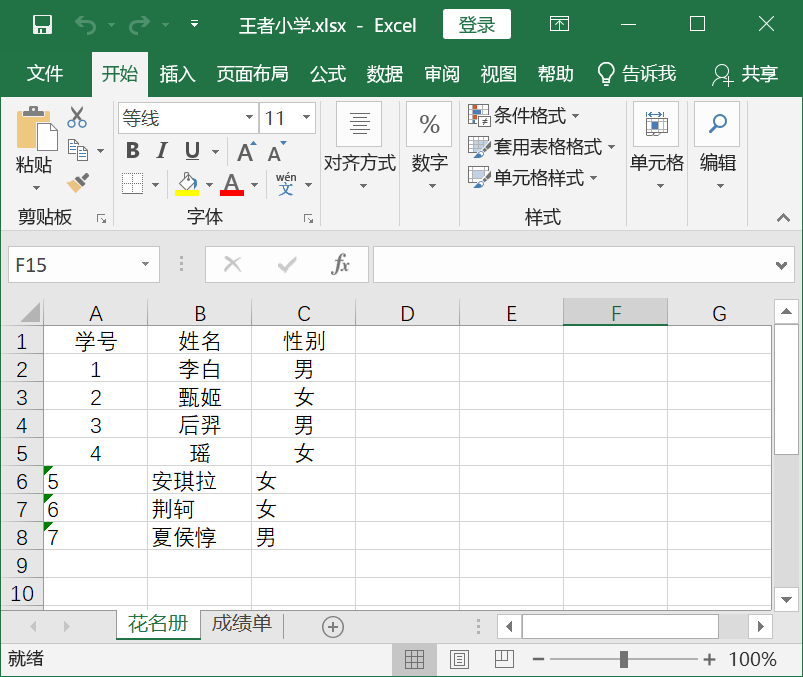

# 自动化操作 Excel

## openpyxl 简介

### 安装openpyxl库

Python要操作Excel表格，需要用到第三方库。虽然能操作excel的库有很多，本次学习我们使用到的是openpyxl库。

要使用openpyxl的第一步就是先安装它。在Pycharm下方终端（英文：Terminal）中输入`pip install openpyxl` 回车就会自动安装了。

当你看到Successfully字样的时候说明你安装成功了。

### 认识Excel窗口

安装好openpyxl库后我们就可以开始操作Excel表格了。在操作Excel表之前我们要先明确下Excel中一些简单的术语。我们认真查看下图中的每一项描述，明确下行（row），列（column）,单元格（cell），坐标（coordinate）与表（sheet）的概念。

这里还要注意一点，在Excel中是从1开始计数的，并不是像程序编码中0开始，这点很重要。比如图中 【后羿】标出来的格子对应的单元格是B4，B4就是它的坐标。



### 打开Excel

openpyxl目前支持的文件格式为 .xlsx / .xlsm / .xltx / .xltm。如果是xls文件格式的文件，数量少可以手动另存为.xlsx格式，如果数量多则可以通过pywin32库将其批量转化为.xlsx文件，这里暂时不详细说了，有兴趣的可以去星球中查看相应问文章。

接下来教大家如何打开一个.xlsx文件，示例文件在D盘根目录下名为王者小学.xlsx, 表格中内容如下：



打开文件的代码如下：

```python
from openpyxl import load_workbook

filePath = r'D:\王者小学.xlsx'  # 文件路径
workbook = load_workbook(filePath)  # 打开excel文件
print(workbook.sheetnames)  # 打印excel中的表格（sheet）名
```


运行结果如下：

```
['花名册', '成绩单']
```

从上面的代码可以看出，打开excel文件用到函数是load_workbook，只需要将文件的路径传入函数，就可以打开excel文件了。这里需要注意一点，load_workbook只能打开已经存在的excel文件，不能创建新的工作簿。

这里再阐述一个工作簿（workbook）的概念，打开excel函数load_workbook的名称翻译为中文就是载入工作簿，所以我们也可以认为一个excel就是一个工作簿。

简而言之，一个Excel工作簿（workbook）是由一个或是多个表sheet组成。一个sheet可以看作是多行row或是多列column组成，而每一行或每一列则是由多个单元格cell组成。

## 获取Excel数据

### 获取表格

从上面打开的excel文件可以看出，一个excel文件中可以有多个表。像王者小学.xlsx 这个文件里就有【花名册】和【成绩单】两个表格。

一般而言我们操作的都是第一个表，而获取表的方法也多种，常用的有三种:

1. `workbook[表格名]`：通过传入相应的表格名来获取对应的表数据；
2. `workbook.worksheets[索引]`：通过索引从workbook.worksheets中获取对应的表数据；
3. `workbook.active`：获取当前活动的工作表

直接看代码看看：

```python
from openpyxl import load_workbook

filePath = r'D:\王者小学.xlsx'  # 文件路径
workbook = load_workbook(filePath)  # 打开excel文件
print(workbook.sheetnames)  # 打印excel中的表格（sheet）名

sheet = workbook["花名册"]  # 根据表名获取表格
sheet2 = workbook.worksheets[0]  # 根据索引在worksheets中获取表格
sheet3 = workbook.active  # 获取当前活跃的表

print(sheet)
print(sheet2)
print(sheet3)
```

运行结果如下：

```
['花名册', '成绩单']
<Worksheet "花名册">
<Worksheet "花名册">
<Worksheet "成绩单">
```

我们可以看到 `workbook["花名册"]` 与 `workbook.worksheets[0]` 都可以得到【花名册】对应的表数据，而当前活动的表格是【成绩单】，所以`workbook.active`返回的是【成绩单】。

### 获取表格的尺寸大小

学习了获取到表格后，我们就可以来获取到表格对应的尺寸大小了。这里说的尺寸指的是excel表格中的数据有几行几列，前面我们有提到一个excel可以包含多个表，所以不同的sheet包含的尺寸可能都是不一样的。

王者小学.excel 中有两个表，内容如下：

如何获取两个表的尺寸呢，很简单，先获取表，然后调用`表.dimensions`即可，我们上代码看看：

```python
from openpyxl import load_workbook

filePath = r'D:\王者小学.xlsx'  # 文件路径
workbook = load_workbook(filePath)  # 打开excel文件
print(workbook.sheetnames)  # 打印excel中的表格（sheet）名

sheet = workbook["花名册"]  # 根据表名获取表格
sheet2 = workbook.worksheets[1]  # 根据索引在worksheets中获取表格

print(sheet, sheet.dimensions)
print(sheet2, sheet2.dimensions)
```

运行结果：

```
['花名册', '成绩单']
<Worksheet "花名册"> A1:C5
<Worksheet "成绩单"> A1:D5
```


从结果可以看出：【花名册】的尺寸是表示A列第1行到C列第5行这个区域，而成绩单的尺寸是表示A列第1行到D列第5行这个区域，这个与上面图中表格数据尺寸是一致的。

### 获取单元格数据

上一节我们学习了如何获取表的尺寸，这一节我们来学习下如何获取表中单元格对应的数据。众所周知每个单元格都是有坐标的。比如花名册中【李白】这个单元格坐标是B2，后羿的数据成绩【96】对应的单元格坐标是C4。我们通过代码如何得到这两个数据呢？

很简单，只要获取到工作表后，通过坐标来进行索引就能获取到对应的单元格，然后调用单元格.value就可以获得对应单元格内的数据了。格式如下：

- `sheet[单元格坐标]`能获取到表格中对应单元格的对象；
- `sheet[单元格坐标].value` 则是能获取对应单元格中的值。

我们上代码看看：

```python
from openpyxl import load_workbook

filePath = r'D:\王者小学.xlsx'  # 文件路径
workbook = load_workbook(filePath)  # 打开excel文件

sheet = workbook["花名册"]  # 根据表名获取表格
sheet2 = workbook.worksheets[1]  # 根据索引在worksheets中获取表格

print(sheet["B2"])  # 获取sheet的B2单元格的对象
print(sheet2["C4"])  # 获取sheet2的C4单元的对象
print(sheet["B2"].value)  # 获取sheet的B2单元格中的值
print(sheet2["C4"].value)  # 获取sheet2的C4单元格中的值
```





运行结果：

```
<Cell '花名册'.B2>
<Cell '成绩单'.C4>
李白
96
```

除了上面我们通过`sheet[单元格坐标]`获取单元格，还有另一种获取单元格数据的方法。这里我们先回顾下excel的一些基础知识，单元格数据除了坐标的方式来定位，我们还可以用行列来找到它，比如B2对应的是第2行第2列（row=2,column=2）, C4对应的是第4行第3列（row=4, column=3)。

理清楚单元格的行列后，我们可以通过`sheet.cell(row=, column=)` 这个函数来获取单元格的对象了。我们看下代码：

```python
from openpyxl import load_workbook

filePath = r'D:\王者小学.xlsx'  # 文件路径
workbook = load_workbook(filePath)  # 打开excel文件

sheet = workbook["花名册"]  # 根据表名获取表格
sheet2 = workbook.worksheets[1]  # 根据索引在worksheets中获取表格

cell = sheet.cell(row=2, column=2)  # 获取B2的数据
cell2 = sheet2.cell(row=4, column=3)  # 获取C4的数据

print(cell, cell.value)  # 获取B2单元格中的值
print(cell2, cell2.value)  # 获取C4单元格中的值
```

运行结果：

```
<Cell '花名册'.B2> 李白
<Cell '成绩单'.C4> 96
```

可以看到，我们通过这种方式也成功获取到了对应单元格的值。

来总结一下，我们可以通过`sheet[单元格坐标]` 或 `sheet.cell(row=, column=)` 方法来获取对应的单元格cell，要得到cell中的值只需要调用`cell.value`即可。

### 获取区域单元格数据

#### sheet[]方法

前面我们学习了用`sheet[单元格坐标]`来获取单个单元格的对象，那么我们要读取某个区域内的单元格数据该怎么办呢？

其实很简单，还是用`sheet[]`方法。我们先看下【花名册】这个表有数据的区域，是从A1到C4这个范围。获取单个单元格我们是传入坐标如"B2"，那么我们要获取整个表里的数据也很简单，就是传入左上角坐标跟右下角坐标拼接的字符串，格式如 `sheet["A1:C4"]`，我们看下代码：

```python
from openpyxl import load_workbook

filePath = r'D:\王者小学.xlsx'  # 文件路径
workbook = load_workbook(filePath)  # 打开excel文件

sheet = workbook["花名册"]  # 根据表名获取表格
cells = sheet["A1:C4"]  # 获取A1:C4区域的数据

for i in cells:
    print(i)
    for j in i:
        print(j.value)
```

运行下看看：

```
(<Cell '花名册'.A1>, <Cell '花名册'.B1>, <Cell '花名册'.C1>)
学号
姓名
性别
(<Cell '花名册'.A2>, <Cell '花名册'.B2>, <Cell '花名册'.C2>)
1
李白
男
(<Cell '花名册'.A3>, <Cell '花名册'.B3>, <Cell '花名册'.C3>)
2
甄姬
女
(<Cell '花名册'.A4>, <Cell '花名册'.B4>, <Cell '花名册'.C4>)
3
后羿
男
```

从打印的结果可以看出，cells中的数据是按行读取的。

通过`sheet["坐标:坐标2"]`获取区域内单元格的数据，它返回的是一个区域内的数据。其实我们还可以通过`sheet[]`方法获取某行或某列的数据，格式如下：

- 获取第A列的数据：`sheet["A"]`
- 获取第4行的数据：`sheet["4"]`

上代码看看：

```python
from openpyxl import load_workbook

filePath = r'D:\王者小学.xlsx'  # 文件路径
workbook = load_workbook(filePath)  # 打开excel文件

sheet = workbook["花名册"]  # 根据表名获取表格

print("第4行的数据：")
cells = sheet["4"]  # 获取第4行的数据
for i in cells:
    print(i.value)

print("第A列的数据：")
cells = sheet["A"]  # 获取A列的数据
for i in cells:
    print(i.value)

print("2-4行之间的数据：")
cells = sheet[2:4]  # 获取第2行到第4行之间的数据
for i in cells:
    print(i)
    for j in i:
        print(j.value)

print("A-C列之间的数据：")
cells = sheet["A:C"]  # 获取第A列到第C列之间的数据
for i in cells:
    print(i)
    for j in i:
        print(j.value)
```

运行结果：

```
第4行的数据：
3
后羿
男
第A列的数据：
学号
1
2
3
4
2-4行之间的数据：
(<Cell '花名册'.A2>, <Cell '花名册'.B2>, <Cell '花名册'.C2>)
1
李白
男
(<Cell '花名册'.A3>, <Cell '花名册'.B3>, <Cell '花名册'.C3>)
2
甄姬
女
(<Cell '花名册'.A4>, <Cell '花名册'.B4>, <Cell '花名册'.C4>)
3
后羿
男
A-C列之间的数据：
(<Cell '花名册'.A1>, <Cell '花名册'.A2>, <Cell '花名册'.A3>, <Cell '花名册'.A4>, <Cell '花名册'.A5>)
学号
1
2
3
4
(<Cell '花名册'.B1>, <Cell '花名册'.B2>, <Cell '花名册'.B3>, <Cell '花名册'.B4>, <Cell '花名册'.B5>)
姓名
李白
甄姬
后羿
瑶
(<Cell '花名册'.C1>, <Cell '花名册'.C2>, <Cell '花名册'.C3>, <Cell '花名册'.C4>, <Cell '花名册'.C5>)
性别
男
女
男
女
```

`sheet[]`获取单行单列的数据没有问题，如果获取多行或是多列呢？答案仍是通过`sheet[]`函数，格式如：

- 获取行1到行2之间的数据：`sheet["行1:行2"]`
- 获取列1与列2之间的数据：`sheet["列1:列2"]`

注意行是由数字表示，列是由A-Z的字母组合表示。直接看代码看看：

```python
from openpyxl import load_workbook

filePath = r'D:\王者小学.xlsx'  # 文件路径
workbook = load_workbook(filePath)  # 打开excel文件

sheet = workbook["花名册"]  # 根据表名获取表格

print("2-4行之间的数据：")
cells = sheet[2:4]  # 获取第2行到第4行之间的数据
for i in cells:
    print(i)
    for j in i:
        print(j.value)

print("A-C列之间的数据：")
cells = sheet["A:C"]  # 获取第A列到第C列之间的数据
for i in cells:
    print(i)
    for j in i:
        print(j.value)
```


运行结果：（同上）

#### sheet.iter_rows()方法

前面我们学习了用`sheet[]`方法获取单元格区域内数据，`sheet[]`很强大，既能获取单行或单列数据，又能获取多行或多列之间的数据，还能根据单元格坐标获取两个坐标内单元格的数据。

但是`sheet[]`方法有一定的局限性，比如我需要第10行至第15行，第3列至第10列之间的全部单元格数据，我需要先把行列信息转化为字母数字坐标，那有没有一种方法直接就根据行列数据就能获取相应范围内的数据呢，答案当然是有的，那就是`sheet.iter_rows()`。

我们看下它的定义：

```python
def iter_rows(self, min_row=None, max_row=None, min_col=None, max_col=None, values_only=False)
```

- min_row为最小行数索引
- max_row为最大行数索引
- min_col为最小列数索引
- max_col为最大列数索引

这里我们可以通过min_row,max_row,min_col,max_col来控制需要获取的行或列的索引，这四个值都是可以缺省的，如果全部缺省就是按行返回表的所有数据。这里需要注意索引最小值都是从1开始的。

values_only 默认是False, 如果设置为True则直接输出值，不必利用单元格的value属性来输出值了。

直接看代码看看：

```python
from openpyxl import load_workbook

filePath = r'D:\王者小学.xlsx'  # 文件路径
workbook = load_workbook(filePath)  # 打开excel文件

sheet = workbook["花名册"]  # 根据表名获取表格

# 按行获取范围内数据
for i in sheet.iter_rows(min_row=2, max_row=4, min_col=1, max_col=2):
    print(i)
    for j in i:
        print(j.value)

# 按行获取所有数据
for i in sheet.iter_rows():
    print(i)
    for j in i:
        print(j.value)
```

运行结果：

```
(<Cell '花名册'.A2>, <Cell '花名册'.B2>)
1
李白
(<Cell '花名册'.A3>, <Cell '花名册'.B3>)
2
甄姬
(<Cell '花名册'.A4>, <Cell '花名册'.B4>)
3
后羿
(<Cell '花名册'.A1>, <Cell '花名册'.B1>, <Cell '花名册'.C1>)
学号
姓名
性别
(<Cell '花名册'.A2>, <Cell '花名册'.B2>, <Cell '花名册'.C2>)
1
李白
男
(<Cell '花名册'.A3>, <Cell '花名册'.B3>, <Cell '花名册'.C3>)
2
甄姬
女
(<Cell '花名册'.A4>, <Cell '花名册'.B4>, <Cell '花名册'.C4>)
3
后羿
男
(<Cell '花名册'.A5>, <Cell '花名册'.B5>, <Cell '花名册'.C5>)
4
瑶
女
```

利用`sheet.iter_rows(min_row=行索引1, max_row=行索引2, min_col=列索引1, max_col=列索引2)`可以获取设定的范围内的表格数据。当括号内传入参数都不设置的时候是按行返回表格中所有数据。

那么我们只设置部分参数会怎么样呢？上代码看看:

```python
from openpyxl import load_workbook

filePath = r'D:\王者小学.xlsx'  # 文件路径
workbook = load_workbook(filePath)  # 打开excel文件

sheet = workbook["花名册"]  # 根据表名获取表格

print("不指定min_row:")
# 按行获取值，缺省min_row
for i in sheet.iter_rows(max_row=4, min_col=1, max_col=2):
    print(i)
    for j in i:
        print(j.value)

print("不指定max_row:")
# 按行获取值,缺省max_row
for i in sheet.iter_rows(min_row=2, min_col=1, max_col=2):
    print(i)
    for j in i:
        print(j.value)

print("不指定min_col:")
# 按行获取值，缺省min_row
for i in sheet.iter_rows(min_row=2, max_row=4, max_col=2):
    print(i)
    for j in i:
        print(j.value)

print("不指定max_col:")
# 按行获取值,缺省max_row
for i in sheet.iter_rows(min_row=2, max_row=4, min_col=1):
    print(i)
    for j in i:
        print(j.value)
```



运行下看看：

```
不指定min_row:
(<Cell '花名册'.A1>, <Cell '花名册'.B1>)
学号
姓名
(<Cell '花名册'.A2>, <Cell '花名册'.B2>)
1
李白
(<Cell '花名册'.A3>, <Cell '花名册'.B3>)
2
甄姬
(<Cell '花名册'.A4>, <Cell '花名册'.B4>)
3
后羿
不指定max_row:
(<Cell '花名册'.A2>, <Cell '花名册'.B2>)
1
李白
(<Cell '花名册'.A3>, <Cell '花名册'.B3>)
2
甄姬
(<Cell '花名册'.A4>, <Cell '花名册'.B4>)
3
后羿
(<Cell '花名册'.A5>, <Cell '花名册'.B5>)
4
瑶
不指定min_col:
(<Cell '花名册'.A2>, <Cell '花名册'.B2>)
1
李白
(<Cell '花名册'.A3>, <Cell '花名册'.B3>)
2
甄姬
(<Cell '花名册'.A4>, <Cell '花名册'.B4>)
3
后羿
不指定max_col:
(<Cell '花名册'.A2>, <Cell '花名册'.B2>, <Cell '花名册'.C2>)
1
李白
男
(<Cell '花名册'.A3>, <Cell '花名册'.B3>, <Cell '花名册'.C3>)
2
甄姬
女
(<Cell '花名册'.A4>, <Cell '花名册'.B4>, <Cell '花名册'.C4>)
3
后羿
男
```

从结果可以看出：
- 当缺省min_row时是默认取的最小行；
- 当缺省max_row时是默认取的最大行；
- 当缺省min_col时是默认取的最小列；
- 当缺省max_col时是默认取的最大列；

总结下就是：当设置的参数缺省时，如果缺省的参数是min_row或min_col则取最小行或是最小列，如果是max_row或是max_col则取最大行或最大列

## 修改保存Excel

### 修改单元格的值与保存Excel

前面学习如何读取表中的数据，接下来我们要学习如何修改单元格的值。

其实修改单元格的值很简单，我们前面学习了如何获取单元格，比如获取B2单元格：`sheet['B2']` ，我们要给它赋值只需要 `sheet['B2'] = 新的值` 就可以了。也可以先获取单元格，然后对单元格进行赋值。

修改了值我们要保存下Excel, 这样保存才会生效，我们需要调用`workbook.save(filepath=保存路径)` 就可以保存修改了。我们上代码看看：

```python
from openpyxl import load_workbook

filePath = r'D:\王者小学.xlsx'  # 文件路径
workbook = load_workbook(filePath)  # 打开excel文件

sheet = workbook['花名册']  # 根据表名获取表格
sheet["B2"] = '渣男教父'  # 修改B2单元格的值为'渣男教父'

cell = sheet["B3"]  # 获取B3单元格为cell
cell.value = '蔡文姬'  # 修改cell的内容为 '蔡文姬'

savePath = r'D:\王者小学2.xlsx'
workbook.save(savePath)  # 另存为D:
```


运行后我们到D盘根目录下看看，果然多了一个王者小学2.xlsx文件

我们打开王者小学2.xlsx看一下，果然B2，B3单元格都改成了相应的数据。我们对比下：




这里需要注意两点：
1. 如果文件保存路径savePath不是当前打开excel的路径时是修改并另存为一个新文件，如果savePath是打开execl的路径则是直接修改并保存源文件了。
2. 保存之前必须保证你要保存的文件时关闭的，否则会保存失败。

### 向表格中插入行数据

前面学习了如何修改单元格的内容，一个个修改太慢了，有没有办法直接插入一堆数据呢。这个肯定是有的，现在我们就来学习下如何在表格中插入行数据的方法-`append()`。

`append()`会在表格已有的数据后面增添你要加入的数据，注意它是按行插入的。

我们上代码看看：

```python
from openpyxl import load_workbook

filePath = r'D:\王者小学.xlsx'  # 文件路径
workbook = load_workbook(filePath)  # 打开excel文件

sheet = workbook['花名册']  # 根据表名获取表格

data = [
    ['5', '安琪拉', "女"],
    ['6', '荆轲', "女"],
    ['7', '夏侯惇', "男"],
]

for row in data:
    sheet.append(row)  # 按行插入到表格数据最后面

workbook.save(filePath)  # 保存到源文件
```


运行后我们打开王者小学.xlsx，新的数据果然已经插入到以前数据的后面。

`append()`这个操作是很有用的，比如以后你用爬虫爬到一堆的数据，都可以用该方式保存到excel文件中。

## 实战一-合并多个Excel中数据

之前我们已经学习了如何读取和写入Execl数据，今天我们来用一个实例来进行表格的合并。如下是2021年4个季度的销售数据明细。我们把它放在了D盘2021年销售明细的文件夹下。

