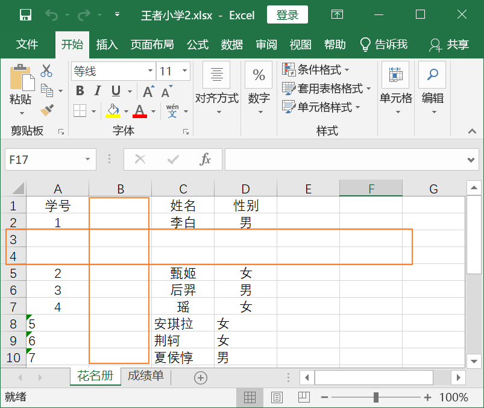
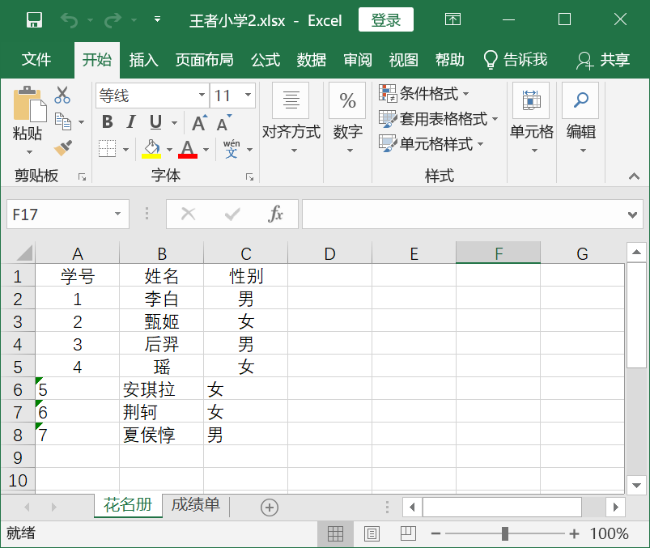
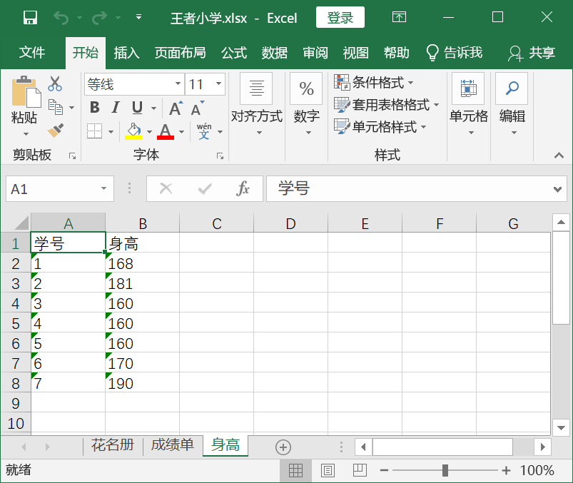
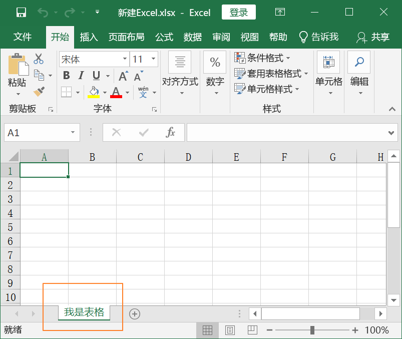
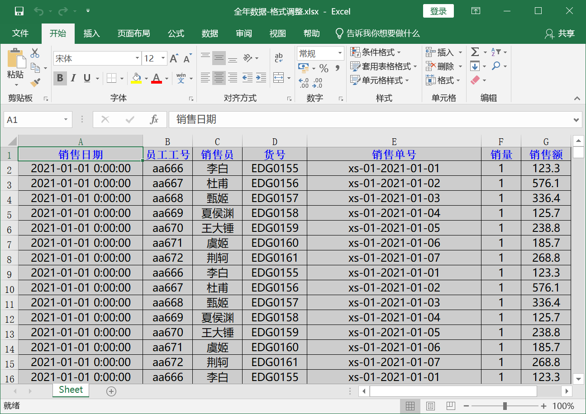
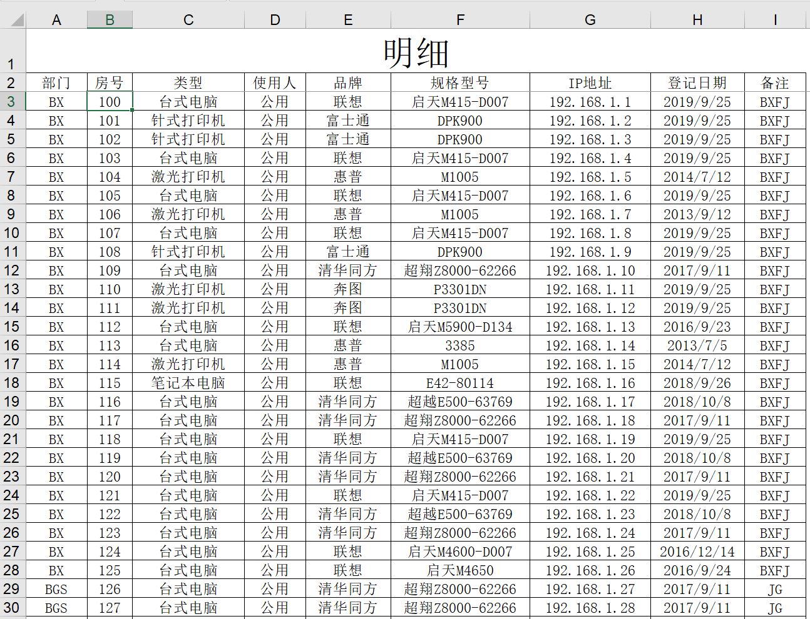
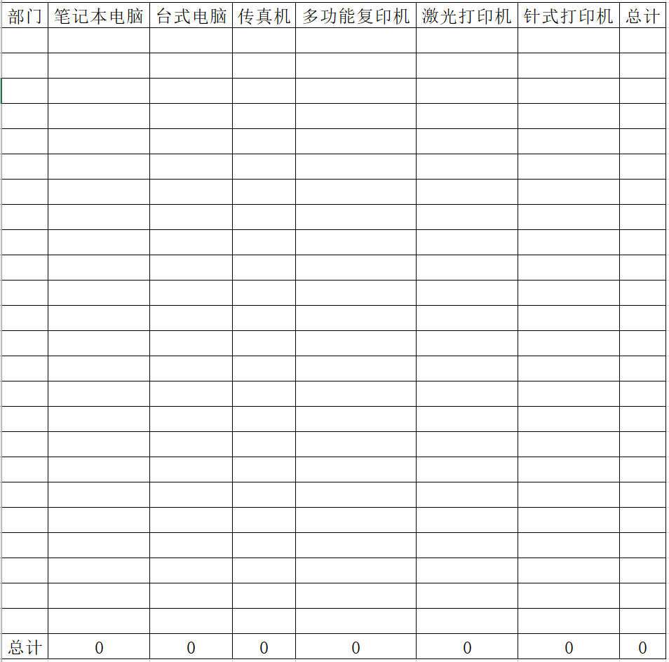
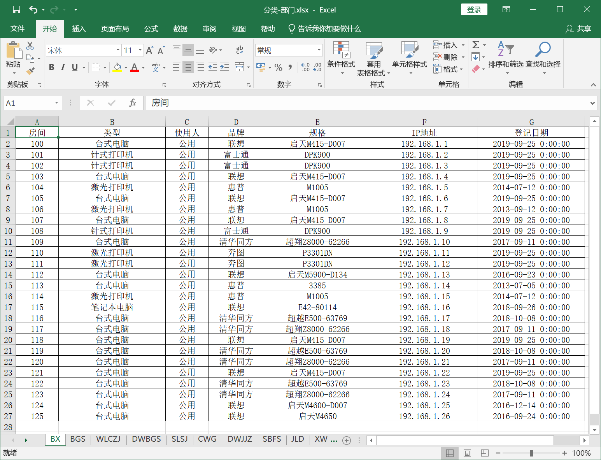

# 获取 Excel 数据扩展

## 获取单元格其他属性

## 获取单元格其他属性

前面我们学习到了如何获取到单元格对象以及获取单元格中的值。其实获取单元格的值只是单元格其中的一个属性，那么今天我们再来学习下单元格的其他属性：行（row）,列（column）和坐标（coordinate）。

获取属性的方法其实跟获取值的方法是一样的：
- cell.row：获取行数
- cell.column：获取列数
- cell.coordinate：获取坐标

直接看代码看看：

```python
from openpyxl import load_workbook

filePath = r'D:\王者小学.xlsx'  # 文件路径
workbook = load_workbook(filePath)  # 打开excel文件
sheet = workbook["花名册"]  # 根据表名获取表格
sheet2 = workbook.worksheets[1]  # 根据索引在worksheets中获取表格

cell = sheet["B2"]  # 获取B2的数据
cell2 = sheet2["C4"]  # 获取C4的数据

print("单元格B2 行数：%s 列数：%s 值：%s 坐标：%s" % (cell.row, cell.column, cell.value, cell.coordinate))  # 获取B2单元格属性
print("单元格C4 行数：%s 列数：%s 值：%s 坐标：%s" % (cell2.row, cell2.column, cell2.value, cell2.coordinate))  # 获取C4单元格属性
```

运行下看看：

```
单元格B2 行数：2 列数：2 值：李白 坐标：B2
单元格C4 行数：4 列数：3 值：96 坐标：C4
```

## 获取区域单元格数据

### sheet.iter_cols()方法

前面我们学习了利用sheet.iter_rows()按行获取表中的数据。既然能有按行获取的方式，那么肯定也有按列获取的方式。这里我们就来学习按列获取表中的数据的方法-sheet.iter_cols()。

sheet.iter_cols的使用可以说几乎跟sheet.iter_rows()是一样的：
1. 当不传入参数时是按列获取表中的所有数据；
2. 当设置参数时则返回参数限定范围内表数据；
3. 当设置的参数有缺省时，如果缺省的参数是min_row或min_col则取最小行或是最小列，如果是max_row或是max_col则取最大行或最大列。

我们上代码看看：

```python
from openpyxl import load_workbook

filePath = r'D:\王者小学.xlsx'  # 文件路径
workbook = load_workbook(filePath)  # 打开excel文件
sheet = workbook["花名册"]  # 根据表名获取表格

print("不指定min_row:")
# 按列获取值，缺省min_row
for i in sheet.iter_cols(max_row=4, min_col=1, max_col=2):
    print(i)
    for j in i:
        print(j.value)

print("不指定max_row:")
# 按列获取值,缺省max_row
for i in sheet.iter_cols(min_row=2, min_col=1, max_col=2):
    print(i)
    for j in i:
        print(j.value)

print("不指定min_col:")
# 按列获取值，缺省min_col
for i in sheet.iter_cols(min_row=2, max_row=4, max_col=2):
    print(i)
    for j in i:
        print(j.value)

print("不指定max_col:")
# 按列获取值,缺省max_col
for i in sheet.iter_cols(min_row=2, max_row=4, min_col=1):
    print(i)
    for j in i:
        print(j.value)
```

运行结果：

```
不指定参数，按列获取表中所有数据:
(<Cell '花名册'.A1>, <Cell '花名册'.A2>, <Cell '花名册'.A3>, <Cell '花名册'.A4>, <Cell '花名册'.A5>)
学号 1 2 3 4
(<Cell '花名册'.B1>, <Cell '花名册'.B2>, <Cell '花名册'.B3>, <Cell '花名册'.B4>, <Cell '花名册'.B5>)
姓名 李白 甄姬 后羿 瑶
(<Cell '花名册'.C1>, <Cell '花名册'.C2>, <Cell '花名册'.C3>, <Cell '花名册'.C4>, <Cell '花名册'.C5>)
性别 男 女 男 女

不指定min_row, min_row默认取最小行:
(<Cell '花名册'.A1>, <Cell '花名册'.A2>, <Cell '花名册'.A3>, <Cell '花名册'.A4>)
学号 1 2 3
(<Cell '花名册'.B1>, <Cell '花名册'.B2>, <Cell '花名册'.B3>, <Cell '花名册'.B4>)
姓名 李白 甄姬 后羿

不指定max_row，max_row默认取最大行:
(<Cell '花名册'.A2>, <Cell '花名册'.A3>, <Cell '花名册'.A4>, <Cell '花名册'.A5>)
1 2 3 4
(<Cell '花名册'.B2>, <Cell '花名册'.B3>, <Cell '花名册'.B4>, <Cell '花名册'.B5>)
李白 甄姬 后羿 瑶

不指定min_col, min_col默认取最小列:
(<Cell '花名册'.A2>, <Cell '花名册'.A3>, <Cell '花名册'.A4>)
1 2 3
(<Cell '花名册'.B2>, <Cell '花名册'.B3>, <Cell '花名册'.B4>)
李白 甄姬 后羿

不指定max_col, max_col默认取最大列:
(<Cell '花名册'.A2>, <Cell '花名册'.A3>, <Cell '花名册'.A4>)
1 2 3
(<Cell '花名册'.B2>, <Cell '花名册'.B3>, <Cell '花名册'.B4>)
李白 甄姬 后羿
(<Cell '花名册'.C2>, <Cell '花名册'.C3>, <Cell '花名册'.C4>)
男 女 男
```

### sheet.rows和sheet.columns

前面我们学习了sheet[]和sheet.iter_rows()和sheet.iter_cols()获取表中数据，这里再介绍两种获取表格中数据的方式:
- sheet.rows 获取表格中所有行数据；
- sheet.columns获取表格中所有列数据。

我们上代码看看效果：

```python
from openpyxl import load_workbook

filePath = r'D:\王者小学.xlsx'  # 文件路径
workbook = load_workbook(filePath)  # 打开excel文件
sheet = workbook["花名册"]  # 根据表名获取表格

print("sheet.rows获取所有行数据:")
# 按行获取值
for i in sheet.rows:
    print(i)
    for j in i:
        print(j.value)

print("sheet.columns获取所有列数据:")
# 按列获取值
for i in sheet.columns:
    print(i)
    for j in i:
        print(j.value)
```

运行结果：

```
sheet.rows获取所有行数据:
(<Cell '花名册'.A1>, <Cell '花名册'.B1>, <Cell '花名册'.C1>)
学号 姓名 性别
(<Cell '花名册'.A2>, <Cell '花名册'.B2>, <Cell '花名册'.C2>)
1 李白 男
(<Cell '花名册'.A3>, <Cell '花名册'.B3>, <Cell '花名册'.C3>)
2 甄姬 女
(<Cell '花名册'.A4>, <Cell '花名册'.B4>, <Cell '花名册'.C4>)
3 后羿 男
(<Cell '花名册'.A5>, <Cell '花名册'.B5>, <Cell '花名册'.C5>)
4 瑶 女

sheet.columns获取所有列数据:
(<Cell '花名册'.A1>, <Cell '花名册'.A2>, <Cell '花名册'.A3>, <Cell '花名册'.A4>, <Cell '花名册'.A5>)
学号 1 2 3 4
(<Cell '花名册'.B1>, <Cell '花名册'.B2>, <Cell '花名册'.B3>, <Cell '花名册'.B4>, <Cell '花名册'.B5>)
姓名 李白 甄姬 后羿 瑶
(<Cell '花名册'.C1>, <Cell '花名册'.C2>, <Cell '花名册'.C3>, <Cell '花名册'.C4>, <Cell '花名册'.C5>)
性别 男 女 男 女
```

是不是感觉有点眼熟，其实sheet.rows实现的效果跟sheet.iter_rows()是一样的，sheet.columns实现的效果跟sheet.iter_cols()是一样的。

在你利用load_workbook打开Excel后，所有行数据已经存入到了sheet的rows这个变量中，所有列数据已经存入到了sheet的columns这个变量中。而你调用iter_rows()或是iter_cols()其实是调用了相应的函数返回对应的表数据。

## 插入与删除行列

### 插入空行和空列

前面我们学习了利用append()方法往表中插入行数据，但是它只能在表格数据最后面依次添加。那今天我们学习下如何在想要的位置插入空行或空列。插入空行和空列的格式如下：
- sheet.insert_rows(idx=数字编号, amount=要插入的行数)，插入的行数是在idx行数的位置插入，如果amount不设置则默认插入一行；
- sheet.insert_cols(idx=数字编号, amount=要插入的列数)，插入的位置是在idx列数的位置插入，如果amount不设置则默认插入一列。

我们上代码看看：

```python
from openpyxl import load_workbook

filePath = r'D:\王者小学.xlsx'  # 文件路径
workbook = load_workbook(filePath)  # 打开excel文件
sheet = workbook['花名册']  # 根据表名获取表格

sheet.insert_rows(idx=3, amount=2)  # 第三行位置插入两行
sheet.insert_cols(idx=2, amount=1)  # 第二列位置插入一列

savePath = r'D:\王者小学2.xlsx'
workbook.save(savePath)  # 另存为D:\王者小学2.xlsx
```

运行完成我们打开王者小学2.xlsx看下，我们成功在第三行位置插入了两行，在第二列位置插入了一列。



### 删除行和列

前面我们学习了如何往表里插入行和列，现在我们来学习下如何删除行和列。删除行和列的格式如下：
- sheet.delete_rows(idx=数字编号, amount=要删除的行数)，删除的行数是在idx行数的位置
- sheet.delete_cols(idx=数字编号, amount=要删除的列数)，删除的列数是在idx列数的位置

我们打开王者小学2.xlsx看下，在3,4行有两个空行，第2列有一个空列，我们就把它删除了，然后再保存一下，我们上代码看看：

```python
from openpyxl import load_workbook

filePath = r'D:\王者小学2.xlsx'  # 文件路径
workbook = load_workbook(filePath)  # 打开excel文件
sheet = workbook['花名册']  # 根据表名获取表格

sheet.delete_rows(idx=3, amount=2)
sheet.delete_cols(idx=2, amount=1)

savePath = r'D:\王者小学2.xlsx'
workbook.save(savePath)  # 另存为D:\王者小学2.xlsx
```

我们运行前先看下表格内容，然后我们再关掉excel，运行代码看看，2空行1空列都成功删除了。


## 新建与删除表

### 创建新的sheet表

前面我们一直都是在一张表中进行操作，接下来我们学习下在工作簿中操作，在工作簿中新增一个新的sheet表。创建新的sheet表的格式如下：
- workbook.create_sheet("新的表名")

我们的王者小学.xlsx中有【花名册】跟【成绩单】两个sheet表，那我们再新建一个【身高】表，并往这个表里插入身高数据，上代码：

```python
from openpyxl import load_workbook

filePath = r'D:\王者小学.xlsx'  # 文件路径
workbook = load_workbook(filePath)  # 打开excel文件

workbook.create_sheet("身高")  # 创建新的身高表
print(workbook.sheetnames)

sheet = workbook.worksheets[2]

data = [
    ['学号', '身高'],
    ['1', '168'],
    ['2', '181'],
    ['3', '160'],
    ['4', '160'],
    ['5', '160'],
    ['6', '170'],
    ['7', '190'],
]

for row in data:
    sheet.append(row)

workbook.save(filePath)  # 保存源文件
```




我们再打开王者小学.xlsx看看，果然多了一个【身高表】，并且里面也写入了相应的身高数据。

### 删除sheet表

学习了如何新建一个新的sheet表，我们再来学习下如何删除sheet表，删除sheet表的格式也很简单，如下：
- del workbook['表名']：根据表名删除
- workbook.remove(sheet表)：删除某个sheet表对象；

我们在王者小学.xlsx中现在有三张表，我们再把身高表给删除掉，代码如下：

```python
from openpyxl import load_workbook

filePath = r'D:\王者小学.xlsx'  # 文件路径
workbook = load_workbook(filePath)  # 打开excel文件

print(workbook.sheetnames)

# 方法一
del workbook['身高']

# 方法二
# sheet = workbook['身高']
# workbook.remove(sheet)  # 删除身高表

print(workbook.sheetnames)
workbook.save(filePath)  # 保存为源文件
```



我们运行下看看，控制台输出可以看到刚开始打开时是三张表的，删除后就只剩下两张了，我们打开文件验证下。

这里注意啦，sheet表名是区分大小写的，如果表名错误或是不存在，删除是会报错的。

### 新建Excel与修改sheet表名

我们一直用到workbook.save()这个方法用来保存excel中数据的修改，其实它还有一个很重要的功能就是新建Excel表，代码很简单：

```python
from openpyxl import Workbook

workbook = Workbook()
workbook.save(filename=r"D:\新建Excel.xlsx")
```


运行下看下，我们D盘下就多了一个新建Excel.xlsx的文件，我们打开看下可以看到一个空白的表，表名是默认的sheet，那我们如何在创建excel的时候把表名也改了呢？

其实也很简单，就是获取到sheet，然后更改它的title属性就可以了。直接看代码看看：

```python
from openpyxl import Workbook

workbook = Workbook()
sheet = workbook.active
sheet.title = "我是表格"  # 设置表格的标题为我是表格
workbook.save(filename=r"D:\新建Excel.xlsx")
```




我们删除新建Excel.xlsx，我们重新运行下再打开看看：可以看到表名已经改成了我是表格了。

## 设置表格样式与单元格属性

实战一我们合并了4个季度的表格数据到【全年数据.xlsx】，但是我们打开发现表格是没有边框的，而且数据之间排版很拥挤，销售单号那一列都显示不全，所以今天我们来学习下给表格设置固定的样式，并对单元格的属性值进行修改。

我们先上代码看看：

```python
from openpyxl import Workbook, load_workbook
from openpyxl.styles import Font, PatternFill, Alignment, Border, fills, colors, Side

# 导入表格数据
filePath = r"D:\2021年销售分析\全年数据.xlsx"
wb = load_workbook(filePath)

# 操作单元格
ws = wb.active

# 调整列宽
ws.column_dimensions["A"].width = 25
ws.column_dimensions["B"].width = 10
ws.column_dimensions["C"].width = 10
ws.column_dimensions["D"].width = 13
ws.column_dimensions["E"].width = 35
ws.column_dimensions["F"].width = 8
ws.column_dimensions["G"].width = 10

# 设置单元格格式
# 设置字体格式
font = Font("微软雅黑", size=12, color=colors.BLACK, bold=False)

# 单元格颜色填充
fill = PatternFill(fill_type="solid", start_color="CDCDCD", end_color="CDCDCD")  # CDCDCD浅灰色

# 单元格对齐方式
alignment = Alignment(horizontal="center", vertical="center", indent=0)  # wrap_text=True文字换行，shrink_to_fit=True自适应宽度

# 单元格边框
bd = Border(
    left=Side(border_style="thin", color=colors.BLACK),
    right=Side(border_style="thin", color=colors.BLACK),
    top=Side(border_style="thin", color=colors.BLACK),
    bottom=Side(border_style="thin", color=colors.BLACK),
    outline=Side(border_style="thin", color=colors.BLACK),
    vertical=Side(border_style="thin", color=colors.BLACK),
    horizontal=Side(border_style="thin", color=colors.BLACK)
)

# 遍历数据
for row in ws.rows:
    for cell in row:
        cell.font = font
        cell.fill = fill
        cell.alignment = alignment
        cell.border = bd

# 设置表头字体格式
ft = Font("宋体", size=12, color=colors.BLUE, bold=True)  # italic=True斜体
ws["A1"].font = ft
ws["B1"].font = ft
ws["C1"].font = ft
ws["D1"].font = ft
ws["E1"].font = ft
ws["F1"].font = ft
ws["G1"].font = ft

savePath = r"D:\2021年销售分析\全年数据-格式调整.xlsx"
# 保存数据
wb.save(savePath)
```

运行结束后打开【全年数据-格式调整.xlsx】看看，是不是清爽多了。

我们总结下上面用到的知识点：

**修改字体样式：**
```python
Font(name=字体名称, size=字体大小, bold=是否加粗, italic=是否斜体, color=字体颜色)
```

**单元格颜色填充：**
```python
PatternFill(fill_type=填充样式, start_color=开始颜色, end_color=结束颜色)
```

**单元格对齐方式：**
```python
Alignment(horizontal=水平对齐模式, vertical=垂直对齐模式, text_rotation=旋转角度, wrap_text=是否自动换行)
```

- 水平对齐：'distributed'，'justify'，'center'，'left'，'centerContinuous'，'right'，'general'
- 垂直对齐：'bottom'，'distributed'，'justify'，'center'，'top'

```python
cell.fill = fill
cell.alignment = alignment
cell.border = bd
```

**设置边框样式：**
```python
Side(style=边线样式, color=边线颜色)
Border(left=左边线样式, right=右边线样式, top=上边线样式, bottom=下边线样式)
```

style参数的种类：'double', 'mediumDashDotDot', 'slantDashDot', 'dashDotDot', 'dotted', 'hair', 'mediumDashed', 'dashed', 'dashDot', 'thin', 'mediumDashDot', 'medium'



## 文档总结

本节课我们进一步了解更多获取表格数据的方法，如 sheet.iter_cols、sheet.rows和 sheet.columns。获取表格数据方法有多种，在不同的应用场景下选择不同的方法可以使用我们达到想要的效果。

花费合理的时间调整表格的样式可以使我们保存的Excel表格看起来更加美观，但是自动化操作Excel的核心还是对数据的处理与分析，所以大家学习时注意抓大放小，合理规划学习时间的权重。

## 实战一-数据汇总

某公司用【明细.xlsx 】登记了各个部门使用办公设备的情况，如下图：



现在需按照明细表里的（部门）统计各（类型）总数到【汇总.xlsx】中横竖合计。

已知的类型有：'笔记本电脑', '台式电脑', '传真机', '多功能复印机', '激光打印机', '针式打印机'

最终结果大致如下图：



我们上代码看看：

```python
import os.path
import openpyxl as xl
from openpyxl.styles import Alignment, Border, Side, colors

def 汇总数据(file_path, save_path):
    if not os.path.exists(file_path):
        print("输入文件不存在")
        return
    
    workbook = xl.load_workbook(file_path)  # 载入工作簿
    sheet = workbook.worksheets[0]  # 取出对应表格
    
    equipment_types = ['笔记本电脑', '台式电脑', '传真机', '多功能复印机', '激光打印机', '针式打印机']
    dic = {}
    
    for row in sheet.iter_rows(min_row=3):  # 遍历取出每一行
        department, equipment_type = row[0].value, row[2].value
        if department not in dic:
            dic[department] = [0, 0, 0, 0, 0, 0, 0]  # 初始化各类型数量
        if equipment_type in equipment_types:
            index = equipment_types.index(equipment_type)  # 取出设备类型在类型中的下标
            dic[department][index] += 1  # 该部门该设备数量+1
            dic[department][6] += 1  # 该部门设备总数+1
    
    workbook2 = xl.Workbook()
    sheet2 = workbook2.active
    
    header = ['部门', '笔记本电脑', '台式电脑', '传真机', '多功能复印机', '激光打印机', '针式打印机', '总计']
    sheet2.append(header)
    
    summary = ['总计', 0, 0, 0, 0, 0, 0, 0]
    for key, value in dic.items():
        row = [key]
        for i in range(len(value)):
            row.append(value[i])
            summary[i + 1] += value[i]
        sheet2.append(row)
    sheet2.append(summary)
    
    设置样式(sheet2)
    
    save_dir = os.path.dirname(save_path)  # 获取文件所在的目录
    if not os.path.exists(save_dir):
        os.makedirs(save_dir)
    workbook2.save(save_path)

def 设置样式(表格):
    # 单元格边框
    side = Side(border_style="thin", color=colors.BLACK)
    bd = Border(left=side, right=side, top=side, bottom=side, outline=side, vertical=side, horizontal=side)
    
    # 单元格对齐方式
    alignment = Alignment(horizontal="center", vertical="center", indent=0, shrink_to_fit=True)  # shrink_to_fit=True自适应宽度
    
    for 行数据 in 表格.rows:
        for 单元格 in 行数据:
            单元格.alignment = alignment
            单元格.border = bd

if __name__ == '__main__':
    汇总数据(r'D:\数据\第11讲\明细.xlsx', r'D:\数据\第11讲\汇总.xlsx')
```

## 实战二-数据分类

按【明细.xlsx】里的（部门）生成部门分类明细，保存到 【分类-部门.xlsx】中。【分类-部门.xlsx】中包含多个sheet表，每个表保存一个部门的使用数据，sheet表名为部门名。

生成结果如下图：



代码如下：

```python
import openpyxl as xl
from openpyxl.styles import Alignment, Border, Side, colors

def 部门分类(file_path, save_path):
    workbook = xl.load_workbook(file_path)  # 载入工作簿
    sheet = workbook.worksheets[0]  # 取出对应表格
    
    dic = {}
    for row in sheet.iter_rows(min_row=3, values_only=True):  # 遍历取出每一行
        department = row[0]
        if department not in dic:
            dic[department] = []  # 初始化各部分数据
        dic[department].append((row[1], row[2], row[3], row[4], row[5], row[6], row[7]))
    
    header = ['房间', '类型', '使用人', '品牌', '规格', 'IP地址', '登记日期']
    workbook2 = xl.Workbook()
    
    for key, value in dic.items():
        workbook2.create_sheet(key)
        sheet2 = workbook2[key]
        sheet2.append(header)
        for row in value:
            sheet2.append(row)
        
        设置样式(sheet2)
    
    # 删除默认的Sheet表
    del workbook2['Sheet']
    workbook2.save(save_path)

def 设置样式(表格):
    # 调整列宽
    表格.column_dimensions["A"].width = 10
    表格.column_dimensions["B"].width = 25
    表格.column_dimensions["C"].width = 10
    表格.column_dimensions["D"].width = 13
    表格.column_dimensions["E"].width = 25
    表格.column_dimensions["F"].width = 25
    表格.column_dimensions["G"].width = 25
    
    # 单元格边框
    side = Side(border_style="thin", color=colors.BLACK)
    bd = Border(left=side, right=side, top=side, bottom=side, outline=side, vertical=side, horizontal=side)
    
    # 单元格对齐方式
    alignment = Alignment(horizontal="center", vertical="center", indent=0)
    
    for 行数据 in 表格.rows:
        for 单元格 in 行数据:
            单元格.alignment = alignment
            单元格.border = bd

if __name__ == '__main__':
    try:
        部门分类(r'D:\数据\第11讲\明细.xlsx', r'D:\数据\第11讲\分类-部门.xlsx')
    except:
        print("出错了")
        raise  # 抛出错误，便于定位出错点
```

## 练习题

按课程中【明细.xlsx】里的（类型）生成类型分类明细，保存到 【分类-类型.xlsx】中。【分类-类型.xlsx】中包含多个sheet表，每个表保存一个类型的使用数据，sheet表名为类型名。