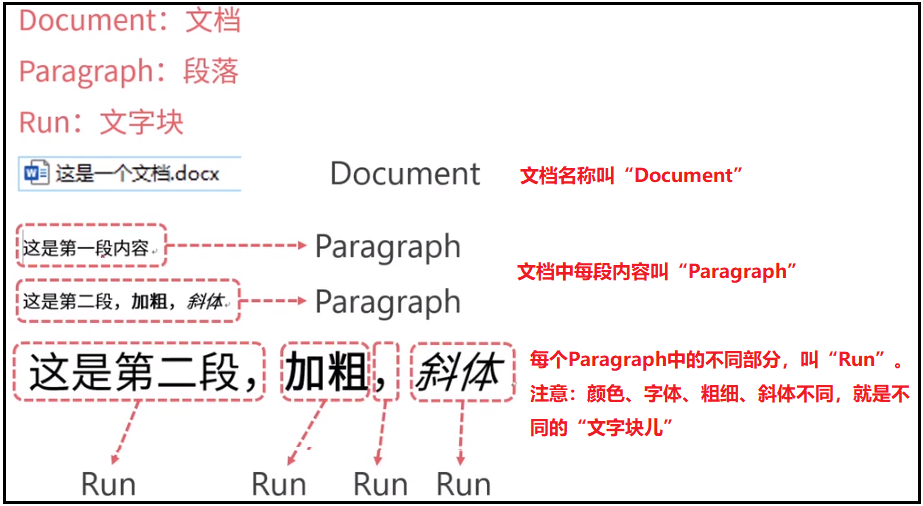
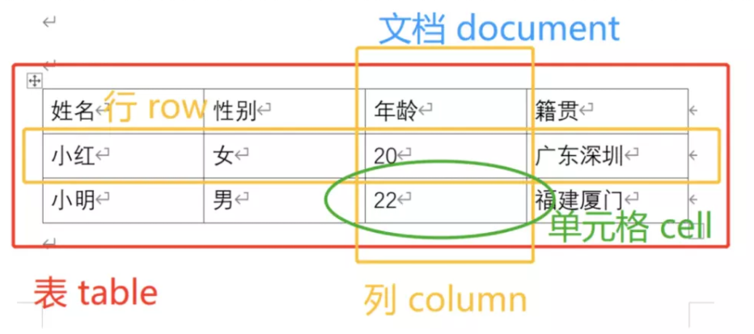
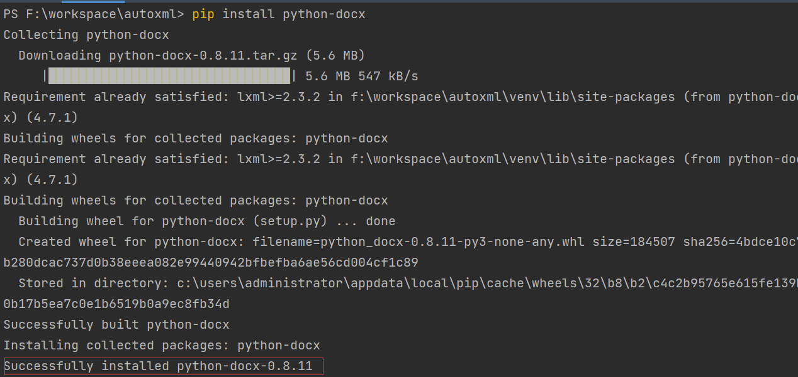
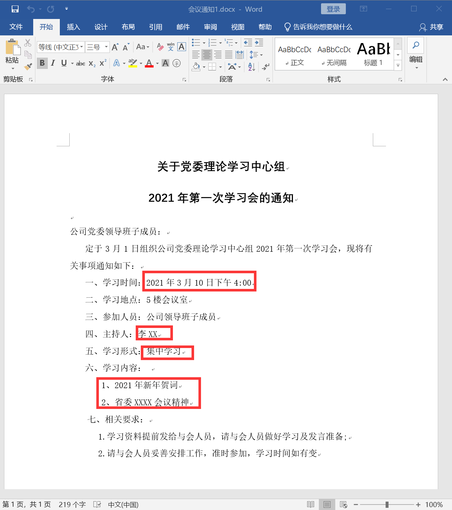
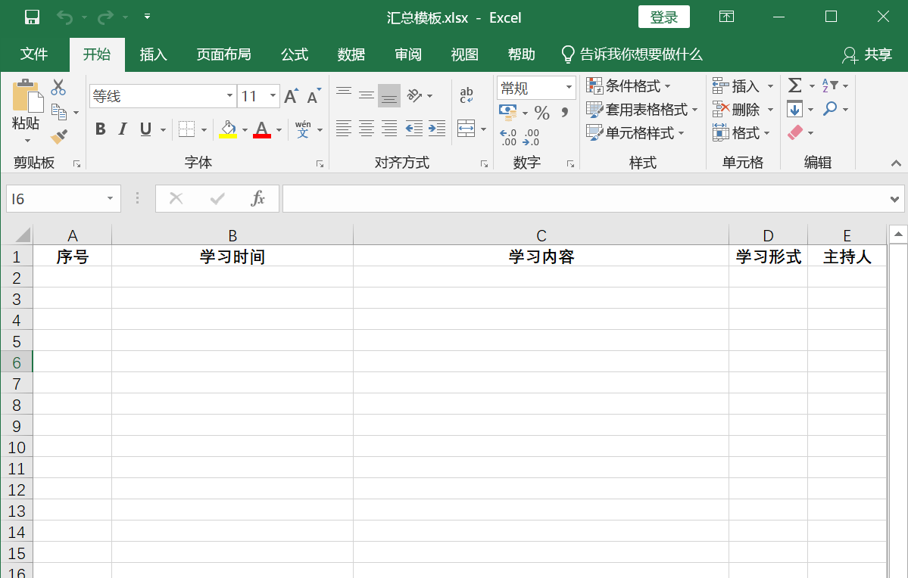
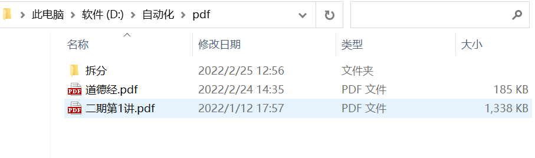
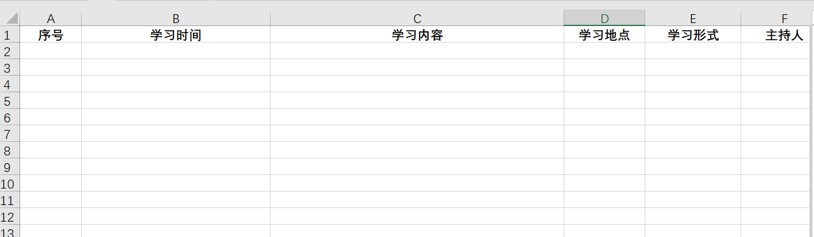

# 自动化操作 Word

## python-docx简介

## python-docx简介

python自动化操作Word最常用的模块就是python-docx。

python-docx模块处理word文档，处理方式是面向对象的。也就是说python-docx模块会把word文档，文档中的段落、文本、字体等都看做对象，对对象进行处理就是对word文档的内容处理。

如果需要读取word文档中的文字（一般来说，程序也只需要认识word文档中的文字信息），需要先了解python-docx模块的几个概念。

Word文档一般可以结构化成三个部分：
- Document，表示一个word文档
- Paragraph，表示word文档中的一个段落
- Run，表示段落中的文字块

Document - Paragraph - Run三级结构，这是最普遍的情况。但是如果Word中存在表格，这时会有新的文档结构，如下：



这时的结构非常类似Excel，可以看成Document-Table-Row/Column-Cells四级结构。

## 安装与使用python-docx

要使用必须先安装，要安装python-docx还是在Pycharm的终端（Terminal）中输入pip install python-docx，如下所示（Successfully installed）便是表示安装成功了。

## 课程准备

课程所需的资源文件下载链接：
点击此处下载word.zip

资源文件解压后放置D:\自动化文件夹下，最终资源路径为 D:\自动化\word ，内容分布如下图：





为了保证学习的流畅性，请提前创建好相应的文件夹，将资源放置在相应位置。

## 新建与保存word

python-docx模块已经安装好了，我们直接利用它新建一个全新的word文档，直接上代码：

```python
from docx import Document

document = Document()  # 创建一个空文档
document.save(r'D:\自动化\word\道德经.docx')  # 保存文件
```

运行后，在 D:\自动化\word 目录下就多出了一个道德经.docx 文档了。因为只是创建了一个空文档，所以打开里面什么也没有，是空白的。

代码很简单，首先导入docx库，这里需要注意一点，虽然我们安装的是python-docx模块，但是使用时是导入的docx，从代码中第一行可以看出。

第二行就是新建一个Document。

第三行则是将新建的Document保存到D:\自动化\word\道德经.docx。

## 写入Word

我们通过代码打开刚才创建的道德经.docx 来插入一些数据看看，上代码:

```python
from docx import Document  # 导入docx库
from docx.shared import Inches, Cm  # 导入英寸单位厘米Cm （可用于指定图片大小、表格宽窄等）

# 打开一个document
file_path = r'D:\自动化\word\道德经.docx'
document = Document(file_path)

# 设置标题段落
document.add_heading('道德经', 0)

# 添加段落
p = document.add_paragraph('道可道，非常道；名可名，非常名。')
p.add_run('无名，天地之始，').bold = True  # 在指定段落后添加粗体文字
p.add_run('有名，')  # 在指定段落后添加默认格式文字
p.add_run('万物之母。').italic = True  # 在指定段落后添加斜体文字

# 添加1级标题=标题1
document.add_heading('故常无欲，', level=1)

# 添加指定格式段落 style后面则是样式
document.add_paragraph('以观其妙，', style='Intense Quote')

# 添加段落，样式为List Bullet类型
document.add_paragraph('常有欲，以观其徼。', style='List Bullet')

# 添加段落，样式为List Number类型
document.add_paragraph('此两者，同出而异名，同谓之玄，玄之又玄，众妙之门。', style='List Number')
document.add_paragraph('所以说，学Python，学得妙。', style='List Number')

# 添加图片
img_path = r'D:\自动化\word\girl.png'
document.add_picture(img_path)
document.add_picture(img_path, width=Inches(1.25))
document.add_picture(img_path, width=Cm(5), height=Cm(5))

# 待添加到表格的内容
records = (
    (1, '李白', '诗仙'),
    (2, '杜甫', '诗圣'),
    (3, '白居易', '香山居士, 与元稹并称元白, 与刘禹锡合称刘白')
)

# 添加一个1行3列的表格, 表格样式为Table Grid
# 表格样式参数可选，缺省时为Normal Table
# Normal Table
# Table Grid
# Light Shading、 Light Shading Accent 1 至 Light Shading Accent 6
# Light List、Light List Accent 1 至 Light List Accent 6
# Light Grid、Light Grid Accent 1 至 Light Grid Accent 6
# 太多了其它省略...
table = document.add_table(rows=1, cols=3, style='Table Grid')

# 填充标题行
hdr_cells = table.rows[0].cells
hdr_cells[0].text = '序号'
hdr_cells[1].text = '姓名'
hdr_cells[2].text = '描述'

# 动态添加数据行
for id, name, desc in records:
    row_cells = table.add_row().cells
    row_cells[0].text = str(id)
    row_cells[1].text = name
    row_cells[2].text = desc

document.add_paragraph('再添加一个表格')

# 待添加到表格的内容
records2 = [
    ["姓名", "性别", "家庭地址"],
    ["貂蝉", "女", "河北省"],
    ["杨贵妃", "女", "贵州省"],
    ["西施", "女", "山东省"]
]

# 添加一个4行3列的表格
table2 = document.add_table(rows=4, cols=3, style='Light List Accent 5')

# 填充表格
for 行索引 in range(4):
    cells = table2.rows[行索引].cells
    for 列索引 in range(3):
        cells[列索引].text = str(records2[行索引][列索引])

# 添加分页符
document.add_page_break()

# 保存文档
document.save(file_path)
```

总结下写入操作的知识点：

### 打开文档
Document()传入参数是打开相应的文档，不传参数则是创建一个空文档。

### 添加标题
level等级1-9 也就是标题1-标题9，我们可以在旧文档中将标题格式设置好，使用Python-docx打开旧文档，再添加相应等级标题即可。 上代码：

```python
# 创建一个空文档
document = Document()
# 加载旧文档（用于修改或添加内容）
document = Document('exist.docx')
document.add_heading('一级标题', level=1)
```

### 添加段落
段落在 Word 中是基本内容。它们用于正文文本，也用于标题和项目列表（如项目符号）。
添加段落的时候，赋值给一个变量，方便我们后面进行格式调整。 上代码：

```python
p = document.add_paragraph('道可道，非常道；名可名，非常名。')
# 添加指定格式段落 style后面则是样式
document.add_paragraph('以观其妙，', style='Intense Quote')
p.add_run('无名，天地之始，').bold = True  # 在指定段落后添加粗体文字
p.add_run('有名，')                      # 在指定段落后添加默认格式文字
p.add_run('万物之母。').italic = True     # 在指定段落后添加斜体文字
```

### 添加文字块
在指定段落上添加文字块。

### 添加图片
width, height可用于设置图片尺寸，缺省时为图片默认大小。 上代码：

```python
document.add_picture('girl.png')
document.add_picture('girl.png', width=Inches(1.25))
document.add_picture('girl.png', width=Cm(5), height=Cm(5))
```

### 添加表格
表格样式style参数可选，缺省时默认为Normal Table。
常用样式有：
- Normal Table
- Table Grid
- Light Shading、 Light Shading Accent 1 至 Light Shading Accent 6
- Light List、Light List Accent 1 至 Light List Accent 6
- Light Grid、Light Grid Accent 1 至 Light Grid Accent 6

```python
# 添加一个4行3列的表格
table = document.add_table(rows=4, cols=3)
table = document.add_table(rows=4, cols=3, style='Light Shading Accent 2')
```

### 添加分页符

```python
document.add_page_break()
```

## 读取Word

学习如何写入Word, 我们继续学习下如何读取Word中的文字数据与表格数据。上代码：

```python
from docx import Document

doc = Document(r'D:\自动化\word\道德经.docx')

# 读取 word 中所有内容
for p in doc.paragraphs:
    print(p, p.text)

# 读取指定段落中的所有run
for run in doc.paragraphs[1].runs:
    print(run, run.text)

# 读取 word中所有表格内容
for 表格 in doc.tables:
    print(表格)
    for 行 in 表格.rows:
        for 单元格 in 行.cells:
            print(单元格.text)

doc.save(r'D:\自动化\word\另存为新文档.docx')
```

文档.paragraphs可以获取文档中所有段落数据，不包含表格，这里注意一点图片跟分页符也会计算在段落数据内

段落.runs 可以获取段落的所有文字块

文档.tables可以获取文档中所有表格数据

文档.save (path) 可以用于保存修改后的文档本身，同样也可在将打开的文档另存为新文档

## 实战一-提取word数据到Excel

一个文件夹下有大量会议通知文件，为word文件，文件格式都是一致的，现在要将文件中的一些字段提取出来汇总到Excel文件中。

会议通知文件格式如下：



要提取学习时间、学习内容、学习形式、主持人汇总到会议汇总.xlsx 中，每新增一条记录序号加1，Excel表格式如下：



代码如下：

```python
from docx import Document
from openpyxl import load_workbook
import glob

# glob文件名模式匹配，不用遍历整个目录判断每个文件是不是符合。
def 提取数据汇总(file_dir):
    template = file_dir + r'\汇总模板.xlsx'
    workbook = load_workbook(template)  # 打开模板文件
    sheet = workbook.active
    number = 1  # 计数
    
    docFiles = glob.glob(file_dir + r'\*.docx')  # 筛选出指定文件下所有.docx后缀文件
    
    for file in docFiles:
        doc = Document(file)
        contentList = []  # 学习内容
        studyTime = ''  # 学习时间
        studyType = ''  # 学习形式
        host = ''  # 主持人
        
        for paragraph in doc.paragraphs:
            if paragraph.text[2:7] == '学习时间：':
                studyTime = paragraph.text[7:]
            if paragraph.text[2:6] == '主持人：':
                host = paragraph.text[6:]
            if paragraph.text[2:7] == '学习形式：':
                studyType = paragraph.text[7:]
            if len(paragraph.text) >= 2:
                if paragraph.text[0].isdigit() and paragraph.text[1] == '、':
                    contentList.append(paragraph.text)
        
        content = ' '.join(contentList)  # 列表转化为字符串
        sheet.append([number, studyTime, content, studyType, host])
        number += 1
    
    workbook.save(file_dir + r'\会议汇总.xlsx')

if __name__ == '__main__':
    提取数据汇总(r'D:\自动化\word\会议通知')
```



## 自动化操作PDF

### 第三方库介绍

Python 操作 PDF 会用到两个库，分别是：PyPDF2 和 pdfplumber。
- PyPDF2 可以更好的读取、写入、分割、合并PDF文件；
- pdfplumber 可以更好的读取 PDF 文件中内容和提取 PDF 中的表格，主要应用于机器生成的 PDF，而非扫描的PDF文档。

对应的官网分别是：
- PyPDF2：https://pythonhosted.org/PyPDF2/
- pdfplumber：https://github.com/jsvine/pdfplumber

由于这两个库都不是 Python 的标准库，所以在使用之前都需要单独安装，在终端中依次输入如下命令进行安装：

```bash
pip install PyPDF2
pip install pdfplumber
```

安装完成后显示 success 则表示安装成功。

### 课程准备

课程所需的资源文件下载链接：
点击此处下载pdf.zip

资源文件解压后放置D:\自动化文件夹下，最终资源路径为 D:\自动化\pdf ，内容分布如下图：

为了保证学习的流畅性，请提前创建好相应的文件夹，将资源放置在相应位置。

### 拆分PDF

将一个完整的 PDF 拆分成几个小的 PDF，因为主要涉及到 PDF 整体的操作，需要用到 PyPDF2 这个库

拆分的大概思路如下：
1. 读取 PDF 的整体信息、总页数等
2. 按照页数每页拆分为一个PDF
3. 将小的文件块重新保存为新的 PDF 文件

```python
import os.path
from PyPDF2 import PdfFileReader, PdfFileWriter

pdf_path = r"D:\自动化\pdf\二期第1讲.pdf"
out_dir = r"D:\自动化\pdf\拆分"

if not os.path.exists(out_dir):
    os.makedirs(out_dir)

# 获取 PdfFileReader 对象
pdf_reader = PdfFileReader(pdf_path)

# 获取 pdf 文件页数
pageCount = pdf_reader.getNumPages()

for page in range(pageCount):
    pdf_writer = PdfFileWriter()
    pdf_writer.addPage(pdf_reader.getPage(page))
    out_path = out_dir + "\\%s.pdf" % page
    with open(out_path, "wb") as out:
        pdf_writer.write(out)
```

### 合并PDF

比起拆分来，合并的思路更加简单：
1. 确定要合并的文件顺序
2. 循环追加到一个文件块中
3. 保存成一个新的文件

```python
from PyPDF2 import PdfFileReader, PdfFileWriter
import os

pdf_dir = r"D:\自动化\pdf\拆分"
out_path = r"D:\自动化\pdf\merge.pdf"
pdfList = os.listdir(pdf_dir)

pdf_writer = PdfFileWriter()

for i in range(len(pdfList)):
    path = pdf_dir + "\\%s.pdf" % i
    pdf_reader = PdfFileReader(path)
    for page in range(pdf_reader.getNumPages()):
        pdf_writer.addPage(pdf_reader.getPage(page))

with open(out_path, "wb") as out:
    pdf_writer.write(out)
```

### 提取文字内容

涉及到具体的 PDF 内容操作需要用到 pdfplumber 这个库

在进行文字提取的时候，主要用到 extract_text() 这个函数

```python
import pdfplumber

pdf_path = r"D:\自动化\pdf\道德经.pdf"

with pdfplumber.open(pdf_path) as pdf:
    # 读取所有内容
    for page in pdf.pages:
        print(page.extract_text())
    
    # 读取第一页的文字内容
    # page = pdf.pages[0]
    # print(page.extract_text())
```

### 提取表格内容

- extract_table()：获取page页的第一个表格数据，表格数据为一个二维列表
- extract_tables()：获取page页的所有表格数据，表格数据为一个三维列表

```python
import pdfplumber

pdf_path = r"D:\自动化\pdf\道德经.pdf"

with pdfplumber.open(pdf_path) as pdf:
    # 获取第2页数据
    page = pdf.pages[1]
    
    # 获取第2页的第一个表格的内容
    table = page.extract_table()
    print(type(table), table)
    
    # 获取第2页所有表格的内容
    tables = page.extract_tables()
    print(type(tables), tables)
```

结果如下：

```
<class 'list'> [['序号', '姓名', '描述'], ['1', '李白', '诗仙'], ['2', '杜甫', '诗圣'], ['3', '白居易', '香山居士, 与元稹并称元白, \n与刘禹锡合称刘白']]
<class 'list'> [[['序号', '姓名', '描述'], ['1', '李白', '诗仙'], ['2', '杜甫', '诗圣'], ['3', '白居易', '香山居士, 与元稹并称元白, \n与刘禹锡合称刘白']], [['姓名', '', '性别', '', '家庭地址'], ['貂蝉女  河北省', None, None, None, None], ['杨贵妃女  贵州省', None, None, None, None], ['西施女  山东省', None, None, None, None]]]
```

从结果可以看到提取出来的表格数据有很多None数据，这个就需要在使用数据时再对数据进行清洗了。

### PDF加密

PDF 文件加密需要使用 encrypt 函数，对应的加密代码也比较简单：

```python
from PyPDF2 import PdfFileReader, PdfFileWriter

pdf_path = r"D:\自动化\pdf\道德经.pdf"
sava_path = r"D:\自动化\pdf\加密后.pdf"

pdf_reader = PdfFileReader(pdf_path)
pdf_writer = PdfFileWriter()

for page in range(pdf_reader.getNumPages()):
    pdf_writer.addPage(pdf_reader.getPage(page))

# 添加密码
pdf_writer.encrypt("youbafu")

with open(sava_path, "wb") as out:
    pdf_writer.write(out)
```

执行完成后，加密后.pdf打开则需要输入密码才能打开了。

### PDF解密

PDF 文件解密需要使用 decrypt 函数，代码如下：

```python
from PyPDF2 import PdfFileReader, PdfFileWriter

pdf_path = r"D:\自动化\pdf\加密后.pdf"
sava_path = r"D:\自动化\pdf\解密后.pdf"

pdf_reader = PdfFileReader(pdf_path)

# 利用密码解密
pdf_reader.decrypt('youbafu')

pdf_writer = PdfFileWriter()
for page in range(pdf_reader.getNumPages()):
    pdf_writer.addPage(pdf_reader.getPage(page))

with open(sava_path, "wb") as out:
    pdf_writer.write(out)
```

## 实战二-拆分PDF文件

Wps等软件拆分一份页数较多的PDF文件时，经常会出现要收费或者只能拆分其中几页的情况，下面我们就自己来写代码来实现这个收费功能。

文档中已经初步学习了如何将一个PDF文件拆分成总页数个子PDF文件，我们基于其中的思路进行改进，将拆分代码封装成函数，代码如下：

```python
import os
from PyPDF2 import PdfFileWriter, PdfFileReader

"""
拆分PDF为多个小的PDF文件，
@param filename:拆分后的文件名
@param filepath:文件路径
@param save_dir:保存小的PDF的文件路径
@param step: 每step间隔的页面生成一个文件，比如step=3，表示0-2页、2-5页...为一个文件
@return:
"""
def 拆分PDF(file_name, file_path, save_dir, step=3):
    if not os.path.exists(save_dir):
        os.mkdir(save_dir)
    
    if step < 1:
        print("输入的拆分间隔不能小于1")
        return
    
    pdf_reader = PdfFileReader(file_path)
    
    # 获取文件总页数
    pageCount = pdf_reader.getNumPages()
    
    # 读取每一页的数据
    for page in range(0, pageCount, step):
        pdf_writer = PdfFileWriter()
        
        # 拆分pdf，每 step 页的拆分成一个文件
        for index in range(page, page + step):
            if index < pageCount:
                pdf_writer.addPage(pdf_reader.getPage(index))
        
        # 保存拆分后的小文件
        childName = '%s%s.pdf' % (file_name, int(page / step) + 1)
        save_path = os.path.join(save_dir, childName)
        print(save_path)
        with open(save_path, "wb") as out:
            pdf_writer.write(out)
    
    print("文件已成功拆分，保存路径为：" + save_dir)

if __name__ == '__main__':
    拆分PDF('拆分PDF', 'D:\自动化\pdf\二期第1讲.pdf', 'D:\自动化\pdf\拆分2', 4)
```

## 文档总结

本次课程学习了如何利用python-docx库写入Word与读取Word文件，Word与Excel交互是自动化办公中经常会用到的，熟练掌握相关的知识对提高办公效率会有很大的提升。

Pdf文件在办公文件中占有很大一席之地，熟悉了pdfplumber库一些常用操作可以让你轻松获取pdf文件中的内容，不用再一次次去选中文件中的文字进行复制，PyPDF2库可以让你自己实现很多付费软件才能实现的功能。

学习二字，多学多习，希望有空时将本文档中学习的代码都抽离成一个个函数，以后用时直接调用，既省时又省力了。

## 练习题

编程题：
基于实战一数据，增加学习地点的提取，提取学习时间、学习内容、学习地点、学习形式、主持人汇总到会议汇总.xlsx 中，每新增一条记录序号加1，Excel表格式如下：

