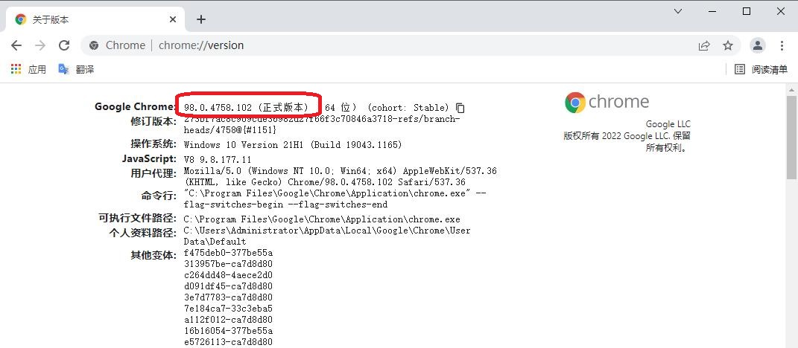
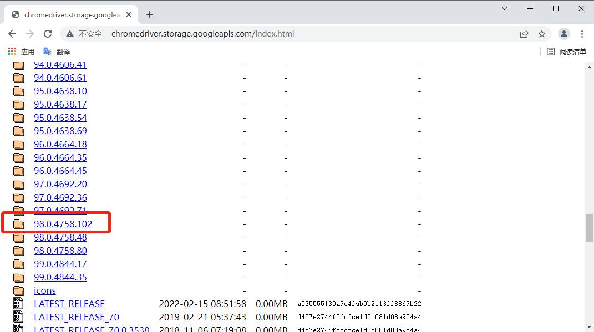
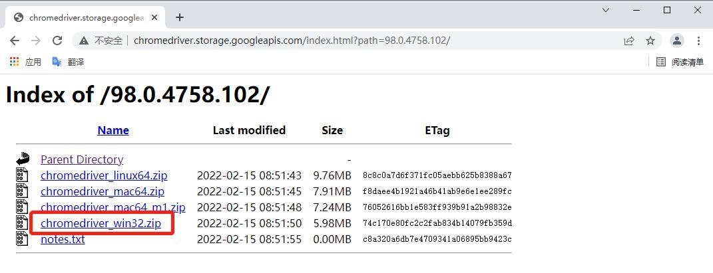
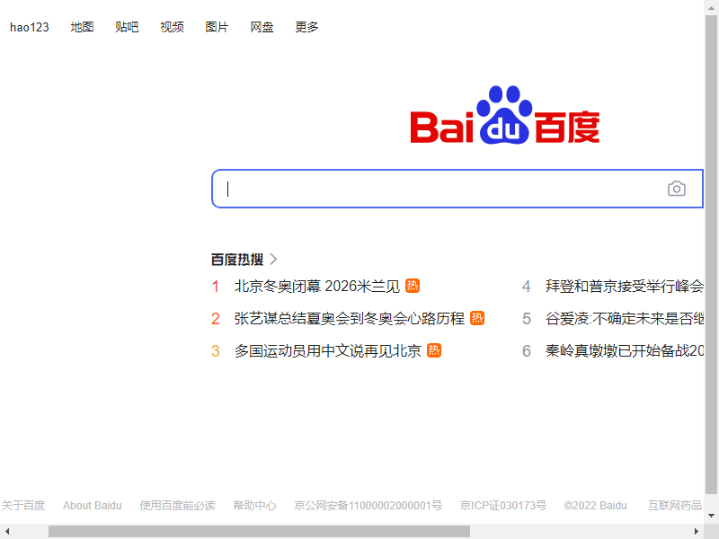
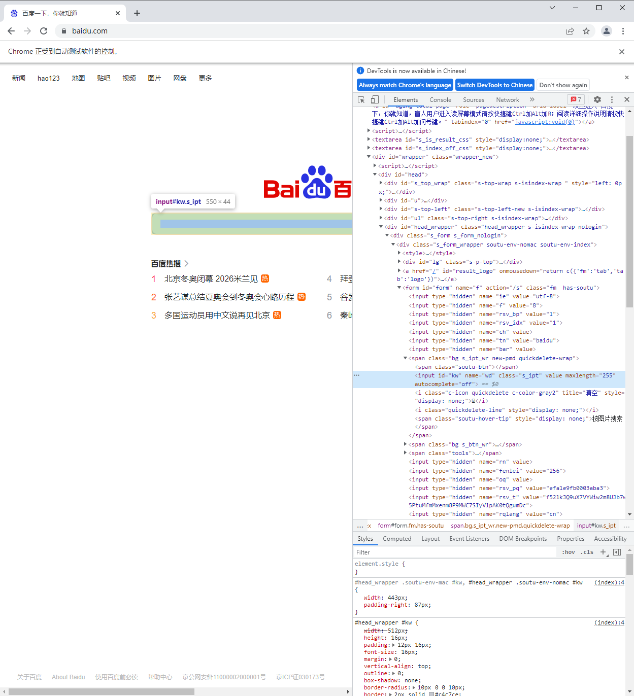
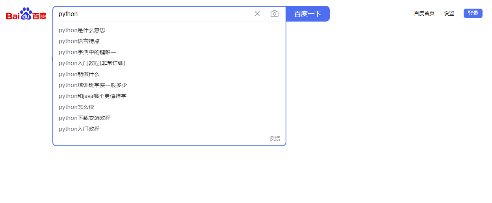

# 网页自动化（一）

## 准备工作

## 准备工作

### 为什么要模拟浏览器？

对爬虫是稍微有了解的同学可能会有疑问，明明可以使用 requests 库直接获取到网页源代码了，为什么还是要模拟浏览器进行网页自动化操作呢？获取源码的方式虽然简单又直接，但大家别忘了你有爬虫，别人有反爬虫。

另外网页里一些关键数据的解析和提交，往往可能通过脚本（JavaScript）来进行解析和加密，我们要理解这些混淆后的 JavaScript 代码是很费劲的，就不能很快地进行数据的抓取或提交。而且很多网站往往是有验证码的，现在验证方式五花八门，要想模拟过验证那确实是有难度的。所以用浏览器的打开网页，真实地模拟人类操作，才能克服读取网页内容的障碍。

### Selenium介绍

Selenium可以说是网络爬虫中的王者了，它可以控制浏览器，当使用 Selenium 当爬虫工具时，网络服务器会认为来读取数据的是正常的浏览器，所以不会有阻挡无法读取网页 HTML 原始文件的问题。

当然，Selenium作为爬虫王者，不仅是可以打开网页，读取信息，还可以用它点击链接，填写登录信息，甚至可以做自动上下架商品、抢票抢茅台系统。

### 安装工作

要在 Windows 中使用 Selenium 来控制浏览器完成自动操作，必须要先安装好下面的软件：
1. Selenium库 - 本教程以 Pycharm 开发环境作为示例。
2. 浏览器 - 本教程以Win10系统下使用 Chrome 浏览器作为示例。
3. 驱动程序 - 这里指的是浏览器对应的驱动程序，要使用配合 Chrome 的 chromedriver 。

#### 1. 安装Selenium

这个比较简单，在 Pycharm 底部的功能菜单中选择终端（Terminal），然后在控制台中输入按回车后等下载安装完成，可以使用以下的方式导入对应模块：

```bash
pip install selenium
```

```python
from selenium import webdriver
```

#### 2. 安装浏览器

本教程使用 Chrome 作为示例，直接点击这个链接去官方下载：https://www.google.cn/chrome/ （经测试这个网址国内是可以打开的），下载完成后安装好，就是最新版的。

#### 3. 安装驱动程序

这一步就比较关键了，首先打开 Chrome 浏览器，在地址栏里输入 chrome://version/ ，看看浏览器的版本号是多少，比如我的版本号是 "98.0.4758.102 (正式版本) （64 位） (cohort: Stable)" ，记住这串数字，等下要去下载对应版本的驱动程序。

在浏览器里再打开这个网址从http://chromedriver.storage.googleapis.com/index.html ，找到刚才对应的版本号：





点击进去选择 windows 版本的驱动下载：

下载后解压，再把解压后文件夹里的 chromedriver.exe 复制到指定的目录下。比如我这里放到 D:\driver 里。



## 基本用法

这节我们就从初始化浏览器对象、访问页面、设置浏览器大小、刷新页面和前进后退、定位元素输入或点击等基础操作开始学习。

### 初始化浏览器对象

准备工作都已就绪，接下来我们尝试打开第一个网站，看看效果是什么样的。

新建一个 Python 代码文件，在文件中输入以下代码：

```python
import time
from selenium import webdriver
from selenium.webdriver.chrome.service import Service

s = Service(r'D:\driver\chromedriver.exe')
# 初始化浏览器为chrome浏览器
browser = webdriver.Chrome(service=s)
time.sleep(2)
# 关闭浏览器
browser.close()
```

可以看到以上是有界面的浏览器，我们还可以初始化浏览器为无界面的浏览器。 上代码：

```python
import time
from selenium import webdriver
from selenium.webdriver.chrome.service import Service

s = Service(r'D:\driver\chromedriver.exe')
option = webdriver.ChromeOptions()
option.add_argument("headless")
# 初始化浏览器为chrome浏览器
browser = webdriver.Chrome(service=s, options=option)
# 访问百度首页
browser.get(r'https://www.baidu.com/')
# 截图预览
browser.get_screenshot_as_file('截图.png')
time.sleep(2)
# 关闭浏览器
browser.close()
```

运行后，打开工程下的截图.png 图片可以看到：



完成浏览器对象的初始化后并将其赋值给了browser 对象，接下来我们就可以调用browser 来执行各种方法模拟浏览器的操作了。

### 访问页面

进行页面访问使用的是get 方法，传入参数为待访问页面的URL 地址即可。 上代码：

```python
import time
from selenium import webdriver
from selenium.webdriver.chrome.service import Service

s = Service(r'D:\driver\chromedriver.exe')
# 初始化浏览器为chrome浏览器
browser = webdriver.Chrome(service=s)
# 访问百度首页
browser.get(r'https://www.baidu.com/')
time.sleep(2)
# 关闭浏览器
browser.close()
```

### 设置浏览器大小

set_window_size() 方法可以用来设置浏览器大小（就是分辨率），而maximize_window 则是设置浏览器为全屏！ 上代码：

```python
import time
from selenium import webdriver
from selenium.webdriver.chrome.service import Service

s = Service(r'D:\driver\chromedriver.exe')
# 初始化浏览器为chrome浏览器
browser = webdriver.Chrome(service=s)
# 访问百度首页
browser.get(r'https://www.baidu.com/')
time.sleep(2)
# 设置分辨率 500*500
browser.set_window_size(500,500)
time.sleep(2)
# 设置分辨率 1000*800
browser.set_window_size(1000,800)
time.sleep(2)
# 关闭浏览器
browser.close()
```

### 刷新页面

刷新页面是我们在浏览器操作时很常用的操作，这里refresh() 方法可以用来进行浏览器页面刷新。 上代码：

```python
import time
from selenium import webdriver
from selenium.webdriver.chrome.service import Service

s = Service(r'D:\driver\chromedriver.exe')
# 初始化浏览器为chrome浏览器
browser = webdriver.Chrome(service=s)
# 访问百度首页
browser.get(r'https://www.baidu.com/')
time.sleep(2)
try:
    # 刷新页面
    browser.refresh()
    time.sleep(2)
    print('刷新页面')
except Exception as e:
    print('刷新失败')
# 关闭浏览器
browser.close()
```

大家也是自行演示看效果哈，作用同F5 快捷键一样。

### 前进后退

前进后退也是我们在使用浏览器时非常常见的操作，这里forward() 方法可以用来实现前进，back() 可以用来实现后退。 上代码：

```python
import time
from selenium import webdriver
from selenium.webdriver.chrome.service import Service

s = Service(r'D:\driver\chromedriver.exe')
# 初始化浏览器为chrome浏览器
browser = webdriver.Chrome(service=s)
# 访问百度首页
browser.get(r'https://www.baidu.com/')
time.sleep(2)
# 打开淘宝页面
browser.get(r'https://www.taobao.com')
time.sleep(2)
# 后退到百度页面
browser.back()
time.sleep(2)
# 前进的淘宝页面
browser.forward()
time.sleep(2)
# 关闭浏览器
browser.close()
```

### 获取页面基础属性

当我们用selenium 打开某个页面，有一些基础属性如网页标题、网址、浏览器名称、页面源码等信息。

如果有需要，这里的页面源码我们就可以用正则表达式、Bs4 、xpath 以及pyquery 等工具进行解析提取想要的信息了。 上代码：

```python
import time
from selenium import webdriver
from selenium.webdriver.chrome.service import Service

s = Service(r'D:\driver\chromedriver.exe')
# 初始化浏览器为chrome浏览器
browser = webdriver.Chrome(service=s)
# 访问百度首页
browser.get(r'https://www.baidu.com/')
time.sleep(2)
# 网页标题
print(browser.title)
# 当前网址
print(browser.current_url)
# 浏览器名称
print(browser.name)
# 网页源码
print(browser.page_source)
# 关闭浏览器
browser.close()
```

### 定位元素

我们在实际使用浏览器的时候，很重要的操作有输入文本、点击确定等等。对此，Selenium 提供了一系列的方法来方便我们实现以上操作。常说的8种定位页面元素的操作方式，我们一一演示一下！

我们以百度首页的搜索框节点为例，搜索：python

搜索框的html 结构：

```html
<input id="kw" name="wd" class="s_ipt" value="" maxlength="255" autocomplete="off">
```

Selenium 还提供了一个通用的方法find_element() ，这个方法有两个参数：定位方式和定位值。 上代码：

```python
# 使用前先导入By类
from selenium.webdriver.common.by import By
```



#### 1. id定位

browser.find_element(By.ID, 'kw') 根据id 属性获取，这里id 属性是 kw

运行后，可以看到浏览器输入了搜索的关键词：python

```python
import time
from selenium import webdriver
from selenium.webdriver.chrome.service import Service
from selenium.webdriver.common.by import By

s = Service(r'D:\driver\chromedriver.exe')
# 初始化浏览器为chrome浏览器
browser = webdriver.Chrome(service=s)
# 访问百度首页
browser.get(r'https://www.baidu.com/')
time.sleep(2)
browser.find_element(By.ID, 'kw').send_keys('python')
time.sleep(2)
# 关闭浏览器
browser.close()
```



#### 2. name定位

browser.find_element(By.NAME, 'wd') 根据name 属性获取，这里name 属性是 wd

```python
import time
from selenium import webdriver
from selenium.webdriver.chrome.service import Service
from selenium.webdriver.common.by import By

s = Service(r'D:\driver\chromedriver.exe')
# 初始化浏览器为chrome浏览器
browser = webdriver.Chrome(service=s)
# 访问百度首页
browser.get(r'https://www.baidu.com/')
time.sleep(2)
browser.find_element(By.NAME, 'wd').send_keys('python')
time.sleep(2)
# 关闭浏览器
browser.close()
```

#### 3. class定位

browser.find_element(By.CLASS_NAME, 's_ipt') 根据class 属性获取，这里class 属性是s_ipt

```python
import time
from selenium import webdriver
from selenium.webdriver.chrome.service import Service
from selenium.webdriver.common.by import By

s = Service(r'D:\driver\chromedriver.exe')
# 初始化浏览器为chrome浏览器
browser = webdriver.Chrome(service=s)
# 访问百度首页
browser.get(r'https://www.baidu.com/')
time.sleep(2)
browser.find_element(By.CLASS_NAME, 's_ipt').send_keys('python')
time.sleep(2)
# 关闭浏览器
browser.close()
```

#### 4. tag定位

我们知道HTML 是通过tag 来定义功能的，比如input 是输入，table 是表格等等。每个元素其实就是一个tag ，一个tag 往往用来定义一类功能，我们查看百度首页的html 代码，可以看到有很多同类tag ，所以其实很难通过tag 去区分不同的元素。 上代码：

```python
import time
from selenium import webdriver
from selenium.webdriver.chrome.service import Service
from selenium.webdriver.common.by import By

s = Service(r'D:\driver\chromedriver.exe')
# 初始化浏览器为chrome浏览器
browser = webdriver.Chrome(service=s)
# 访问百度首页
browser.get(r'https://www.baidu.com/')
time.sleep(2)
browser.find_element(By.TAG_NAME, 'input').send_keys('python')
time.sleep(2)
# 关闭浏览器
browser.close()
```

注意：由于存在多个input ，以上代码会报错。

#### 5. link定位

这种方法顾名思义就是用来定位文本链接的，比如百度首页上方的分类模块链接

```python
import time
from selenium import webdriver
from selenium.webdriver.chrome.service import Service
from selenium.webdriver.common.by import By

s = Service(r'D:\driver\chromedriver.exe')
# 初始化浏览器为chrome浏览器
browser = webdriver.Chrome(service=s)
# 访问百度首页
browser.get(r'https://www.baidu.com/')
time.sleep(2)
browser.find_element(By.LINK_TEXT, '新闻').click()
time.sleep(2)
# 关闭浏览器全部页面
browser.quit()
```

#### 6. partial定位

有时候一个超链接的文本很长，我们如果全部输入，既麻烦，又显得代码很不美观，这时候我们就可以只截取一部分字符串，用这种方法模糊匹配了。 上代码：

```python
import time
from selenium import webdriver
from selenium.webdriver.chrome.service import Service
from selenium.webdriver.common.by import By

s = Service(r'D:\driver\chromedriver.exe')
# 初始化浏览器为chrome浏览器
browser = webdriver.Chrome(service=s)
# 访问百度首页
browser.get(r'https://www.baidu.com/')
time.sleep(2)
browser.find_element(By.PARTIAL_LINK_TEXT, '闻').click()
time.sleep(2)
# 关闭浏览器
browser.quit()
```

#### 7. xpath定位

前面介绍的几种定位方法都是在理想状态下，有一定使用范围的，那就是：在当前页面中，每个元素都有一个唯一的id 或name 或class 或超链接文本的属性，那么我们就可以通过这个唯一的属性值来定位他们。

但是在实际工作中并非有这么美好，那么这个时候我们就只能通过xpath 或者css 来定位了。 上代码：

```python
import time
from selenium import webdriver
from selenium.webdriver.chrome.service import Service
from selenium.webdriver.common.by import By

s = Service(r'D:\driver\chromedriver.exe')
# 初始化浏览器为chrome浏览器
browser = webdriver.Chrome(service=s)
# 访问百度首页
browser.get(r'https://www.baidu.com/')
time.sleep(2)
browser.find_element(By.XPATH, '//*[@id="kw"]').send_keys('python')
time.sleep(2)
# 关闭浏览器
browser.quit()
```

#### 8. css定位

这种方法相对xpath 要简洁些，定位速度也要快些。 上代码：

```python
import time
from selenium import webdriver
from selenium.webdriver.chrome.service import Service
from selenium.webdriver.common.by import By

s = Service(r'D:\driver\chromedriver.exe')
# 初始化浏览器为chrome浏览器
browser = webdriver.Chrome(service=s)
# 访问百度首页
browser.get(r'https://www.baidu.com/')
time.sleep(2)
browser.find_element(By.CSS_SELECTOR, '#kw').send_keys('python')
time.sleep(2)
# 关闭浏览器
browser.quit()
```

#### 9. 多个元素

如果定位的目标元素在网页中不止一个，那么则需要用到find_elements ，得到的结果会是列表形式。简单说，就是element 后面多了复数标识s ，其他操作一致。

## 文档总结

本节我们学习了网页自动化控制的工具 Selenium 的安装和基本使用方法和元素定位的实现，这些基 础知识是后面实现复杂功能的基石，值得花时间去多看看，动手写写，加深印象和理解。

## 练习题

1.（编程题）请仿照案例写一个程序，打开淘宝网，并搜索手机。