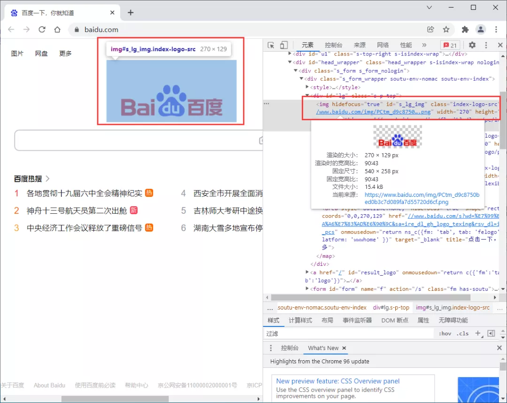
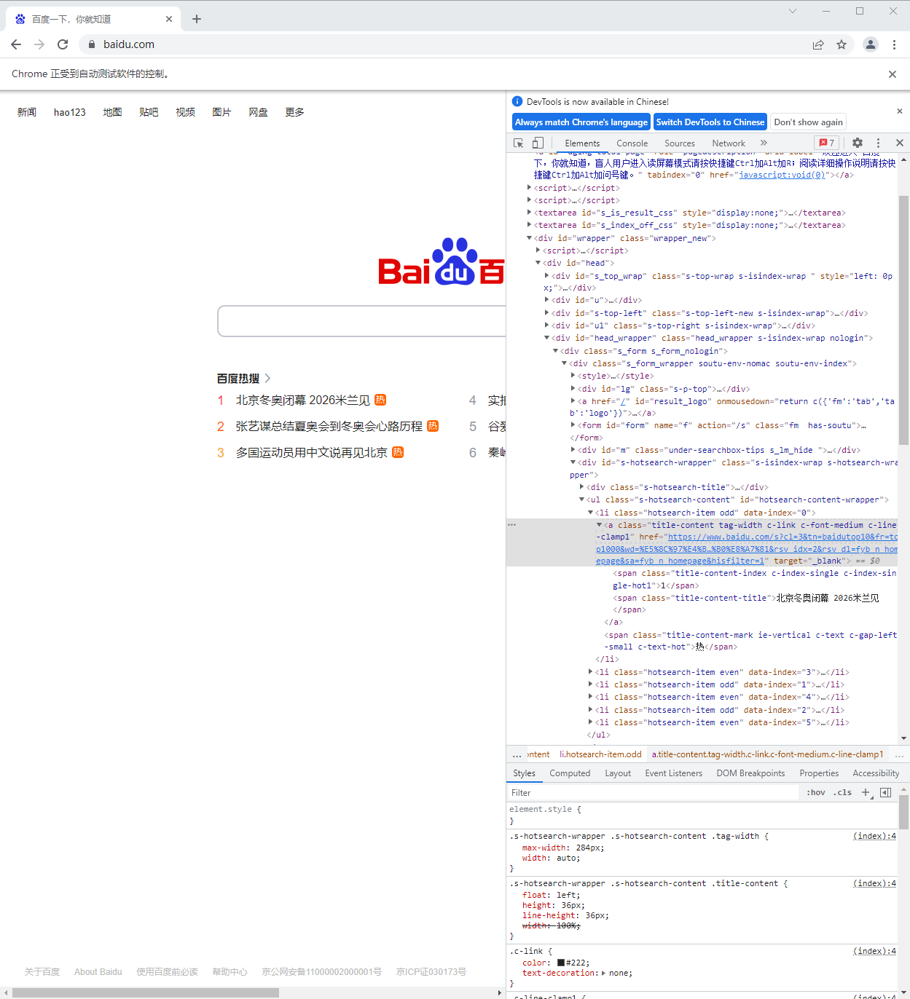
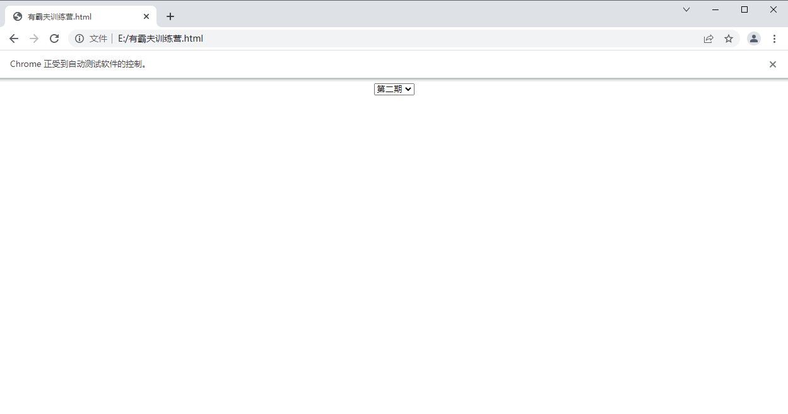
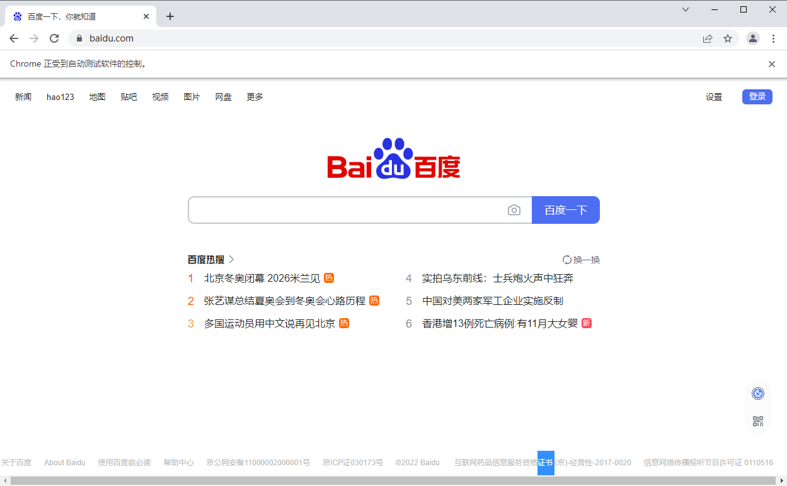
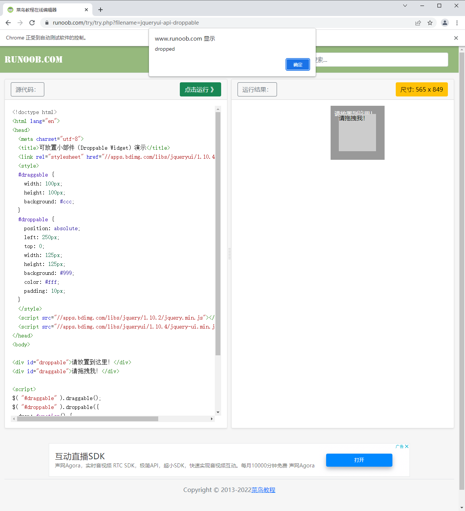
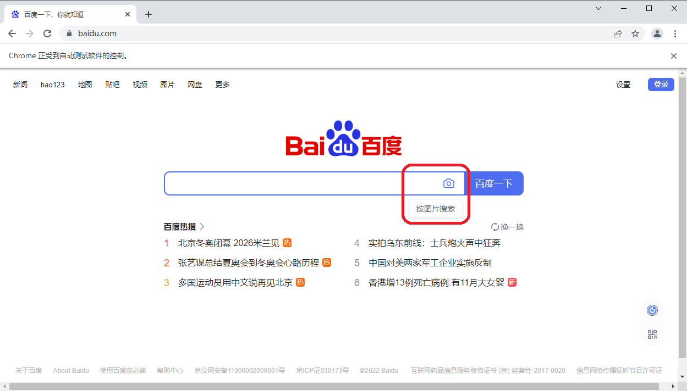

# 网页自动化（二）

## 获取元素属性

## 获取元素属性

### 1. 获取属性

以百度首页的logo为例，获取logo相关属性

```html

```



运行后输出：

```python
import time
from selenium import webdriver
from selenium.webdriver.chrome.service import Service
from selenium.webdriver.common.by import By

s = Service(r'D:\driver\chromedriver.exe')
# 初始化浏览器为chrome浏览器
browser = webdriver.Chrome(service=s)
# 访问百度首页
browser.get(r'https://www.baidu.com/')
time.sleep(2)
logo = browser.find_element(By.CLASS_NAME, 'index-logo-src')
print(logo)
print(logo.get_attribute('src'))
# 关闭浏览器
browser.quit()
```

```
<selenium.webdriver.remote.webelement.WebElement (session="d4c9ee59e1b2f2bfdf4b11a2e699f063", element="e71cceb6-7cd8-4002-a078-45b5aa497c94")>
https://www.baidu.com/img/PCtm_d9c8750bed0b3c7d089fa7d55720d6cf.png
```

### 2. 获取文本

以热榜为例，获取热榜文本和链接

```html
<a class="title-content tag-width c-link c-font-medium c-line-clamp1" href="https://www.baidu.com/s?cl=3&amp;tn=baidutop10&amp;fr=top1000&amp;wd=%E5%8C%97%E4%BA%AC%E5%86%AC%E5%A5%A5%E9%97%AD%E5%B9%95+2026%E7%B1%B3%E5%85%B0%E8%A7%81&amp;rsv_idx=2&amp;rsv_dl=fyb_n_homepage&amp;sa=fyb_n_homepage&amp;hisfilter=1" target="_blank"><span class="title-content-index c-index-single c-index-single-hot1">1</span><span class="title-content-title">北京冬奥闭幕 2026米兰见</span></a>
```



获取热榜的文本，用的是text 属性，直接调用即可

```python
import time
from selenium import webdriver
from selenium.webdriver.chrome.service import Service
from selenium.webdriver.common.by import By

s = Service(r'D:\driver\chromedriver.exe')
# 初始化浏览器为chrome浏览器
browser = webdriver.Chrome(service=s)
# 访问百度首页
browser.get(r'https://www.baidu.com/')
time.sleep(2)
hot = browser.find_element(By.CSS_SELECTOR, '#hotsearch-content-wrapper > li:nth-child(1) > a')
print(hot.text)
print(hot.get_attribute('href'))
# 关闭浏览器
browser.quit()
```

输出：

```
1各地贯彻十九届六中全会精神纪实 https://www.baidu.com/s?cl=3&tn=baidutop10&fr=top1000&wd=%E5%90%84%E5%9C%B0%E8%B4%AF%E5%BD%BB%E5%8D%81%E4%B9%9D%E5%B1%8A%E5%85%AD%E4%B8%AD%E5%85%A8%E4%BC%9A%E7%B2%BE%E7%A5%9E%E7%BA%AA%E5%AE%9E&rsv_idx=2&rsv_dl=fyb_n_homepage&sa=fyb_n_homepage&hisfilter=1
```

### 3. 获取其他属性

除了属性和文本值外，还有id、位置、标签名和大小等属性。 上代码：

```python
import time
from selenium import webdriver
from selenium.webdriver.chrome.service import Service
from selenium.webdriver.common.by import By

s = Service(r'D:\driver\chromedriver.exe')
# 初始化浏览器为chrome浏览器
browser = webdriver.Chrome(service=s)
# 访问百度首页
browser.get(r'https://www.baidu.com/')
time.sleep(2)
logo = browser.find_element(By.CLASS_NAME, 'index-logo-src')
print(logo.id)
print(logo.location)
print(logo.tag_name)
print(logo.size)
# 关闭浏览器
browser.quit()
```

输出：

```
ffec5900-4bd5-4162-a127-e970bc3e85a6
{'x': 490, 'y': 151}
img
{'height': 129, 'width': 270}
```

## 页面交互操作

页面交互就是在浏览器的各种操作，比如上面演示过的输入文本、点击链接等等，还有像清除文本、回车确认、单选框与多选框选中等。

### 1. 输入文本

其实，在之前的小节中我们有用过此操作。send_keys()

```python
import time
from selenium import webdriver
from selenium.webdriver.chrome.service import Service
from selenium.webdriver.common.by import By

s = Service(r'D:\driver\chromedriver.exe')
# 初始化浏览器为chrome浏览器
browser = webdriver.Chrome(service=s)
# 访问百度首页
browser.get(r'https://www.baidu.com/')
time.sleep(2)
browser.find_element(By.CLASS_NAME, 's_ipt').send_keys('python')
time.sleep(2)
# 关闭浏览器
browser.quit()
```

### 2. 点击

同样，我们也用过这个点击操作。click()

```python
import time
from selenium import webdriver
from selenium.webdriver.chrome.service import Service
from selenium.webdriver.common.by import By

s = Service(r'D:\driver\chromedriver.exe')
# 初始化浏览器为chrome浏览器
browser = webdriver.Chrome(service=s)
# 访问百度首页
browser.get(r'https://www.baidu.com/')
time.sleep(2)
browser.find_element(By.LINK_TEXT, '新闻').click()
time.sleep(2)
# 关闭浏览器
browser.quit()
```

### 3. 清除文本

既然有输入，这里也就有清除文本啦。clear()

```python
import time
from selenium import webdriver
from selenium.webdriver.chrome.service import Service
from selenium.webdriver.common.by import By

s = Service(r'D:\driver\chromedriver.exe')
# 初始化浏览器为chrome浏览器
browser = webdriver.Chrome(service=s)
# 访问百度首页
browser.get(r'https://www.baidu.com/')
time.sleep(2)
# 定位搜索框
input = browser.find_element(By.CLASS_NAME, 's_ipt')
# 输入python
input.send_keys('python')
time.sleep(2)
# 清除python
input.clear()
time.sleep(2)
# 关闭浏览器
browser.quit()
```

### 4. 回车确认

```python
import time
from selenium import webdriver
from selenium.webdriver.chrome.service import Service
from selenium.webdriver.common.by import By

s = Service(r'D:\driver\chromedriver.exe')
# 初始化浏览器为chrome浏览器
browser = webdriver.Chrome(service=s)
# 访问百度首页
browser.get(r'https://www.baidu.com/')
time.sleep(2)
# 定位搜索框
input = browser.find_element(By.CLASS_NAME, 's_ipt')
# 输入python
input.send_keys('python')
time.sleep(2)
# 回车查询
input.submit()
time.sleep(5)
# 关闭浏览器
browser.quit()
```

### 5. 单选

单选比较好操作，先定位需要单选的某个元素，然后点击一下即可。

### 6. 多选

多选好像也比较容易，依次定位需要选择的元素，点击即可。

### 7. 下拉框

下拉框的操作相对复杂一些，需要用到Select 模块。

先导入该类：

```python
from selenium.webdriver.support.select import Select
```

在select 模块中有以下定位方法：

```python
'''1、三种选择某一选项项的方法'''
select_by_index()           # 通过索引定位；注意：index索引是从"0"开始。
select_by_value()           # 通过value值定位，value标签的属性值。
select_by_visible_text()    # 通过文本值定位，即显示在下拉框的值。

'''2、三种返回options信息的方法'''
options                     # 返回select元素所有的options
all_selected_options        # 返回select元素中所有已选中的选项
first_selected_options      # 返回select元素中选中的第一个选项

'''3、四种取消选中项的方法'''
deselect_all                # 取消全部的已选择项
deselect_by_index           # 取消已选中的索引项
deselect_by_value           # 取消已选中的value值
deselect_by_visible_text    # 取消已选中的文本值
```

我们来进行演示一波，由于暂时没找到合适的网页，我们自己动手写一个简单的网页本地测试。

在 E:\ 下新建一个文本文档，输入以下内容：

```html
<html>
<body align="center">
<form>
<select name="教程">
<option value="1">第一期</option>
<option value="2" selected="">第二期</option>
<option value="3">第三期</option>
<option value="4">第四期</option>
</select>
</form>
</body>
</html>
```

保存后，把文件名修改为：渣男教父教程.html。

现在来演示下拉框的不同选择的方式：

```python
import time
from selenium import webdriver
from selenium.webdriver.chrome.service import Service
from selenium.webdriver.common.by import By
from selenium.webdriver.support.select import Select

s = Service(r'D:\driver\chromedriver.exe')
# 初始化浏览器为chrome浏览器
browser = webdriver.Chrome(service=s)
# 访问本地网页
browser.get(r'file:///E:/渣男教父教程.html')
time.sleep(2)
# 根据索引选择
Select(browser.find_element(By.NAME, "教程")).select_by_index("2")
time.sleep(2)
# 根据value值选择
Select(browser.find_element(By.NAME, "教程")).select_by_value("4")
time.sleep(2)
# 根据文本值选择
Select(browser.find_element(By.NAME, "教程")).select_by_visible_text("第二期")
time.sleep(2)
# 关闭浏览器
browser.quit()
```

## 多窗口切换

比如同一个页面的不同子页面的节点元素获取操作，不同选项卡之间的切换以及不同浏览器窗口之间的切换操作等等。

### 1. Frame切换

Selenium 打开一个页面之后，默认是在父页面进行操作，此时如果这个页面还有子页面，想要获取子页面的节点元素信息则需要切换到子页面进行擦走，这时候switch_to.frame() 就来了。如果想回到父页面，用switch_to.parent_frame() 即可。

### 2. 选项卡切换

我们在访问网页的时候会打开很多个页面，在Selenium 中提供了一些方法方便我们对这些页面进行操作。

- current_window_handle ：获取当前窗口的句柄。
- window_handles ：返回当前浏览器的所有窗口的句柄。
- switch_to_window() ：用于切换到对应的窗口。 上代码：

```python
import time
from selenium import webdriver
from selenium.webdriver.chrome.service import Service

s = Service(r'D:\driver\chromedriver.exe')
# 初始化浏览器为chrome浏览器
browser = webdriver.Chrome(service=s)
# 打开百度
browser.get(r'https://www.baidu.com')
# 新建一个选项卡
browser.execute_script('window.open()')
```



```python
print(browser.window_handles)
# 跳转到第二个选项卡并打开知乎
browser.switch_to.window(browser.window_handles[1])
browser.get(r'https://www.zhihu.com')
# 回到第一个选项卡并打开淘宝（原来的百度页面改为了淘宝）
time.sleep(2)
browser.switch_to.window(browser.window_handles[0])
browser.get(r'https://www.taobao.com')
# 关闭浏览器
browser.quit()
```

## 模拟鼠标操作

既然是模拟浏览器操作，自然也就需要能模拟鼠标的一些操作了，这里需要导入ActionChains 类。 上代码：

```python
from selenium.webdriver.common.action_chains import ActionChains
```

### 1. 左键

这个其实就是页面交互操作中的点击click() 操作。

### 2. 右键

使用函数context_click() 操作。 上代码：

```python
import time
from selenium import webdriver
from selenium.webdriver.chrome.service import Service
from selenium.webdriver.common.action_chains import ActionChains
from selenium.webdriver.common.by import By

s = Service(r'D:\driver\chromedriver.exe')
# 初始化浏览器为chrome浏览器
browser = webdriver.Chrome(service=s)
# 打开百度
browser.get(r'https://www.baidu.com')
# 定位到要右击的元素，这里选的新闻链接
right_click = browser.find_element(By.LINK_TEXT, '新闻')
# 执行鼠标右键操作
ActionChains(browser).context_click(right_click).perform()
time.sleep(2)
# 关闭浏览器
browser.quit()
```

- ActionChains(browser) ：调用ActionChains() 类，并将浏览器驱动browser 作为参数传入
- context_click(right_click) ：模拟鼠标右键，需要传入指定元素定位作为参数
- perform() ：执行ActionChains() 中储存的所有操作，可以看做是执行之前一系列的操作

### 3. 双击

使用函数 double_click() 操作。

通过双击选择中对应的文字，效果如下：

```python
import time
from selenium import webdriver
from selenium.webdriver.chrome.service import Service
from selenium.webdriver.common.action_chains import ActionChains
from selenium.webdriver.common.by import By

s = Service(r'D:\driver\chromedriver.exe')
# 初始化浏览器为chrome浏览器
browser = webdriver.Chrome(service=s)
# 打开百度
browser.get(r'https://www.baidu.com')
# 定位到要双击的元素
double_click = browser.find_element(By.CSS_SELECTOR, '#bottom_layer > div > p:nth-child(8) > span')
# 双击
ActionChains(browser).double_click(double_click).perform()
time.sleep(15)
# 关闭浏览器
browser.quit()
```

### 4. 拖拽

drag_and_drop(source,target) 意思就是拖拽操作嘛，开始位置和结束位置需要被指定，这个常用于滑块类验证码的操作之类。

我们以菜鸟教程的一个案例来进行演示 https://www.runoob.com/try/try.php?filename=jqueryui-api-droppable

```python
import time
from selenium import webdriver
from selenium.webdriver.chrome.service import Service
from selenium.webdriver.common.action_chains import ActionChains
from selenium.webdriver.common.by import By

s = Service(r'D:\driver\chromedriver.exe')
# 初始化浏览器为chrome浏览器
browser = webdriver.Chrome(service=s)
# 打开菜鸟教程示例
browser.get(r'https://www.runoob.com/try/try.php?filename=jqueryui-api-droppable')
time.sleep(2)
# 切换至子页面
browser.switch_to.frame('iframeResult')
# 开始位置
source = browser.find_element(By.CSS_SELECTOR, "#draggable")
# 结束位置
target = browser.find_element(By.CSS_SELECTOR, "#droppable")
# 执行元素的拖放操作
actions = ActionChains(browser)
actions.drag_and_drop(source, target)
actions.perform()
# 拖拽
time.sleep(15)
# 关闭浏览器
browser.quit()
```



拖拽到目标位置后，弹出如下界面：



### 5. 悬停

使用函数 move_to_element() 操作。 上代码：

```python
import time
from selenium import webdriver
from selenium.webdriver.chrome.service import Service
from selenium.webdriver.common.action_chains import ActionChains
from selenium.webdriver.common.by import By

s = Service(r'D:\driver\chromedriver.exe')
# 初始化浏览器为chrome浏览器
browser = webdriver.Chrome(service=s)
# 打开百度
browser.get(r'https://www.baidu.com')
time.sleep(2)
# 定位悬停的位置
move = browser.find_element(By.CSS_SELECTOR, "#form > span.bg.s_ipt_wr.new-pmd.quickdelete-wrap > span.soutu-btn")
# 悬停操作
ActionChains(browser).move_to_element(move).perform()
time.sleep(5)
# 关闭浏览器
browser.quit()
```



## 模拟键盘操作

selenium 中的Keys() 类提供了大部分的键盘操作方法，通过send_keys() 方法来模拟键盘上的按键。

引入Keys 类：

```python
from selenium.webdriver.common.keys import Keys
```

常见的键盘操作：

```python
send_keys(Keys.BACK_SPACE)        # 删除键(BackSpace)
send_keys(Keys.SPACE)             # 空格键(Space)
send_keys(Keys.TAB)               # 制表键(TAB)
send_keys(Keys.ESCAPE)            # 回退键(ESCAPE)
send_keys(Keys.ENTER)             # 回车键(ENTER)
send_keys(Keys.CONTRL,'a')        # 全选(Ctrl+A)
send_keys(Keys.CONTRL,'c')        # 复制(Ctrl+C)
send_keys(Keys.CONTRL,'x')        # 剪切(Ctrl+X)
send_keys(Keys.CONTRL,'v')        # 粘贴(Ctrl+V)
send_keys(Keys.F1)                # 键盘F1
...
send_keys(Keys.F12)               # 键盘F12
```

实例操作演示：

定位需要操作的元素，然后操作即可！ 上代码：

```python
import time
from selenium import webdriver
from selenium.webdriver.chrome.service import Service
from selenium.webdriver.common.by import By
from selenium.webdriver.common.keys import Keys

s = Service(r'D:\driver\chromedriver.exe')
# 初始化浏览器为chrome浏览器
browser = webdriver.Chrome(service=s)
# 打开百度
browser.get(r'https://www.baidu.com')
time.sleep(2)
# 定位搜索框
input = browser.find_element(By.CLASS_NAME, 's_ipt')
# 输入python
input.send_keys('python')
time.sleep(2)
# 回车
input.send_keys(Keys.ENTER)
time.sleep(5)
# 关闭浏览器
browser.quit()
```


## 文档总结

本文档学习了获取元素属性，多窗口切换，页面交互操作和模拟鼠标、键盘操作这些基本的功能，我们为每一个功能都编写了一个案例，先模仿再修改，多写多练，加深记忆。

## 练习题

1. （编程题）模仿示例打开网址 https://pan.baidu.com/ ，模拟完成输入账号，密码，点击登录的流程。测试账号： 123456@qq.com ，密码 ：123456。