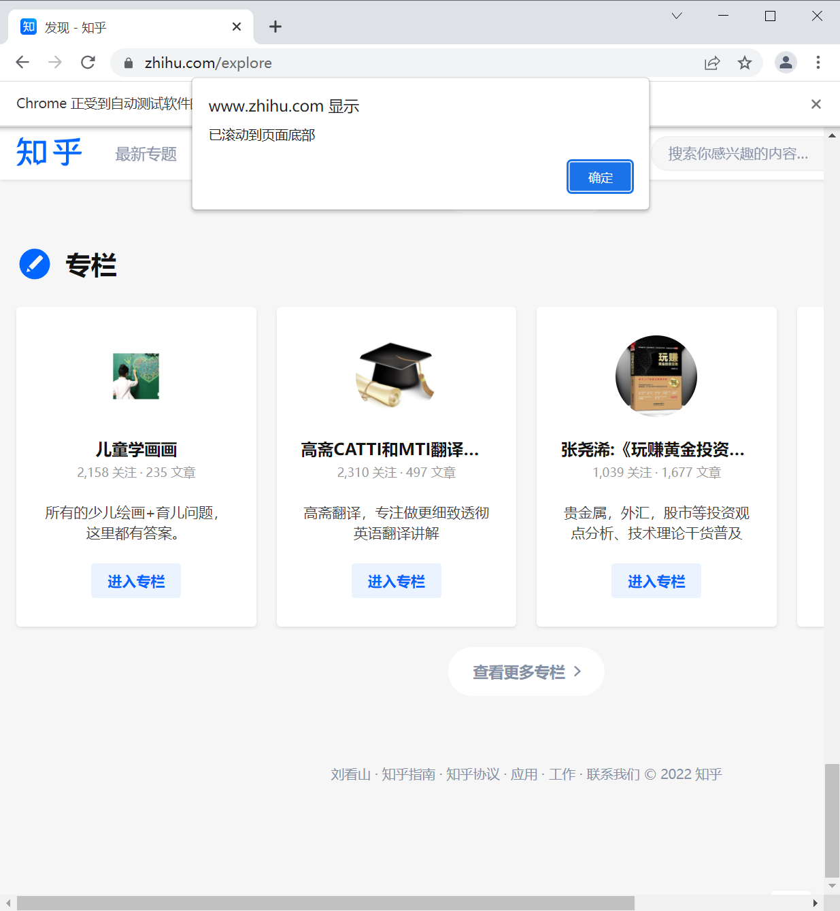
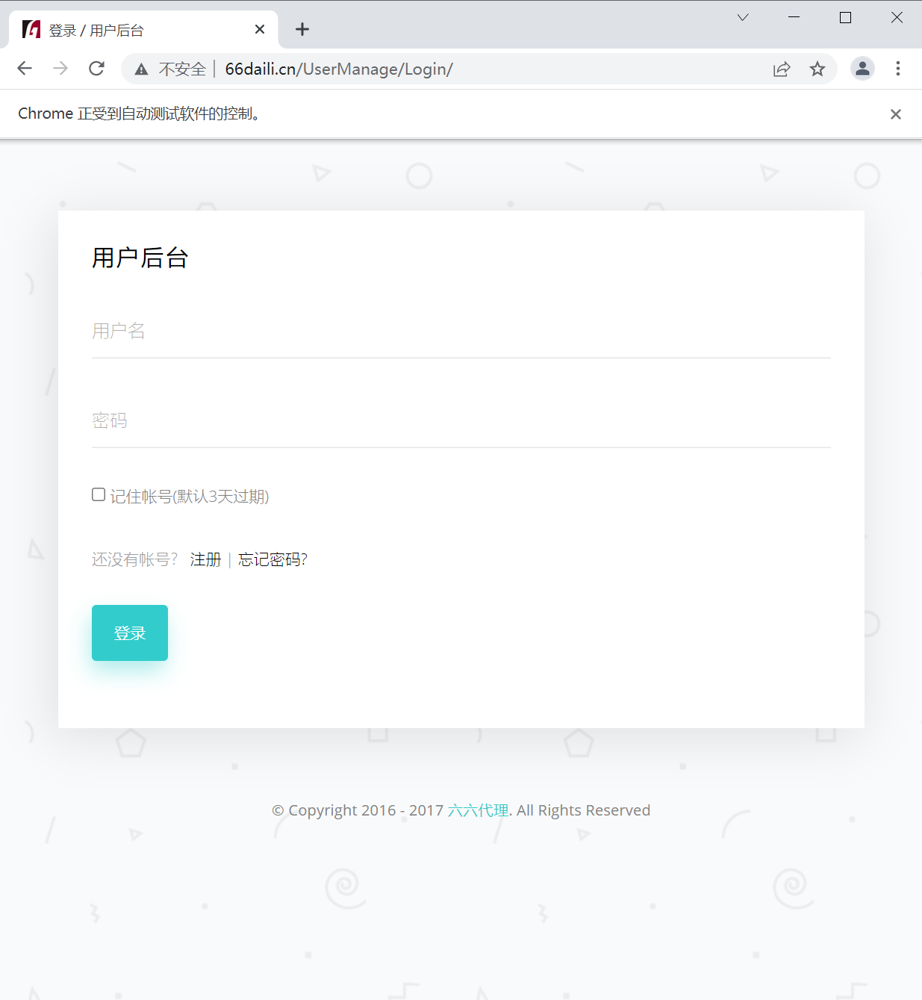
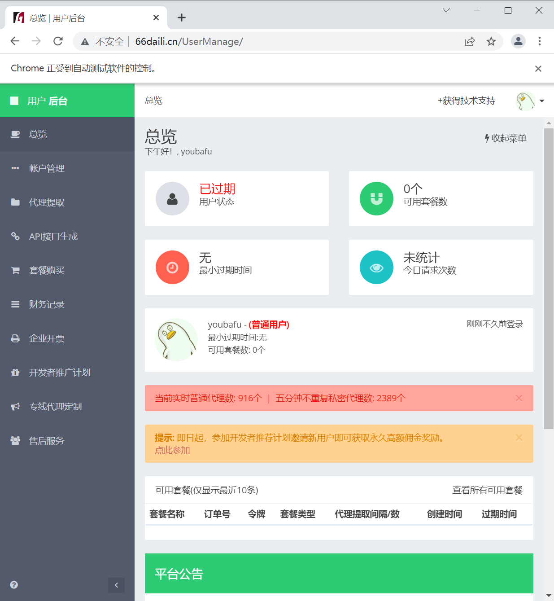

# 网页自动化（三）

如果遇到使用ajax 加载的网页，页面元素可能不是同时加载出来的，这个时候尝试在get 方法执行完成时获取网页源代码可能并非浏览器完全加载完成的页面。所以，这种情况下需要设置延时等待一定时间，确保全部节点都加载出来。

如果遇到使用ajax 加载的网页，页面元素可能不是同时加载出来的，这个时候尝试在get 方法执行完成时获取网页源代码可能并非浏览器完全加载完成的页面。所以，这种情况下需要设置延时等待一定时间，确保全部节点都加载出来。

那么，有三种方式可以选择：强制等待、隐式等待和显式等待。

### 延时等待

#### 1. 强制等待

这个实现就非常简单了，直接time.sleep(n) 强制等待n秒，在执行get 方法之后执行。 上代码：

```python
import time
from selenium import webdriver
from selenium.webdriver.chrome.service import Service

s = Service(r'D:\driver\chromedriver.exe')
# 初始化浏览器为chrome浏览器
browser = webdriver.Chrome(service=s)
# 打开百度
browser.get(r'https://www.baidu.com')
time.sleep(5)
# 关闭浏览器
browser.quit()
```

#### 2. 隐式等待

通过implicitly_wait() 方法设置等待时间，如果到时间有元素节点没有加载出来，就会抛出异常。 上代码：

```python
from selenium import webdriver
from selenium.webdriver.chrome.service import Service

s = Service(r'D:\driver\chromedriver.exe')
# 初始化浏览器为chrome浏览器
browser = webdriver.Chrome(service=s)
# 隐式等待，等待时间10秒
browser.implicitly_wait(10)
# 打开百度
browser.get(r'https://www.baidu.com')
print(browser.current_url)
print(browser.title)
# 关闭浏览器
browser.quit()
```

#### 3. 显式等待

设置一个等待时间和一个条件，在规定时间内，每隔一段时间查看下条件是否成立，如果成立那么程序就继续执行，否则就抛出一个超时异常。

WebDriverWait() 的参数说明：

构造函数原型：`WebDriverWait(driver, timeout, poll_frequency=0.5, ignored_exceptions=None)`

- driver : 浏览器驱动
- timeout : 超时时间，等待的最长时间（同时要考虑隐性等待时间）
- poll_frequency : 每次检测的间隔时间，默认是0.5秒
- ignored_exceptions :超时后的异常信息，默认情况下抛出NoSuchElementException 异常

```python
from selenium import webdriver
from selenium.webdriver.chrome.service import Service
from selenium.webdriver.support.wait import WebDriverWait
from selenium.webdriver.support import expected_conditions as ec
from selenium.webdriver.common.by import By
import time

s = Service(r'D:\driver\chromedriver.exe')
# 初始化浏览器为chrome浏览器
browser = webdriver.Chrome(service=s)
# 打开百度
browser.get(r'https://www.baidu.com')
# 设置等待时间10s
wait = WebDriverWait(browser, 10)
# 设置判断条件：等待id='kw'的元素加载完成
input = wait.until(ec.presence_of_element_located((By.ID, 'kw')))
# 在关键词输入：关键词
input.send_keys('Python')
# 关闭浏览器
time.sleep(5)
browser.quit()
```

等待方式一：
- method : 在等待期间，每隔一段时间调用这个传入的方法，直到返回值不是False
- message : 如果超时，抛出TimeoutException ，将message 传入异常

等待方式二：
- until_not 与until 相反，until 是当某元素出现或什么条件成立则继续执行，until_not 是当某元素消失或什么条件不成立则继续执行，参数也相同。

### 其它等待条件

以下只列出了对应函数名，参数请自行参考函数定义传入。

- until(method, message='')
- until_not(method, message='')

```python
from selenium.webdriver.support import expected_conditions as ec

# 判断标题是否和预期的一致
ec.title_is()
# 判断标题中是否包含预期的字符串
ec.title_contains()
# 判断指定元素是否加载出来
ec.presence_of_element_located()
# 判断所有元素是否加载完成
ec.presence_of_all_elements_located()
# 判断某个元素是否可见. 可见代表元素非隐藏，并且元素的宽和高都不等于0，传入参数是元组类型的locator
ec.visibility_of_element_located()
# 判断元素是否可见，传入参数是定位后的元素WebElement
ec.visibility_of()
# 判断某个元素是否不可见，或是否不存在于DOM树
ec.invisibility_of_element_located()
# 判断元素的 text 是否包含预期字符串
ec.text_to_be_present_in_element()
# 判断元素的 value 是否包含预期字符串
ec.text_to_be_present_in_element_value()
# 判断frame是否可切入，可传入locator元组或者直接传入定位方式：id、name、index或WebElement
ec.frame_to_be_available_and_switch_to_it()
# 判断是否有alert出现
ec.alert_is_present()
# 判断元素是否可点击
ec.element_to_be_clickable()
# 判断元素是否被选中,一般用在下拉列表，传入WebElement对象
ec.element_to_be_selected()
# 判断元素是否被选中
ec.element_located_to_be_selected()
# 判断元素的选中状态是否和预期一致，传入参数：定位后的元素，相等返回True，否则返回False
ec.element_selection_state_to_be()
# 判断元素的选中状态是否和预期一致，传入参数：元素的定位，相等返回True，否则返回False
ec.element_located_selection_state_to_be()
# 判断一个元素是否仍在DOM中，传入WebElement对象，可以判断页面是否刷新了
ec.staleness_of()
```

### 运行JavaScript

我们还需要模拟一些操作，比如下拉页面滚动条，模拟javaScript ，那么可以使用 execute_script 方法来实现。

效果如下：

```python
from selenium import webdriver
from selenium.webdriver.chrome.service import Service
import time

s = Service(r'D:\driver\chromedriver.exe')
# 初始化浏览器为chrome浏览器
browser = webdriver.Chrome(service=s)
# 知乎发现页
browser.get('https://www.zhihu.com/explore')
browser.execute_script('window.scrollTo(0, document.body.scrollHeight)')
browser.execute_script('alert("已滚动到页面底部")')
# 关闭浏览器
time.sleep(5)
browser.quit()
```



### 操作Cookie

在selenium 使用过程中，还可以很方便对Cookie 进行获取、添加与删除等操作。 上代码：

```python
from selenium import webdriver
from selenium.webdriver.chrome.service import Service
import time

s = Service(r'D:\driver\chromedriver.exe')
# 初始化浏览器为chrome浏览器
browser = webdriver.Chrome(service=s)
# 知乎发现页
browser.get('https://www.zhihu.com/explore')
# 获取cookie
print(f'Cookies的值：{browser.get_cookies()}')
# 添加cookie
browser.add_cookie({'name':'渣男教父', 'value':'youbafu'})
print(f'添加后Cookies的值：{browser.get_cookies()}')
# 删除cookie
browser.delete_all_cookies()
print(f'删除后Cookies的值：{browser.get_cookies()}')
# 关闭浏览器
time.sleep(5)
browser.quit()
```

输出：

```
Cookies的值：[{'domain': '.zhihu.com', 'httpOnly': False, 'name': 'Hm_lpvt_98beee57fd2ef70ccdd5ca52b9740c49', 'path': '/', 'secure': False, 'value': '1645602157'}, {'domain': '.zhihu.com', 'expiry': 1677138156, 'httpOnly': False, 'name': 'Hm_lvt_98beee57fd2ef70ccdd5ca52b9740c49', 'path': '/', 'secure': False, 'value': '1645602157'}, {'domain': 'www.zhihu.com', 'httpOnly': False, 'name': 'KLBRSID', 'path': '/', 'secure': False, 'value': 'fe0fceb358d671fa6cc33898c8c48b48|1645602156|1645602155'}, {'domain': '.zhihu.com', 'expiry': 1740210155, 'httpOnly': False, 'name': 'd_c0', 'path': '/', 'secure': False, 'value': '"AJARHbZ1iRSPTtni0h7Qji7IsmB-r9ipHvw=|1645602155"'}, {'domain': '.zhihu.com', 'httpOnly': False, 'name': '_xsrf', 'path': '/', 'secure': False, 'value': '4a4ff716-19e4-4fb8-b852-92fc28a7c29c'}, {'domain': '.zhihu.com', 'expiry': 1708674155, 'httpOnly': False, 'name': '_zap', 'path': '/', 'secure': False, 'value': '53c13dfc-70bc-40f8-a233-ad3b9c6275d4'}]

添加后Cookies的值：[{'domain': 'www.zhihu.com', 'httpOnly': False, 'name': 'KLBRSID', 'path': '/', 'secure': False, 'value': 'fe0fceb358d671fa6cc33898c8c48b48|1645602157|1645602155'}, {'domain': '.zhihu.com', 'expiry': 1677138156, 'httpOnly': False, 'name': 'Hm_lvt_98beee57fd2ef70ccdd5ca52b9740c49', 'path': '/', 'secure': False, 'value': '1645602157'}, {'domain': 'www.zhihu.com', 'httpOnly': False, 'name': '渣男教父', 'path': '/', 'secure': True, 'value': 'youbafu'}, {'domain': '.zhihu.com', 'httpOnly': False, 'name': 'Hm_lpvt_98beee57fd2ef70ccdd5ca52b9740c49', 'path': '/', 'secure': False, 'value': '1645602157'}, {'domain': '.zhihu.com', 'expiry': 1740210155, 'httpOnly': False, 'name': 'd_c0', 'path': '/', 'secure': False, 'value': '"AJARHbZ1iRSPTtni0h7Qji7IsmB-r9ipHvw=|1645602155"'}, {'domain': 'www.zhihu.com', 'httpOnly': False, 'name': 'SESSIONID', 'path': '/', 'secure': False, 'value': '2HJ7JhGKmFRCkr6x3omKnI16geharxa7uWQ5htrGelW'}, {'domain': '.zhihu.com', 'httpOnly': False, 'name': '_xsrf', 'path': '/', 'secure': False, 'value': '4a4ff716-19e4-4fb8-b852-92fc28a7c29c'}, {'domain': '.zhihu.com', 'expiry': 1708674155, 'httpOnly': False, 'name': '_zap', 'path': '/', 'secure': False, 'value': '53c13dfc-70bc-40f8-a233-ad3b9c6275d4'}]

删除后Cookies的值：[]
```

### 实战案例：自动登录网站

在写爬虫的时候，要伪装成真实用户请求。可能需要大量的IP地址，那么大量的IP地址从哪里来呢？这里就需要用代理IP来解决了，有的网站专门通过提供代理IP池服务作为主要的经营业务，只要注册相关网站开通对应套餐就可以了。

这次我们以自动登录一个爬虫代理 IP 网站来做为实战案例：

直接看代码：

账号我已经实现注册好了，可以用代码中的测试账号，也可以自己手动注册一个。 上代码：

```python
from selenium import webdriver
from selenium.webdriver.chrome.service import Service
from selenium.webdriver.common.by import By
import time

s = Service(r'D:\driver\chromedriver.exe')
# 初始化浏览器为chrome浏览器
browser = webdriver.Chrome(service=s)
# 隐式等待，等待时间10秒
browser.implicitly_wait(10)
# 66代理登录页
browser.get('http://www.66daili.cn/UserManage/Login/')
# 自动登录
browser.find_element(By.ID, 'username').send_keys('youbafu')
browser.find_element(By.ID, 'password').send_keys('youbafu123')
remember = browser.find_element(By.ID, 'remember')
if not remember.get_attribute('checked'):
    remember.click()
browser.find_element(By.ID, 'submit').click()
time.sleep(2)
# 关闭浏览器
time.sleep(100)
browser.quit()
```



运行代码可以看到，自动填好了账号密码，并勾选了记住账号，然后提交登录成功。

## 文档总结

本文档我们学习了更进阶的操作：三种延时等待方法、运行JavaScript和操作Cookie，并且通过一个实战案例，完整展示了开发一个网页自动化的思路和流程。

## 练习题

1.（编程题）请在教程案例的基础上增加退出登录功能，并删除所有的Cookie，然后使用JavaScript弹出提示框：已清空痕迹。

