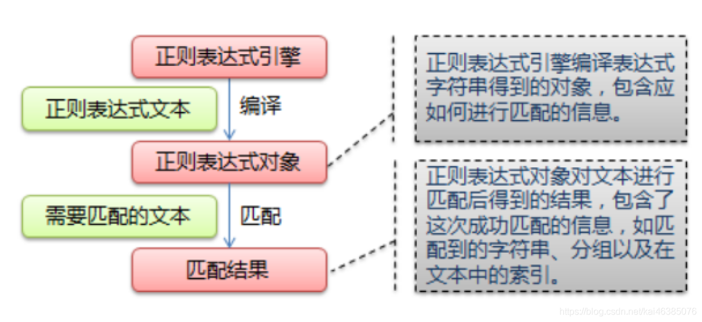
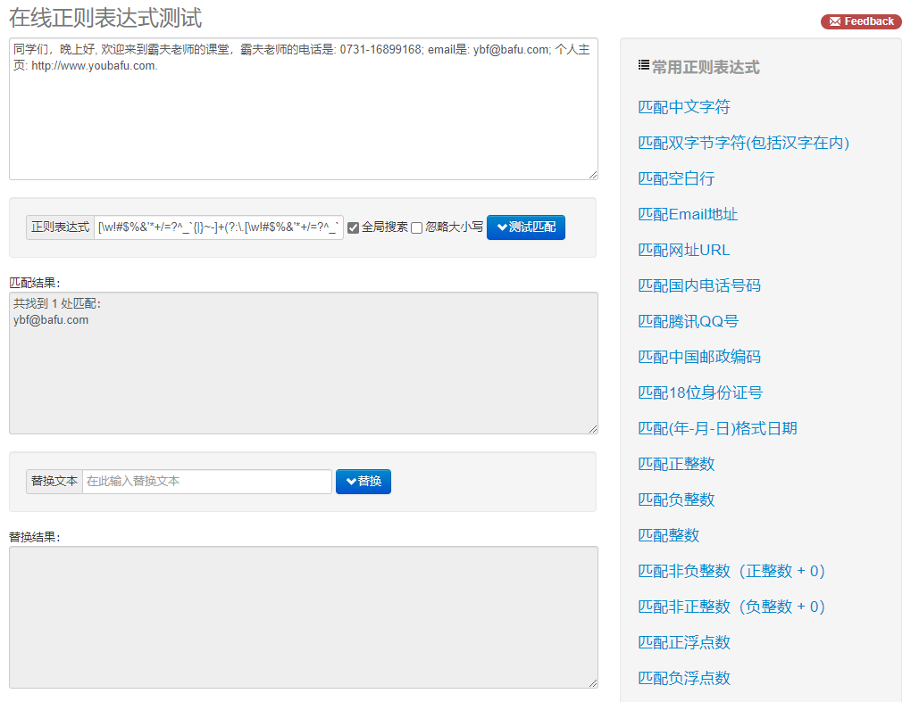
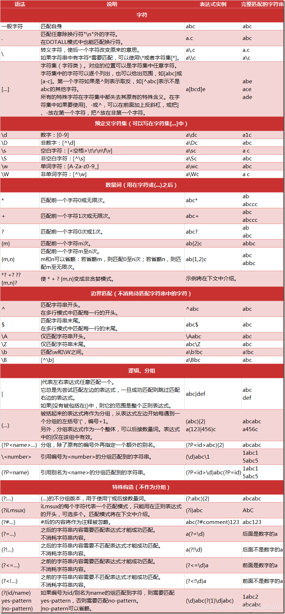

# 正则表达式

## 认识正则表达式

### 为什么要学习正则表达式

### 为什么要学习正则表达式

因为爬虫需要！！！

一般来说爬虫需要四个主要步骤：

1. 明确目标 (要知道你准备在哪个范围或者网站去搜索)
2. 爬 (将所有的网站的内容全部爬下来)
3. 取 (去掉对我们没用处的数据)
4. 处理数据（按照我们想要的方式存储和使用）

一般情况我们拉取的网页数据庞大并且很混乱，其中很大一部分东西是我们不关心的，因此我们需要将其按要求过滤和匹配出来。

那么对于文本的过滤和指定规则的匹配，最强大的就是正则表达式，可以说正则表达式是Python爬虫世界里必不可少的神兵利器。

### 什么是正则表达式

正则表达式，又称规则表达式，通常被用来检索、替换那些符合某个模式（规则）的文本。

正则表达式是处理字符串的强大工具，它有自己特定的语法结构，有了它，实现字符串的检索、替换、匹配验证都不在话下。

对于爬虫来说，有了正则表达式，再从 HTML 里提取想要的信息就非常方便了。

给定一个正则表达式和目标字符串，我们可以达到如下的目的：

- 目标字符串是否符合正则表达式的过滤逻辑（"匹配"）；
- 通过正则表达式，从目标字符串中获取我们想要的特定部分（"过滤"）。

正则表达式匹配能力非常的强大且实用，同时相对应的匹配规则也非常的丰富，要想学好用好正则表达式光靠看和记是不行的，最好的方法就是想办法去使用它，在使用的过程中强化对匹配规则的理解。

### 正则表达式示例

前面说了很多的概念，对正则表达式到底是个什么，可能还是比较模糊，下面我们就用实例来带大家看一下正则表达式的用法。

这里需要用到一个工具，地址是: http://tool.oschina.net/regex/，打开页面，输入待匹配的文本，然后选择常用的正则表达式，就可以得出相应的匹配结果了。

比如，这里输入待匹配的文本如下：

```
晚上好, 欢迎来到Python课堂，电话是: 0731-16899168; email是: ybf@bafu.com; 个人主页: http://www.youbafu.com.
```

这段字符串中包含了一个电话号码和一个电子邮件，接下来就尝试用正则表达式提取出来，如下图所示：



在网页右侧选择 "匹配 Email 地址"，就可以看到下方出现了文本中的 E-mail。如果选择 "匹配网址 URL"，就可以看到下方出现了文本中的 URL，是不是有点神奇。

其实，这里就是用到了正则表达式匹配，也就是用一定的规则将特定的文本提取出来。比如，电子邮件开头是一段字符串，然后是一个 @符号，最后是某个域名，这是有特定的组成格式的。另外，对于 URL，开头是协议类型，然后是冒号加双斜线，最后是域名加路径。

对于 URL 来说，可以用下面的正则表达式匹配：

```
[a-zA-z]+://[^\s]*
```

用这个正则表达式去匹配一个字符串，如果这个字符串中包含类似 URL 的文本，那就会被提取出来。

这个正则表达式看上去是乱糟糟的一团，其实不然，这里面都是有特定的语法规则的。比如，a-z 代表匹配任意的小写字母，\s 表示匹配任意的空白字符，* 就代表匹配前面的字符任意多个，这一长串的正则表达式就是这么多匹配规则的组合。

写好正则表达式后，就可以拿它去一个长字符串里匹配查找了。不论这个字符串里面有什么，只要符合我们写的规则，统统可以找出来。对于网页来说，如果想找出网页源代码里有多少 URL，用匹配 URL 的正则表达式去匹配即可。

上面我们列举了几个匹配规则，下表列出了一些较为常用的匹配语法规则。



| 模式 | 描述 |
|------|------|
| \w | 匹配字母、数字、下划线,等价于[a-zA-Z0-9_] \w可以匹配汉字(python) |
| \W | 匹配不是字母、数字、下划线的其他字符 |
| \s | 匹配任意空白字符,等价于(\t\n\r\f) |
| \S | 匹配任意非空字符 |
| \d | 匹配数字,等价于[0-9] |
| \D | 匹配不是数字的字符 |
| \A | 匹配字符串开头 |
| \Z | 匹配字符串结尾的,如果存在换行,只匹配到换行前的结束字符串 |
| \z | 匹配字符串结尾的,如果存在换行,匹配到换行符\n |
| \G | 最好完成匹配的位置 |
| \n | 匹配一个换行符 |
| \t | 匹配一个制表符(tab) |
| ^ | 匹配一行字符串的开头 |
| $ | 匹配一行字符串的结尾 |
| . | 匹配任意字符,除了换行符.当re.DOTALL标记被指定时,这可以匹配包括换行符在内的任字符 |
| […] | 用来表示一组字符,比如[abc]表示匹配a或b或c,[a-z],[0-9] |
| [^…] | 匹配不在[]里面的字符,比如[^abc]匹配除a,b,c以外的字符 |
| * | 匹配0个或多个字符 |
| + | 匹配1个或多个字符 |
| ? | 匹配0个或1个前面的正则表达式片段,(.*?)表示尽可能少地匹配字符(后面详解) |
| {n} | 精确匹配前面n个前面的表达式,如\d{5}表示匹配5个数字 |
| {n,m} | 匹配前面的表达式n到m次,贪婪模式 |
| a\|b | 匹配a或b |
| (…) | 匹配括号里的表达式,也可以表示一个组 |

看完了之后，可能会觉得有些复杂。这很正常，不过不用担心，后面我们会详细讲解一些常见规则的用法。

其实正则表达式不是 Python 独有的，它也可以用在其他编程语言中。但是 Python 的 re 库提供了整个正则表达式的实现，利用这个库，可以在 Python 中使用正则表达式。在 Python 中写正则表达式几乎都用这个库，下面就来了解它的一些常用方法。

## 正则表达式Python模块

在 Python 中，我们可以使用其内置的 re 模块来使用正则表达式，下面我来学习一下 re 模块里面一些实用的方法。

### match()

这里首先介绍第一个常用的匹配方法 —— match() ，向它传入要匹配的字符串以及正则表达式，就可以检测这个正则表达式是否匹配字符串。

match() 方法会尝试从字符串的起始位置匹配正则表达式，如果匹配，就返回匹配成功的结果；如果不匹配，就返回 None 。示比如下：

```python
import re
content = 'Hi 123 4567 Python一起来学习正则 match Demo'
print(len(content))
result = re.match('^Hi\s\d\d\d\s\d{4}\s\w{4}', content)
print(result)
print(result.group())
print(result.span())
```

运行结果如下：

```
35
<re.Match object; span=(0, 16), match='Hi 123 4567 Python'>
Hi 123 4567 Python
(0, 16)
```

这里首先声明了一个字符串，其中包含英文字母、空白字符、数字等。接下来，我们写一个正则表达式：

```
^Hi\s\d\d\d\s\d{4}\s\w{4}
```

用它来匹配这个长字符串。开头的 ^ 是匹配字符串的开头，也就是以 Hi 开头；然后 \s 匹配空白字符，用来匹配目标字符串的空格；\d 匹配数字，3 个 \d 匹配 123；然后再写 1 个 \s 匹配空格；后面还有 4567 ，我们其实可以依然用 4 个 \d 来匹配，但是这么写比较烦琐，所以后面可以跟 {4} 以代表匹配前面的规则 4 次，也就是匹配 4 个数字；然后后面再紧接 1 个空白字符，最后 \w{4} 匹配 4 个字母及下划线。我们注意到，这里其实并没有把目标字符串匹配完，不过这样依然可以进行匹配，只不过匹配结果短一点而已。

而在 match() 方法中，第一个参数传入了正则表达式，第二个参数传入了要匹配的字符串。

打印输出结果，可以看到结果是 re.Match 对象，这证明成功匹配。该对象有两个方法：group() 方法可以输出匹配到的内容，结果是 Hi 123 4567 Python，这恰好是正则表达式规则所匹配的内容；span() 方法可以输出匹配的范围，结果是 (0, 16) ，这就是匹配到的结果字符串在原字符串中的位置范围。

通过上面的例子，我们基本了解了如何在 Python 中使用正则表达式来匹配一段文本字符串。

### 匹配目标

刚才我们用 match() 方法可以得到匹配到的字符串内容，但是如果想从字符串中提取一部分内容，该怎么办呢？

比如如何从文本 "晚上好, 欢迎来到Python课堂，电话是: 0731-16899168; email是: ybf@bafu.com; 个人主页: http://www.youbafu.com." 中提取出邮件或电话号码等内容呢？

这里可以使用 () 括号将想提取的子字符串括起来。() 实际上标记了一个子表达式的开始和结束位置，被标记的每个子表达式会依次对应每一个分组，调用 group() 方法传入分组的索引即可获取提取的结果。示比如下：

```python
import re
content = 'Hi 1234567 Python一起来学习正则 match Demo'
result = re.match('^Hi\s(\d+)\sPython', content)
print(result)
print(result.group())
print(result.group(1))
print(result.span())
```

运行结果如下：

```
<re.Match object; span=(0, 15), match='Hi 1234567 Python'>
Hi 1234567 Python
1234567
(0, 15)
```

这里我们想把字符串中的 1234567 提取出来，此时可以将数字部分的正则表达式用 () 括起来，然后调用了 group(1) 获取匹配结果。

可以看到，我们成功得到了 1234567 。这里用的是 group(1) ，它与 group() 有所不同，后者会输出完整的匹配结果，而前者会输出第一个被 () 包围的匹配结果。假如正则表达式后面还有 () 包括的内容，那么可以依次用 group(2) 、group(3) 等来获取。

### 通用匹配

刚才我们写的正则表达式其实比较繁琐，出现空白字符我们就写 \s 匹配，出现数字我们就用 \d 匹配，这样的工作量非常大。其实完全没必要这么做，因为还有一个万能匹配可以用，那就是.* （点星）。

其中. （点）可以匹配任意字符（除换行符），* （星）代表匹配前面的字符无限次，所以它们组合在一起就可以匹配任意字符了。有了它，我们就不用挨个字符地匹配了。

接着上面的例子，我们可以改写一下正则表达式：

```python
import re
content = 'Hi 1234567 Python一起来学习正则 match Demo'
result = re.match('^Hi.*Demo$', content)
print(result)
print(result.group())
print(result.span())
```

这里我们将中间部分直接省略，全部用.* 来代替，最后加一个结尾字符串就好了。运行结果如下：

```
<re.Match object; span=(0, 34), match='Hi 1234567 Python一起来学习正则 match Demo'>
Hi 1234567 Python一起来学习正则 match Demo
(0, 34)
```

可以看到，group() 方法输出了匹配的全部字符串，也就是说我们写的正则表达式匹配到了目标字符串的全部内容；span() 方法输出 (0, 35) ，这是整个字符串的长度。

因此，我们可以使用.* 简化正则表达式的书写。

### 贪婪与非贪婪

在使用上面的通用匹配.* 时，需要注意一点，可能有时候匹配到的并不是我们想要的结果。

来看示例：

```python
import re
content = 'Hi 1234567 Python一起来学习正则 match Demo'
result = re.match('^Hi.*(\d+).*Demo$', content)
print(result)
print(result.group(1))
```

这里我们依然想获取中间的数字，所以中间依然写的是 (\d+) 。而数字两侧由于内容比较杂乱，所以想省略来写，都写成 .* 。最后，组成 ^Hi.*(\d+).*Demo$ ，看样子并没有什么问题。我们看下运行结果：

```
<re.Match object; span=(0, 34), match='Hi 1234567 Python一起来学习正则 match Demo'>
7
```

我们发现只得到了 7 这个数字，这是为什么呢？

这里就涉及一个贪婪匹配与非贪婪匹配的问题了。在贪婪匹配下，.* 会匹配尽可能多的字符。正则表达式中.* 后面是 \d+ ，也就是至少一个数字，并没有指定具体多少个数字，因此，.* 就尽可能匹配多的字符，这里就把 123456 匹配了，给 \d+ 留下一个可满足条件的数字 7，最后得到的内容就只有数字 7 了。

但这很明显会给我们带来很大的不便。有时候，匹配结果会莫名其妙少了一部分内容。其实，这里只需要使用非贪婪匹配就好了。非贪婪匹配的写法是.*? ，多了一个 ? ，那么它可以达到怎样的效果？我们再用实例看一下：

```python
import re
content = 'Hi 1234567 Python一起来学习正则 match Demo'
result = re.match('^Hi.*?(\d+).*Demo$', content)
print(result)
print(result.group(1))
```

这里我们只是将第一个.* 改成了.*? ，转变为非贪婪匹配。结果如下：

```
<re.Match object; span=(0, 34), match='Hi 1234567 Python一起来学习正则 match Demo'>
1234567
```

此时就可以成功获取 1234567 了。原因可想而知，贪婪匹配是尽可能匹配多的字符，非贪婪匹配就是尽可能匹配少的字符。当.*? 匹配到 Hi 后面的空白字符时，再往后的字符就是数字了，而 \d+ 恰好可以匹配，那么这里.*? 就不再进行匹配，交给 \d+ 去匹配后面的数字。所以这样.*? 匹配了尽可能少的字符，\d+ 的结果就是 1234567 了。

所以说，在做匹配的时候，字符串中间尽量使用非贪婪匹配，也就是用.*? 来代替.* ，以免出现匹配结果缺失的情况。

但这里需要注意，如果匹配的结果在字符串结尾，.*? 就有可能匹配不到任何内容了，因为它会匹配尽可能少的字符。比如：

```python
import re
content = 'http://weibo.com/comment/youbafu'
result1 = re.match('http.*?comment/(.*?)', content)
result2 = re.match('http.*?comment/(.*)', content)
print('result1', result1.group(1))
print('result2', result2.group(1))
```

运行结果如下：

```
result1 
result2 youbafu
```

可以观察到，.*? 没有匹配到任何结果，而.* 则尽量匹配多的内容，成功得到了匹配结果。

### 修饰符

正则表达式可以包含一些可选标志修饰符来控制匹配的模式。修饰符被指定为一个可选的标志。我们用实例来看一下：

```python
import re
content = '''Hi 1234567 Python
一起来学习正则 match Demo
'''
result = re.match('^Hi.*?(\d+).*?Demo$', content)
print(result.group(1))
```

和上面的例子相仿，我们在字符串中加了换行符，正则表达式还是一样的，用来匹配其中的数字。看一下运行结果：

```
Traceback (most recent call last):
  File "E:/爬虫/修饰符.py", line 16, in <module>
    print(result.group(1))
AttributeError: 'NoneType' object has no attribute 'group'
```

运行直接报错，也就是说正则表达式没有匹配到这个字符串，返回结果为 None ，而我们又调用了 group() 方法导致 AttributeError 。

那么，为什么加了一个换行符，就匹配不到了呢？这是因为 . 匹配的是除换行符之外的任意字符，当遇到换行符时，.*? 就不能匹配了，所以导致匹配失败。这里只需加一个修饰符 re.S ，即可修正这个错误：

```python
result = re.match('^Hi.*?(\d+).*?Demo$', content, re.S)
```

这个修饰符的作用是使. 匹配包括换行符在内的所有字符。此时运行结果如下：

```
1234567
```

这个 re.S 在网页匹配中经常用到。因为 HTML 节点经常会有换行，加上它，就可以匹配节点与节点之间的换行了。

另外，还有一些修饰符，在必要的情况下也可以使用，如下表所示：

| 修饰符 | 描述 |
|--------|------|
| re.I | 使匹配对大小写不敏感 |
| re.L | 做本地化识别（locale-aware）匹配 |
| re.M | 多行匹配，影响 ^ 和 $ |
| re.S | 使. 匹配包括换行在内的所有字符 |
| re.U | 根据 Unicode 字符集解析字符。这个标志影响 \w 、\W 、\b 和 \B |
| re.X | 该标志通过给予你更灵活的格式以便你将正则表达式写得更易于理解 |

在网页匹配中，较为常用的有 re.S 和 re.I 。

### 转义匹配

我们知道正则表达式定义了许多匹配模式，如. 匹配除换行符以外的任意字符，但是如果目标字符串里面就包含. ，那该怎么办呢？

这里就需要用到转义匹配了，示比如下：

```python
import re
content = '(渣男教父)www.bpsend.net'
result = re.match('\(渣男教父\)www\.bpsend\.net', content)
print(result)
```

当遇到用于正则匹配模式的特殊字符时，在前面加反斜线转义一下即可。比如. 就可以用 \. 来匹配，运行结果如下：

```
<re.Match object; span=(0, 16), match='(渣男教父)www.bpsend.net'>
```

可以看到，这里成功匹配到了原字符串。

这些是写正则表达式常用的几个知识点，熟练掌握它们对后面写正则表达式匹配非常有帮助。

### search()

前面提到过，match() 方法是从字符串的开头开始匹配的，一旦开头不匹配，那么整个匹配就失败了。我们看下面的例子：

```python
import re
content = '加点头头 Hi 1234567 Python一起来学习正则 search Demo 接点尾巴'
result = re.match('Hi.*?(\d+).*?Demo', content)
print(result)
```

这里的字符串以加点头头开头，但是正则表达式以 Hi 开头，整个正则表达式是字符串的一部分，但是这样匹配是失败的。运行结果如下：

```
None
```

因为 match() 方法在使用时需要考虑到开头的内容，这在做匹配时并不方便。它更适合用来检测某个字符串是否符合某个正则表达式的规则。

这里就有另外一个方法 search() ，它在匹配时会扫描整个字符串，然后返回第一个成功匹配的结果。也就是说，正则表达式可以是字符串的一部分，在匹配时，search() 方法会依次扫描字符串，直到找到第一个符合规则的字符串，然后返回匹配内容，如果搜索完了还没有找到，就返回 None 。

我们把上面代码中的 match() 方法修改成 search() 。再看下运行结果：

```python
import re
content = '加点头头 Hi 1234567 Python一起来学习正则 search Demo 接点尾巴'
result = re.search('Hi.*?(\d+).*?Demo', content)
print(result)
print(result[1])
```

这时就得到了匹配结果。 上代码：

```
<re.Match object; span=(5, 40), match='Hi 1234567 Python一起来学习正则 search Demo'>
1234567
```

因此，为了匹配方便，我们可以尽量使用 search() 方法。

下面再用几个实例来看看 search() 方法的用法。

首先，这里有一段待匹配的 HTML 文本，接下来写几个正则表达式实例来实现相应信息的提取：

