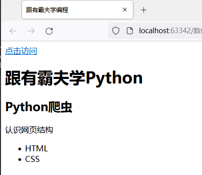
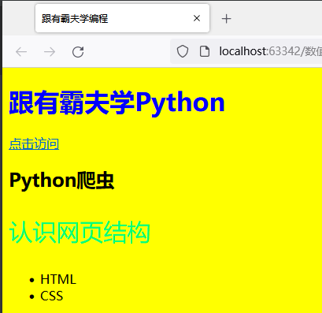
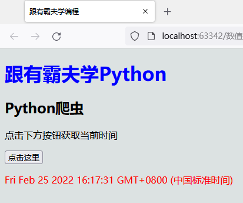
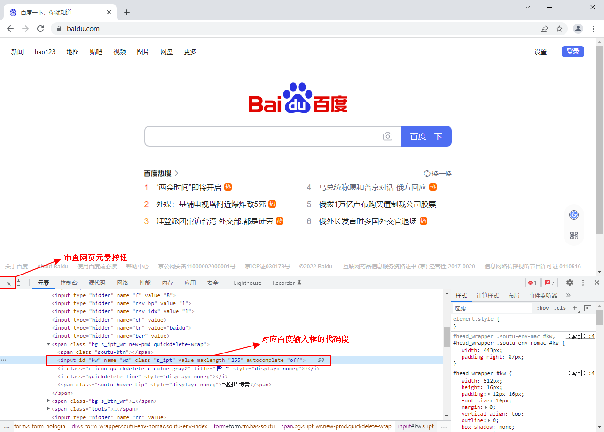
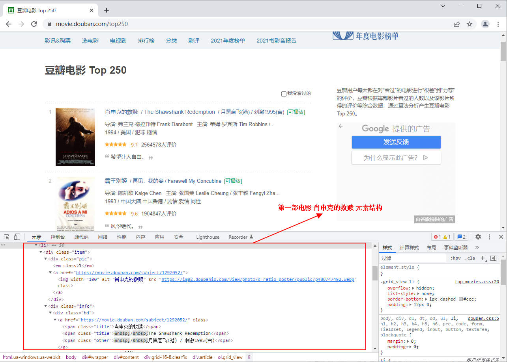
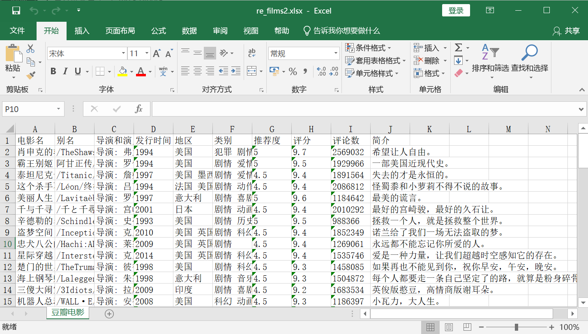

# 爬虫基础知识

## 什么是爬虫

### 什么是爬虫

简单说，爬虫就是获取网页并提取和保存信息的自动化程序，爬虫能够自动请求网页，并将所需要的数据抓取下来。通过对抓取的数据进行处理，从而提取出有价值的信息进行存储使用。

### 为什么用Python做爬虫

首先您应该明确，不止 Python 这一种语言可以做爬虫，诸如 Java、C/C++、PHP 都可以用来写爬虫程序，但是相比较而言 Python 做爬虫是最简单的。下面对它们的优劣势做简单对比：

- Java 也经常用来写爬虫程序，但是 Java 语言本身较为复杂，代码量较大，因此它对于初学者而言，入门的门槛较高；
- C/C++ 运行效率虽然很高，但是学习和开发成本高。写一个小型的爬虫程序就可能花费很长的时间；
- PHP：对多线程、异步支持不是很好，并发处理能力较弱。

而 Python 语言，其语法优美、代码简洁、开发效率高、支持多个爬虫模块，比如 urllib、requests、Bs4、lxml 等。Python 的请求模块和解析模块丰富成熟，并且还提供了强大的 Scrapy 框架，让编写爬虫程序变得更为简单。因此使用 Python 编写爬虫程序是个非常不错的选择。

### 编写爬虫注意事项

爬虫是一把双刃剑，它给我们带来便利的同时，也给网络安全带来了隐患。有些不法分子利用爬虫在网络上非法搜集网民信息，或者利用爬虫恶意攻击他人网站，从而导致网站瘫痪的严重后果。关于爬虫的如何合法使用，推荐阅读《中华人民共和国网络安全法》。


因此大家在使用爬虫的时候，要自觉遵守国家法律法规，不要非法获取他人信息，或者做一些危害他人网站的事情。

### 编写爬虫的流程

爬虫程序与其他程序不同，它的的思维逻辑一般都是相似的，所以无需我们在逻辑方面花费大量的时间。下面对 Python 编写爬虫程序的流程做说白了明：

1. 先由 requests 模块的 get() 方法打开 URL 得到网页 HTML 对象。
2. 使用浏览器打开网页源代码分析网页结构以及元素节点。
3. 通过解析库（lxml、BeautifulSoup）或则正则表达式提取数据。
4. 存储数据到本地磁盘或数据库。

当然也不局限于上述一种流程。编写爬虫程序，需要您具备较好的 Python 编程功底，这样在编写的过程中您才会得心应手。爬虫程序需要尽量伪装成人访问网站的样子，而非机器访问，否则就会被网站的反爬策略限制，甚至直接封杀 IP，相关知识会在后续内容介绍。

爬虫程序之所以可以抓取数据，是因为爬虫能够对网页进行分析，并在网页中提取出想要的数据。在学习 Python 爬虫模块前，我们有必要先熟悉网页的基本结构，这是编写爬虫程序的必备知识。

如果您熟悉前端语言，那么您可以轻松地掌握本节知识。

网页一般由三部分组成，分别是 HTML（超文本标记语言）、CSS（层叠样式表）和 JavaScript（简称"JS"动态脚本语言），它们三者在网页中分别承担着不同的任务。

- HTML 负责定义网页的内容
- CSS 负责描述网页的布局
- JavaScript 负责网页的行为

接下来我们来一起简单了解一下网页的基础知识。

## 网页基础知识

### HTML

HTML 是网页的基本结构，它相当于人体的骨骼结构。网页中同时带有"＜"、"＞"符号的都属于 HTML 标签。常见的 HTML 标签如下所示：

- `<!DOCTYPE html>` 声明为 HTML5 文档
- `<html>..</html>` 是网页的根元素
- `<head>..</head>` 元素包含了文档的元（meta）数据，如 `<meta charset="utf-8">` 定义网页编码格式为 utf-8。
- `<title>..<title>` 元素描述了文档的标题
- `<body>..</body>` 表示用户可见的内容
- `<div>..</div>` 表示框架
- `<p>..</p>` 表示段落
- `<ul>..</ul>` 定义无序列表
- `<ol>..</ol>` 定义有序列表
- `<li>..</li>` 表示列表项
- `` 表示图片
- `<h1>..</h1>` 表示标题
- `<a href="">..</a>` 表示超链接

编写如下代码：

```html
<!DOCTYPE html>
<html>
<head>
    <meta charset="utf-8">
    <title>跟渣男教父学编程</title>
</head>
<body>
    <a href="www.youbafu.com">点击访问</a>
    <h1>跟渣男教父学Python</h1>
    <h2>Python爬虫</h2>
    <div>
        <p>认识网页结构</p>
        <ul>
            <li>HTML</li>
            <li>CSS</li>
        </ul>
    </div>
</body>
</html>
```

运行结果如下图所示：

### CSS

CSS 表示层叠样式表，其编写方法有三种，分别是行内样式、内嵌样式和外联样式。CSS 代码演示如下：

```html
<!DOCTYPE html>
<html>
<head>
    <!-- 内嵌样式 -->
    <style type="text/css">
        body {
            background-color: yellow;
        }
        p {
            font-size: 30px;
            color: springgreen;
        }
    </style>
    <meta charset="utf-8">
    <title>跟渣男教父学编程</title>
</head>
<body>
    <!-- h1标签使用了行内样式 -->
    <h1 style="color: blue;">跟渣男教父学Python</h1>
    <a href="www.youbafu.com">点击访问</a>
    <h2>Python爬虫</h2>
    <div>
        <p>认识网页结构</p>
        <ul>
            <li>HTML</li>
            <li>CSS</li>
        </ul>
    </div>
</body>
</html>
```



如上图所示内嵌样式通过 `<style>` 标签书写样式表：

而行内样式则通过 HTML 元素的 style 属性来书写 CSS 代码。注意，每一个 HTML 元素，都有 style，class，id，name，title 属性。

外联样式表指的是将 CSS 代码单独保存为以 .css 结尾的文件，并使用引入到所需页面：

```html
<head>
    <link rel="stylesheet" type="text/css" href="mystyle.css">
</head>
```

当样式需要被应用到多个页面的时候，使用外联样式表是最佳的选择。

### JavaScript

JavaScript 负责描述网页的行为，比如，交互的内容和各种特效都可以使用 JavaScript 来实现。当然可以通过其他方式实现，比如 jQuery、还有一些前端框架( vue、React 等)，不过它们都是在"JS"的基础上实现的。

简单示例：

```html
<!DOCTYPE html>
<html>
<head>
    <style type="text/css">
        body {
            background-color: rgb(220, 226, 226);
        }
    </style>
    <meta charset="utf-8">
    <title>跟渣男教父学编程</title>
</head>
<body>
    <h1 style="color: blue;">跟渣男教父学Python</h1>
    <h2>Python爬虫</h2>
    <p>点击下方按钮获取当前时间</p>
    <button onclick="DisplayDate()">点击这里</button>
    <p id="time" style="color: red;"></p>
    <!-- script标签内部编写js代码 -->
    <script>
        function DisplayDate() {
            document.getElementById("time").innerHTML = Date()
        }
    </script>
</body>
</html>
```



运行结果如下:



如果用人体来比喻网站结构的话，那么 HTML 是人体的骨架，它定义了人的嘴巴、眼睛、耳朵长在什么位置；CSS 描述了人体的外观细节，比如嘴巴长什么样子，眼睛是双眼皮还是单眼，皮肤是黑色的还是白色的等；而 JavaScript 则表示人拥有的技能，比如唱歌、打球、游泳等。

### 网页形态

#### 静态网页

静态网页是标准的 HTML 文件，通过 GET 请求方法可以直接获取，文件的扩展名是.html 、.htm 等，网面中可以包含文本、图像、声音、FLASH 动画、客户端脚本和其他插件程序等。静态网页是网站建设的基础，早期的网站一般都是由静态网页制作的。静态并非静止不动，它也包含一些动画效果，这一点不要误解。

我们知道，当网站信息量较大的时，网页的生成速度会降低，由于静态网页的内容相对固定，且不需要连接后台数据库，因此响应速度非常快。但静态网页更新比较麻烦，每次更新都需要重新加载整个网页。

静态网页的数据全部包含在 HTML 中，因此爬虫程序可以直接在 HTML 中提取数据。通过分析静态网页的 URL，并找到 URL 查询参数的变化规律，就可以实现页面抓取。与动态网页相比，并且静态网页对搜索引擎更加友好，有利于搜索引擎收录。

#### 动态网页

动态网页指的是采用了动态网页技术的页面，比如 AJAX（是指一种创建交互式、快速动态网页应用的网页开发技术）、ASP(是一种创建动态交互式网页并建立强大的 web 应用程序)、JSP(是 Java 语言创建动态网页的技术标准) 等技术，它不需要重新加载整个页面内容，就可以实现网页的局部更新。动态页面使用"动态页面技术"与服务器进行少量的数据交换，从而实现了网页的异步加载。

抓取动态网页的过程较为复杂，可以使用前面学习的网页自动化来模拟操作实现数据的爬取。

### 审查网页元素

对于一个优秀的爬虫工程师而言，要善于发现网页元素的规律，并且能从中提炼出有效的信息。因此，在动手编写爬虫程序前，必须要对网页元素进行审查。本节将讲解如何使用"浏览器"审查网页元素。

浏览器都自带检查元素的功能，不同的浏览器对该功能的叫法不同，谷歌(Chrome)浏览器称为"检查"，而 Firefox 则称"查看元素"，尽管如此，但它们的功却是相同的，本教程推荐使用谷歌(Chrome)浏览器。

#### 检查百度首页

下面以检查百度首页为例：首先使用 Chrome 浏览器打开百度，然后在百度首页的空白处点击鼠标右键（或者按快捷键：F12），在出现的会话框中点击"检查"，并进行如图所示操作：点击审查元素按钮，然后将鼠标移动至您想检查的位置，比如百度的输入框，然后单击，此时就会将该位置的代码段显示出来，如下图所示：

```html
<input id="kw" name="wd" class="s_ipt" value="" maxlength="255" autocomplete="off">
```



最后在该代码段处点击右键，在出现的会话框中选择"复制"选项卡，并在二级会话框内选择"复制元素"。

依照上述方法，您可以检查页面内的所有元素。

#### 检查网页结构

对于爬虫而言，检查网页结构是最为关键的一步，需要对网页进行分析，并找出信息元素的相似性。

下面以豆瓣电影 Top250 https://movie.douban.com/top250 为例，检查每部影片的 HTML 元素结构。如下图所示：



第一部影片的html代码段如下所示：

```html
<li>
    <div class="item">
        <div class="pic">
            <em class="">1</em>
            <a href="https://movie.douban.com/subject/1292052/">
                
            </a>
        </div>
        <div class="info">
            <div class="hd">
                <a href="https://movie.douban.com/subject/1292052/" class="">
                    <span class="title">肖申克的救赎</span>
                    <span class="title">&nbsp;/&nbsp;The Shawshank Redemption</span>
                    <span class="other">&nbsp;/&nbsp;月黑高飞(港)  /  刺激1995(台)</span>
                </a>
                <span class="playable">[可播放]</span>
            </div>
            <div class="bd">
                <p class="">
                    导演: 弗兰克·德拉邦特 Frank Darabont&nbsp;&nbsp;&nbsp;主演: 蒂姆·罗宾斯 Tim Robbins /...<br>
                    1994&nbsp;/&nbsp;美国&nbsp;/&nbsp;犯罪剧情
                </p>
                <div class="star">
                    <span class="rating5-t"></span>
                    <span class="rating_num" property="v:average">9.7</span>
                    <span property="v:best" content="10.0"></span>
                    <span>2564578人评价</span>
                </div>
                <p class="quote">
                    <span class="inq">希望让人自由。</span>
                </p>
            </div>
        </div>
    </div>
</li>
```

接下来检查第二部影片的html代码，如下所示：

```html
<li>
    <div class="item">
        <div class="pic">
            <em class="">2</em>
            <a href="https://movie.douban.com/subject/1291546/">
                
            </a>
        </div>
        <div class="info">
            <div class="hd">
                <a href="https://movie.douban.com/subject/1291546/" class="">
                    <span class="title">霸王别姬</span>
                    <span class="other">&nbsp;/&nbsp;再见，我的妾  /  Farewell My Concubine</span>
                </a>
                <span class="playable">[可播放]</span>
            </div>
            <div class="bd">
                <p class="">
                    导演: 陈凯歌 Kaige Chen&nbsp;&nbsp;&nbsp;主演: 张国荣 Leslie Cheung / 张丰毅 Fengyi Zha...<br>
                    1993&nbsp;/&nbsp;中国大陆中国香港&nbsp;/&nbsp;剧情爱情同性
                </p>
                <div class="star">
                    <span class="rating5-t"></span>
                    <span class="rating_num" property="v:average">9.6</span>
                    <span property="v:best" content="10.0"></span>
                    <span>1904847人评价</span>
                </div>
                <p class="quote">
                    <span class="inq">风华绝代。</span>
                </p>
            </div>
        </div>
    </div>
</li>
```

经过对比发现，除了每部影片的信息不同之外，它们的 HTML 结构是相同的，比如每部影片都使用 `<div class="item"></div>` 标签包裹起来。这里我们只检查了两部影片，如果在实际编写时，可以多检查几部，从而确定它们的 HTML 结构是相同的。

**提示：通过检查网页结构，然后发现规律，这是编写爬虫程序最为重要的一步。**

## 豆瓣电影实战

以豆瓣电影Top250为例，我们使用上一篇学过的正则表达式，结合分析网页元素来爬取电影的简单信息并存储到Excel中，或者存储为json文件。

再来一起看看每部影片的html代码元素结构：

```html
<li>
    <div class="item">
        <div class="pic">
            <em class="">1</em>
            <a href="https://movie.douban.com/subject/1292052/">
                
            </a>
        </div>
        <div class="info">
            <div class="hd">
                <a href="https://movie.douban.com/subject/1292052/" class="">
                    <span class="title">肖申克的救赎</span>
                    <span class="title">&nbsp;/&nbsp;The Shawshank Redemption</span>
                    <span class="other">&nbsp;/&nbsp;月黑高飞(港)  /  刺激1995(台)</span>
                </a>
                <span class="playable">[可播放]</span>
            </div>
            <div class="bd">
                <p class="">
                    导演: 弗兰克·德拉邦特 Frank Darabont&nbsp;&nbsp;&nbsp;主演: 蒂姆·罗宾斯 Tim Robbins /...<br>
                    1994&nbsp;/&nbsp;美国&nbsp;/&nbsp;犯罪剧情
                </p>
                <div class="star">
                    <span class="rating5-t"></span>
                    <span class="rating_num" property="v:average">9.7</span>
                    <span property="v:best" content="10.0"></span>
                    <span>2564578人评价</span>
                </div>
                <p class="quote">
                    <span class="inq">希望让人自由。</span>
                </p>
            </div>
        </div>
    </div>
</li>
```

这里假设我们要爬取影片的：电影名、电影别名、导演和演员信息、发行时间、地区、类别、推荐度、评分、评论数、简介信息，我们可以编写对应的正则表达式，将每部影片的需要信息匹配出来，正则表达式如下所示：

```python
# 正则表达式匹配规则
pattern = re.compile('<li>.*?"title">(.*?)<' +
                     '.*?"title">(.*?)<.*?"other">(.*?)<' +
                     '.*?"bd".*?p class="">(.*?)</p>' +  # 注意class后面有=""
                     '.*?"star".*?rating(.*?)-t' +
                     '.*?"v:average">(.*?)<' +
                     '.*?<span>(\d+)人' +
                     '.*?inq">(.*?)<.*?</li>', re.S)
```

代码中用到请求模块 requests 和 pandas 库，需要先安装，在终端（Terminal）里输入：

```bash
pip install requests
pip install pandas
```

requests的简单请求使用比较简单，下节课会详细讲解模块的相关使用。

完整代码：

```python
import json
import os.path
import pandas as pandas
import requests
import re
import csv

# 设置请求头： 模拟浏览器
headers = {
    'Host': 'movie.douban.com',
    'Origin': 'movie.douban.com',
    'User-Agent': 'Mozilla/5.0 (Linux; Android 6.0; Nexus 5 Build/MRA58N) AppleWebKit/537.36 (KHTML, like Gecko) Chrome/73.0.3683.103 Mobile Safari/537.36',
}

# 正则表达式匹配规则
pattern = re.compile('<li>.*?"title">(.*?)<' +
                     '.*?"title">(.*?)<.*?"other">(.*?)<' +
                     '.*?"bd".*?p class="">(.*?)</p>' +  # 注意class后面有=""
                     '.*?"star".*?rating(.*?)-t' +
                     '.*?"v:average">(.*?)<' +
                     '.*?<span>(\d+)人' +
                     '.*?inq">(.*?)<.*?</li>', re.S)

def get_films(pages=5):
    films = []
    for i in range(pages):
        url = 'https://movie.douban.com/top250?start={}&filter='.format(i * 25)
        text = requests.get(url, headers=headers).text
        for item in re.findall(pattern, text):
            print(item)
            m_info = item[3].replace('&nbsp;', '').strip().split('<br>\n')
            film = {
                '电影名': item[0],
                '别名': item[1].replace('&nbsp;', '').replace(' ', '').strip() + item[2].replace('&nbsp;', '').replace(' ', '').strip(),
                '导演和演员': m_info[0],
                '发行时间': m_info[1].split('/')[0].strip(),
                '地区': m_info[1].split('/')[1].strip(),
                '类别': m_info[1].split('/')[2].strip(),
                '推荐度': '.'.join(list(item[4])),
                '评分': item[5],
                '评论数': item[6],
                '简介': item[7]
            }
            films.append(film)
    return films

def write_cvs(data):
    with open(r'data/re_films.csv', 'w', encoding='utf-8') as f:
        w = csv.DictWriter(f, fieldnames=data[0].keys())
        w.writeheader()
        w.writerows(data)

def write_excel(data):
    pdfile = pandas.DataFrame(data)
    pdfile.to_excel(r'data/re_films.xlsx', sheet_name="豆瓣电影")

def write_json(data):
    s = json.dumps(data, indent=4, ensure_ascii=False)
    with open(r'data/re_films.json', 'w', encoding='utf-8') as f:
        f.write(s)

def start():
    data = list(get_films(1))
    if not os.path.exists('data'):
        os.mkdir('data')
    write_json(data)
    # write_excel(data)
    # write_cvs(data)

if __name__ == '__main__':
    start()
```

## 文档总结

本文档正式进入了爬虫的内容，学习巩固了爬虫的一些基础知识，同时还学习了静态网页的相关基础知识，毕竟爬虫的本质是对网页元素进行分析处理，只有对相关的基础知识牢固掌握了，写起爬虫来才会更加轻松自如，最后结合正则表达式对豆瓣电影Top250进行了实战爬取。

## 练习题

**编程题**

根据豆瓣电影实战的源码，利用openpyxl库编写write_excel2()函数，并将爬取到的前3页数据利用该函数保存到 data/re_films2.xlsx 中，保存格式如下图：

