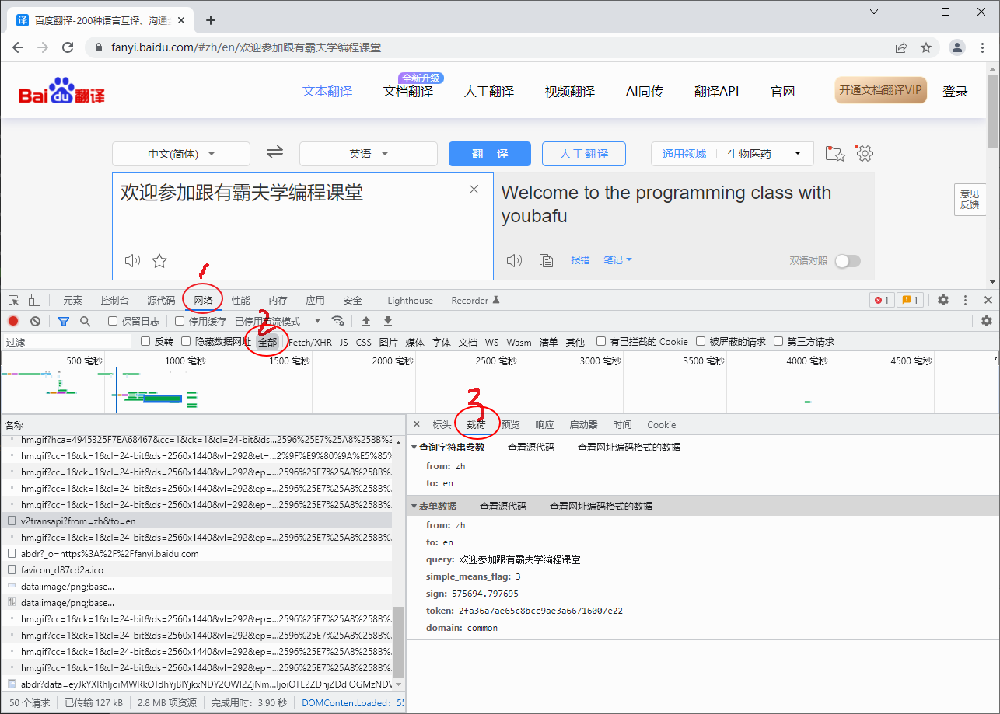
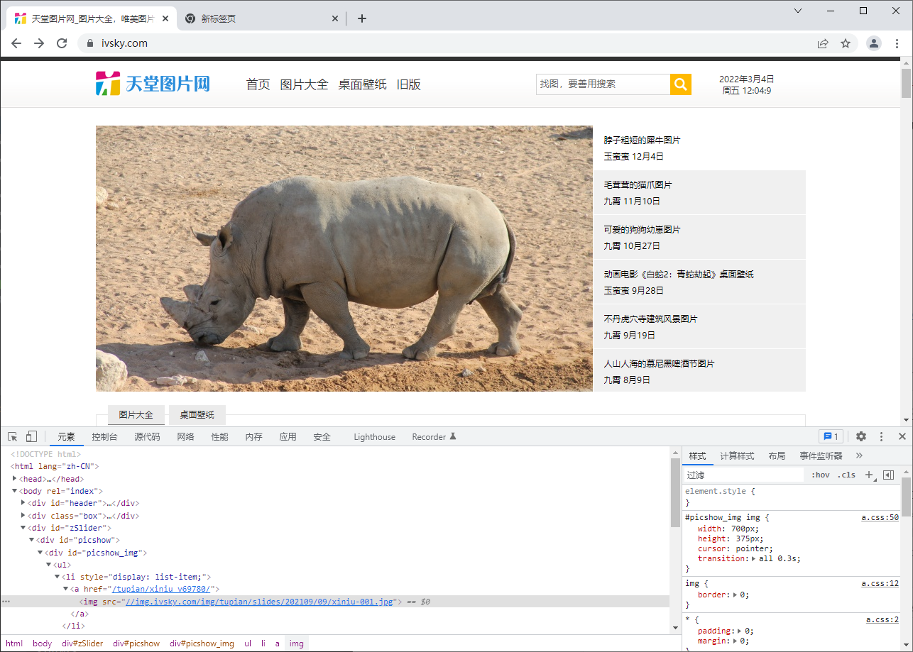
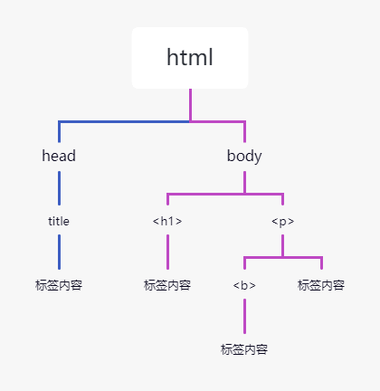

# 网络请求 Requests 库

前面两节课我们学习了正则表达式和爬虫的相关基础知识，虽然有接触实战的案例，但是都是基础使用，今天我们来学习一下Python爬虫世界里的一些实用又便捷的第三方模块，今天的主要学习内容是网络请求requests库和网页解析BeautifulSoup库。

## Requests 基本使用库

Python 提供了多个用来编写爬虫程序的库，有一个重要网络请求库就是 Requests 库，这个库的宗旨是"让 HTTP 服务于人类"。

Requests 是 Python 的第三方库，它的安装非常简便，如下所示：

```bash
pip install requests
```

Requests 库是在 urllib 的基础上开发而来，它使用 Python 语言编写，并且采用了 Apache2 Licensed（一种开源协议）的 HTTP 库。与 urllib 相比，Requests 更加方便、快捷，因此在编写爬虫程序时 Requests 库使用较多，接下来我们一起来学习requests库。

### 常用请求方法

#### requests.get()

该方法用于 GET 请求，表示向网站发起请求，获取页面响应对象。语法如下：

```python
res = requests.get(url, headers=headers, params, timeout)
```

参数说明如下：

- url：要抓取的 url 地址。
- headers：用于包装请求头信息。
- params：请求时携带的查询字符串参数。
- timeout：超时时间，超过时间会抛出异常。


具体使用示比如下：

```python
import requests
url = 'http://baidu.com'
response = requests.get(url)
print(response)
# print(response.text)  可以查看请求具体的返回数据信息
```

输出结果：

```
<Response [200]>
```

200 是请求返回状态码，表示请求成功。

如果我们想要请求时带上请求参数，使用也非常的简单，这里使用到了 http://httpbin.org，当我们请求http://httpbin.org/get 时会返回具体的请求信息，示比如下所示：

```python
import requests
data = {'name': '渣男教父', 'url': "www.ybf.com"}
response = requests.get('http://httpbin.org/get', params=data)  # 直接拼接参数也可以
# response = requests.get('http://httpbin.org/get?name=ybf&age=33')
# 调用响应对象text属性，获取文本信息
print(response.text)
```

输出结果：

```json
{
  "args": {
    "name": "\u6709\u9738\u592b",
    "url": "www.ybf.com"
  },
  "headers": {
    "Accept": "*/*",
    "Accept-Encoding": "gzip, deflate",
    "Host": "httpbin.org",
    "User-Agent": "python-requests/2.25.1",
    "X-Amzn-Trace-Id": "Root=1-62216f84-2054fe065f625d4928c77cfa"
  },
  "origin": "175.0.53.160",
  "url": "http://httpbin.org/get?name=\u6709\u9738\u592b&url=www.ybf.com"
}
```

#### requests.post()

该方法用于 POST 请求，先由用户向目标 url 提交数据，然后服务器返回一个 HttpResponse 响应对象，语法如下：

```python
response = requests.post(url, data={请求体的字典})
```

示比如下所示：

```python
import requests
url = 'https://fanyi.baidu.com'  # 百度翻译
# post请求体携带的参数，可通过开发者调试工具查看
# 查看步骤：NetWork选项->Headers选项->Form Data
data = {'from': 'zh', 'to': 'en', 'query': '欢迎参加跟渣男教父学编程课堂'}
response = requests.post(url, data=data)
print(response)
# print(response.text)  可以查看请求具体的返回数据信息
```

输出结果：

```
<Response [200]>
```

chrome中查看 Form Data 的步骤非常的简单，如下图所示：



### 响应对象属性

当我们使用 Requests 模块向一个 URL 发起请求后会返回一个 HttpResponse 响应对象，该对象具有以下常用属性：

| 常用属性 | 说明 |
|----------|------|
| encoding | 查看或者指定响应字符编码 |
| status_code | 返回HTTP响应码 |
| url | 查看请求的 url 地址 |
| headers | 查看请求头信息 |
| cookies | 查看cookies 信息 |
| text | 以字符串形式输出 |
| content | 以字节流形式输出，若要保存下载图片需使用该属性。 |

使用示比如下所示：

```python
import requests
response = requests.get('http://www.baidu.com')
print(response.encoding)
response.encoding = "utf-8"  # 更改为utf-8编码
print(response.status_code)  # 打印状态码
print(response.url)          # 打印请求url
print(response.headers)      # 打印头信息
print(response.cookies)      # 打印cookie信息
print(response.text)         # 以字符串形式打印网页源码
print(response.content)      # 以字节流形式打印
```

输出结果：

```
# 编码格式
ISO-8859-1
# 响应码
200
# url地址
http://www.baidu.com/
# 请求头信息
{'Cache-Control': 'private, no-cache, no-store, proxy-revalidate, no-transform', 'Connection': 'keep-alive', 'Content-Encoding': 'gzip', 'Content-Type': 'text/html', 'Date': 'Fri, 04 Mar 2022 02:04:36 GMT', 'Last-Modified': 'Mon, 23 Jan 2017 13:27:57 GMT', 'Pragma': 'no-cache', 'Server': 'bfe/1.0.8.18', 'Set-Cookie': 'BDORZ=27315; max-age=86400; domain=.baidu.com; path=/', 'Transfer-Encoding': 'chunked'}
# 查看cookies信息
<RequestsCookieJar[<Cookie BDORZ=27315 for .baidu.com/>]>
...内容过长，此处省略后两项输出
```

在使用 requests请求网页时，我们可以很方便的拿到响应对象的各种信息，实际使用中可以很灵活的进行操作。

### 实用请求参数

#### SSL认证-verify参数

SSL 证书是数字证书的一种，类似于驾驶证、护照和营业执照。因为配置在服务器上，也称为 SSL 服务器证书。SSL 证书遵守 SSL 协议，由受信任的数字证书颁发机构 CA（电子认证服务）颁发。 SSL 具有服务器身份验证和数据传输加密功能。

verify 参数的作用是检查 SSL 证书认证，参数的默认值为 True，如果设置为 False 则表示不检查 SSL证书，此参数适用于没有经过 CA 机构认证的 HTTPS 类型的网站。其使用格式如下：

```python
response = requests.get(url=url, params=params, headers=headers, verify=False)
```

#### 代理IP-proxies参数

一些网站为了限制爬虫从而设置了很多反爬策略，其中一项就是针对 IP 地址设置的。比如，访问网站超过规定次数导致流量异常，或者某个时间段内频繁地更换浏览器访问，存在上述行为的 IP 极有可能被网站封杀掉。

代理 IP 就是解决上述问题的，它突破了 IP 地址的访问限制，隐藏了本地网络的真实 IP，而使用第三方 IP 代替自己去访问网站。

**1. 代理IP池**

通过构建代理 IP 池可以让你编写的爬虫程序更加稳定，从 IP 池中随机选择一个 IP 去访问网站，而不使用固定的真实 IP。总之将爬虫程序伪装的越像人，它就越不容易被网站封杀。当然代理 IP 也不是完全不能被察觉，通过端口探测技等术识仍然可以辨别。其实爬虫与反爬虫永远相互斗争的，就看谁的技术更加厉害。

**2. proxies参数**

Requests 提供了一个代理 IP 参数proxies ，该参数的语法结构如下：

```python
proxies = {
    '协议类型(http/https)': '协议类型://IP地址:端口号'
}
```

下面构建了两个协议版本的代理 IP，示比如下：

```python
proxies = {
    'http': 'http://IP:端口号',
    'https': 'https://IP:端口号'
}
```

**3. 代理IP使用**

下面通过简单演示如何使用proxies 参数，示比如下：

```python
import requests
url = 'http://httpbin.org/get'
headers = {'User-Agent': 'Mozilla/5.0'}
proxies = {'http': 'http://1.194.238.242:3828'}  # 网上找的免费代理ip
html = requests.get(url, proxies=proxies, headers=headers, timeout=10).text
print(html)
```

输出结果：

```json
{
  "args": {},
  "headers": {
    "Accept": "*/*",
    "Accept-Encoding": "gzip, deflate",
    "Cache-Control": "max-age=259200",
    "Host": "httpbin.org",
    "User-Agent": "Mozilla/5.0",
    "X-Amzn-Trace-Id": "Root=1-622b1032-3ef292bc349cd9ca3d57e39f"
  },
  "origin": "1.194.238.242",
  "url": "http://httpbin.org/get"
}
```

由于上述示例使用的是免费代理 IP，因此其质量、稳定性较差，可能会随时失效。如果想构建一个稳定的代理 IP 池，就需要花费成本。

**4. 付费代理IP**

网上有许多提供代理 IP 服务的网站，比如快代理、携趣代理等。这些网站也提供了相关文档说明，以及 API 接口，爬虫程序通过访问 API 接口，就可以构建自己的代理 IP 池。

付费代理 IP 按照资源类型可划分为：开发代理、私密代理、隧道代理、独享代理，其中最常使用的是开放代理与私密代理。

- **开放代理**：开放代理是从公网收集的代理服务器，具有 IP 数量大，使用成本低的特点，全年超过 80% 的时间都能有 3000 个以上的代理 IP 可供提取使用。
- **私密代理**：私密代理是基于云主机构建的高品质代理服务器，为您提供高速、可信赖的网络代理服务。私密代理每天可用 IP 数量超过 20 万个，可用率在 95 %以上，1 次可提取 IP 数量超过 700 个，可以为爬虫业务提供强大的助力。

付费代理的收费标准根据 IP 使用的时间长短，以及 IP 的质量高低，从几元到几百元不等，网上有很多提供免费代理 IP 的网站，不过想找到一个质量较高的免费代理好比大海捞针。

#### 用户认证-auth参数

Requests 提供了一个auth 参数，该参数的支持用户认证功能，也就是适合那些需要验证用户名、密码的网站。auth 的参数形式是一个元组，其格式如下：

```python
auth = ('username', 'password')
```

其使用示比如下所示：

```python
import requests  # 导入requests模块
# 定义请求地址
url = 'http://sck.rjkflm.com:666/spider/auth/'
ah = ('admin', 'admin')
response = requests.get(url=url, auth=ah)
if response.status_code == 200:
    print(response.text)
```

### Requests 库实战应用

接下来我们学习使用 Requests 库下载图片。

首先打开天堂图片网（https://www.ivsky.com/），然后使用 Chrome 开发者工具随意查看一张图片的源地址，如下图所示：



图片地址为：

```html

```

可以将上述 url 粘贴至浏览器地址栏进行验证。当我们确定图片地址后，就可以使用 requests 库进行编码了：

```python
import requests
url = 'https://img.ivsky.com/img/tupian/slides/202109/09/xiniu-001.jpg'
headers = {'User-Agent': 'Mozilla/4.0'}
html = requests.get(url=url, headers=headers).content  # 读取图片需要使用content属性
with open('D:/requests_img.jpg', 'wb') as f:  # 以二进制的方式下载图片
    f.write(html)
```

最后，在D盘目录下可以找到已经下载好的图片。

## 网页解析 BeautifulSoup 库

BeautifulSoup 简称 BS4（其中 4 表示版本号）是一个 Python 第三方库，它可以从 HTML 或 XML 文档中快速地提取指定的数据。Beautiful Soup 语法简单，使用方便，并且容易理解，可以快速地学习并掌握它。

下面我们讲解 BS4 的基本语法。

由于 BeautifulSoup 是第三方库，因此需要单独下载，下载方式非常简单，执行以下命令即可安装：

```bash
pip install bs4
```

由于 BS4 解析页面时需要依赖文档解析器，所以还需要安装 lxml 作为解析库：

```bash
pip install lxml
```


Python 也自带了一个文档解析库 html.parser，但是其解析速度要稍慢于 lxml。除了上述解析器外，还可以使用 html5lib 解析器，安装方式如下：

```bash
pip install html5lib
```

该解析器生成 HTML 格式的文档，但速度较慢。

### BS4解析对象

创建 BS4 解析对象是万事开头的第一步，这非常地简单，语法格式如下所示：

```python
# 导入解析包
from bs4 import BeautifulSoup
# 创建beautifulsoup解析对象
soup = BeautifulSoup(html_doc, 'html.parser')
```

上述代码中，html_doc 表示要解析的文档，而 html.parser 表示解析文档时所用的解析器，此处的解析器也可以是 'lxml' 或者 'html5lib'，示例代码如下所示：

```python
# -*- coding: UTF-8 -*-
from bs4 import BeautifulSoup
html_doc = """<html><head><title>"跟渣男教父学编程"</title></head><body><p class="title"><b>www.youbafu.com</b></p><p class="website">跟渣男教父学编程<a href="http://youbafu.com/python/" id="link1">python教程</a><a href="http://youbafu.com/c/" id="link2">c语言教程</a>"""
soup = BeautifulSoup(html_doc, 'html.parser')
# prettify()用于格式化输出html/xml文档
print(soup.prettify())
```

输出结果：

```html
<html>
 <head>
  <title>
   "跟渣男教父学编程"
  </title>
 </head>
 <body>
  <p class="title">
   <b>
    www.youbafu.com
   </b>
  </p>
  <p class="website">
   跟渣男教父学编程
   <a href="http://youbafu.com/python/" id="link1">
    python教程
   </a>
   <a href="http://youbafu.com/c/" id="link2">
    c语言教程
   </a>
  </p>
 </body>
</html>
```

如果是外部文档，您也可以通过 open() 的方式打开读取，语法格式如下：

```python
soup = BeautifulSoup(open('html_doc.html', encoding='utf8'), 'lxml')
```

### BS4常用语法

接下来一起学习一下爬虫中经常用到的 BS4 解析方法。

Beautiful Soup 将 HTML 文档转换成一个树形结构，该结构有利于快速地遍历和搜索 HTML 文档。下面使用树状结构来描述一段 HTML 文档：

```html
<html>
    <head><title>跟渣男教父学编程</title></head>
    <body>
        <h1>www.youbafu.com</h1>
        <p><b>一个学习编程的网站</b></p>
    </body>
</html>
```



文档树中的每个节点都是 Python 对象，这些对象大致分为四类：Tag , NavigableString , BeautifulSoup , Comment 。其中使用最多的是 Tag 和 NavigableString。

- **Tag**：标签类，HTML 文档中所有的标签都可以看做 Tag 对象。
- **NavigableString**：字符串类，指的是标签中的文本内容，使用 text、string、strings 来获取文本内容。
- **BeautifulSoup**：表示一个 HTML 文档的全部内容，您可以把它当作一个人特殊的 Tag 对象。
- **Comment**：表示 HTML 文档中的注释内容以及特殊字符串，它是一个特殊的 NavigableString。

#### Tag节点

标签（Tag）是组成 HTML 文档的基本元素。在 BS4 中，通过标签名和标签属性可以提取出想要的内容。看一组简单的示例：

```python
from bs4 import BeautifulSoup
soup = BeautifulSoup('<p class="Web site url"><b>www.youbafu.com</b></p>', 'html.parser')
# 获取整个p标签的html代码
print(soup.p)  # 获取p标签
print(soup.p.b)  # 获取b标签
print(soup.p.text)  # 获取p标签内容，使用NavigableString类中的string、text、get_text()
print(soup.p.attrs)  # 返回一个字典，里面是多有属性和值
print(type(soup.p))  # 查看返回的数据类型
print(soup.p['class'])  # 根据属性，获取标签的属性值，返回值为列表
soup.p['class'] = ['Web', 'Site']  # 给class属性赋值,此时属性值由列表转换为字符串
print(soup.p)
```

输出结果如下：

```
soup.p输出结果:
<p class="Web site url"><b>www.youbafu.com</b></p>

soup.p.b输出结果：
<b>www.youbafu.com</b>

soup.p.text输出结果：
www.youbafu.com

soup.p.attrs输出结果：
{'class': ['Web', 'site', 'url']}

type(soup.p)输出结果：
<class 'bs4.element.Tag'>

soup.p['class']输出结果：
['Web', 'site', 'url']

class属性重新赋值：
<p class="Web site url"><b>www.youbafu.com</b></p>
```

#### 遍历节点

Tag 对象提供了许多遍历 tag 节点的属性，比如 contents、children 用来遍历子节点；parent 与 parents 用来遍历父节点；而 next_sibling 与 previous_sibling 则用来遍历兄弟节点 。示比如下：

```python
html_doc = """<html><head><title>"跟渣男教父学编程"</title></head><body><p class="title"><b>www.youbafu.com</b></p><p class="website">一个学习编程的网站</p><a href="http://www.youbafu.com/python/" id="link1">python教程</a>
<a href="http://www.youbafu.com/c/" id="link2">c语言教程</a>
</body></html>"""
soup = BeautifulSoup(html_doc, 'html.parser')
body_tag = soup.body
print(body_tag)
print(body_tag.contents)  # 以列表的形式输出，所有子节点
```

输出结果：

```
<body><p class="title"><b>www.youbafu.com</b></p><p class="website">一个学习编程的网站
</p><a href="http://www.youbafu.com/python/" id="link1">python教程</a>
<a href="http://www.youbafu.com/c/" id="link2">c语言教程</a>
</body>

# 以列表的形式输出
[<p class="title"><b>www.youbafu.com</b></p>, <p class="website">一个学习编程的网站
</p>, <a href="http://www.youbafu.com/python/" id="link1">python教程</a>, '\n', <a href="http://www.youbafu.com/c/" id="link2">c语言教程</a>, ' ']
```

Tag 的 children 属性会生成一个可迭代对象，可以用来遍历子节点，示比如下：

```python
for child in body_tag.children:
    print(child)
```

输出结果：

```
<p class="title"><b>www.youbafu.com</b></p>
<p class="website">一个学习编程的网站</p>
<a href="http://www.youbafu.com/python/" id="link1">python教程</a>
<a href="http://www.youbafu.com/c/" id="link2">c语言教程</a>
```

#### find_all() 与 find()

find_all() 与 find() 是解析 HTML 文档的常用方法，它们可以在 HTML 文档中按照一定的条件（相当于过滤器）查找所需内容。find() 与 find_all() 的语法格式相似，希望大家在学习的时候，可以举一反三。

BS4 库中定义了许多用于搜索的方法，find() 与 find_all() 是最为关键的两个方法，其余方法的参数和使用与其类似。

**find_all()**

find_all() 方法用来搜索当前 tag 的所有子节点，并判断这些节点是否符合过滤条件，最后以列表形式将符合条件的内容返回，语法格式如下：

```python
find_all(name, attrs, recursive, text, limit)
```

参数说明：

- name：查找所有名字为 name 的 tag 标签，字符串对象会被自动忽略。
- attrs：按照属性名和属性值搜索 tag 标签，注意由于 class 是 Python 的关键字，所以要使用 "class_"。
- recursive：find_all() 会搜索 tag 的所有子孙节点，设置 recursive=False 可以只搜索 tag 的直接子节点。
- text：用来搜文档中的字符串内容，该参数可以接受字符串 、正则表达式 、列表、True。
- limit：由于 find_all() 会返回所有的搜索结果，这样会影响执行效率，通过 limit 参数可以限制返回结果的数量。

find_all() 使用示比如下：

```python
from bs4 import BeautifulSoup
html_doc = """<html><head><title>"跟渣男教父学编程"</title></head><body><p class="title"><b>www.youbafu.com</b></p><p class="website">一个学习编程的网站</p><a href="http://www.youbafu.com/python/" id="link1">python教程</a><a href="http://www.youbafu.com/c/" id="link2">c语言教程</a><a href="http://www.youbafu.com/django/" id="link3">django教程</a><p class="vip">加入我们阅读所有教程</p><a href="http://www.youbafu.com/vip" id="link4">成为vip</a>"""
# 创建soup解析对象
soup = BeautifulSoup(html_doc, 'html.parser')
print(soup.find_all("a"))  # 查找所有a标签并返回
print(soup.find_all("a", limit=2))  # 查找前两条a标签并返回
```

最后以列表的形式返回输出结果，如下所示：

```
[<a href="http://www.youbafu.com/python/" id="link1">python教程</a>, <a href="http://www.youbafu.com/c/" id="link2">c语言教程</a>, <a href="http://www.youbafu.com/django/" id="link3">django教程</a>, <a href="http://www.youbafu.com/vip" id="link4">成为vip</a>]
[<a href="http://www.youbafu.com/python/" id="link1">python教程</a>, <a href="http://www.youbafu.com/c/" id="link2">c语言教程</a>]
```

按照标签属性以及属性值查找 HTML 文档，如下所示：

```python
print(soup.find_all("p", class_="website"))
print(soup.find_all(id="link4"))
```

输出结果：

```
[<p class="website">一个学习编程的网站</p>]
[<a href="http://www.youbafu.com/vip" id="link4">成为vip</a>]
```

正则表达式、列表，以及 True 也可以当做过滤条件，使用示比如下：

```python
import re
# 查找tag标签
print(soup.find_all(['b', 'a']))
# 正则表达式匹配id属性值
print(soup.find_all('a', id=re.compile(r'.\d')))
print(soup.find_all(id=True))  # True可以匹配任何值，下面代码会查找所有tag，并返回相应的tag名称
for tag in soup.find_all(True):
    print(tag.name, end=" ")
# 输出所有以b开始的tag标签
```

BS4 为了简化代码，为 find_all() 提供了一种简化写法，如下所示：

```python
soup.find_all("a")
```

上述两种的方法的输出结果是相同的。

**find()**

find() 方法与 find_all() 方法类似，不同之处在于 find() 只返回第一个匹配的元素，而不是列表。语法格式如下：

```python
find(name, attrs, recursive, text)
```

使用示比如下：

```python
from bs4 import BeautifulSoup
html_doc = """<html><head><title>"跟渣男教父学编程"</title></head><body><p class="title"><b>www.youbafu.com</b></p><p class="website">一个学习编程的网站</p><a href="http://www.youbafu.com/python/" id="link1">python教程</a><a href="http://www.youbafu.com/c/" id="link2">c语言教程</a>"""
soup = BeautifulSoup(html_doc, 'html.parser')
print(soup.find("a"))  # 查找第一个a标签
print(soup.find(id="link2"))  # 查找id为link2的元素
```

输出结果：

```
<a href="http://www.youbafu.com/python/" id="link1">python教程</a>
<a href="http://www.youbafu.com/c/" id="link2">c语言教程</a>
```

## 课程总结

本节课我们学习了两个重要的爬虫库：

1. **Requests库**：用于发送HTTP请求，支持GET、POST等方法，可以处理SSL认证、代理IP、用户认证等功能
2. **BeautifulSoup库**：用于解析HTML文档，提供了简单直观的API来提取网页数据

Requests库让网络请求变得简单优雅，而BS4则让数据提取变得轻松自如。两者结合使用，可以完成大部分的网页数据抓取任务。

## 课后习题

### 选择题（单选）

1、使用Requests库发送GET请求，正确的代码是：
- A、`requests.post(url)`
- B、`requests.get(url)`
- C、`requests.send(url)`
- D、`requests.request(url)`

2、BeautifulSoup创建解析对象时，第二个参数指定的是：
- A、编码格式
- B、解析器类型
- C、文档类型
- D、输出格式

3、要获取响应对象的文本内容，应该使用哪个属性：
- A、`response.content`
- B、`response.text`
- C、`response.data`
- D、`response.html`

### 编程题

4. 使用Requests库和BeautifulSoup库，爬取豆瓣电影top250第一页的电影名称和评分，并打印出来。

提示：
- 使用requests.get()获取网页内容
- 使用BeautifulSoup解析HTML
- 使用find_all()查找电影信息
- 需要设置合适的User-Agent