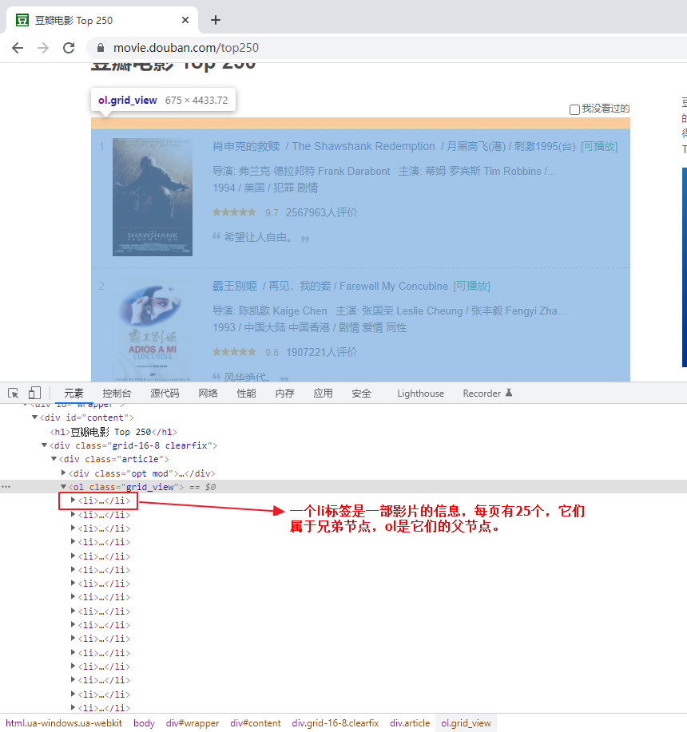
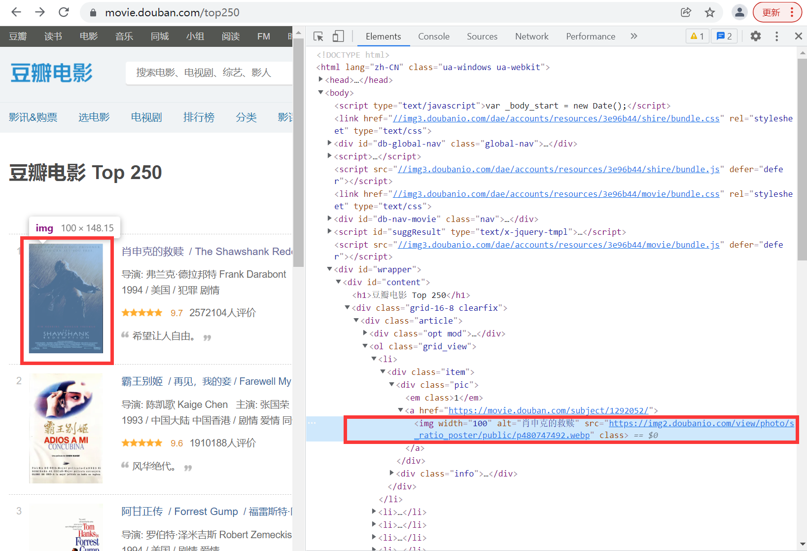

# 网页解析 lxml 库

上节课我们玩转了Python的解析库BS4，今天我们再来学习另一个强大的Python解析库lxml，它们的使用方式有明显的区别，各有优势，今天就一起来学习一下lxml库。

## lxml 基本使用库

lxml 是 Python 的第三方解析库，完全使用 Python 语言编写，它对 XPath表达式提供了良好的支持，因此能够了高效地解析 HTML/XML 文档。本节讲解如何通过 lxml 库解析 HTML 文档。

### lxml库使用流程

lxml 属于Python第三方库，因此在使用前需要使用如下方法安装：

```bash
pip install lxml
```

lxml 库提供了一个 etree 模块，该模块专门用来解析 HTML/XML 文档，下面来介绍一下 lxml 库的使用流程，主要有 3 个步骤：

**1、导入模块**

```python
from lxml import etree
```

**2、创建解析对象**

调用 etree 模块的 HTML() 方法来创建 HTML 解析对象。如下所示：

```python
parse_html = etree.HTML(html)
```

HTML() 方法能够将 HTML 标签字符串解析为 HTML 文件，该方法可以自动修正 HTML 文本。示比如下：

```python
from lxml import etree
html_str = '''
<div>
    <ul>
        <li class="item1"><a href="link1.html">Python</a></li>
        <li class="item2"><a href="link2.html">Java</a></li>
        <li class="site1"><a href="www.youbafu.com">跟渣男教父学编程</a>
        <li class="site2"><a href="www.baidu.com">百度</a></li>
        <li class="site3"><a href="www.jd.com">京东</a></li>
    </ul>
</div>'''
html = etree.HTML(html_str)
result = etree.tostring(html)  # tostring()将标签元素转换为字符串输出，注意：result为字节类型
print(result.decode('utf-8'))
```

输出结果如下：

```html
<html><body><div>
    <ul>
        <li class="item1"><a href="link1.html">Python</a></li>
        <li class="item2"><a href="link2.html">Java</a></li>
        <li class="site1"><a href="www.youbafu.com">&#36319;&#26377;&#38712;&#22827;&#23398;&#32534;&#31243;</a></li>
        <li class="site2"><a href="www.baidu.com">&#30334;&#24230;</a></li>
        <li class="site3"><a href="www.jd.com">&#20140;&#19996;</a></li>
    </ul>
</div></body></html>
```

上述 HTML 字符串存在缺少标签的情况，比如缺少一个闭合标签，当使用了 HTML() 方法后，会将其自动转换为符合规范的 HTML 文档格式。

**3、调用xpath表达式**

最后使用第二步创建的解析对象调用 xpath() 方法，完成数据的提取，如下所示：

```python
r_list = parse_html.xpath('xpath表达式')
```

### lxml库提取数据

下面通过一段 HTML 代码实例演示如何使用 lxml 库提取想要的数据。HTML 代码如下所示：

```html
<div class="wrapper">
    <a href="www.youbafu.com/" id="site">网站类别</a>
    <ul id="sitename">
        <li><a href="http://www.youbafu.com/" title="渣男教父">编程</a></li>
        <li><a href="http://world.sina.com/" title="新浪娱乐">微博</a></li>
        <li><a href="http://www.baidu.com" title="百度">百度贴吧</a></li>
        <li><a href="http://www.taobao.com" title="淘宝">天猫淘宝</a></li>
        <li><a href="http://www.jd.com/" title="京东">京东购物</a></li>
        <li><a href="http://www.360.com" title="360科技">安全卫士</a></li>
        <li><a href="http://www.bytesjump.com/" title="字节">视频娱乐</a></li>
        <li><a href="http://bzhan.com/" title="b站">年轻娱乐</a></li>
        <li><a href="http://hao123.com/" title="浏览器">搜索引擎</a></li>
    </ul>
</div>
```

**提取所有a标签的文本**

```python
from lxml import etree
# 创建解析对象
parse_html = etree.HTML(html)
# 书写xpath表达式,提取文本最终使用text()
xpath_bds = '//a/text()'
# 提取文本数据，以列表形式输出
r_list = parse_html.xpath(xpath_bds)
# 打印数据列表
print(r_list)
```

输出结果：

```
['网站类别', '编程', '微博', '百度贴吧', '天猫淘宝', '京东购物', '安全卫士', '视频娱乐', '年轻娱乐', '搜索引擎']
```

**获取所有href的属性值**

这里接上面的代码，不同的地方就是xpath的表达式不一样。 上代码：

```python
xpath_bds = '//a/@href'  # 书写xpath表达式,提取属性值使用@
r_list = parse_html.xpath(xpath_bds)  # 提取属性值数据，以列表形式输出
print(r_list)  # 打印数据列表
```

输出结果：

```
['www.youbafu.com/', 'http://www.youbafu.com/', 'http://world.sina.com/', 'http://www.baidu.com', 'http://www.taobao.com', 'http://www.jd.com/', 'http://www.360.com', 'http://www.bytesjump.com/', 'http://bzhan.com/', 'http://hao123.com/']
```

**匹配指定内容**

```python
# 书写xpath表达式,提取指定属性的href
xpath_bds = '//ul[@id="sitename"]/li/a[@title="渣男教父"]/@href'
r_list = parse_html.xpath(xpath_bds)  # 提取属性值数据，以列表形式输出
print(r_list)  # 打印数据列表
```

输出结果：

```
['http://www.youbafu.com/']
```

## XPath入门

在编写爬虫程序的过程中提取信息是超级重要的环节，但是有时使用正则表达式无法匹配到想要的信息，或者书写起来非常麻烦，此时就需要用另外一种数据解析方法，也就是本节要学习的 XPath表达式。

XPath（全称：XML Path Language）即 XML 路径语言，它是一门在 XML 文档中查找信息的语言，最初被用来搜寻 XML 文档，同时它也适用于搜索 HTML 文档。因此，在爬虫过程中可以使用 XPath来提取相应的数据。

提示：XML 是一种遵守 W3C 标准的标记语言，类似于 HTML，但两者的设计目的是不同，XML 通常被用来传输和存储数据，而 HTML 常用来显示数据。

您可以将 XPath理解为在XML/HTML 文档中检索、匹配元素节点的工具。

XPath使用路径表达式来选取XML/HTML 文档中的节点或者节点集。XPath的功能十分强大，它除了提供了简洁的路径表达式外，还提供了100 多个内建函数，包括了处理字符串、数值、日期以及时间的函数。因此 XPath路径表达式几乎可以匹配所有的元素节点。

Python 第三方解析库 lxml 对 XPath路径表达式提供了良好的支持，能够解析 XML 与 HTML 文档。

### XPath节点

XPath提供了多种类型的节点，常用的节点有：元素、属性、文本、注释以及文档节点。如下所示：

```xml
<?xml version="1.0" encoding="utf-8"?>
<website>
    <site>
        <title lang="zh-CN">website name</title>
        <name>跟渣男教父学编程</name>
        <year>2022</year>
        <address>www.youbafu.com</address>
    </site>
</website>
```

上面的 XML 文档中的节点例子：

- `<website></website>` （文档节点）
- `<name></name>` （元素节点）
- `lang="zh-CN"` （属性节点）

### 节点关系

XML 文档的节点关系和 HTML 文档相似，同样有父、子、同代、先辈、后代节点。如下所示：

```xml
<?xml version="1.0" encoding="utf-8"?>
<website>
    <site>
        <title lang="zh-CN">website name</title>
        <name>跟渣男教父学编程</name>
        <year>2022</year>
        <address>www.youbafu.com</address>
    </site>
</website>
```

上述示例分析后，会得到如下结果：

- title、name、year、address 都是 site 的子节点
- site 是 title、name、year、address 的父节点
- title、name、year、address 属于同代节点
- title 元素的先辈节点是 site、website
- website 的后代节点是 site、title、name、year、address

### XPath基本语法

#### 1) 基本语法使用

XPath使用路径表达式在文档中选取节点，下表列出了常用的表达式规则：

| 表达式 | 描述 |
|--------|------|
| node_name | 选取此节点的所有子节点。 |
| / | 绝对路径匹配，从根节点选取。 |
| // | 相对路径匹配，从所有节点中查找当前选择的节点，包括子节点和后代节点，其第一个 / 表示根节点。 |
| . | 选取当前节点。 |
| .. | 选取当前节点的父节点。 |
| @ | 选取属性值，通过属性值选取数据。常用元素属性有 @id、@name、@type、@class、@title、@href。 |

下面以下述代码为例讲解 XPath表达式的基本应用，代码如下所示：

```html
<ul class="BookList">
    <li class="book1" id="book_01" href="http://www.youbafu.com/c">
        <p class="name">c语言小白入门到小怪兽</p>
        <p class="model">纸质书</p>
        <p class="price">80元</p>
        <p class="color">红蓝色封装</p>
    </li>
    <li class="book2" id="book_02" href="http://www.youbafu.com/python">
        <p class="name">Python入门到精通</p>
        <p class="model">电子书</p>
        <p class="price">45元</p>
        <p class="color">蓝绿色封装</p>
    </li>
</ul>
```

路径表达式以及相应的匹配内容如下：

```
xpath表达式：//li
匹配内容：
c语言小白入门到小怪兽
纸质书
80元
红蓝色封装
Python入门到精通
电子书
45元
蓝绿色封装
```

```
xpath表达式：//li/p[@class="name"]
匹配内容：
c语言小白入门到小怪兽
Python入门到精通
```

```
xpath表达式：//li/p[@class="model"]
匹配内容：
纸质书
电子书
```

```
xpath表达式：//ul/li/@href
匹配内容：
http://www.youbafu.com/c
http://www.youbafu.com/python
```

```
xpath表达式：//ul/li
匹配内容：
c语言小白入门到小怪兽
纸质书
80元
红蓝色封装
Python入门到精通
电子书
45元
蓝绿色封装
```

```
xpath表达式：//ul/li[@class="book2"]/p[@class="price"]
匹配结果：45元
```

注意：当需要查找某个特定的节点或者选取节点中包含的指定值时需要使用[] 方括号。

#### 2) XPath通配符

XPath表达式的通配符可以用来选取未知的节点元素，基本语法如下：

| 通配符 | 描述说明 |
|--------|----------|
| * | 匹配任意元素节点 |
| @* | 匹配任意属性节点 |
| node() | 匹配任意类型的节点 |

示比如下：

```
xpath表达式：//li/*
匹配内容：
c语言小白入门到小怪兽
纸质书
80元
红蓝色封装
Python入门到精通
电子书
45元
蓝绿色封装
```

#### 3) 多路径匹配

多个 XPath路径表达式可以同时使用，其语法如下：

```
xpath表达式1 | xpath表达式2 | xpath表达式3
```

示例应用：

```
表达式：//ul/li[@class="book2"]/p[@class="price"]|//ul/li/@href
匹配内容：
45元
http://www.youbafu.com/python
http://www.youbafu.com/c
```

### XPath内建函数

XPath提供 100 多个内建函数，这些函数给我们提供了很多便利，比如实现文本匹配、模糊匹配、以及位置匹配等，下面介绍几个常用的内建函数。

| 函数名称 | xpath表达式示例 | 示例说明 |
|----------|-----------------|----------|
| text() | ./text() | 文本匹配，表示只取当前节点中的文本内容。 |
| contains() | //div[contains(@id,'stu')] | 模糊匹配，表示选择 id 中包含"stu"的所有 div 节点。 |
| last() | //*[@class='web'][last()] | 位置匹配，表示选择@class='web'的最后一个节点。 |
| position() | //*[@class='site'][position() <=2] | 位置匹配，表示选择@class='site'的前两个节点。 |
| start-with() | //input[start-with(@id,'st')] | 匹配 id 以 st 开头的元素。 |
| ends-with() | //input[ends-with(@id,'st')] | 匹配 id 以 st 结尾的元素。 |
| concat(str1,str2) | concat('渣男教父',.//*/[@class='stie']/@href) | C语言中文网与标签类别属性为"stie"的 href 地址做拼接。 |

## lxml库实战

接下来我们一起来编写一个简单的爬虫程序，进一步熟悉 lxml 解析库的使用。

前面我们使用正则和BS4爬取了豆瓣电影top250，今天我们来使用lxml解析库爬取豆瓣电影top250，与前面使用的正则解析和BS4解析方式对比，来看一看你到底喜欢哪种方式。

### 确定信息元素结构

首先明确要抓取信息的网页元素结构，比如电影名称、主演演员、上映时间。通过简单分析可以得知，每一部影片的信息都包含在`<li>` 标签中，而每一`<li>` 标签又包含在`<ol>` 标签中，因此对于li 标签而言，ol 标签是一个更大的节点，也就是它的父辈节点，如下图所示：



当一个`<li>` 标签内的影片信息提取完成时，您需要使用同样的 XPath表达式提取下一影片信息，直到所有影片信息提取完成，这种方法显然很繁琐，那么有没有更好的方法呢？

当然有的，来看基准表达式。

### 基准表达式

因为每一个节点对象都使用相同 XPath表达式去匹配信息，所以很容易想到 for 循环。我们将 25 个`<li>` 节点放入一个列表中，然后使用 for 循环的方式去遍历每一个节点对象，这样就大大提高了编码的效率。

通过`<li>` 节点的父节点`<ol>` 可以同时匹配 25 个`<li>` 节点，并将这些节点对象放入列表中。我们把匹配 25个`<li>` 节点的 XPath表达式称为"基准表达式"。如下所示：

```python
xpath_bds = '//ol[@class="grid_view"]/li'
```

下面通过基准表达式匹配节点对象，代码如下：

```python
# 匹配25个li节点对象
xpath_bds = '//ol[@class="grid_view"]/li'
movie_list = parse_html.xpath(xpath_bds)
print(movie_list)
```

输出结果：

```
[<Element li at 0x364621d0>, <Element li at 0x36462180>, <Element li at 0x36462b80>, <Element li at 0x36462270>, <Element li at 0x36462770>, <Element li at 0x36462bd0>, <Element li at 0x36462c20>, <Element li at 0x36462c70>, <Element li at 0x36462cc0>, <Element li at 0x36462d10>, <Element li at 0x36462d60>, <Element li at 0x36462db0>, <Element li at 0x36462e00>, <Element li at 0x36462e50>, <Element li at 0x36462ea0>, <Element li at 0x36462ef0>, <Element li at 0x36462f40>, <Element li at 0x36462f90>, <Element li at 0x3647a040>, <Element li at 0x3647a090>, <Element li at 0x3647a0e0>, <Element li at 0x3647a130>, <Element li at 0x3647a180>, <Element li at 0x3647a1d0>, <Element li at 0x3647a220>]
```

这样虽然很方便的获取每部影片的全部信息，但是我们所要提取的目标细信息都在 `<div class="info">` 中。

我们可以将基准表达式编写的更加详细一点，可以如下：

```python
xpath_bds = '//ol[@class="grid_view"]/li/div/div[@class="info"]'
movie_list = parse_html.xpath(xpath_bds)
# 这样同样可以得到25部影片的信息，而且过滤了一些干扰信息。
```

### 提取数据表达式

因为我们想要抓取的信息都包含在`<li>` 节点中，接下来开始分析 `<div class="info">` 节点包含的 HTML 代码，下面随意选取的一段 `<div class="info">` 节点包含的影片信息，如下所示：

```html
<div class="info">
    <div class="hd">
        <a href="https://movie.douban.com/subject/1292052/" class="">
            <span class="title">肖申克的救赎</span>
            <span class="title">&nbsp;/&nbsp;The Shawshank Redemption</span>
            <span class="other">&nbsp;/&nbsp;月黑高飞(港) / 刺激1995(台)</span>
        </a>
        <span class="playable">[可播放]</span>
    </div>
    <div class="bd">
        <p class="">
            导演: 弗兰克·德拉邦特 Frank Darabont&nbsp;&nbsp;&nbsp;主演: 蒂姆·罗宾斯 Tim Robbins /...<br>
            1994&nbsp;/&nbsp;美国&nbsp;/&nbsp;犯罪剧情
        </p>
        <div class="star">
            <span class="rating5-t"></span>
            <span class="rating_num" property="v:average">9.7</span>
            <span property="v:best" content="10.0"></span>
            <span>2564578人评价</span>
        </div>
        <p class="quote">
            <span class="inq">希望让人自由。</span>
        </p>
    </div>
</div>
```

分析上述代码段，写出待抓取信息的 XPath表达式，如下所示：

```python
movie_list = parse_html.xpath(xpath_bds)
movies = []
# 这里 movie 表示每一个 <div class='info'>里面的元素信息
for movie in movie_list:
    title = movie.xpath('div[@class="hd"]/a/span[@class="title"]/text()')
    other = movie.xpath('div[@class="hd"]/a/span[@class="other"]/text()')
    url = movie.xpath('div[@class="hd"]/a/@href')
    m_info = movie.xpath('div[@class="bd"]/p/text()')
    rate_num = movie.xpath('div[@class="bd"]/div[@class="star"]/span[@class="rating_num"]/text()')
    quote = movie.xpath('div[@class="bd"]/p[@class="quote"]/span/text()')
```

### 完整程序代码

上述内容介绍了编写程序时用到的 XPath表达式，下面正式编写爬虫程序，代码如下所示：

```python
import json
import pandas
import requests
from lxml import html
import csv

class LxmlDoubanTopMovies(object):
    headers = {
        'Host': 'movie.douban.com',
        'Origin': 'movie.douban.com',
        'User-Agent': 'Mozilla/5.0 (Linux; Android 6.0; Nexus 5 Build/MRA58N) AppleWebKit/537.36 (KHTML, like Gecko) Chrome/73.0.3683.103 Mobile Safari/537.36',
    }

    def __init__(self):
        self.baseurl = 'https://movie.douban.com/top250'
        self.movies = []

    def start_requests(self, url):
        r = requests.get(url, headers=self.headers)
        return r.content

    def parse(self, source):
        parse_html = html.document_fromstring(source)
        xpath_bds = '//ol[@class="grid_view"]/li/div/div[@class="info"]'
        movie_list = parse_html.xpath(xpath_bds)

        for movie in movie_list:
            title = movie.xpath('div[@class="hd"]/a/span[@class="title"]/text()')
            other = movie.xpath('div[@class="hd"]/a/span[@class="other"]/text()')
            url = movie.xpath('div[@class="hd"]/a/@href')
            m_info = movie.xpath('div[@class="bd"]/p/text()')
            rate_num = movie.xpath('div[@class="bd"]/div[@class="star"]/span[@class="rating_num"]/text()')
            quote = movie.xpath('div[@class="bd"]/p[@class="quote"]/span/text()')

            movie_dic = {}
            movie_dic["电影名称"] = ''.join(title[0] + other[0]).replace(u'\xa0', ' ')  # 注意xpath表达式匹配结果是一个列表，因此需要索引[0]提取数据
            movie_dic["url"] = url[0]
            movie_dic['导演和演员'] = m_info[0].strip().replace(u'\xa0', ' ').replace(u'\u3000', ' ')
            mi = m_info[1].strip()
            movie_dic['发行时间'] = mi.split('/')[0].strip()
            movie_dic['地区'] = mi.split('/')[1].strip()
            movie_dic['类别'] = mi.split('/')[2].strip()
            movie_dic["评分"] = rate_num[0]
            if len(quote) > 0:
                quote_0 = quote[0]
            else:
                quote_0 = ""
            movie_dic["简介"] = quote_0
            self.movies.append(movie_dic)
            print(movie_dic)

        next_page = parse_html.xpath('//span[@class="next"]/a/@href')
        if next_page:
            next_url = self.baseurl + next_page[0]
            text = self.start_requests(next_url)
            self.parse(text)

    def write_json(self, result):
        s = json.dumps(result, indent=4, ensure_ascii=False)
        with open(r'data/lxml_movies.json', 'w', encoding='utf-8') as f:
            f.write(s)

    def write_cvs(self, data):
        with open(r'data/lxml_movies.csv', 'w', encoding='utf-8') as f:
            w = csv.DictWriter(f, fieldnames=data[0].keys())
            w.writeheader()
            w.writerows(data)

    def write_excel(self, data):
        excel_file = pandas.DataFrame(data)
        excel_file.to_excel(r'data/lxml_movies.xlsx', sheet_name="豆瓣电影lxml")

    def start(self):
        text = self.start_requests(self.baseurl)
        self.parse(text)
        # self.write_json(self.movies)
        # self.write_cvs(self.movies)
        self.write_excel(self.movies)

if __name__ == '__main__':
    db_movies = LxmlDoubanTopMovies()
    db_movies.start()
```

## 文档总结

本节课我们又学习了爬虫的一个新的网页解析库lxml，从网页中快速解析出想要的目标元素，熟练掌握解析库的使用技巧是必须的基础，爬虫的范围非常的广，爬虫的入门门槛很低，但是要修炼到更高的阶段，道路可不平坦，课程所限不能将爬虫的知识展开细讲，有需要可以在相关社区里和大家一起来研讨如何写出自己想要的爬虫。

## 🎓 学霸进阶

趁热打铁，做几道题巩固一下！

**编程题**

基于lxml库，编写requestImages(url)方法，url为网站地址，筛选出豆瓣电影top250（https://movie.douban.com/top250）第一页电影列表中的所有电影封面图片，结合爬虫（二）作业中的 download(img_url)方法，将所有电影封面图片保存到D:\images目录下。

**参考思路**：参考实战案例中的parse()方法，首先定位到电影封面图片列表，遍历每项图片模块，再通过xpath定位图片的链接地址，将链接地址传入download(img_url)中保存图片。



---

手痒了吧？来写代码！

<details>
<summary>点击查看参考代码</summary>

```python
# 参考代码（待补充）

```

**思路解析**：

（解析待补充）

</details>