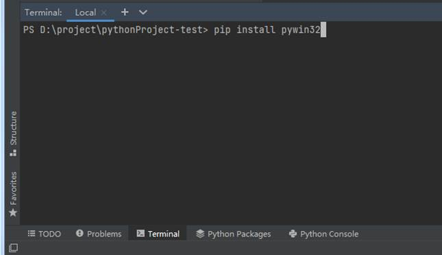
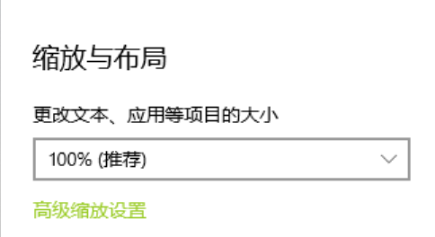
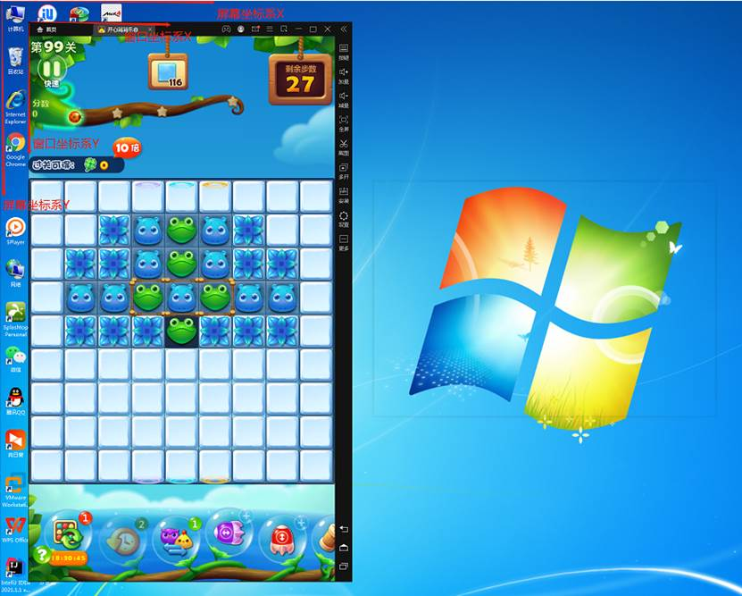

# 游戏自动化（一）

## 前提准备

## 前提准备

### 什么是游戏自动化？

游戏自动化是指通过对游戏的界面结构的解析或界面图像的处理与识别，再模拟人工对软件进行的各种操作，从而实现自动化，达到解放双手，节约时间，提高效率的目标。

在本教程中，我们要先实现自动刷快手这个功能，再实现一个叫《豆腐女孩》的自动游戏脚本。通过图像的处理，通过轮廓识别出图像中的目标，计算出要操作的位置或时间，再通过模拟点击或划动的方式，实现对手机的自动化操作。

### 为什么使用模拟器？

因为通过图像的处理和识别，无论真机还是模拟器，解决方案和实现思路都是一致的，为了方便学员构造环境，本教程使用运行在 Windows 下的模拟器进行演示。

### 模拟器怎么下载安装？

进入雷电模拟器官方网站：https://www.ldmnq.com/ ，点击模拟器下载按钮，下载完成安装后并打开待用。

### 快手极速版怎么下载安装？

https://z4gvregzdz.feishu.cn/file/boxcnm4ZYHsEDRO5eWIKUfoEXxc  下载后把 apk 文件拖入到模拟器窗口中就会自动安装。

### 游戏怎么下载安装？

https://z4gvregzdz.feishu.cn/file/boxcnBPgwu80WEvWHMeMWsMr0Jd 下载后把 apk 文件拖入到模拟器窗口中就会自动安装。

## 窗口与截图

### 什么是pywin32库？

pywin32是一个第三方模块库，主要的作用是方便python开发者快速调用windows API的一个模块库。

同时pywin32也是绝大部分windows上第三方python模块库的前提，比如wmi，如果没有安装pywin32是无法正常使用wmi这个三方模块库的。

### 安装pywin32

由于pywin32是第三方模块库，Python并没有自带，所以我们使用之前必须先按照，安装也很简单，只需要再pycharm下方终端 （Terminal）窗口中输入pip install pywin32 回车就可以自动下载安装了。

看到success这样的字样则是说明安装成功了。



如果你不放心，还可以通过 pip list  可以看到pywin32是否已经安装成功了

### pywin32提供的模块

Pywin32提供的模块有很多，常用的几个如下：

- win32api 提供了常用的用户API函数
- win32gui 提供了有关windows用户界面图形操作的API函数
- win32con 提供了定义windows Api内的宏
- win32clipboard 提供了有关粘贴板的API函数
- win32console 提供了有关控制台的API函数
- win32service 提供了有关服务操作的API函数
- win32file 提供了有关文件操作的API函数


我们平时最常用的的模块有3个， win32api， win32gui，win32con，下面我们就导入 win32api，win32con这两个模块写一个简单的弹出框，顺便验证下我们pywin32是否安装成功了。 上代码：

```python
import win32api
import win32con

win32api.MessageBox(0, "我是渣男教父", "我是标题", win32con.MB_OK | win32con.MB_ICONWARNING)
```

运行下看看：

### 什么是窗口句柄？

这里我们要先说下句柄的概念，通俗点说句柄就是窗口的身份证号，是一串整数。举个栗子，你有你自己的身份证号,一报身份证号，你应该知道是你了。你也有名字，但是大家都知道名字并不是唯一的，你可以叫张三，别人也可以叫张三，而且没有数字来得方便。所以，窗口句柄就相当于身份证号，每个窗口都有一个唯一编号,  操作系统用这个编号来发送消息。这就是操作系统的消息机制。

获取到窗口句柄，我们就可以通过这个句柄对窗口进行操作了。

### 查找窗口句柄

pywin32是如何查找窗口句柄的，这里我们用到了win32gui模块，以及模块的FindWindow方法。直接看代码看看

```python
import win32gui

hwnd = win32gui.FindWindow(None, '雷电模拟器')
print(hwnd)
hwnd2 = win32gui.FindWindow(None, '英雄联盟')
print(hwnd2)
```

运行下看看：

```
5506644
0
```

我们现在详细解析下win32gui.FindWindow(0, wdname)这个函数，这个函数其实就是根据窗口标题获取窗口句柄

```
# 函数功能：该函数获得一个顶层窗口的句柄，该窗口的类名和窗口名与给定的字符串相匹配。这个函数不查找子窗口。在查找时不区分大小写
# 参数1 窗口类名
# 参数2 窗口标题--必须完整；如果该参数为None，则为所有窗口全匹配
# 返回值：如果函数成功，返回值为窗口句柄；如果函数失败，返回值为0
```

因为我电脑上现在打开了雷电模拟器，有这个窗口，所以结果打印了雷电模拟器窗口对应的句柄数字，我没有打开英雄联盟的窗口，所以没有得到相应的句柄，返回值为0。

### 激活窗口

我们大多数情况下操作窗口都是需要窗口在最前方，这样对窗口的操作才会行之有效。所以接下来我们来写一个通用的方法来查找并激活窗口，如果查找到就使之前台显示并返回句柄。我们将文件名保存为获取句柄激活.py 直接上代码：

```python
import win32con
import win32gui
import time

def activate_window(title):
    hwnd = win32gui.FindWindow(None, title)
    if hwnd == 0:
        print('未找到游戏窗口')
        return 0
    if win32gui.GetForegroundWindow() != hwnd:
        win32gui.SetForegroundWindow(hwnd)
        time.sleep(1)
    return hwnd

def activate_emulator():
    return activate_window('雷电模拟器')

if __name__ == '__main__':
    print(activate_emulator())
```

运行下：

（先手动将窗口放置到后台，不要最小化，最小化会有问题。）

这样我们就实现了将后台窗口重新激活放置到前台了。

这里又用到了两个win32gui的新方法。

- win32gui.GetForegroundWindow()这个方法是获取当前前台窗口的句柄；
- win32gui.SetForegroundWindow(hwnd)这个方法则是将hwnd对应的窗口前台显示。

程序的逻辑也很简单，首先判断雷电模拟器的窗口是否存在，如果存在则检查当前前台窗口hwnd与雷电模拟器的窗口hwnd是否一致，如果一致则不需要处理，否则就将雷电模拟器前台显示，最后再返回hwnd信息。

### 截图

平时大家聊qq时经常会用到截图功能，这是一个相当实用的功能。那我们今天也用Python来写一个截图功能。我们先看下桌面截图的代码，这个代码是只截取了部分代码，并不完整，只是用于展示。后面会有完整代码。 上代码：

```python
import win32gui
import win32ui
import win32con
import numpy as np

def capture_screen(hwnd):
    # 根据窗口句柄获取窗口的设备上下文DC（Divice Context）
    desktop = win32gui.GetDesktopWindow()
    dc = win32gui.GetWindowDC(desktop)
    # 根据窗口的DC获取mfcDC
    mfc_dc = win32ui.CreateDCFromHandle(dc)
    # mfcDC创建可兼容的DC
    save_dc = mfc_dc.CreateCompatibleDC()
    # 创建bitmap准备保存图片
    save_bit_map = win32ui.CreateBitmap()
    left, top, right, bottom = win32gui.GetWindowRect(hwnd)
    w, h = right - left, bottom - top
    # 为bitmap开辟空间
    save_bit_map.CreateCompatibleBitmap(mfc_dc, w, h)
    # 高度saveDC，将截图保存到saveBitmap中
    save_dc.SelectObject(save_bit_map)
    # 截取从左上角（0，0）长宽为（w，h）的图片
    save_dc.BitBlt((0, 0), (w, h), mfc_dc, (left, top), win32con.SRCCOPY)
    signed_ints_array = save_bit_map.GetBitmapBits(True)
    im_opencv = np.frombuffer(signed_ints_array, dtype='uint8')
    im_opencv.shape = (h, w, 4)
    save_dc.DeleteDC()
    win32gui.DeleteObject(save_bit_map.GetHandle())
    win32gui.ReleaseDC(hwnd, dc)
    return im_opencv
```

frombuffer(buffer, dtype=float, count=-1, offset=0) 作用：将缓冲区data以流的形式读入转化成ndarray对象

Parameters:
- buffer:目标缓冲区对象
- dtype:默认浮点型
- count = -1表示缓冲区中所有数据
- offset =0,从0开始读取

截图方法最终返回的是一个ndarray对象，也就是一个数字组成的矩阵。

截图方法写好了，这个方法用到的知识点比较繁琐，大家暂时知道怎么用就好了，只需要传入窗口句柄，就可以得到相应的图像了。结合前面说到的获取句柄模块 【  获取句柄激活.py 】  ，我们来截图看看最终结果的ndarray是怎样的，上代码：

```python
import win32gui
import win32ui
import win32con
import numpy as np
import get_handle_activate as window

def capture_screen(hwnd):
    # 根据窗口句柄获取窗口的设备上下文DC（Divice Context）
    desktop = win32gui.GetDesktopWindow()
    dc = win32gui.GetWindowDC(desktop)
    # 根据窗口的DC获取mfcDC
    mfc_dc = win32ui.CreateDCFromHandle(dc)
    # mfcDC创建可兼容的DC
    save_dc = mfc_dc.CreateCompatibleDC()
    # 创建bitmap准备保存图片
    save_bit_map = win32ui.CreateBitmap()
    left, top, right, bottom = win32gui.GetWindowRect(hwnd)
    w, h = right - left, bottom - top
    # 为bitmap开辟空间
    save_bit_map.CreateCompatibleBitmap(mfc_dc, w, h)
    # 高度saveDC，将截图保存到saveBitmap中
    save_dc.SelectObject(save_bit_map)
    # 截取从左上角（0，0）长宽为（w，h）的图片
    save_dc.BitBlt((0, 0), (w, h), mfc_dc, (left, top), win32con.SRCCOPY)
    signed_ints_array = save_bit_map.GetBitmapBits(True)
    im_opencv = np.frombuffer(signed_ints_array, dtype='uint8')
    im_opencv.shape = (h, w, 4)
    save_dc.DeleteDC()
    win32gui.DeleteObject(save_bit_map.GetHandle())
    win32gui.ReleaseDC(hwnd, dc)
    return im_opencv

def get_emulator_image():
    hwnd = window.activate_emulator()
    return capture_screen(hwnd)

if __name__ == '__main__':
    image = get_emulator_image()
    print(image)
```

main函数作为代码入口，我们看看截图的流程，其实就是两步，第一步，找到并激活窗口获得它的hwnd，第二步根据它的hwnd截图，是不是很简单。

我们运行下看看效果：

```
[[[ 65  63  60 255]
  [ 65  63  60 255]
  [ 65  63  60 255]
  ...
  [153 136 123 255]
  [195 170 144 255]
  [195 182 168 255]]
 [[ 65  63  60 255]
  [ 65  63  60 255]
  [ 65  63  60 255]
  ...以下省略
```

这个数据看起来比较复杂，这里我们先暂时不用管它，接下来我们还会讲到opencv的模块，到时候我们再来处理这个数据。

这里需要注意一点，电脑显示设置中的缩放与布局必须是100%，否则截图会不对。

ps：上面面代码中的capture_screen()方法以及activate_window()方法是可以复用的，因为我们后面会大量用到激活雷电模拟器和截取模拟器的图像，所以我们又封装了activate_emulator()跟get_emulator_image()两个函数。这个文件可保存为window_capture.py。

## 鼠标点击

我们玩消消乐就需要点击两个相邻的小方块进行交换，只需要用鼠标分别点击一次就可实现交互了，所以这一节课我们来学习下如何如何利用python在Windows系统下调用win32 api来实现一些系统级的功能，比如控制鼠标点击来实现游戏辅助。

回顾在窗口模块的时候有说过，由于python并没有自带pywin32库文件，需要自己动手安装pywin32这个库，安装方法是在pycharm底下的终端（Terminal）窗口中输入：pip install pywin32 ，然后回车就可自动安装了。



### 模拟点击命令

实现鼠标模拟点击我们需要用到win32api中的两个函数，一个是win32api.SetCursorPos用于设置鼠标当前位置 ，另一个就是win32api.mouse_event 用于发送鼠标指令。

举个最简单的例子我们要点击某个图标，我们是需要把鼠标移动到那个图标上方，然后进行左键点击。点击操作其实也是有两个步骤的，鼠标点下去与鼠标弹起。

我直接代码实操一下：

```python
import win32api
import win32con

desktop_coord = (0, 0)  # 括号中分别是x, y坐标，单位是像素
win32api.SetCursorPos(desktop_coord)  # 设置鼠标位置
win32api.mouse_event(win32con.MOUSEEVENTF_LEFTDOWN, 0, 0, 0, 0)  # 鼠标按下
win32api.mouse_event(win32con.MOUSEEVENTF_LEFTUP, 0, 0, 0, 0)  # 鼠标弹起
```

运行下看看：

可以看到，鼠标跑到屏幕最左上角的位置去了。因为左上角没什么东西，所以点击效果好像看不出来，没关系，后面我们还会继续举更多例子，到时候就能看到更直观的效果了。

接下来我们来看下代码:

前面两行是导入win32api跟win32con模块;

第四行是赋值给desktop_coord这个变量为 （0,0）, 这个括号表示一个坐标，前一个0是横向x坐标，后一个0是纵向坐标y， 坐标的单位是像素，而在windows中桌面坐标的起始点是从桌面左上角开始计算的。所以刚才我们运行的时候鼠标跑到了最左上角去点了一下;

第五行代码则是设置鼠标位置为桌面坐标;

第六行第七行是一个连贯的操作分别发送鼠标左键按下与鼠标左键弹起的指令。

短短几行代码，一套鼠标点击某个位置的流程就实现了，是不是很简单。

### 屏幕坐标和窗口坐标

上面我们点击坐标点（0,0），鼠标是跑到了桌面最左上角去了。这里我们就要普及下坐标系的概念了。

Windows 窗体的坐标系基于设备坐标，设备坐标包括三种，客户区坐标，窗口坐标，屏幕坐标，它的特点是以左上角为原点，x轴向右递增，y轴向下递增，单位是像素。

如下图所示，屏幕坐标包含整个屏幕，屏幕的左上角为（0,0); 窗口坐标包含一个程序的整个窗口，比如雷电模拟器整个窗口，包含标题栏，菜单，滚动条和窗口框，窗口的左上角为（0,0）。

眼尖的同学应该已经率先发现点击窗口坐标中的某个坐标，其实也约等于点击桌面中的某个坐标。所以当我们想点击模拟器窗口中的某个坐标时可以通过坐标转化为点击桌面中的某个坐标。win32gui也确实提供了这个相应的方法，方法名为 ClientToScreen(窗口句柄，窗口坐标)，这个函数会返回对应的桌面坐标。

眼见为实，我们通过代码来验证一下。首先我们来封装一下点击函数

```python
def 点击(桌面坐标):
    win32api.SetCursorPos(桌面坐标)  # 设置鼠标位置
    win32api.mouse_event(win32con.MOUSEEVENTF_LEFTDOWN, 0, 0, 0, 0)  # 鼠标按下
    win32api.mouse_event(win32con.MOUSEEVENTF_LEFTUP, 0, 0, 0, 0)  # 鼠标弹起

def 点击窗口坐标(窗口句柄, 窗口坐标):
    桌面坐标 = win32gui.ClientToScreen(窗口句柄, 窗口坐标)  # 窗口坐标换算成桌面坐标
    点击(桌面坐标)
```

我们点击下模拟器右边菜单图标（326, 15）位置，看看再两个坐标系的坐标是多少，我们改下代码加点打印坐标的语句。 上代码：

```python
import win32api
import win32gui
import win32con

def 点击(桌面坐标):
    win32api.SetCursorPos(桌面坐标)  # 设置鼠标位置
    win32api.mouse_event(win32con.MOUSEEVENTF_LEFTDOWN, 0, 0, 0, 0)  # 鼠标按下
    win32api.mouse_event(win32con.MOUSEEVENTF_LEFTUP, 0, 0, 0, 0)  # 鼠标弹起

def 点击窗口坐标(窗口句柄, 窗口坐标):
    桌面坐标 = win32gui.ClientToScreen(窗口句柄, 窗口坐标)  # 窗口坐标换算成桌面坐标
    print('窗口坐标' + str(窗口坐标))
    print('桌面坐标' + str(桌面坐标))
    点击(桌面坐标)

if __name__ == '__main__':
    句柄 = win32gui.FindWindow(None, '雷电模拟器')
    窗口坐标 = (326, 15)
    点击窗口坐标(句柄, 窗口坐标)
```

我们把模拟器置顶，运行下看看。窗口打印出：

```
窗口坐标(326, 15)
桌面坐标(372, 44)
```

鼠标也成功点击到模拟器顶上的菜单图标，弹出了菜单。



## 实战-自动刷快手

刷快手跟直接点击就不一样了，就需要有个滑动操作了。（模拟器的分辨率设置是720*1280）

### 滑动操作

所谓滑动就是先按下鼠标左键，然后移动到目标位置，再松开鼠标左键。 上代码：

```python
import time
import win32api
import win32gui
import win32con

def 向上划动(窗口句柄, 窗口起点坐标, 划动距离):
    桌面坐标 = win32gui.ClientToScreen(窗口句柄, 窗口起点坐标)  # 窗口坐标换算成桌面坐标
    win32api.SetCursorPos(桌面坐标)  # 设置鼠标位置
    time.sleep(0.1)
    win32api.mouse_event(win32con.MOUSEEVENTF_LEFTDOWN, 0, 0, 0, 0)  # 鼠标按下
    time.sleep(0.1)
    for i in range(1, 划动距离 + 1, 10):
        轨迹坐标 = (窗口起点坐标[0], 窗口起点坐标[1] - i)
        桌面坐标 = win32gui.ClientToScreen(窗口句柄, 轨迹坐标)  # 窗口坐标换算成桌面坐标
        win32api.SetCursorPos(桌面坐标)  # 设置鼠标位置
        time.sleep(0.01)
    win32api.mouse_event(win32con.MOUSEEVENTF_LEFTUP, 0, 0, 0, 0)  # 鼠标弹起

if __name__ == '__main__':
    句柄 = win32gui.FindWindow(None, '雷电模拟器')
    win32gui.SetForegroundWindow(句柄)  # 窗口前置
    time.sleep(0.5)
    起点坐标 = (300, 750)
    向上划动(句柄, 起点坐标, 500)
```


## 文档总结

本文档我们学习了窗口句柄和坐标系的概念，这是自动化操作的基础。鼠标点击其实分为坐标设置、按下、延时、弹起等几个基本事件。理解了这个基础，就可以根据这些基本事件进行组合，模拟出任何鼠标操作。

## 练习题

选择题（单选）

1、（单选题）窗口坐标系的起始点（0,0）是从窗口的哪个位置开始计算的：
- A、左上角
- B、右上角
- C、左下角
- D、右下角

2、（判断题）在Python中利用pywin32获取到的窗口句柄都是整数，这句话正确吗？
- A、正确
- B、不正确

3. （编程题）完善自动刷快手程序，可以自动刷10个视频，并且每隔一个视频点一次赞（双击屏幕可点赞）。