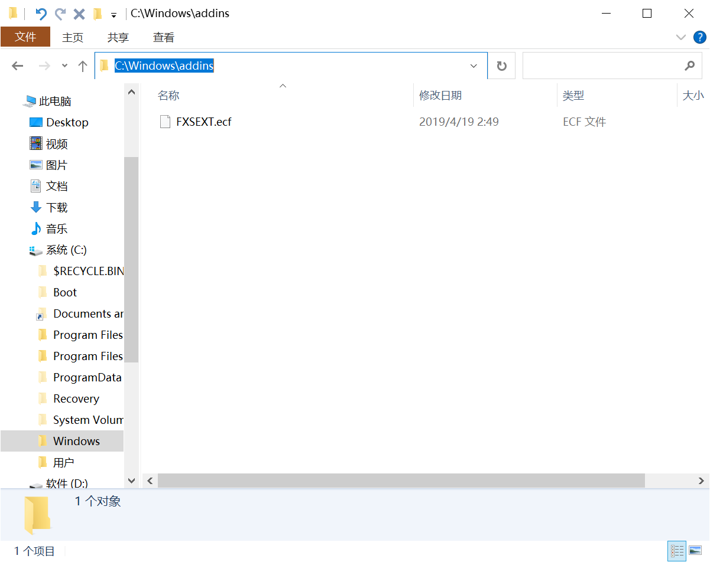
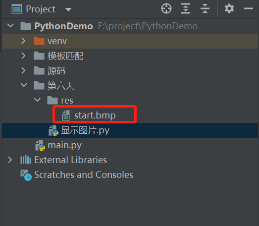
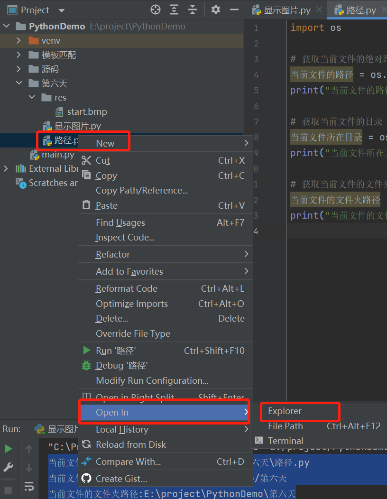

# 游戏自动化（二）OpenCV

## OpenCV 简介

## OpenCV

### OpenCV简介

首先我们来了解一下，OpenCV是什么？

OpenCV 是计算机视觉中经典的专用库，其支持多语言、跨平台，功能强大。

OpenCV现在支持与计算机视觉和机器学习有关的多种算法，并且正在日益扩展。

OpenCV支持多种编程语言，比如C++、Python、Java等，并且可在Windows、Linux、OS X、 Android和iOS等不同平台上使用。基于CUDA和OpenCL的高速GPU操作的接口也正在积极开发中。

OpenCV-Python是用于OpenCV的Python API，结合了OpenCV C++ API和Python语言的最佳特性， 旨在解决计算机视觉问题的Python专用库。

OpenCV-Python 为OpenCV提供了Python接口，使得使用者在Python中能够调用C/C++，在保证易读性和运行效率的前提下，实现所需的功能。

而Python因为它的简单性和代码可读性。它使程序员可以用较少的代码行表达想法，而不会降低可读性。

与C/C++之类的语言相比，Python速度较慢。也就是说，可以使用C/C++轻松扩展Python，这使我们能够用C/C++编写计算密集型代码并创建可用作Python模块的Python包装器。这给我们带来了两个好处：首先，代码与原始C/C++代码一样快（因为它是在后台运行的实际C++代码），其次，在Python中比C/C++编写代码更容易。OpenCV-Python是原始OpenCV C++实现的Python包装器。

### 安装OpenCV-Python

安装OpenCV可以有几种方案，比如使用预编译的二进制文件安装，或者从源代码自行编译，但那些方法都太麻烦了，而且我们只是使用这个库，又不是要研究这个库的算法实现，所以我们这里选择最简单的安装方式。

大家用来编程的电脑都是什么系统的呀？应该大部分都是Windows吧。如果是mac或其它系统问题也不大，安装方法是差不多的。

之前说到了，OpenCV是一个计算机视觉库，既然是库，所以就可以使用import 命令，很方便的导入后进行使用。但它是第三方库，所以需要先安装才能使用。

在Pycharm中，在最底部的这一排的按钮中，找到终端（Terminal），点击后可以看到光标在闪烁了，这里可以输入安装命令：

```bash
pip install opencv-python
```

如果在安装的时候，出现黄色的提示，要你先更新pip版本，安装它的提示做，把pip版本更新到最新后，再次运行安装OpenCV的命令就行。

由于有"墙"的原因，安装可能会慢或者不成功，多试两次，还不行就可以找个梯子科学上网，或者找老师答疑。

命令执行完后，怎么判断是否成功安装了呢？

创建一个python文件，在文件里写下：

```python
import cv2 as cv
print(cv.version.opencv_version)
```

运行如果不报错，看到输出了类似下面的内容就是成功了：

```
4.5.2.52
```

这里我们是把OpenCV库的版本号给显示出来了，我当前用的版本是4.5版本，后面的是小版本号，不用管。

## 使用OpenCV

使用OpenCV非常简单，它就是一个库嘛，导入之后再调用方法就可以使用对应的功能了。这里的所谓方法，就是库里面定义好的函数，它里面封装了一些功能。

在当前阶段，我们不需要知道它是具体是怎么实现那些功能的，只要知道它能做什么就行了。这是一个学习的策略技巧，建议先专注于掌握如何使用，以达成目标为导向，不必一开始就深入所有细节。待你学到一定程度的时候，自然有机会再去了解更深入的细节。

刚才在安装完python后，其实我们在无形中，已经简单的使用过OpenCV了。

导入库和调用模块，其实就是这么简单方便。

使用OpenCV肯定不只是查看一个版本号，接下来我们进入实战。

### 文件路径

首先来了解一下什么叫文件路径

文件的路径表示用户在磁盘上寻找文件时，所历经的文件夹线路。

我们可以看下Windows中文件目录是什么样的。我们打开我的电脑C盘，Windows文件夹-addins文件夹，我们来看看

我们从上面的标题或是点击地址栏可以看到，当前文件的所在的目录是`C:\Windows\addins`

我们右键文件-属性-安全，可以看到文件的路径是 `C:\Windows\addins\FXSEXT.ecf`

这个其实是标准的DOS路径，有以下三部分组成：
- 卷号或驱动器号，后跟卷分隔符 ( : )。
- 目录名称。
- 目录分隔符用来分隔嵌套目录层次结构中的子目录。
- 可选的文件名。目录分隔符用来分隔文件路径和文件名。

### 文件路径在python的写法

路径分为绝对路径和相对路径。

绝对路径就是文件的真正存在的路径，是指从硬盘的根目录(盘符)开始，进行一级级目录指向文件。

相对路径就是以当前文件为基准进行一级级目录指向被引用的资源文件。

比如刚才所说的 `C:\Windows\addins\FXSEXT.ecf` 就是文件的绝对路径。

绝对路径有三种使用方法：



- 反斜杠 `'\'`：由于反斜杠 `'\'` 要用作转义符， 所以如果要使用反斜杠表示路径，则必须使用双反斜杠。
- 原始字符串 `r''`：可以使用原始字符串+单反斜杠`'\'`的方式表示路径
- 斜杠`'/'`：为了避免转义符 `'\'` 和原始字符串的麻烦，可以直接用斜杠`'/'`，python中是承认`'/'`用于路径分割符号的。

相对路径：
- `./Images` 表示当前目录下的 Images文件夹
- `../Images` 表示当前目录的上一层目录下的Images文件夹
- `/Images` 表示项目根目录

如果我们要读取当前工作目录下的图片，我们就有两种方式来获取了。

绝对路径的方式：`r'E:\project\PythonDemo\第六天\res\start.bmp'`

相对路径的方式：`'./res/start.bmp'`

如果是在当前目录调用同目录下的文件时，相对路径还可以忽略掉`./`, 写成 `'res/start.bmp'`, 效果是一样的。

这里还需要注意一个很重要的点：opencv读取含有中文路径的文件时，会返回空，但是程序不会报错。所以路径最好使用字母，数字，下划线，避免一些莫名其妙的问题。 上代码：

```python
'C:\\Users\\Administrator\\Desktop\\image\\cork.jpg'
r'C:\Users\Administrator\Desktop\image\cork.jpg'
'C:/Users/Administrator/Desktop/image/cork.jpg'
```



### 项目工程路径

当我们要使用到当前编码文件所在的目录我们该怎么办呢。

有种和你直接的方法是，工程目录中选中文件，右键- Open In - Explorer，就能打开文件所在的目录了。

这样操作好像有点麻烦，我们是否可以直接使用代码来获取文件所在的目录呢？答案是可以的！

这里我们就需要使用到os模块，以及os中的两个方法了：

- `os.path.abspath(文件)` 用于获取当前文件的绝对路径
- `os.path.dirname(文件)` 用户获取当前文件的目录

```python
import os

# 获取当前文件的绝对路径
current_file_path = os.path.abspath(__file__)
print("当前文件的路径:{}".format(current_file_path))

# 获取当前文件的目录
current_file_dir = os.path.dirname(__file__)
print("当前文件所在文件夹:{}".format(current_file_dir))

# 获取当前文件的文件夹路径
current_file_folder = os.path.dirname(current_file_path)
print("当前文件的文件夹路径:{}".format(current_file_folder))
```



结果：

```
当前文件的路径:E:\project\PythonDemo\第六天\路径.py
当前文件所在文件夹:E:/project/PythonDemo/第六天
当前文件的文件夹路径:E:\project\PythonDemo\第六天
```

这里我们发现 【current_file_dir】与【current_file_folder】是一样的，只是斜杆的方式不一样。但是平时一般用第三种方式获取文件的文件夹路径，因为反斜杆更通用。

### 读取图像

读取图像就是从电脑的硬盘中加载之前已经保存好的图片，支持各种格式的，像bmp、jpg、png等等。

读取图像的函数是 `cv.imread()`

这个函数的完整写法是：

```python
image = cv.imread(image_path, read_mode)
```

函数有2个参数：
- 第一个参数是图片的路径，如果文件是在项目工程下，传入相对路径就可以了，如果不在项目工程下，那就要传入完整的绝对路径。这是一个必传参数。
- 第二个参数是图像读取方式，传入1就是按彩色模式读取，传入0就是按灰色模式读取。这是可选参数，不写的话，默认是按彩色模式读取。

函数的返回值是这个image对象，后续可以对这个image对象进行各种操作。

如果打印来看的话，就是数字组成的矩阵。

这里特别要注意一点：即使图像路径错误，它也不会引发任何错误，但是 print img 会给出 None。 上代码：

```python
import cv2 as cv

# 相对路径
image = cv.imread('res/start.bmp')
print(image)

# 绝对路径
image = cv.imread('E:/screenshot.bmp')
print(image)
```

### 显示图像

接下来学习怎么把读取进来的图片显示出来。

读取图像的函数是 `cv.imshow()`

这个函数的完整写法是：

```python
cv.imshow(窗口标题, 图片对象)
```

- 第一个参数是显示图片时用什么标题，为了在多张图片显示时，好有个区分。一般用图片名来表示，中文会显示乱码。这是必填参数。
- 第二个参数是image对象，就是刚才读取后的image对象，也是必填参数。 上代码：

```python
import cv2 as cv

image = cv.imread('res/start.bmp')
cv.imshow('img', image)
cv.waitKey(0)
cv.destroyAllWindows()
```

运行代码看到窗口一闪而过了，所以还得设置一个等待状态，一直显示这张图像，直到按下一个键后再关闭窗口。

加载不同分辨率的图片，窗口自动适合图像尺寸，把图片完整显示出来。

### 保存图像

在截图后或者对图像处理后，很多时候需要把图像保存下来，OpenCV保存图像的函数是 `cv.imwrite()`

这个函数的完整写法是：

```python
cv.imwrite(image_path_and_name, image)
```

- 第一个参数是图片文件的路径，如果文件是在项目工程下，传入相对路径就可以了，如果不在项目工程下，那就要传入完整的绝对路径。图片名称里，必须还要包含后缀名，后缀名决定了这个图像是以什么格式保存。这是一个必传参数。
- 第二个参数是image对象。这也是必传参数。 上代码：

```python
import win32gui
import win32ui
import win32con
import numpy as np
import get_handle_activate as window
import cv2 as cv

def capture_screen(hwnd):
    # 根据窗口句柄获取窗口的设备上下文DC（Divice Context）
    desktop = win32gui.GetDesktopWindow()
    dc = win32gui.GetWindowDC(desktop)
    # 根据窗口的DC获取mfcDC
    mfc_dc = win32ui.CreateDCFromHandle(dc)
    # mfcDC创建可兼容的DC
    save_dc = mfc_dc.CreateCompatibleDC()
    # 创建bitmap准备保存图片
    save_bit_map = win32ui.CreateBitmap()
    left, top, right, bottom = win32gui.GetWindowRect(hwnd)
    w, h = right - left, bottom - top
    # 为bitmap开辟空间
    save_bit_map.CreateCompatibleBitmap(mfc_dc, w, h)
    # 高度saveDC，将截图保存到saveBitmap中
    save_dc.SelectObject(save_bit_map)
    # 截取从左上角（0，0）长宽为（w，h）的图片
    save_dc.BitBlt((0, 0), (w, h), mfc_dc, (left, top), win32con.SRCCOPY)
    signed_ints_array = save_bit_map.GetBitmapBits(True)
    im_opencv = np.frombuffer(signed_ints_array, dtype='uint8')
    im_opencv.shape = (h, w, 4)
    save_dc.DeleteDC()
    win32gui.DeleteObject(save_bit_map.GetHandle())
    win32gui.ReleaseDC(hwnd, dc)
    return im_opencv

def get_emulator_image():
    hwnd = window.activate_emulator()
    return capture_screen(hwnd)

if __name__ == '__main__':
    image = get_emulator_image()
    cv.imshow('模拟器截图', image)
    cv.waitKey(0)
    cv.destroyAllWindows()
```

### 图像色彩空间

#### 什么是色彩空间

色彩空间是描述使用一组值（通常使用三个、四个值或者颜色成分）表示颜色方法的抽象数学模型。

常见的色彩空间有以下几种：
- RGB：是最常见的面向硬件设备的彩色模型，它是人的视觉系统密切相连的模型，根据人眼结构，所有的颜色都可以看做是3个基本颜色-红r、绿g、蓝b的不同比例的组合。国际照度委员会CIE规定的红绿蓝三种基本色的波长分别为700nm、546.1nm、435.8nm。
- HSV：HSV颜色空间是孟塞尔彩色空间的简化形式，是一种基于感知的颜色模型。它将彩色信号分为3种属性：色调（Hue,H），饱和度（Saturation,S），亮度（Value,V）。色调表示从一个物体反射过来的或透过物体的光波长，也就是说，色调是由颜色的名称来辨别的，如红、黄、蓝；亮度是颜色的明暗程度；饱和度是颜色的深浅，如深红、浅红。
- HLS：HLS颜色空间与HSV类似，H表示色调，L表示亮度，S表示饱和度。
- CMYK：主要用于印刷行业。

#### 色彩空间转换

OpenCV中默认的色彩空间是BGR，但我们可以将其转换为其他色彩空间。 上代码：

```python
import cv2 as cv

# 读取图像
img = cv.imread('image.jpg')

# 转换为灰度图像
gray = cv.cvtColor(img, cv.COLOR_BGR2GRAY)

# 转换为HSV色彩空间
hsv = cv.cvtColor(img, cv.COLOR_BGR2HSV)

# 转换为HLS色彩空间
hls = cv.cvtColor(img, cv.COLOR_BGR2HLS)
```

### 图像灰度化

#### 什么是灰度图

灰度图是只含亮度信息而不含色彩信息的图像，它把亮度值量化为0到255共256级，其中0最暗（全黑），255最亮（全白）。

#### 为什么要灰度化

- 减少计算量：彩色图像有3个通道，而灰度图像只有1个通道，计算量大大减少。
- 简化处理：很多图像处理算法在灰度图上效果更好。
- 突出轮廓：去除颜色干扰，更容易识别物体轮廓。

#### 灰度化方法

```python
import cv2 as cv

# 方法1：读取时直接转为灰度
img_gray = cv.imread('image.jpg', 0)

# 方法2：通过色彩空间转换
img = cv.imread('image.jpg')
img_gray = cv.cvtColor(img, cv.COLOR_BGR2GRAY)
```

### 图像二值化

#### 什么是二值化

图像二值化就是将图像上的像素点的灰度值设置为0或255，也就是将整个图像呈现出明显的只有黑和白的视觉效果。

#### 为什么要二值化

- 简化图像：将复杂的灰度图像简化为只有黑白两种颜色。
- 分离目标：将目标物体从背景中分离出来。
- 减少数据量：便于后续的图像处理和分析。

#### 二值化方法

```python
import cv2 as cv

# 读取图像并转为灰度
img = cv.imread('image.jpg', 0)

# 二值化
ret, binary = cv.threshold(img, 127, 255, cv.THRESH_BINARY)

# 显示结果
cv.imshow('binary', binary)
cv.waitKey(0)
cv.destroyAllWindows()
```

`cv.threshold()` 函数参数说明：
- 第一个参数：输入图像（灰度图）
- 第二个参数：阈值
- 第三个参数：最大值（超过阈值的像素设置为该值）
- 第四个参数：二值化类型

常见的二值化类型：
- `cv.THRESH_BINARY`：超过阈值的设为最大值，低于阈值的设为0
- `cv.THRESH_BINARY_INV`：超过阈值的设为0，低于阈值的设为最大值
- `cv.THRESH_TRUNC`：超过阈值的设为阈值，低于阈值的不变
- `cv.THRESH_TOZERO`：超过阈值的不变，低于阈值的设为0
- `cv.THRESH_TOZERO_INV`：超过阈值的设为0，低于阈值的不变

### 图像裁剪

图像裁剪就是从原图像中截取一部分区域。 上代码：

```python
import cv2 as cv

img = cv.imread('image.jpg')

# 裁剪图像 [y1:y2, x1:x2]
cropped = img[100:300, 200:400]

cv.imshow('cropped', cropped)
cv.waitKey(0)
cv.destroyAllWindows()
```

### 模板匹配

模板匹配是在一幅图像中寻找与另一幅模板图像最匹配部分的方法。 上代码：

```python
import cv2 as cv
import numpy as np

# 读取原图和模板
img = cv.imread('image.jpg', 0)
template = cv.imread('template.jpg', 0)

# 模板匹配
res = cv.matchTemplate(img, template, cv.TM_CCOEFF_NORMED)

# 获取匹配位置
threshold = 0.8
loc = np.where(res >= threshold)

# 绘制矩形
w, h = template.shape[::-1]
for pt in zip(*loc[::-1]):
    cv.rectangle(img, pt, (pt[0] + w, pt[1] + h), (0, 0, 255), 2)

cv.imshow('result', img)
cv.waitKey(0)
cv.destroyAllWindows()
```

### 轮廓检测

轮廓检测是找出图像中物体的边界。 上代码：

```python
import cv2 as cv

# 读取图像并转为灰度
img = cv.imread('image.jpg')
gray = cv.cvtColor(img, cv.COLOR_BGR2GRAY)

# 二值化
ret, binary = cv.threshold(gray, 127, 255, cv.THRESH_BINARY)

# 查找轮廓
contours, hierarchy = cv.findContours(binary, cv.RETR_EXTERNAL, cv.CHAIN_APPROX_SIMPLE)

# 绘制轮廓
cv.drawContours(img, contours, -1, (0, 255, 0), 2)

cv.imshow('contours', img)
cv.waitKey(0)
cv.destroyAllWindows()
```

## 文档总结

本节课我们学习了OpenCV的基础知识，包括：
- OpenCV的安装和基本使用
- 图像的读取、显示和保存
- 色彩空间和灰度转换
- 图像二值化
- 图像裁剪
- 模板匹配
- 轮廓检测

这些知识将为我们后续的游戏自动化开发打下坚实的基础。

## 练习题

1. （单选题）OpenCV读取图像的函数是：
   - A. `cv.read()`
   - B. `cv.imread()`
   - C. `cv.load()`
   - D. `cv.open()`

2. （单选题）将彩色图像转换为灰度图像的色彩空间转换代码是：
   - A. `cv.COLOR_BGR2HSV`
   - B. `cv.COLOR_BGR2RGB`
   - C. `cv.COLOR_BGR2GRAY`
   - D. `cv.COLOR_GRAY2BGR`

3. （编程题）编写一个程序，读取一张图片，将其转换为灰度图，然后进行二值化处理，最后显示处理后的图像。