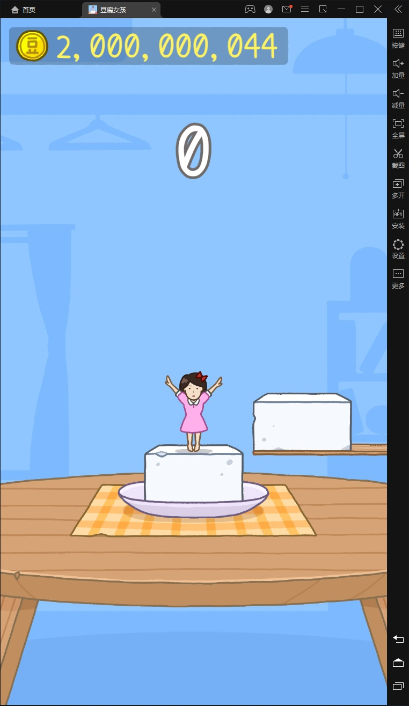

# 游戏自动化（三）

## 前提准备

## 前提准备

**特别注意：** 本节教程所演示的模拟器分辨率设置为 720x1080（手机版），电脑分辨率设置大于 720x1080并且没有设置放大。

本文档开始之前我们来回顾一下昨天所学的知识内容，因为今天要学的内容和昨天内容有着紧密的联系。昨天的课程主要讲解了计算机的图像相关基础知识，图像坐标系，图像灰度化，图像二值化，使用OpenCV进行图像匹配、图像切割，还尝试了对图像进行轮廓处理。

在前面的学习中，我们已经掌握了使用OpenCV进行图片处理的相关知识，之所以做了那么多的铺垫，目的就是为这篇文档服务的。

写出这个游戏的自动化脚本中，图像的处理占了超过一半的工作量，这也是模拟类自动化脚本的常见情况。

**图像处理的目的是什么？**

是把图像识别成简单的数据类型或数据结构，以便于使用算法来解决问题。

大家来想一想，在这个豆腐女孩的游戏中，规则很简单，开始后，只要不断识别游戏画面，看到有豆腐过来，就判断豆腐离女孩的距离，如果距离在某个数值范围内，点击鼠标起跳就可以了。

通过观察游戏界面，豆腐出现的区域是不变的，所以我们只需要关注中间那一块区域就行了，通过坐标把这一块区域裁剪出来，一方面可以减少图像处理的计算量，另一方面可以减少不必要的干扰，简化处理的逻辑。

接下来对这块目标区域的图像进行处理，先装成灰度图，再找出一个合适的阈值，变成二值化图像：




对于这样背景和前景分明的图像，就可以非常轻松的找出轮廓了，但不是所有的轮廓都是符合条件的，我们只需要找到面积最大的轮廓的边框，就可以确认豆腐的位置。

上图中的绿色线条方框就是找出来的豆腐的位置，而小女孩是居中显示的，所以得到豆腐的边，再计算两个物体的距离，然后根据豆腐的移动速度，就可以算出起跳前的等待时间。

通过OpenCV这个强大的图像处理库，就可以真正从目标识别的角度去编写逻辑，跟那些基于找图找色的按键精灵、易语言写的那些脚本不一样，这是基于图像识别的方法，使用分层思想来设计模型，帮助大家真正提高从底层逻辑去建立起解决问题的思维，这在大家以后不光是学编程，写python，做脚本时非常有用，对于生活中、学习中、工作中的复杂问题的解决，同样可以有很大的帮助。

**人跟人的本质区别，在于思维的层次差别。**

有了上面整理出来的思路，接下来我们就带领来一步步来实现我们的思路。抽离出一个模拟器的模块，负责对窗口的基本操作，比如激活、点击、截图等功能，到时作为模块导入，可以很方便的调用这里面的功能，从而简化逻辑，并且达到高内聚，低耦合的设计目标。

## 模拟器模块

```python
import time
import win32api
import win32con
import win32gui
import win32ui
import numpy as np

"""
本节教程所演示的模拟器分辨率设置为 720x1080（手机版），电脑分辨率设置大于 720x1080并且没有设置放大。
"""

def 激活窗口():
    hwnd = win32gui.FindWindow(None, '雷电模拟器')
    if hwnd == 0:
        print('未找到游戏窗口')
        return 0
    tup = win32gui.GetWindowPlacement(hwnd)  # 获取窗口布局
    if tup[1] != win32con.SW_SHOWNORMAL:  # 非正常尺寸（已最小化或最大化）
        win32gui.SendMessage(hwnd, win32con.WM_SYSCOMMAND, win32con.SC_RESTORE, 0)
        # 恢复窗口大小
        time.sleep(0.1)
    if win32gui.GetForegroundWindow() != hwnd:
        win32gui.SetForegroundWindow(hwnd)  # 窗口前置
        time.sleep(0.3)
    return hwnd

def 点击(窗口坐标):
    """
    :param 窗口坐标: 元组(x,y) x为横坐标，y为纵坐标
    :return: 返回点击执行结果
    """
    hwnd = activate_window()
    if hwnd == 0:
        print('模拟器窗口不存在，点击失败')
        return False
    desktop_coord = win32gui.ClientToScreen(hwnd, window_coord)  # 窗口坐标换算成桌面坐标
    win32api.SetCursorPos(desktop_coord)  # 设置鼠标位置
    win32api.mouse_event(win32con.MOUSEEVENTF_LEFTDOWN, 0, 0, 0, 0)  # 鼠标按下
    win32api.mouse_event(win32con.MOUSEEVENTF_LEFTUP, 0, 0, 0, 0)  # 鼠标弹起
    return True

def _窗口截图_(hwnd):
    # 根据窗口句柄获取窗口的设备上下文DC（Divice Context）
    desktop = win32gui.GetDesktopWindow()
    dc = win32gui.GetWindowDC(desktop)
    # 根据窗口的DC获取mfcDC
    mfc_dc = win32ui.CreateDCFromHandle(dc)
    # mfcDC创建可兼容的DC
    save_dc = mfc_dc.CreateCompatibleDC()
    # 创建bitmap准备保存图片
    save_bit_map = win32ui.CreateBitmap()
    left, top, right, bottom = win32gui.GetWindowRect(hwnd)
    w, h = right - left, bottom - top
    # 为bitmap开辟空间
    save_bit_map.CreateCompatibleBitmap(mfc_dc, w, h)
    # 高度saveDC，将截图保存到saveBitmap中
    save_dc.SelectObject(save_bit_map)
    # 截取从左上角（0，0）长宽为（w，h）的图片
    save_dc.BitBlt((0, 0), (w, h), mfc_dc, (left, top), win32con.SRCCOPY)
    signed_ints_array = save_bit_map.GetBitmapBits(True)
    im_opencv = np.frombuffer(signed_ints_array, dtype='uint8')
    im_opencv.shape = (h, w, 4)
    save_dc.DeleteDC()
    win32gui.DeleteObject(save_bit_map.GetHandle())
    win32gui.ReleaseDC(hwnd, dc)
    return im_opencv

def capture():
    hwnd = activate_window()
    if hwnd == 0:
        print('模拟器窗口不存在，截图失败')
        return None
    return _窗口截图_(hwnd)

if __name__ == '__main__':
    activate_window()
    time.sleep(0.5)
    start = time.time()
    img = capture()
    end = time.time()
    print('花费', end - start, '秒')
    import cv2 as cv
    cv.imwrite(r'E:\home.bmp', img)
    h, w = img.shape[:2]
    check_result = '检测通过！' if w == 762 and h == 1316 else '检测未通过！请修改模拟器分辨率'
    print(f'期望截图的分辨率为：762*1316 实际分辨率为{h}*{w}')
    click((360, 1116))
    time.sleep(1.2)
    tofu = 截图()
    cv.imwrite(r'E:\tofu.bmp', tofu)
```


## 游戏控制模块

在这个游戏控制模块中，主要完成图像的处理和目标的检测，并通过简单的算法计算出操作间隔，然后调用模拟器模块中的相应函数来实现操作。

来看看源码：

```python
import time
import cv2 as cv
import numpy as np
import simulator

start_button_img = cv.imread('res/start.bmp', 0)  # 开始按钮

def is_color_image(image):
    if image is None:
        print('is_color_image() 参数错误：', '图片为空')
        return False
    return len(image.shape) > 2

def find_image(large_img, small_img, similarity=0.8):
    if is_color_image(large_img):
        large_img = cv.cvtColor(large_img, cv.COLOR_BGR2GRAY)
    if is_color_image(small_img):
        small_img = cv.cvtColor(small_img, cv.COLOR_BGR2GRAY)
    res = cv.matchTemplate(large_img, small_img, cv.TM_CCOEFF_NORMED)  # 模板匹配
    loc = np.where(res >= similarity)  # 过滤结果
    for pt in zip(*loc[::-1]):
        left = int(pt[0])
        top = int(pt[1])
        right = int(pt[0] + small_img.shape[1])
        bottom = int(pt[1] + small_img.shape[0])
        area = ((left, top), (right, bottom))
        return area  # 实际操作区域
    return None

def find_cube(gray_screenshot):
    sw = 720
    key_region = gray_screenshot[730:840, 1:sw]  # 裁剪出感兴趣的区域
    _, binary_img = cv.threshold(key_region, 248, 255, cv.THRESH_BINARY)  # 图像二值化
    contours, hierarchy = cv.findContours(黑白图像, cv.RETR_EXTERNAL, cv.CHAIN_APPROX_SIMPLE)  # 查找轮廓
    max_area, max_cnt = 0, None  # 设置最大面积和最大轮廓的默认值
    for cnt in contours:
        area = cv.contourArea(cnt)
        if area > 5000 and area > max_area:  # 筛选出轮廓
            max_area = area
            max_cnt = cnt
    if max_cnt is None:
        # print('没有发现豆腐')
        return 0
    x, y, w, h = cv.boundingRect(max_cnt)  # 计算出边框
    center_x = sw / 2  # 中线位置
    cube_x = x + w if x + w < center_x else x  # 取离中线最近的豆腐边线x（豆腐不确定从哪边来）
    dist = abs(center_x - cube_x)  # 豆腐边缘到中线的距离
    return dist

def jump_check():
    for i in range(100):  # 每次跳跃前循环检测画面
        screenshot = simulator.capture()
        screenshot_gray = cv.cvtColor(screenshot, cv.COLOR_BGR2GRAY)  # 转成灰度图片
        if find_image(screenshot_gray, start_button_img):
            print('游戏已结束')
            return True
        dist = find_cube(screenshot_gray)  # 算出豆腐离中线距离
        if 150 < dist < 190:
            print(f'---跳---')
            jump()  # 点击鼠标（跳跃）
            time.sleep(0.8)
            return False
        time.sleep(0.01)

def jump():
    simulator.click((360, 900))

def start_game():
    while True:
        screenshot = simulator.capture()
        screenshot_gray = cv.cvtColor(screenshot, cv.COLOR_BGR2GRAY)
        area = find_image(screenshot_gray, start_button_img)
        if area:
            print('发现开始按钮，点击开始游戏')
            x = int((area[0][0] + area[1][0]) / 2)
            y = int((area[0][1] + area[1][1]) / 2)
            simulator.click((x, y))
            time.sleep(0.5)
            return
        time.sleep(0.5)

if __name__ == '__main__':
    while True:
        start_game()
        time.sleep(1)
        while True:
            if jump_check():
                break
            time.sleep(0.1)
```

## 文档总结

本文档我们实现了一个完整的游戏自动化脚本，主要包括：

1. **模拟器模块**：封装了窗口操作、截图、点击等基础功能
2. **游戏控制模块**：实现了图像识别、目标检测、游戏逻辑控制
3. **核心算法**：
   - 使用模板匹配识别游戏状态
   - 使用轮廓检测定位豆腐位置
   - 计算距离并判断跳跃时机

通过这个项目，我们学会了如何将前面学到的知识综合运用，实现一个完整的自动化程序。

## 练习题

1. （单选题）在OpenCV中，查找轮廓的函数是：
   - A. `cv.findContours()`
   - B. `cv.contours()`
   - C. `cv.getContours()`
   - D. `cv.detectContours()`

2. （单选题）计算轮廓面积的函数是：
   - A. `cv.area()`
   - B. `cv.contourArea()`
   - C. `cv.getArea()`
   - D. `cv.calcArea()`

3. （编程题）修改游戏脚本，使其能够自动识别游戏结束并重新开始游戏。