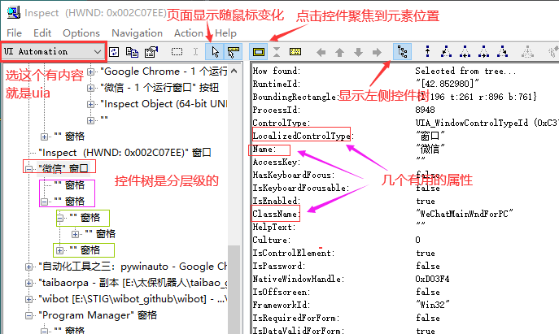
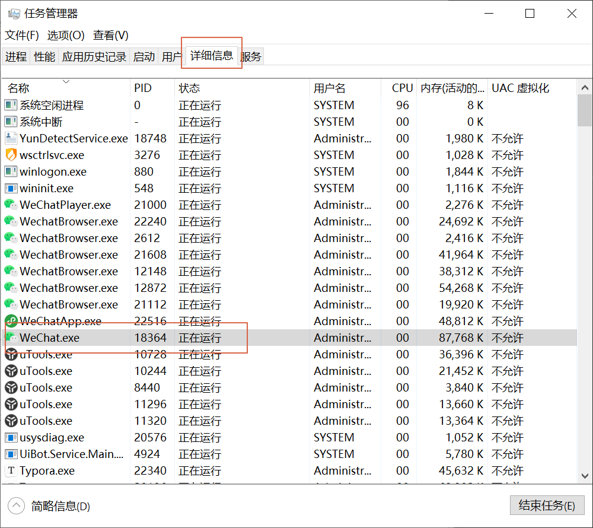

# 桌面软件自动化（一）

## pywinauto 简介

### 什么是pywinauto

pywinauto是一组用于自动化Microsoft Windows GUI的python模块。最简单的是，它允许您将鼠标和键盘操作发送到窗口对话框和控件。

### pywinauto安装和启动

#### 1. 安装pywinauto

在 Pycharm 底部的终端（Terminal）窗口中输入：

```bash
pip install pywinauto
```

提示success即安装成功了。

#### 2. backend选择

我们安装好Pywinauto之后，首先要确定哪种可访问性技术（backend）可以用于我们的应用程序，在windows上受支持的有两种：

- **Win32 API ( backend= "win32" )** - 默认的backend
  - MFC, VB6, VCL, 简单的WinForms控件和大多数旧的遗留应用程序
  
- **MS UI Automation ( backend="uia" )**
  - WinForms, WPF, Store apps, Qt5, 浏览器

如果不能确定程序到底适用于那种backend，可以借助于GUI对象检查工具来查看，常用的检查工具有 Inspect.exe，Spy++ 。如果使用Inspect的UIA模式，可见的控件和属性更多的话，backend可选uia，反之，backend可选win32。

#### 3. 控件查看工具-inspect

- inspect.exe下载链接：https://z4gvregzdz.feishu.cn/file/boxcnoI8GOg5aIWaYTVXL8hyWzc
- spy++下载链接：https://z4gvregzdz.feishu.cn/file/boxcnqlUR6yBhvuJsoFiUVrVGpe

将inspect左上角的下拉列表中切换到"UI Automation"，然后鼠标点一下你需要测试的程序窗体，inspect就会显示相关信息，如下图所示。说明backend为uia

程序里面的任意一个部位其实都是控件，在inspect的控件树中都可以找到，是一层一层分级别的，可以一个个点开所有控件



### 完整操作步骤

通过pywinauto操作控件需要以下几个步骤：

1. **第一步**：创建实例化对象，得到的app是Application对象
2. **第二步**：选择窗口，得到的窗口是WindowSpecification对象
3. **第三步**：基于WindowSpecification对象使用其方法再往下查找，定位到具体的控件
4. **第四步**：使用控件的方法属性执行我们需要的操作

接下来我们先看一个实例代码，（确保电脑版微信已经登录且前台显示在桌面上）按照上面的步骤获取微信的搜索文本框并点击，代码如下：

```python
from pywinauto import Application

# 第一步连接已有微信进程创建实例化对象
PID = 12345  # 进程PID在任务管理器-详细信息可以查看后修改该值
wechat_app = Application(backend='uia').connect(process=PID)

# 第二步拿到微信主窗口
main_window = wechat_app.window(class_name='WeChatMainWndForPC')

# 第三步通过child_window方法查找搜索文本框
search_box = main_window.child_window(control_type='Edit', title='搜索')

# 第四步进行操作点击控件
search_box.click_input()
```

执行后就会自动点击微信左上角搜索文本框了（注意：由于PID是变化的，以上代码一定能执行成功，后面会详细介绍）。

接下来，我们按照上面四步逐步讲解。

### 1. 创建实例化对象

以微信为例，这里介绍下常用的两种获取实例化程序的方式：

#### 启动 start()

用于还没有启动软件的情况。timeout为超时参数（可选），若软件启动所需的时间较长可选timeout，默认超时时间为5s。 上代码：

```python
start(self, cmd_line, timeout=app_start_timeout)
```

先确定微信是关闭的，我们通过上面方法启动微信并获取对应的实例化对象，如下：

```python
from pywinauto import Application

# 启动微信进程（注意路径中特殊字符的转义，/和\）
app = Application(backend="uia").start(r'"E:\Program Files (x86)\Tencent\WeChat\WeChat.exe"')
print(app)
```

运行后将会自动启动微信。

#### 连接 connect()

用于连接已经启动的程序。connect()方式有多种：

- **process**：进程id（PID）
- **handle**：应用程序的窗口句柄
- **path**：进程的执行路径（GetModuleFileNameEx 模块会查找进程的每一个路径并与我们传入的路径去做比较）
- **参数组合**（传递给pywinauto.findwindows.find_elements()这个函数）

```python
app = Application().connect(process=12580)
app = Application().connect(handle=0x234f1b)
app = Application().connect(path="c:\windows\system32\notepad.exe")
app = Application().connect(title_re=".*Notepad", class_name="Notepad")
```

下面我们介绍下通过进程PID与窗口句柄两种链接已启动程序的方式：

PID在任务管理器-详细信息可以查看。如下图，WeChat.exe的PID就是18364。 上代码：

```python
from pywinauto.application import Application

# 通过PID连接已有微信进程
wechat_app = Application(backend='uia').connect(process=18364)
print(wechat_app)
```



在星球中也有提到运利用第三方库psutil根据进程名获取进程PID的文章，有兴趣可以去看看，这里就不做详细介绍了。

在前面游戏自动化中学习了如何获取窗口的句柄，所以我们本着偷懒的原则还可以通过pywin32模块根据窗口名获取窗口句柄，然后获取根据句柄来获得主程序，代码如下：

```python
import win32gui
from pywinauto.application import Application

hwnd = win32gui.FindWindow(None, '微信')
wechat_app = Application(backend='uia').connect(handle=hwnd)
print(wechat_app)
```

**注意**：应用程序必须先准备就绪，才能使用connect()。当应用程序start()后没有超时和重连的机制，在pywinauto外启动启动应用程序，则需要睡眠或编程等待循环以等待应用程序完全启动。

### 实例对象app的常用方法

通过查看pywinauto的源码中application.py文件，可以看到app的所有属性方法，下面列举常用方法：

#### app.top_window()

返回应用程序当前顶部窗口，是WindowSpecification对象，可以继续使用对象的方法往下继续查找控件

如：`app.top_window().child_window(title='搜索', control_type='Edit')`

#### app.window(kwargs)

根据筛选条件，返回一个窗口，是WindowSpecification对象，可以继续适用对象的方法往下继续查找控件

微信主界面：`app.window(class_name='WeChatMainWndForPC')`

#### app.windows(kwargs)

根据筛选条件返回一个窗口列表，无条件默认全部，列表项为wrapped对象，可以使用wrapped对象的方法，注意不是WindowSpecification对象

```python
[<uiawrapper.UIAWrapper - '微信', Dialog, -5995915281609806513>]
```

#### app.kill(soft=False)

强制关闭程序

#### app.cpu_usage()

返回CPU使用率百分比

#### app.wait_cpu_usage_lower(threshold=2.5, timeout=None, usage_interval=None)

等待进程CPU使用率百分比小于指定的阈值threshold

#### app.is64bit()

判断操作的进程是否是64-bit

简单演示下：

```python
from pywinauto.application import Application

# 通过PID连接已有微信进程
wechat_app = Application(backend='uia').connect(process=18364)
print(wechat_app.top_window())
print(wechat_app.window())
print(wechat_app.windows())
print(wechat_app.cpu_usage())
print(wechat_app.is64bit())
```

### 2. 选择窗口

pywinauto选择窗口有三种方式，获取到的窗口为 WindowSpecification对象。

以微信主界面窗口为例，先通过inspect工具查看微信的窗体信息：

按照上面的方法我们有三种方式来选取窗口，代码如下:

```python
from pywinauto.application import Application
import win32gui

# 根据应用程序窗口名获得句柄
hwnd = win32gui.FindWindow(None, '微信')
# 通过句柄连接已有微信进程
app = Application(backend='uia').connect(handle=hwnd)

dlg = app.window(class_name='WeChatMainWndForPC')
# dlg = app.微信
# dlg = app['微信']

dlg.restore()  # 将窗口恢复为正常大小，比如最小化的让他正常显示在桌面
dlg.draw_outline(colour='red')  # 控件外围画框，便于查看，支持'red', 'green', 'blue'
```

前面我们一直是手动先将微信窗口放置到前台，上面代码中我们利用restore()方法就可以自动将窗口恢复到正常大小了，利用draw_outline可以将控件外围画框，非常便于调试。

### 窗口的常用方法

下面则是窗口平时常用的一些方法：

```python
# 以下几个只支持窗口模式的控件
dlg.close()  # 关闭界面
dlg.minimize()  # 最小化界面
dlg.maximize()  # 最大化界面
dlg.restore()  # 将窗口恢复为正常大小，比如最小化的让他正常显示在桌面
dlg.get_show_state()  # 正常0，最大化1，最小化2

dlg.exists(timeout=None, retry_interval=None)  # 判断是否存在
# timeout：等待时间，一般默认5s
# retry_interval：timeout内重试时间

dlg.wait(wait_for, timeout=None, retry_interval=None)  # 等待窗口处于特定状态
dlg.wait_not(wait_for_not, timeout=None, retry_interval=None)  # 等待窗口不处于特定状态，即等待消失
# wait_for/wait_for_not:
# * 'exists' means that the window is a valid handle
# * 'visible' means that the window is not hidden
# * 'enabled' means that the window is not disabled
```

## 课程总结

本节课我们学习了pywinauto的基础知识，包括：
- pywinauto的安装和backend选择
- 如何使用inspect工具查看控件
- 创建实例化对象的两种方式（start和connect）
- 如何选择窗口
- 窗口的常用方法

## 课后习题

1. （单选题）pywinauto中用于连接已启动程序的函数是：
   - A. `start()`
   - B. `connect()`
   - C. `run()`
   - D. `launch()`

2. （单选题）将窗口恢复为正常大小的方法是：
   - A. `restore()`
   - B. `normal()`
   - C. `reset()`
   - D. `recover()`

3. （编程题）编写一个程序，使用pywinauto启动记事本程序，并将其最大化。