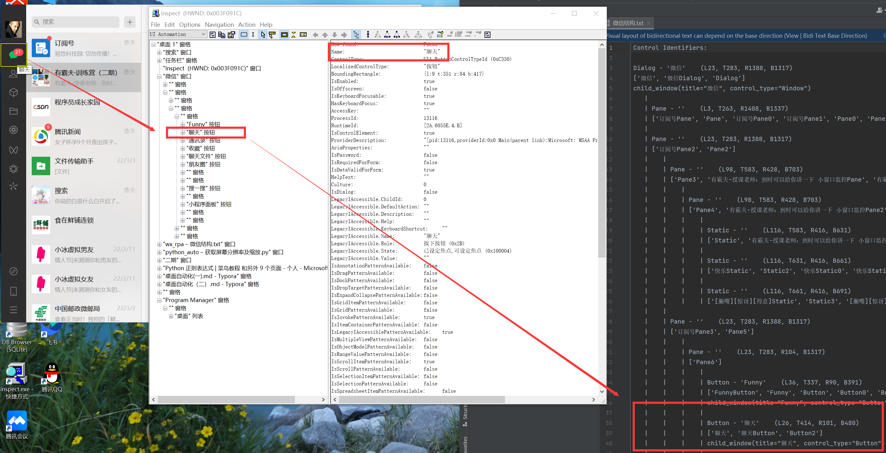

# 桌面软件自动化（二）

## 🎯 内容回顾

是时候展示真正的技术了！

### 🎯 内容回顾

我们先回顾下通过pywinauto操作控件需要以下几个步骤：

1. **第一步**：创建实例化对象，得到的app是Application对象
2. **第二步**：选择窗口，得到的窗口是WindowSpecification对象
3. **第三步**：基于WindowSpecification对象使用其方法再往下查找，定位到具体的控件
4. **第四步**：使用控件的方法属性执行我们需要的操作

接下来我们先看一个实例代码，（确保电脑版微信已经登录且前台显示在桌面上）按照上面的步骤获取微信的搜索文本框并点击，代码如下：

```python
from pywinauto import Application

# 第一步连接已有微信进程创建实例化对象（进程id在任务管理器-详细信息可以查看）
wechat_app = Application(backend='uia').connect(process=18364)

# 第二步拿到微信主窗口
wechat_window = wechat_app.window(class_name='WeChatMainWndForPC')

# 第三步通过child_window方法查找搜索文本框
search_box = wechat_window.child_window(control_type='Edit', title='搜索')

# 第四步进行操作点击控件
search_box.click_input()
```

### 打印元素

inspect可以查看窗口控件的所有层级结构，同样我们也可以通过代码将控件下的所有子控件及其属性以树形结构打印出来。 上代码：

```python
dlg.print_control_identifiers(depth=None, filename=None)
```

- **depth**: 打印的深度，缺省时打印最大深度。
- **filename**: 将返回的标识存成文件（生成的文件与当前运行的脚本在同一个路径下）

比如：`print_control_identifiers(filename='层级关系.txt')`

```python
from pywinauto import Application

# 连接已有微信进程（进程号在任务管理器-详细信息可以查看,项目中一般根据进程名称自动获取）
wechat_app = Application(backend='uia').connect(process=13116)

# 拿到微信主窗口
wechat_window = wechat_app.window(class_name='WeChatMainWndForPC')
wechat_window.restore()

# 打印当前窗口的所有controller（控件和属性）
# 源码内部函数名链式赋值了，print_ctrl_ids = dump_tree = print_control_identifiers, 都能用
wechat_window.print_control_identifiers(depth=None, filename='微信结构.txt')
```

打印出来的文档树就是inspect中的控件树完全展开的样子，都是有层级的，和微信程序中的各个元素是一一对应的：



### 控件常用的方法属性

上节课我们玩转了最常用的两个方法:

- `ctrl.click_input()` - 最常用的点击方法
- `ctrl.type_keys()` - 键盘输入方法

下面总结了大部分常用方法，基本可以满足所有场景的操作，如下：

```python
# 点击操作
ctrl.click_input()  # 最常用的点击方法，一切点击操作的基本方法（底层调用只是参数不同），左键单击，使用时一般都使用默认不需要带参数

# 键盘输入,底层还是调用keyboard.send_keys
ctrl.type_keys(keys, pause=None, with_spaces=False,)
# keys：要输入的文字内容
# pause：每输入一个字符后等待时间，默认0.01就行
# with_spaces：是否保留keys中的所有空格，默认去除0

# 鼠标键盘操作
# 下面只列举常用形式，他们有很多默认参数但不常用，可以在源码中查看
ctrl.right_click_input()  # 鼠标右键单击
ctrl.double_click_input(button="left", coords=(None, None))  # 左键双击
ctrl.press_mouse_input(coords=(None, None))  # 指定坐标按下左键，不传坐标默认左上角
ctrl.release_mouse_input(coords=(None, None))  # 指定坐标释放左键，不传坐标默认左上角
ctrl.move_mouse_input(coords=(0, 0))  # 将鼠标移动到指定坐标，不传坐标默认左上角
ctrl.drag_mouse_input(dst=(0, 0))  # 将ctrl拖动到dst,是press-move-release操作集合

# 控件的常用属性
ctrl.children_texts()  # 所有子控件的文字列表，对应inspect中Name字段
ctrl.window_text()  # 控件的标题文字，对应inspect中Name字段
# ctrl.element_info.name
ctrl.class_name()  # 控件的类名，对应inspect中ClassName字段，有些控件没有类名
# ctrl.element_info.class_name
ctrl.element_info.control_type  # 控件类型，inspect界面LocalizedControlType字段的英文名
ctrl.is_child(parent)  # ctrl是否是parent的子控件
ctrl.legacy_properties().get('Value')  # 可以获取inspect界面LegacyIAccessible开头的一系列字段，在源码uiawraper.py中找到了这个方法，非常有用，如某些按钮显示值是我们想要的，但是window_text获取到的是固定文字'修改群昵称'，这个值才是我们修改后的新名字

# 控件常用操作
ctrl.draw_outline(colour='green')  # 控件外围画框，便于查看，支持'red', 'green', 'blue'
ctrl.print_control_identifiers(depth=None, filename=None)  # 打印其包含的元素，详见打印元素
ctrl.scroll(direction, amount, count=1,)  # 滚动
# direction ："up", "down", "left", "right"
# amount："line" or "page"
# count：int 滚动次数
ctrl.capture_as_image()  # 返回控件的 PIL image对象可使用save()方法保存
ret = ctrl.rectangle()  # 控件上下左右坐标，(L123, 525, R600, B561)
```

接下来我们对其中一些方法进行举例：

#### 1. 清空文本框

我们前面学习了利用type_keys() 方法输入文本，但是如果当前输入框中有文本时，输入的字符串会拼接在已有的文本后面，所以我们需要先清空文本框再输入。清空原理很简单就是先通过ctrl+a选中所有，然后再type_keys()替换，和我们选中然后修改一样的。代码如下：

```python
from pywinauto import Application
import win32gui

# 根据应用程序窗口名获得句柄
hwnd = win32gui.FindWindow(None, '微信')
# 通过句柄连接已有微信进程
app = Application(backend='uia').connect(handle=hwnd)

dlg = app.window(class_name='WeChatMainWndForPC')
search_box = dlg.child_window(control_type='Edit', title='搜索')

# 先点击搜索框获取焦点
search_box.click_input()
# 全选并删除
search_box.type_keys('^a')  # Ctrl+A 全选
search_box.type_keys('{DELETE}')  # 删除
# 或者直接用替换方式
search_box.type_keys('^a{DELETE}新文本')
```

#### 2. 获取控件属性

```python
from pywinauto import Application
import win32gui

hwnd = win32gui.FindWindow(None, '微信')
app = Application(backend='uia').connect(handle=hwnd)

dlg = app.window(class_name='WeChatMainWndForPC')
search_box = dlg.child_window(control_type='Edit', title='搜索')

# 获取控件文本
print(search_box.window_text())
# 获取控件类名
print(search_box.class_name())
# 获取控件类型
print(search_box.element_info.control_type)
# 获取控件坐标
print(search_box.rectangle())
```

#### 3. 截图保存

```python
from pywinauto import Application
import win32gui

hwnd = win32gui.FindWindow(None, '微信')
app = Application(backend='uia').connect(handle=hwnd)

dlg = app.window(class_name='WeChatMainWndForPC')

# 对窗口截图
img = dlg.capture_as_image()
img.save('微信截图.png')

# 对特定控件截图
search_box = dlg.child_window(control_type='Edit', title='搜索')
img = search_box.capture_as_image()
img.save('搜索框截图.png')
```

### 实战案例：微信自动发送消息

下面我们实现一个完整的微信自动发送消息的脚本：

```python
import time
from pywinauto import Application
import win32gui
import keyboard

def 发送消息(联系人, 消息内容):
    """
    给指定联系人发送消息
    :param contact: 联系人名称
    :param message: 要发送的消息
    """
    # 获取微信窗口句柄
    hwnd = win32gui.FindWindow(None, '微信')
    if hwnd == 0:
        print('未找到微信窗口')
        return False
    
    # 连接微信进程
    app = Application(backend='uia').connect(handle=hwnd)
    dlg = app.window(class_name='WeChatMainWndForPC')
    
    # 确保窗口在前台
    dlg.restore()
    time.sleep(0.5)
    
    # 点击搜索框
    search_box = dlg.child_window(control_type='Edit', title='搜索')
    search_box.click_input()
    time.sleep(0.2)
    
    # 清空并输入联系人
    search_box.type_keys('^a{DELETE}')
    time.sleep(0.1)
    keyboard.write(contact)
    time.sleep(0.5)
    
    # 按回车选择联系人
    keyboard.send('enter')
    time.sleep(0.5)
    
    # 输入消息内容
    keyboard.write(message)
    time.sleep(0.2)
    
    # 发送消息
    keyboard.send('enter')
    time.sleep(0.5)
    
    print(f'已向 {contact} 发送消息：{message}')
    return True

if __name__ == '__main__':
    # 使用示例
    send_message('文件传输助手', 'Hello, World!')
```

### 批量发送消息

```python
import time
from pywinauto import Application
import win32gui
import keyboard

def batch_send(contact_list, message):
    """
    给多个联系人发送相同消息
    :param contact_list: 联系人名称列表
    :param message: 要发送的消息
    """
    for contact in contact_list:
        try:
            send_message(contact, message)
            time.sleep(1)  # 间隔1秒，避免发送过快
        except Exception as e:
            print(f'向 {contact} 发送消息失败：{e}')

if __name__ == '__main__':
    contact_list = ['文件传输助手', '张三', '李四']
    message = '这是一条测试消息'
    batch_send(contact_list, message)
```


---

代码写起来！

<details>
<summary>点击查看参考代码</summary>

```python
# 参考代码（待补充）

```

**思路解析**：

（解析待补充）

</details>
## 文档总结

本节课我们学习了pywinauto的控件操作方法，包括：
- 打印控件树结构
- 控件的点击、输入、右键等操作
- 获取控件属性
- 控件截图
- 实战案例：微信自动发送消息

## 练习题

1. （单选题）pywinauto中控件的点击方法是：
   - A. `click()`
   - B. `click_input()`
   - C. `press()`
   - D. `tap()`

2. （单选题）获取控件标题文字的方法是：
   - A. `get_text()`
   - B. `window_text()`
   - C. `title()`
   - D. `caption()`

3. （编程题）编写一个程序，使用pywinauto实现自动打开计算器并计算 123 + 456。