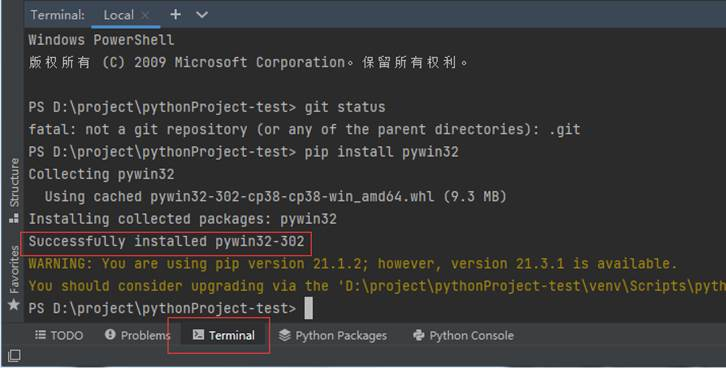
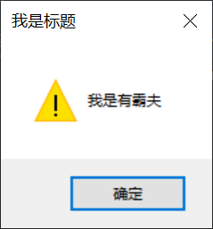

# 窗口、点击与 OpenCV

## 窗口模块与截图

## 窗口模块与截图

### 什么是pywin32库

pywin32是一个第三方模块库，主要的作用是方便python开发者快速调用windows API的一个模块库。

同时pywin32也是绝大部分windows上第三方python模块库的前提，比如wmi，如果没有安装pywin32是无法正常使用wmi这个三方模块库的。

### 安装pywin32

由于pywin32是第三方模块库，Python并没有自带，所以我们使用之前必须先按照，安装也很简单，只需要再pycharm下方终端窗口中输入pip install pywin32 回车就可以自动下载安装了。

看到success这样的字样则是说明安装成功了。


如果你不放心，还可以通过 pip list  可以看到pywin32是否已经安装成功了

### pywin32提供的模块

Pywin32提供的模块有很多，常用的几个如下：

- win32api 提供了常用的用户API函数
- win32gui 提供了有关windows用户界面图形操作的API函数
- win32con 提供了定义windows Api内的宏
- win32clipboard 提供了有关粘贴板的API函数
- win32console 提供了有关控制台的API函数
- win32service 提供了有关服务操作的API函数
- win32file 提供了有关文件操作的API函数




我们平时最常用的的模块有3个， win32api， win32gui，win32con，下面我们就导入 win32api，win32con这两个模块写一个简单的弹出框，顺便验证下我们pywin32是否安装成功了。 上代码：

```python
import win32api
import win32con

win32api.MessageBox(0, "我是渣男教父", "我是标题", win32con.MB_OK | win32con.MB_ICONWARNING)
```

运行下看看：

导入模块后，我们仅用了一行代码就创建了自定义的弹出框。

### 什么是窗口句柄

这里我们要先说下句柄的概念，通俗点说句柄就是窗口的身份证号，是一串整数。举个栗子，你有你自己的身份证号,一报身份证号，你应该知道是你了。你也有名字，但是大家都知道名字并不是唯一的，你可以叫张三，别人也可以叫张三，而且没有数字来得方便。所以，窗口句柄就相当于身份证号，每个窗口都有一个唯一编号,  操作系统用这个编号来发送消息。这就是操作系统的消息机制。

获取到窗口句柄，我们就可以通过这个句柄对窗口进行操作了。

### 查找窗口句柄

pywin32是如何查找窗口句柄的，这里我们用到了win32gui模块，以及模块的FindWindow方法。直接看代码看看

```python
import win32gui

hwnd = win32gui.FindWindow(None, '雷电模拟器')
print(hwnd)
hwnd2 = win32gui.FindWindow(None, '英雄联盟')
print(hwnd2)
```

运行下看看：



```
5506644
0
```

我们现在详细解析下win32gui.FindWindow(0, wdname)这个函数，这个函数其实就是根据窗口标题获取窗口句柄

```
# 函数功能：该函数获得一个顶层窗口的句柄，该窗口的类名和窗口名与给定的字符串相匹配。这个函数不查找子窗口。在查找时不区分大小写
# 参数1 窗口类名
# 参数2 窗口标题--必须完整；如果该参数为None，则为所有窗口全匹配
# 返回值：如果函数成功，返回值为窗口句柄；如果函数失败，返回值为0
```

因为我电脑上现在打开了雷电模拟器，有这个窗口，所以结果打印了雷电模拟器窗口对应的句柄数字，我没有打开英雄联盟的窗口，所以没有得到相应的句柄，返回值为0。

### 激活窗口

我们大多数情况下操作窗口都是需要窗口在最前方，这样对窗口的操作才会行之有效。所以接下来我们来写一个通用的方法来查找并激活窗口，如果查找到就使之前台显示并返回句柄。我们将文件名保存为获取句柄激活.py 直接上代码：

```python
import win32gui
import time

def activate_window(title):
    hwnd = win32gui.FindWindow(None, title)
    if hwnd == 0:
        print('未找到游戏窗口')
        return 0
    if win32gui.GetForegroundWindow() != hwnd:
        win32gui.SetForegroundWindow(hwnd)
        time.sleep(1)
    return hwnd

def activate_emulator():
    return activate_window('雷电模拟器')

if __name__ == '__main__':
    print(activate_emulator())
```

运行下：

（先手动将窗口放置到后台，不要最小化，最小化会有问题。）

这样我们就实现了将后台窗口重新激活放置到前台了。

这里又用到了两个win32gui的新方法。

- win32gui.GetForegroundWindow()这个方法是获取当前前台窗口的句柄；
- win32gui.SetForegroundWindow(hwnd)这个方法则是将hwnd对应的窗口前台显示。

程序的逻辑也很简单，首先判断雷电模拟器的窗口是否存在，如果存在则检查当前前台窗口hwnd与雷电模拟器的窗口hwnd是否一致，如果一致则不需要处理，否则就将雷电模拟器前台显示，最后再返回hwnd信息。

### 截图

平时大家聊qq时经常会用到截图功能，这是一个相当实用的功能。那我们今天也用Python来写一个截图功能。我们先看下桌面截图的代码，这个代码是只截取了部分代码，并不完整，只是用于展示。后面会有完整代码。 上代码：

```python
import win32gui
import win32ui
import win32con
import numpy as np

def capture_screen(hwnd):
    # 根据窗口句柄获取窗口的设备上下文DC（Divice Context）
    desktop = win32gui.GetDesktopWindow()
    dc = win32gui.GetWindowDC(desktop)
    # 根据窗口的DC获取mfcDC
    mfc_dc = win32ui.CreateDCFromHandle(dc)
    # mfcDC创建可兼容的DC
    save_dc = mfc_dc.CreateCompatibleDC()
    # 创建bitmap准备保存图片
    save_bit_map = win32ui.CreateBitmap()
    left, top, right, bottom = win32gui.GetWindowRect(hwnd)
    w, h = right - left, bottom - top
    # 为bitmap开辟空间
    save_bit_map.CreateCompatibleBitmap(mfc_dc, w, h)
    # 高度saveDC，将截图保存到saveBitmap中
    save_dc.SelectObject(save_bit_map)
    # 截取从左上角（0，0）长宽为（w，h）的图片
    save_dc.BitBlt((0, 0), (w, h), mfc_dc, (left, top), win32con.SRCCOPY)
    signed_ints_array = save_bit_map.GetBitmapBits(True)
    im_opencv = np.frombuffer(signed_ints_array, dtype='uint8')
    im_opencv.shape = (h, w, 4)
    save_dc.DeleteDC()
    win32gui.DeleteObject(save_bit_map.GetHandle())
    win32gui.ReleaseDC(hwnd, dc)
    return im_opencv
```

frombuffer(buffer, dtype=float, count=-1, offset=0) 作用：将缓冲区data以流的形式读入转化成ndarray对象

Parameters:
- buffer:目标缓冲区对象
- dtype:默认浮点型
- count = -1表示缓冲区中所有数据
- offset =0,从0开始读取

截图方法最终返回的是一个ndarray对象，也就是一个数字组成的矩阵。

截图方法写好了，这个方法用到的知识点比较繁琐，大家暂时知道怎么用就好了，只需要传入窗口句柄，就可以得到相应的图像了。结合前面说到的获取句柄模块 【  获取句柄激活.py 】  ，我们来截图看看最终结果的ndarray是怎样的，上代码：

```python
import win32gui
import win32ui
import win32con
import numpy as np
import get_handle_activate as window

def capture_screen(hwnd):
    # 根据窗口句柄获取窗口的设备上下文DC（Divice Context）
    desktop = win32gui.GetDesktopWindow()
    dc = win32gui.GetWindowDC(desktop)
    # 根据窗口的DC获取mfcDC
    mfc_dc = win32ui.CreateDCFromHandle(dc)
    # mfcDC创建可兼容的DC
    save_dc = mfc_dc.CreateCompatibleDC()
    # 创建bitmap准备保存图片
    save_bit_map = win32ui.CreateBitmap()
    left, top, right, bottom = win32gui.GetWindowRect(hwnd)
    w, h = right - left, bottom - top
    # 为bitmap开辟空间
    save_bit_map.CreateCompatibleBitmap(mfc_dc, w, h)
    # 高度saveDC，将截图保存到saveBitmap中
    save_dc.SelectObject(save_bit_map)
    # 截取从左上角（0，0）长宽为（w，h）的图片
    save_dc.BitBlt((0, 0), (w, h), mfc_dc, (left, top), win32con.SRCCOPY)
    signed_ints_array = save_bit_map.GetBitmapBits(True)
    im_opencv = np.frombuffer(signed_ints_array, dtype='uint8')
    im_opencv.shape = (h, w, 4)
    save_dc.DeleteDC()
    win32gui.DeleteObject(save_bit_map.GetHandle())
    win32gui.ReleaseDC(hwnd, dc)
    return im_opencv

def get_emulator_image():
    hwnd = window.activate_emulator()
    return capture_screen(hwnd)

if __name__ == '__main__':
    image = get_emulator_image()
    print(image)
```

main函数作为代码入口，我们看看截图的流程，其实就是两步，第一步，找到并激活窗口获得它的hwnd，第二步根据它的hwnd截图，是不是很简单。

我们运行下看看效果：

```
[[[ 65  63  60 255]
  [ 65  63  60 255]
  [ 65  63  60 255]
  ...
  [153 136 123 255]
  [195 170 144 255]
  [195 182 168 255]]
 [[ 65  63  60 255]
  [ 65  63  60 255]
  [ 65  63  60 255]
  ...以下省略
```

这个数据看起来比较复杂，这里我们先暂时不用管它，接下来我们还会讲到opencv的模块，到时候我们再来处理这个数据。

这里需要注意一点，电脑显示设置中的缩放与布局必须是100%，否则截图会不对。

ps：上面面代码中的桌面截图（）方法以及激活窗口（）方法是可以复用的，因为我们后面会大量用到激活雷电模拟器和截取模拟器的图像，所以我们又封装了激活模拟器窗口（）跟获取模拟器图像（）两个函数。这个文件可保存为窗口截图.py。

## 🎉 文档总结

恭喜你又get了一项新技能！这篇文档咱们干了啥？来回顾一下：

### 🎯 今日收获

**1. 认识了pywin32这个神器** 🔧
- 这货就是Python和Windows系统之间的"翻译官"
- 装上它，Python就能操控Windows的各种功能
- 最常用的是 `win32api`、`win32gui`、`win32con` 三兄弟

**2. 搞懂了窗口句柄（HWND）** 🆔
- 句柄就是窗口的"身份证号"
- 每个窗口都有唯一的编号
- 用 `FindWindow()` 就能查到窗口的"身份证号"

**3. 学会了窗口操控术** 🎮
- 找到窗口 → 激活窗口 → 想干啥干啥
- `SetForegroundWindow()` 一键置顶，让窗口乖乖跑到最前面
- 以后写自动化脚本，再也不怕窗口躲在后面了

**4. 掌握了截图大法** 📸
- 不用QQ、不用微信，Python也能截图
- 传入窗口句柄，咔嚓一下就截好了
- 截出来的是numpy数组，后面配合OpenCV可以玩出各种花样

### 💡 核心思路

这篇文档的核心就一句话：**找到窗口 → 激活窗口 → 截图/操作**

这三板斧练熟了，后面写游戏自动化、做脚本工具，都是这个套路！

### 🚀 下节预告

下节课我们要学习OpenCV图像处理，截到的图终于能派上用场了！
- 图像灰度化、二值化
- 模板匹配找东西
- 图像切割和处理

准备好进入图像处理的世界了吗？咱们下节课见！

## 练习题

1. （单选题）获取窗口句柄的函数是：
   - A. `GetWindow()`
   - B. `FindWindow()`
   - C. `SearchWindow()`
   - D. `LocateWindow()`

2. （单选题）将窗口置前的函数是：
   - A. `SetWindowPos()`
   - B. `SetForegroundWindow()`
   - C. `BringWindowToTop()`
   - D. `ShowWindow()`

3. （编程题）编写一个程序，获取当前活动窗口的句柄并截图保存。