# 继续学习 OpenCV

昨天我们带领迈入了实战课程，学习了对Windows窗口的操作，模拟操作鼠标，也开始学习了解了OpenCV加载图像、显示图像和保存图像，今天在昨天OpenCV的学习基础上，带大家进一步的学识使用OpenCV，本文档内容丰富且精彩有趣，希望大家学的开心。

昨天我们带领迈入了实战课程，学习了对Windows窗口的操作，模拟操作鼠标，也开始学习了解了OpenCV加载图像、显示图像和保存图像，今天在昨天OpenCV的学习基础上，带大家进一步的学识使用OpenCV，本文档内容丰富且精彩有趣，希望大家学的开心。

## 图像基础

### 计算机中的RGB

在计算机中我们用红、绿、蓝来表示RGB三原色，各颜色通道的具体取值范围为，红色的RGB值为（255，0，0），绿色的RGB值为（0，255，0）和蓝色的RGB值为（0，0, 255），如下图所示：

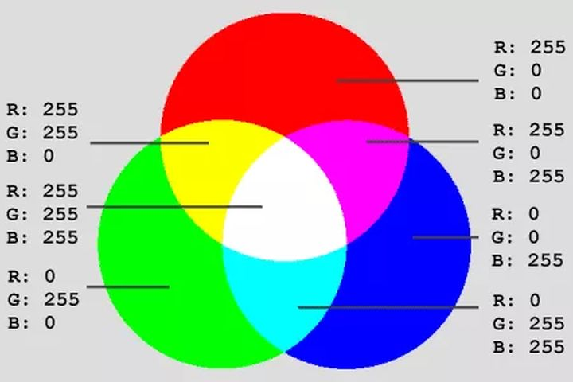

### 计算机图像像素存储

刚刚我们了解了计算机中颜色的取值，那么具体的图像是如何实际存储在计算机上的呢？下面我们就带领大家来学习一下计算机保存图像的两种流行格式- 灰度和 RGB 格式。

#### 灰度图像

举个栗子，下面展示了一个图像，我们看不到彩色的点，因为图像是由黑色、白色和灰色组成的，我们称之为灰度图像，也可以叫做黑白图像。

现在，我们对上面的图像进行放大并且仔细观察，你会发现图像变得失真，并且你会在该图像上看到一些小方框。

在计算机中，这些一个个的小方框就叫做像素（Pixels）。我们经常使用的图像维度是H x W。这实际上是什么意思？这意味着图像的尺寸就是图像的高度（height）和宽度（width）上的像素的数量。

比如，我们举例的图像高度为24像素，宽度为16像素。因此我们说该图像尺寸是24 x 16。我们在计算机上看到的所有图像，都是以数字的形式存储在计算机中，我们继续看下图。

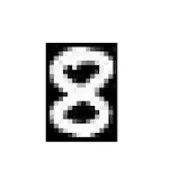

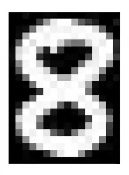

上图中的每一个像素都用一个数值来表示，而这些数字称为像素值。这些像素值表示像素的强度。

**重点：** 对于灰度或黑白图像，我们的像素值范围是0到255。

接近零的较小数字表示较深的阴影，而接近255的较大数字表示较浅或白色的阴影。

在计算机中的每个图像都以这种形式保存，我们可以称它为一个数字矩阵，该数字矩阵也称为通道（Channel）。

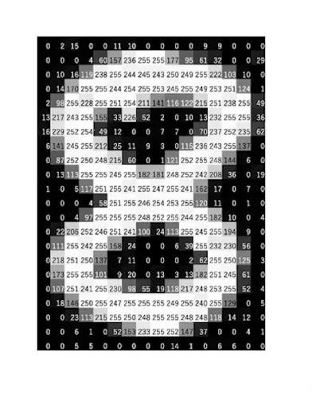

现在我们来猜猜这个矩阵的形状？答案是：它和图像的高度和宽度上的像素值数量相同。也就是说上面矩阵的形状是24 x 16。

**重点：** 让我们快速来总结一下到目前为止我们已经学到的要点：
- 图像以数字矩阵的形式存储在计算机中，其中这些数字称为像素值。
- 这些像素值代表每个像素的强度。
- 0代表黑色，255代表白色。
- 数字矩阵称为通道，对于灰度图像，我们只有一个通道。

#### 彩色图像

我们了解了灰度图像是如何存储在计算机中，接下来让我们学习了解一下更深度一点的知识，彩色图像又是如何存储在计算机当中的呢，它和灰度图像有哪些相同点和不同点呢？我们带大家一起来看看，下面是一张狗狗的彩色图像。

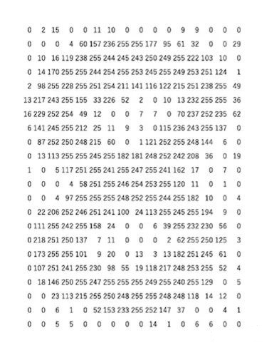

彩色图像由许多的颜色组成，几乎所有颜色都可以从三种原色（红色，绿色和蓝色）合成。我们的理解是：每个彩色图像都是由这三种颜色（或称为3个通道红色、绿色和蓝色）叠加混合组成的，看下图。

这就意味着在彩色图像中，矩阵的数量或通道的数量将会比灰度图像要多。我们举个简单的例子，我们有3个矩阵：1个用于红色的矩阵，称为红色通道。另一个绿色的称为绿色通道。

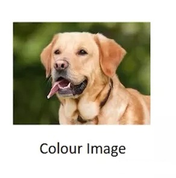

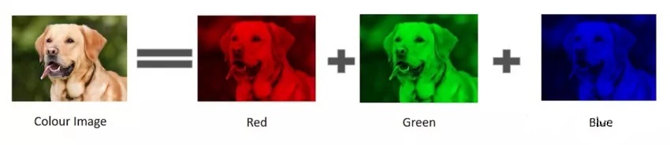

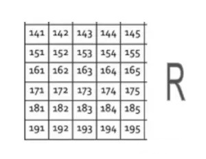

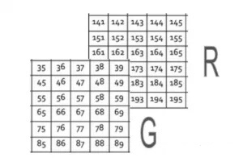

最后是蓝色的矩阵，也称为蓝色通道。

这些矩阵（通道）里面的坐标位置对应图像像素点，矩阵（通道）里面的值（0到255）代表像素的强度，你可以说是红色，绿色和蓝色色彩的强度。最后，所有这些矩阵（通道）都将叠加在一起，这样，当图像的形状加载到计算机中时，它会在二维矩阵上面再加上一个维度，我们说彩色图像在计算机中以三维矩阵来进行存储：

**H × W × 3**

其中 H 是整个高度上的像素数，W 是整个宽度上的像素数，3表示颜色通道数，在这种情况下，我们有3个通道R，G和B。我们上面的示例中，彩色图像的形状将是 6 x 5 x 3，因为我们在高度上有6个像素，在宽度上有5个像素，并且存在3个通道，了解了颜色通道，接下来我们来学习H（高度）、W（宽度）的具体内容。

### 图像坐标系

在使用OpenCV的时候，其实经常会用到对图像像素的操作。取单个像素，取部分像素(ROI操作)，这些OpenCV都给我们提供了接口，但是千万注意像素的坐标（横坐标和纵坐标），行和列之间到底是什么关系？什么时候又该用坐标，什么时候又该用行列？下面我将会细细道来。

#### 行列

行和列一般使用在矩阵中，属于矩阵中的概念，也就是OpenCV-Python中的numpy的Array（二维数组）对象。如下图：

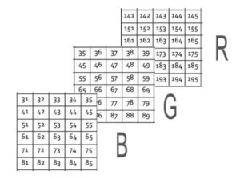

#### 宽和高

宽和高是图像中的概念，内行人说矩阵，外行人是看图像的。一副图像的宽和高是相对的，看当前的方向。一般来说，宽对应像素矩阵的列，高对应像素矩阵的行。

#### x 和 y

其实我们在学习初中平面几何的时候，最常使用的坐标就是x和y，我们会默认的将x认为是横坐标，y认为是纵坐标。我们有这样先入为主的概念，其实，这个只是使用习惯的问题。我们也可以用y去代表横坐标，x去代表纵坐标，所以从本质上来说，x和y是没有任何物理意义的。如果按照x是横坐标，y是纵坐标的习惯去看，结合到图像中的坐标系一般是以左上角为原点，x轴向右，y轴向下，则x对应的范围是[0,col)，y对应的范围是 [0,row)。即x对应列，y对应行。

### 获取图像属性

刚刚我们学习了图像的坐标系，了解了行列、宽高和像素坐标位置，那么我们怎么去获取图像的这些信息呢？接下来我们就来教大家怎么去获取一个图像的相关属性，包括行数，列数和通道数，图像数据类型，像素数等。

首先，在获取图像属性之前，我们需要加载图像，取得图像对象，通过图像对象的属性和函数我们就可以方便的查看图像的相关属性值了。本文档我们会以下面的示例图像（宽1080、高853的彩色图像）来带领大家学习使用OpenCV。

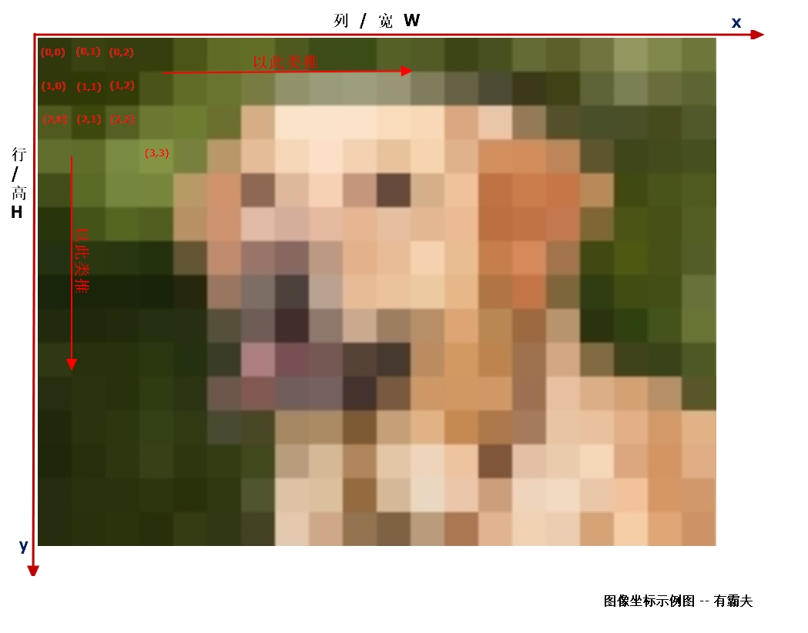

第一步、使用OpenCV加载图像

```python
import cv2 as cv

# 注意 cv.imread() 默认加载的是彩色图像
# 图像文件名字 -- 不能包含中文字符
# xxl_001.jpg 图像尺寸 （宽1080、高853）
img = cv.imread("xxl_001.jpg")
```

#### 行、列和通道数

使用OpenCV获取图像的行数，列数和通道数非常的简单，使用前面的图像对象，通过 img.shape 就可以轻松获取到图像的行数、列数和通道数量。

它返回行，列和通道数的元组（如果图像是彩色的）

注意如果图像是灰度的，则返回的元组仅包含行数和列数，因此这是检查加载的图像是灰度还是彩色的好方法。 上代码：

```python
# 彩色图像
print(img.shape)
# 输出
# (853, 1080, 3)
```

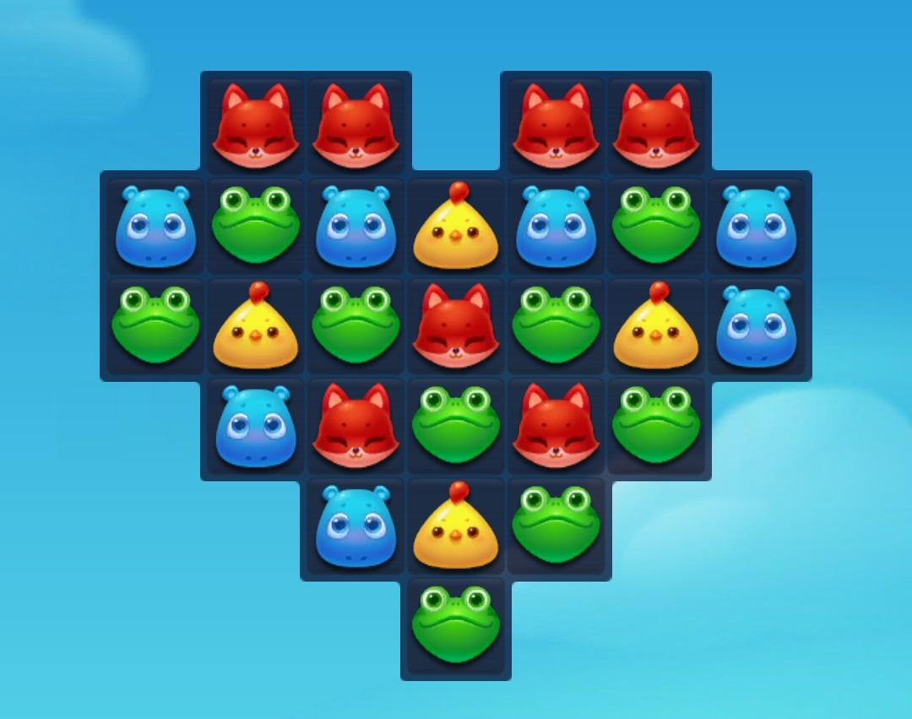

#### 图像像素总数

图像像素总数就是说图像有多少个像素点，也就是图像的行列乘积，我们可以通过img.size来获取，我们使用如下代码来进行测试和查看。

思考一下这个 2763720 是怎么得出来的呢？

答案其实很简单：就是 853 * 1080 * 3， 三个乘数对应着行、列和通道总数。 上代码：

```python
# 输出图像像素总数
print(img.size)
# 输出
# 2763720
```

### 图像灰度化

前面我们已经了解了灰度图像的概念，灰度图像就是黑白图像，每个像素点都是由黑白色组成，黑白色有不同的亮度，在计算机中用 0 到 255 来显示。那么问题来了，我们怎么使用OpenCV让一个彩色图像装换成灰度图像呢？方法非常的简单，我们来给大家演示一下。

这里需要注意一点，使用 cv.cvtColor 函数并不是直接将 img 图像改成了灰度图像，而是相当于拷贝了一个img 副本再转换成灰度图像，是一个新的图像对象。 上代码：

```python
import cv2 as cv

# 注意 cv.imread() 默认加载的是彩色图像
# 图像文件名字 -- 不能包含中文字符
img = cv.imread("xxl_001.jpg")

# 第二种方法
# 将彩色图像转换成灰度图像使用cvtColor 函数，
# 第一个参数img 图像对象，第二个参数cv.COLOR_BGR2GRAY， 返回的对象就是灰度图像了
img2 = cv.cvtColor(img, cv.COLOR_BGR2GRAY)

# 水平组合 -- 这里我们为了展示处理后的图像的对比关系，简单写了一个多图展示小工具
combined_image = ManyImages(([img, img2]))
cv.imshow("show", combined_image)
cv.waitKey(0)
cv.destroyAllWindows()
```

效果如下图：

### 图像二值化

#### 什么是图像二值化

图像二值化可以简单理解成，就是把图像转换成黑白两种颜色（一般用于提取图像特征），二值化图像：只有两种颜色，黑和白，255白色，0黑色。

结合前面学习的彩色图像和灰度图像，一起来做个对比。
- 彩色图像：三个通道0-255，0-255，0-255，所以可以有2^24位空间
- 灰度图像：一个通道0-255,所以有256种颜色
- 二值图像：只有两种颜色，黑和白，255白色，0黑色

#### 二值化图像有什么作用

二值化图像一般用来提取图像特征，也就是为了将感兴趣的目标和背景分离，我们可以理解为图象二值化是后续图象处理技术的基础。

图像的二值化是最简单的图像处理技术，它一般都跟具体算法联系在一起，很多算法的输入需要是二值数据。比如我们要提取消消乐游戏界面的可操作区域，就需要将操作区域和背景进行分离。比如要把图像文字转换为PDF文字，PDF上只能是黑白两种颜色。

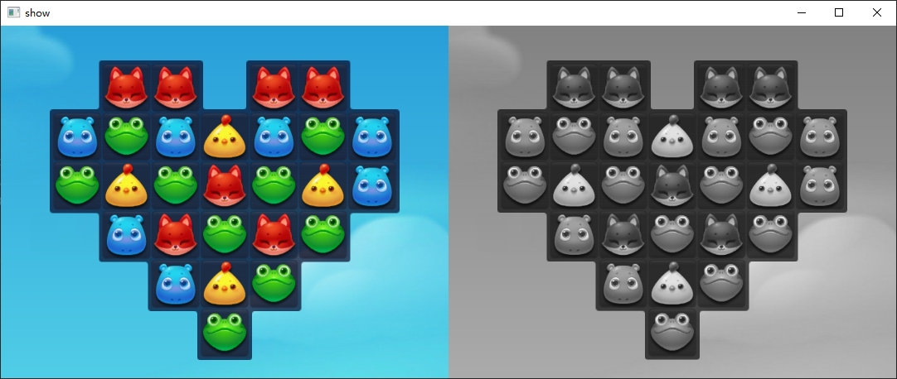

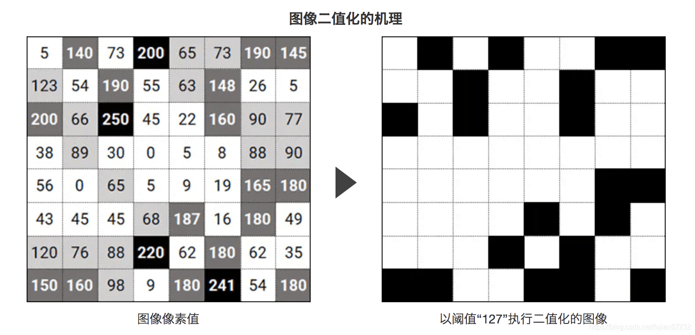

#### OpenCV将图像二值化

第一步、转成灰度图像（一般在图像二值化前，需要对图像进行灰度处理）

```python
img = cv2.cvtColor(img, cv2.COLOR_BGR2GRAY)
```

第二步、对灰度图像进行二值化

我们来学习了解一下OpenCV二值化函数的参数作用以及返回类型。 上代码：

```python
# 图像二值化函数函数 cv2.threshold(src, thresh, maxval, type)
# 用法示例
ret, img = cv2.threshold(img, 127, 255, cv2.THRESH_BINARY)
```

参数说明：

| 参数 | 描述 |
|------|------|
| src | 源图片，必须是单通道，即灰度图 |
| thresh | 用于对像素值进行分类的阈值，取值范围0～255 |
| maxval | 填充色，如果像素值大于（有时小于）阈值则要给出的值，取值范围0～255 |
| type | 阈值类型 |

type 阈值类型表：

| 阈值类型 | 用数字表示 | 小于阈值的像素点 | 大于阈值的像素点 |
|----------|------------|------------------|------------------|
| cv2.THRESH_BINARY | 0 | 置0 | 置填充色maxval |
| cv2.THRESH_BINARY_INV | 1 | 置填充色maxval | 置0 |
| cv2.THRESH_TRUNC | 2 | 保持原色 | 置灰色 |
| cv2.THRESH_TOZERO | 3 | 置0 | 保持原色 |
| cv2.THRESH_TOZERO_INV | 4 | 保持原色 | 置0 |

图像二值化可以看作是聚类，可以看作是分类……这些其实不重要，重要的是它快。它最明显的意义就是简化后期的处理，提高处理的速度。 上代码：

```python
import cv2 as cv

# 注意 cv.imread() 默认加载的是彩色图像
# 图像文件名字 -- 不能包含中文字符
img = cv.imread("xxl_001.jpg")

# 使用cvtColor 函数将图像灰度化
img2 = cv.cvtColor(img, cv.COLOR_BGR2GRAY)

# 将灰度图像二值化
ret, img3 = cv.threshold(img2, 127, 255, cv.THRESH_BINARY)

# 水平组合 -- 这里我们为了展示处理后的图像的对比关系，简单写了一个多图展示小工具
combined_image = ManyImages(([img, img2, img3]))
cv.imshow("show", combined_image)
cv.waitKey(0)
cv.destroyAllWindows()
```

## 图像匹配

### 什么是图像匹配

图像匹配，就是从一个图像中找出想要的小图像，举个栗子：就好比拿着一张头像寸照，然后去大学毕业照里面一个个的头像对照然后将目标找出来。

图像匹配包含模板匹配和特征匹配，模板匹配是一种最原始、最基本的模式识别方法；特征匹配相对模板匹配要复杂很多，这里先不做深入讲解。我们重点来学习了解模板匹配。

模板匹配是在一幅图像中寻找一个特定目标的方法之一，这种方法的原理非常简单，遍历图像中的每一个可能的位置，比较各处与模板是否"相似"，当相似度足够高时，就认为找到了我们的目标。

OpenCV给我们提供一个函数cv.matchTemplate()， 它将模板图像滑动到输入图像上，然后在模板图像下比较模板和输入图像的拼图。 OpenCV中实现了几种比较方法。它返回一个灰度图像，其中每个像素表示该像素的邻域与模板匹配的程度。

接下来我们用实例来展示OpenCV模板匹配的使用方法。

### 使用OpenCV模板匹配

#### 单对象模板匹配

```python
import cv2 as cv

# 读取图像
img = cv.imread("xxl_001.jpg")
gray_img = cv.cvtColor(img, cv.COLOR_BGR2GRAY)

# 读取需要检测的图像
img_template = cv.imread("bird.jpg")
# 一定记得转换成灰度图像
img_template_gray = cv.cvtColor(img_template, cv.COLOR_BGR2GRAY)

# 得到图像的高和宽
h, w = img_template_gray.shape

# 模板匹配
res = cv.matchTemplate(gray_img, img_template_gray, cv.TM_CCOEFF_NORMED)

# 获取匹配位置
threshold = 0.8
loc = np.where(res >= threshold)

# 绘制矩形
for pt in zip(*loc[::-1]):
    cv.rectangle(img, pt, (pt[0] + w, pt[1] + h), (0, 0, 255), 2)

cv.imshow('result', img)
cv.waitKey(0)
cv.destroyAllWindows()
```

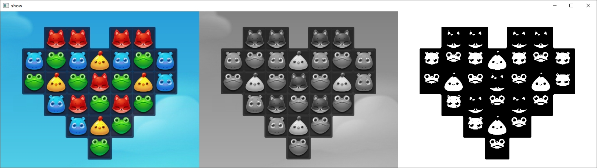

代码效果图如下：

## 文档总结

本节课我们深入学习了OpenCV的图像处理知识，包括：
- 图像的存储方式（灰度和彩色）
- 图像坐标系
- 获取图像属性
- 图像灰度化
- 图像二值化
- 模板匹配

## 练习题

1. （单选题）彩色图像在计算机中的存储维度是：
   - A. H × W
   - B. H × W × 1
   - C. H × W × 3
   - D. H × W × 4

2. （单选题）OpenCV中图像二值化的函数是：
   - A. `cv.binary()`
   - B. `cv.threshold()`
   - C. `cv.binarize()`
   - D. `cv.convert()`

3. （编程题）编写一个程序，使用OpenCV实现模板匹配功能，从一张大图中找出小图的位置并标记出来。