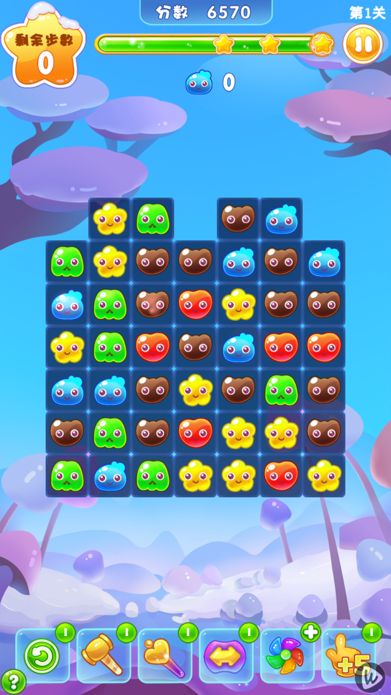
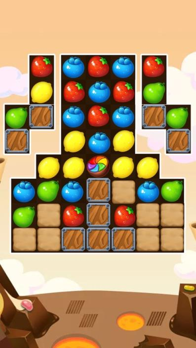
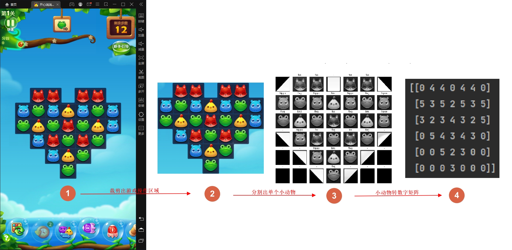
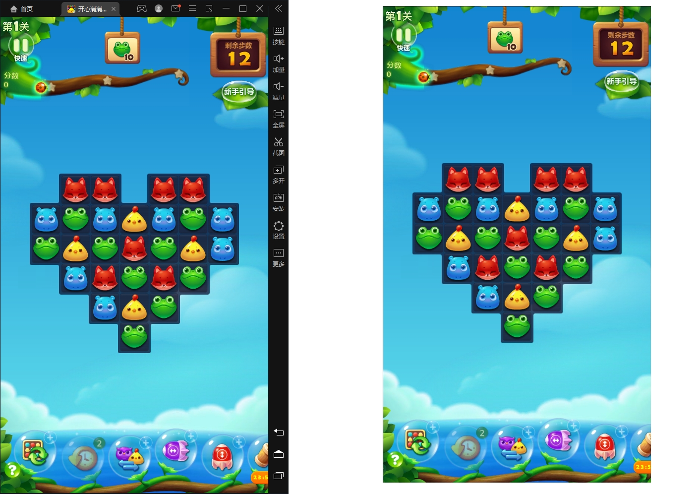
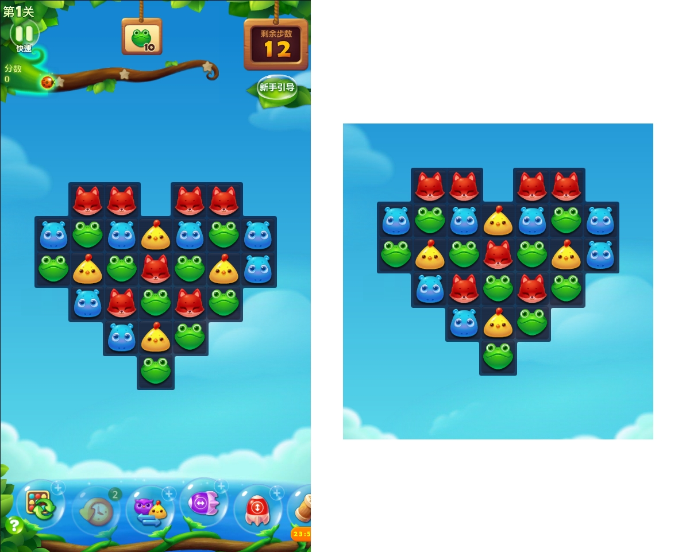
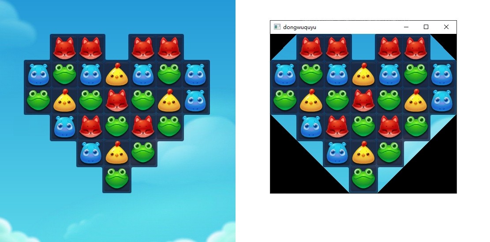
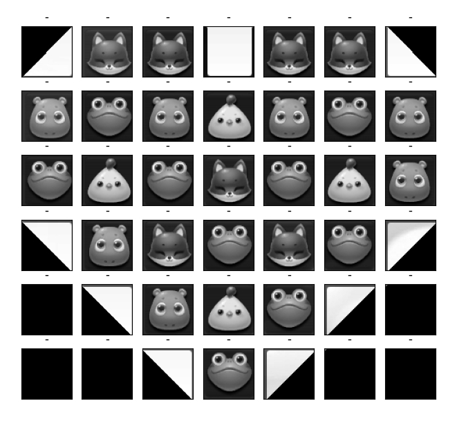
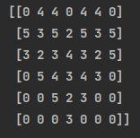

# OpenCV 消除算法

## 课程回顾

本文档开始之前我们来回顾一下昨天所学的知识内容，因为今天要学的内容和昨天内容有着紧密的联系。昨天的课程主要讲解了计算机的图像相关基础知识，图像坐标系，图像灰度化，图像二值化，使用OpenCV进行图像匹配、图像切割，还尝试了对图像进行轮廓处理。

在前面的学习中，我们已经掌握了使用OpenCV进行图片处理的相关知识，之所以做了那么多的铺垫，目的就是为这篇文档服务的。

写出这个游戏的自动化脚本中，图像的处理占了超过一半的工作量，这也是模拟类自动化脚本的常见情况。

## 图像处理的目的

图像处理的目的是什么？**是把图像识别成简单的数据类型或数据结构，以便于使用算法来解决问题。**

大家来想一想，在这些消消乐游戏中，消除的规则是非常明确的，其实跟具体的画面表现形式是无关的。意思就是在不同的消消乐游戏中，用小动物来表示，用水果来表示，还是用糖果来表示，消除的规则都是一样的，只要是同类型道具的数量，在横行或竖行上有大于或等于3个时，就可以消除。

比如我们来下面的类似消消乐的游戏界面：



那么，为了方便计算，就可以把同类型的道具转化成对应的数字编号。转化后，我们只需要关心这些数字的排列关系，而不用管图像方面的事情。

这样做有2个好处：
1. 简化概念，方便计算。
2. 通用适配，便于扩展。

现在做的是开心消消乐的自动化脚本，那其他的同类型的游戏，你把图片换换，更改下相关坐标，很快就可以就可以用上。

这就是我们的课程，为什么跟市面上的课不一样，跟那些基于找图找色的按键精灵、易语言写的那些脚本不一样，这是基于图像识别的方法，使用分层思想来设计模型，帮助大家真正提高从底层逻辑去建立起解决问题的思维，这在大家以后不光是学编程，写python，做脚本时非常有用，对于生活中、学习中、工作中的复杂问题的解决，同样可以有很大的帮助。

人跟人的本质区别，在于思维的层次差别。

用OpenCV来做图像处理是非常方便又高效的，处理的目的就是把图像转化成我们需要的简单数字模型：



对于这样类型简单，结构清晰的数字矩阵，写起消除算法来就容易多了。

## 概念说完了，具体怎么做？

概念说完了，那么具体要怎么样把包含小动物的可操作的游戏区域裁剪出来呢，裁剪出当前关卡所有小动物区域，又怎么把一个个小动物裁剪出来呢？

不用着急，我们今天就带领一步一步来解决掉这些问题，开始之前我们可以先分析整理一下思路：

**第一步**，去除雷电模拟器的上面和右边的边框，因为模拟器边框对图像处理是干扰和障碍，所以要把雷电模拟器上边和右边的黑边框裁掉；

**第二步**、我们把小动物可能会出现的游戏区域裁剪出来，因为在消消乐游戏界面当中，可点击操作的小动物区域只是游戏界面的中间部分；

**第三步**、根据轮廓精准切割出当前游戏关卡的小动物区域，因为只有获得精准的操作区域，才能方便快捷的分割出每一个小动物。

**第四步**、识别切割出来的每个小动物并进行标记分类，因为对小动物进行分类编号，就可以将图像转换成数字矩阵，数字矩阵是分析如何点击操作的基础。

**第五步**、分析处理得到的数字矩阵（就可以进行简单的算法处理），得出可点击操作的方案列表。

**第六步**、根据得到的操作方案列表，调用鼠标对游戏界面进行模拟操作，实现自动游戏。

有了上面整理出来的思路，接下来我们就带领来一步步来实现我们的思路。

## 切割出游戏操作区域

### 裁掉模拟器边框

要裁掉模拟器的边框，使用昨天学到的内容，只要用工具找出游戏界面的的左上角坐标和右下角坐标，就能很方便实现。

得到的效果如下：

```python
# 截出整个消消乐游戏界面模拟器分辨率设定 540 * 960
game_interface = emulator_screen[34:960 + 34, 1:540 + 1]
```



### 裁出小动物能出现区域

得到了消消乐整个游戏界面，接下来就来实现第二个步骤，根据对消消乐不同关卡的试玩，我们发现，出现最多小动物的情况是9行乘以9列，游戏界面的宽度是540像素，除以9列我们得到每列列宽60像素，而小动物的形状是正方形，因此可以得出小动物所有能出现的区域就是游戏界面中间540 * 540的范围，为了稳妥起见，可以对上下稍微多截取一点。

得到效果如下：

```python
# 从消消乐游戏界面裁出小动物能出现区域 540 * 560
animal_area = game_interface[240:800, 0:540]
```



### 裁出包含所有小动物的最小区域

获得了整个小动物能够出现的区域，我们还不能直接对小动物进行切割，为什么呢？

因为消消乐的每一关小动物出现的区域都是居中的，而且每一关都是变化的，那么就需要通过找出当前光卡小动物区域的轮廓，通过轮廓信息计算出切割的最小矩形，并将其切割出来，这里就用到了我们昨天学习关于轮廓的相关知识，跟着通过代码来将其实现出来。 上代码：

```python
# 这里将三次切割裁剪通过一个函数来实现，因为在模拟过程中要不断的去截图判断、再裁剪
def crop_animal_range(emulator_screen):
    # 第一步固定范围裁剪
    game_interface = emulator_screen[34:960 + 34, 1:540 + 1]
    
    # 第二步按小动物能出现区域来裁剪
    # 裁剪游戏出游戏操作区域
    animal_area = game_interface[240:240 + 540 + 10, 0:540]
    
    # 获取图像hsv通道
    hsv = cv.cvtColor(animal_area, cv.COLOR_BGR2HSV)
    
    # 去除高亮背景
    lower, upper = np.array([0, 0, 0]), np.array([255, 255, 180])
    mask_bg = cv.inRange(hsv, lower, upper)
    
    # 查找轮廓
    contours, hierarchy = cv.findContours(mask_bg, cv.RETR_EXTERNAL, cv.CHAIN_APPROX_SIMPLE)
    
    # 生成和原图一样高度和宽度的矩形（全为0的蒙版） 然后将图像的所有像素由 0 变为 255
    # （0表示黑，255表示白）
    mask = np.zeros((animal_area.shape[0], animal_area.shape[1]), np.uint8)
    
    # 要保留的轮廓数组
    need = []
    left, top, right, bottom = animal_area.shape[0], animal_area.shape[1], 0, 0
    
    for cnt in contours:
        # 轮廓凸包处理
        hull = cv.convexHull(cnt)
        # 计算轮廓面积
        area = cv.contourArea(hull)
        x, y, w, h = cv.boundingRect(cnt)
        
        # 筛选保留游戏区域
        if area > 3600 and (w >= 60 and h >= 60):
            need.append(hull)
            left, top = min(left, x), min(top, y)
            right, bottom = max(right, x + w), max(bottom, y + h)
    
    # 填充面积符合要求的轮廓
    copy_img = cv.drawContours(mask, need, -1, 255, cv.FILLED)
    
    # result
    result = cv.copyTo(animal_area, copy_img)
    current_level_area = result[top:bottom, left:right]
    
    return current_level_area, left, top
```



以上代码可以实现如下效果：



## 图片转矩阵 - 给动物编号

接下来的工作就是把对应的位置的小动物转换成对应的数字编号就行。

来，大家观察一下，这张只包含了小动物的图片，它有什么特点？

可以发现，每种小动物不管真实大小如何，在这个游戏格子里，每个动物的图片所占据的区域的大小都是相同的。

所以，我们可以从第一个格子开始，跟已经保存到图库里的小动物一个个进行比较，如果两个图片相似度非常高，那么就把这个格子标记成对应的数字。

既然如此，那就把小动物图库做出来。

在工程的 res 目录下，创建一个名叫 `cell_temp_540`（540对应模拟器的分辨率宽度）的文件夹，用来表示小动物们的图库，把所有的小动物类型都放到这个目录下。

这里要注意一点，一般在这个文件夹下，会选择直接放各种小动物们的图片，每种动物放一张图片来表示对应的分类，但以多年的经验告诉你，我们最好还是再创建一层文件夹。

如果现在不理解为什么，不要紧，先照说的来做。

在之前玩游戏时，大家有没有注意到，这个开心消消乐游戏中，一共有几种小动物？不管那些特殊的类型，哪位同学先答出来，一会课后发个奖励。

好，一共是6种普通类型的小动物，分别是小棕熊、小河马、小狐狸、小青蛙、小黄鸡、猫头鹰。那么我们就创建6个文件夹，分别以它们的名字（注意不能用中文命名文件夹）来命名。

接下来，我们就把各种小动物们的图片截下来，放到对应名字的文件夹里。这里我已经提前截好了，到时也会发给大家。

大家注意看了，即将揭晓谜底了。为什么每种小动物要创建一个文件夹来放图片？因为游戏中有动画，小动物会有各种角度的照片，为了提高识别的准确率，把多个角度的照片都截下来了。把这些同一种小动物的不同角度图片都放到对应的文件夹中，这样就不怕认不出来了。

### 怎么给这些小动物编号呢？

大家还记得上学的时候，每个人都分配了一个学号对吧？老师在不熟悉大家的时候，可以直接通过学号来喊同学来回答问题，班主任手里会有本花名册，每个学号对应着一个学生姓名，一个学生姓名也对应着一个学号，这种关系就是映射关系。

这里用到一个巧妙的方法，用字典来达成映射关系。字典在之前的学过，大家还记得吧?

定义一个字典，这样通过动物花名册就可以快速找到对应的编号。 上代码：

```python
animal_registry = {"bear": 1, "bird": 2, "frog": 3, "fox": 4, "hippo": 5, "owl": 6}
```

有了花名册，接下来我们来实现一个函数，传入一张小动物图片，返回这个动物的编号。 上代码：

```python
def 识别动物编号(tile):
    for name, index in 小动物花名册.items():
        pic_files = os.listdir(pic_path.format(name))
        for pic in pic_files:
            flag = find(tile, cv.imread(pic_path.format(name) + pic, 0))
            if flag:
                return index
    return 0
```

接下来再写点代码来测试下这个函数识别出来的动物代码到底对不对，我事先截好了一些图片，放在D盘下的test文件夹里了，把这些图片读取进来，然后调用这个识别动物编号的函数，看看返回的值是不是对的：

```python
test_image = cv.imread('D:\\test\\小棕熊1.bmp')
id = recognize_animal_id(test_image)
print(id)
```

一个个运行，可以看到识别出来是对的。

有了这个识别的函数，接下来的工作就是把这个可消除区域里的小动物们，一个个送到这个函数里，依次进行识别，再把识别结果保存成一个矩阵。

这里我们可以把图片划分成一个个的小格子，每个格子都是60×60像素（注意这里使用的模拟器分辨率是540×960），先从第一行第一个开始，先横排，再竖排，把这些小格子一个个切出来看看。

首先我们来算一下，这个图片能切成多少个格子，也就是横排能切成几个，竖排能切成几个。

每个格子60像素，一刀刀往右切，再一刀刀往下切。

在画图中，可以看到这个图片的宽度是xxx像素，高度是yyy像素，那么就可以算出横排和竖排能切出来的数量。

然后再通过循环嵌套来依次切割每一行，每一列。tile就是切出来的每个待检测的动物图片，把这个图片显示出来看看，这里是示意效果，上述代码还不能实现具体效果。 上代码：

```python
animal_rows = int(key_region.shape[1] / cell_side)
animal_cols = int(key_region.shape[0] / cell_side)

for i in range(0, animal_rows):
    for j in range(0, animal_cols):
        tile = img[i * cell_side:(i + 1) * cell_side, j * cell_side:(j + 1) * cell_side]
```

接下来把这些图片，一个个放入到检测函数中去识别，把返回的结果保存起来。

这样就把一个个的动物图片，全都转成了数字矩阵了。

打印出来看看：

```python
def convert_animal_image_to_matrix(key_region):
    # 处理游戏操作区域转换成 2维数组
    key_region = cv.cvtColor(key_region, cv.COLOR_BGR2GRAY)
    animal_rows, animal_cols = int(key_region.shape[1] / cell_side), int(key_region.shape[0] / cell_side)
    number_matrix = []
    
    for i in range(1, animal_cols + 1):
        for j in range(1, animal_rows + 1):
            tile = key_region[(i - 1) * cell_side:i * cell_side, (j - 1) * cell_side:j * cell_side]
            mat_tag = recognize_animal_id(tile)
            number_matrix.append(mat_tag)
    
    number_matrix = np.array(number_matrix).reshape(animal_cols, animal_rows)
    return number_matrix

print(number_matrix)
```



用纯粹的数字矩阵来表示类别和位置关系，这就是我们要的效果。

## 消除算法

得到小动物对应的数字矩阵之后，接下来的工作就是对矩阵进行处理。

分析判断：如何去交换矩阵中相邻数字的位置，可以让交换后的矩阵，能够在行或者列的方向得到大于等于3个同样数字的情形，也就是达成消消乐消除小动物的规则。

这个具体要怎么实现呢，其实原理很简单。

就是对数字矩阵中所有可以交换的位置，对其进行交换，在判断交换后是否有符合我们需要的目标情形，如果有就将其记录下来，如果没有就对下一个可交换位置进行判断，这里通过循环嵌套去实现。

接下来我们带领大家一步步来实现完成。

### 交换实现

我们先来分析一下矩阵中数字可以怎么交换。

矩阵中第一个（0,0）位置，对应游戏中就是左上角的位置，这个位置只能跟右边位置（0,1）和下边（1,0）的位置进行交换一共两种交换情况。

接下来分析矩阵（0,1）位置，（0,1）可以和（0,0）、（0,2）、（1,1）三个位置进行交换，对应交换方位是左边、右边、下边，有没有发现其实这个和左边的交换也就是前面（0,0）位置的向右交换，效果是完全一样的。

再来分析矩阵（1,0）位置，（1,0）可以和（0,0）、（2,0）、（1,1）三个位置进行交换，对应交换方位是上边、下边、右边，这时候我猜已经发现了其实这个和上边的交换也就是前面（0,0）位置的向下交换，效果也是完全一样的。

矩阵（1,1）位置，（1,1）可以和（0,1）、（1,2）、（1,0），（2,1）四个位置进行交换，对应交换方位是上边、下边、左边，右边四个方向。

通过上面的分析，虽然每个位置理论上最多可能有四种交换方式（上、下、左、右），但其中有些交换进行了重复计算，所以可以进行简化。

从综上的分析结果来看，对于矩阵中的每一个位置，我们只需要考虑它向右或向下（可交换的前提下）进行交换，判断交换后的结果能否达成消除条件即可。

这里理解起来可能会有点难度，相信花点时间思考一下会明白的。



我们得出了矩阵每个位置要交换的方向，接下来的任务就是编码实现。

来看代码：

```python
def swap_with_right(number_matrix, i, j):
    # 这里用到了numpy库对矩阵进行复制
    matrix = np.array(number_matrix, copy=True)
    matrix[i][j], matrix[i][j + 1] = matrix[i][j + 1], matrix[i][j]
    left_elimination_score = check_elimination_score(matrix, i, j)
    right_elimination_score = check_elimination_score(matrix, i, j + 1)
    return left_elimination_score + right_elimination_score

def swap_with_bottom(number_matrix, i, j):
    # 这里用到了numpy库对矩阵进行复制
    matrix = np.array(number_matrix, copy=True)
    matrix[i][j], matrix[i + 1][j] = matrix[i + 1][j], matrix[i][j]
    top_elimination_score = check_elimination_score(matrix, i, j)
    bottom_elimination_score = check_elimination_score(matrix, i + 1, j)
    return top_elimination_score + bottom_elimination_score
```

### 判断能否消除

每一个尝试交换后，都需要对交换后的结果进行判断，判断是否有可消除的情况达成，如果可消除返回大于0的数，不可消除即返回0。 上代码：

```python
def check_elimination_score(number_matrix, i, j):
    n, m = np.shape(number_matrix)
    horizontal_count = 1
    
    if j + 1 < m and number_matrix[i][j + 1] == number_matrix[i][j]:
        horizontal_count += 1
    if j + 2 < m and number_matrix[i][j + 2] == number_matrix[i][j]:
        horizontal_count += 1
    if j - 1 >= 0 and number_matrix[i][j - 1] == number_matrix[i][j]:
        horizontal_count += 1
    if j - 2 >= 0 and number_matrix[i][j - 2] == number_matrix[i][j]:
        horizontal_count += 1
    
    vertical_count = 1
    if i + 1 < n and number_matrix[i + 1][j] == number_matrix[i][j]:
        vertical_count += 1
    if i + 2 < n and number_matrix[i + 2][j] == number_matrix[i][j]:
        vertical_count += 1
    if i - 1 >= 0 and number_matrix[i - 1][j] == number_matrix[i][j]:
        vertical_count += 1
    if i - 2 >= 0 and number_matrix[i - 2][j] == number_matrix[i][j]:
        vertical_count += 1
    
    horizontal_score = 0
    if horizontal_count >= 3:
        horizontal_score = pow(horizontal_count, 3)
    
    vertical_score = 0
    if vertical_count >= 3:
        vertical_score = pow(vertical_count, 3)
    
    return horizontal_score + vertical_score
```

### 统计方案

每一次交换都会获得交换积分，如果积分大于0，就表示当前的交换是可行的，应该将其位置保存下来，记录到统一的方案表中。

### 方案选择

到这里我们已经成功的获取了通过交换可以实现小动物消除的所有可行方案表，接下来的任务就是从方案表中选取一个方案出来，计算出矩阵对应小动物在游戏中的具体位置，我们通过模拟鼠标点击去实现自动游戏。

从方案表中选取方案有很多的方式，我们可以选第一个、最后一个或是随意选取一个，都是可以的，下节课我们给讲解演示。

消除算法的全部代码如下：

```python
import numpy as np

def count_swap_plans(number_matrix):
    n, m = np.shape(number_matrix)
    print(n, m)
    plan_list = []
    
    for i in range(n - 1):
        for j in range(m - 1):
            if number_matrix[i][j] > 0 and number_matrix[i][j + 1] > 0:
                score = swap_with_right(number_matrix, i, j)
                if score > 0:
                    plan_list.append([j, i, j + 1, i, score])
            if number_matrix[i][j] > 0 and number_matrix[i + 1][j] > 0:
                score = swap_with_bottom(number_matrix, i, j)
                if score > 0:
                    plan_list.append([j, i, j, i + 1, score])
    
    return plan_list

# 根据传入的分类矩阵，计算出最佳的消除方案
```

## 今日文档总结

今天课程的主要内容是对图像进行处理，用到了图像切割，轮廓提取，模板匹配。通过对开心消消乐的游戏界面的一步步处理，将图片转换成了一个数字矩阵，然后对数字矩阵进行了交换分析，获得了一个可以交换方案列表。

## 练习题

1. **（单选题）** 给定一张 600×800 的大图像，从大图像中位置（10,20）开始，截出一张 100 × 200 的小图像，请在下面选项中找出可以实现的代码：
   - A、小图像 = 大图像[10:100，20:200]
   - B、小图像 = 大图像[20:200，10:100]
   - C、小图像 = 大图像[10:110，20:220]
   - D、小图像 = 大图像[20:220，10:110]

2. **（单选题）** 实现矩阵mat中位置[2,2] 和[2,3]进行交换，下面选项中那句代码可以实现：
   - A、mat[3][2], mat[2][3] = mat[2][3], mat[2][2]
   - B、mat[3][2], mat[2][2] = mat[2][3], mat[2][2]
   - C、mat[2][2], mat[2][3] = mat[2][3], mat[2][2]
   - D、mat[2][2], mat[2][3] = mat[2][2], mat[2][3]

3. **（单选题）** 名册 = {"bear": 1, "bird": 2, "frog": 3, "fox": 4, "hippo": 5, "owl": 6} ，名册在Python 中属于什么数据类型？
   - A、列表
   - B、字典
   - C、集合
   - D、元组