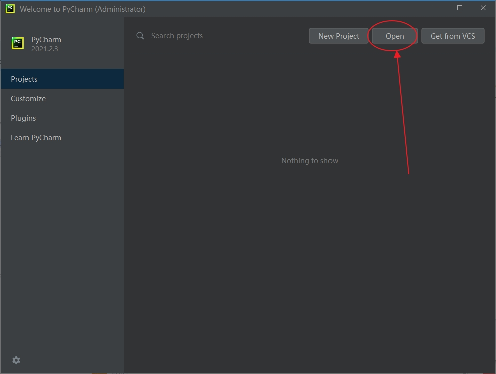
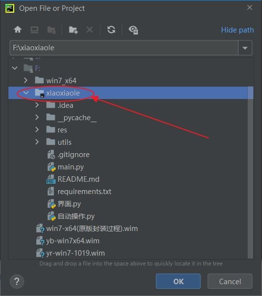
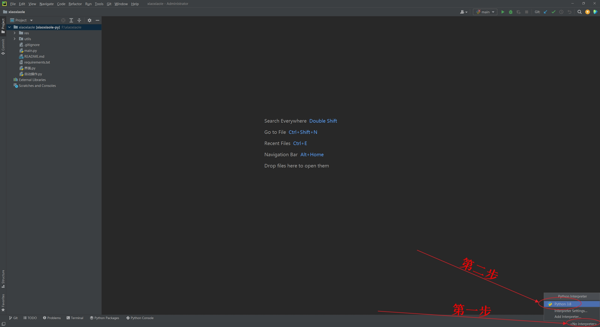
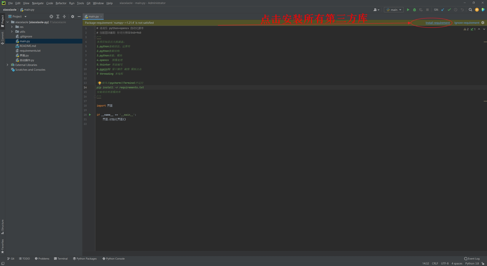
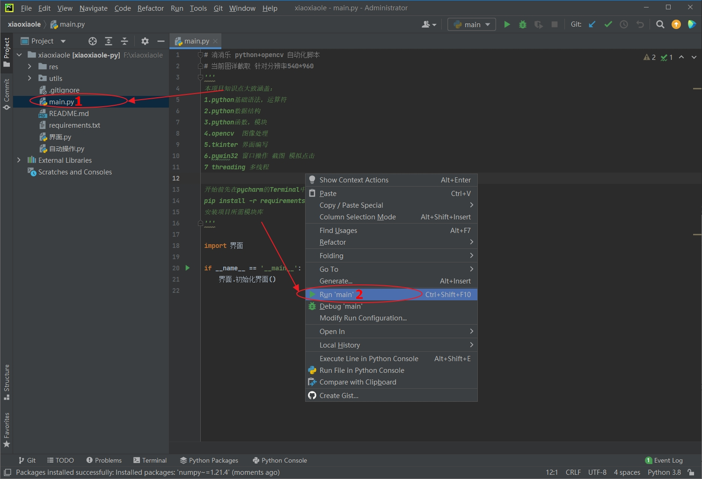
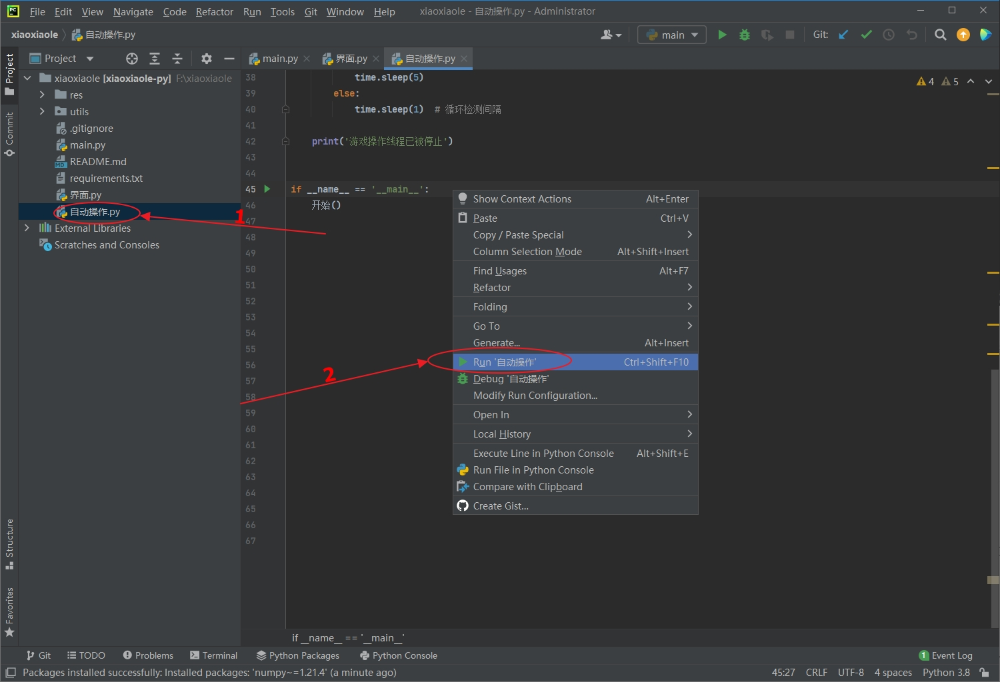
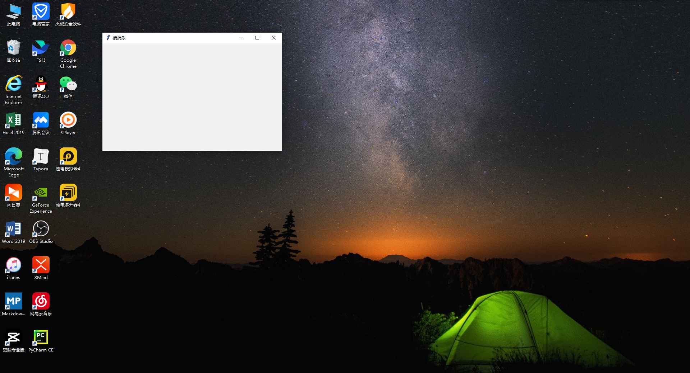
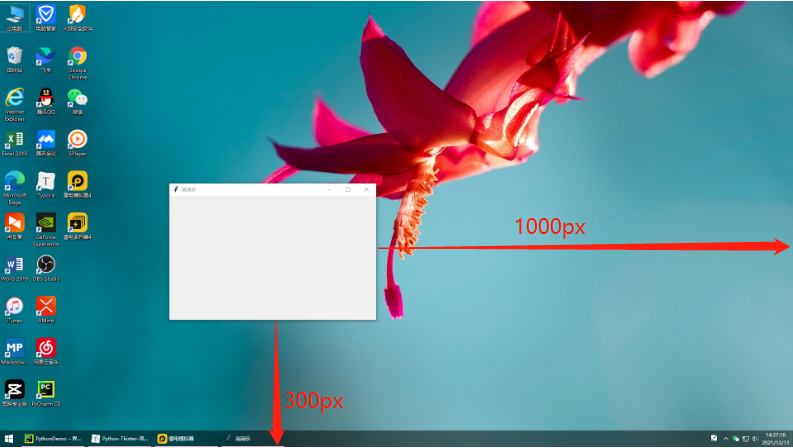
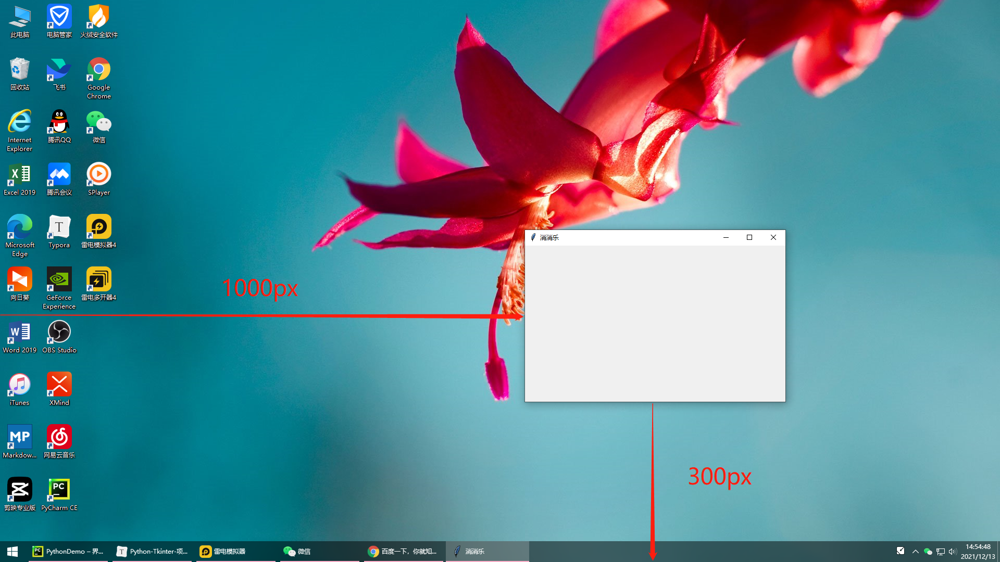
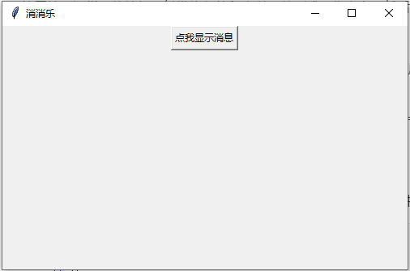

# 消除方案

## 🎯 内容回顾

是时候展示真正的技术了！

本文档开始之前，我们先一起来回顾一下上一篇的知识内容，上一篇所学的内容很关键，也是核心的内容。

我们带领学习了，如何实现将一张图像转换成数字矩阵。

主要步骤有：切除干扰边框，使用轮廓识别出关键游戏区域并进行裁剪，再对游戏关键图像按行列分割出所有小动物图像，使用模板匹配对小动物图像进行识别标记，存储到对应的矩阵列表中，按照消消乐游戏规则对数字矩阵进行计算，得出可以交换操作的可交换方案列表。

上一篇文档内容非常的丰富，理解难度较以前的文档有所提升，可能部分人不能马上理解吸收，没理解的也不用担心，今天我们还会带着跟着工程代码，一起来温习巩固上一篇的知识内容。

我们上一篇的主要学习目标是将消消乐游戏的截图转换成可计算的数字矩阵，主要有六个步骤，还记得吧，我们一起再来复习一下：

**第一步**，去除雷电模拟器的上面和右边的边框，因为模拟器边框对图像处理是干扰和障碍，所以要把雷电模拟器上边和右边的黑边框裁掉；

**第二步**、我们把小动物可能会出现的游戏区域裁剪出来，因为在消消乐游戏界面当中，可点击操作的小动物区域只是游戏界面的中间部分；

**第三步**、根据轮廓精准切割出当前游戏关卡的小动物区域，因为只有获得精准的操作区域，才能方便快捷的分割出每一个小动物。

**第四步**、识别切割出来的每个小动物并进行标记分类，因为对小动物进行分类编号，就可以将图像转换成数字矩阵，数字矩阵是分析如何点击操作的基础。

**第五步**、分析处理得到的数字矩阵（就可以进行简单的算法处理），得出可点击操作的方案列表。

**第六步**、根据得到的操作方案列表，调用鼠标对游戏界面进行模拟操作，实现自动游戏。

前面五个步骤已经讲解了，今天结合工程代码来给演示讲解一下。

首先跟着来学习一下怎么导入一个代码工程文件。







成功导入工程之后，来学习一下如何找到程序的主入口，程序主入口是整个程序很关键的一点。

学会了主入口，Python程序还有一个非常优秀的特点，就是Python非常容易进行单元测试，也就是每个代码文件，我们都可以很方便的进行测试，运行查看实现效果。





学会这些基础的代码调试技巧，跟着一起来调试代码，查看一下上一篇内容展现出来的具体效果。


---

代码写起来！

<details>
<summary>点击查看参考代码</summary>

```python
# 参考代码（待补充）

```

**思路解析**：

（解析待补充）

</details>
## 随机选取交换方案

刚刚我们带着结合代码工程进一步学习演示了游戏图像到可交换方案列表整个流程。

接下来的学习目标，就是对已经得到的可交换方案列表进一步处理，选取其中一个方案，将交换位置在计算机屏幕中计算出来，有了操作坐标，接下来就可以调用鼠标进行模拟移动和模拟点击了，达到真正实现自动游戏的目标。

可执行方案列表是一个列表，实际模拟操作中只需要其中的一个方案即可。

从方案列表中选取其中一个方案的方式有很多种：按顺序选可以选第一个到最后一个中的任何一个；按得分选可以选得分高的，也可以选得分低的；还可以随机从方案列表中进行选取。

我们先来学习一下比较符合我们自己手动玩游戏时的一种策略，就是随机从方案列表中选取一个方案进行操作。

从列表中随机选取一个元素，在之前得列表文档中有详细学过，再来回顾一下具体的用法。

结合随机模块random中的choice()方法可以很方便的从列表中随机获取一个元素，两行代码就可以实现：

```python
# 导入随机模块
import random

execution_plan = random.choice(elimination_plan_list)
```



## 模拟鼠标点击

有了执行方案，接下来的工作就要将方案中矩阵的点击交换位置，转换对应到模拟器窗口的坐标位置。

得到了要点击的窗口位置，就可以使用第六天课程学过的鼠标模拟点击知识，进行模拟操作了，这里还要注意的一点是，真正点击的是屏幕坐标，在点击的时候我们是做了一次转换的，也就是将窗口坐标转换成了屏幕坐标。

跟着一起来看看实现代码：

```python
def detect(img):
    # 传入模拟器截图，裁剪出动物关键区域图像
    key_region_image, left_x, top_y = crop_animal_range(img)
    
    # 关键区域图像，返回动物分类的数字矩阵
    number_matrix = convert_animal_image_to_matrix(key_region_image)
    
    # 传入分类矩阵，返回消除方案
    elimination_plan_list = elimination_algorithm.count_swap_plans(number_matrix)
    print(f"消除方案：{elimination_plan_list}")
    
    if len(elimination_plan_list) > 0:
        # 调用随机模块，从消除方案列表中选取出一个执行方案
        execution_plan = random.choice(elimination_plan_list)
        print('执行方案', execution_plan)
        
        # 修正坐标，还原消消乐游戏界面对应模拟器窗口坐标
        left_x += 1
        top_y += 34 + offset_top
        print('左上角坐标', left_x, top_y)
        
        # 重点！！！
        # 继续修正坐标，还原点击动物的位置对应模拟器窗口的坐标
        first_click_coord = (left_x + execution_plan[0] * 60 + 20, top_y + execution_plan[1] * 60 + 20)
        second_click_coord = (left_x + execution_plan[2] * 60 + 20, top_y + execution_plan[3] * 60 + 20)
        print('第一次点击坐标', first_click_coord)
        
        # 调用鼠标模块模拟点击
        mouse.click_emulator(first_click_coord)
        
        # 模拟等待2秒
        time.sleep(2)
        print('第二次点击坐标', second_click_coord)
        
        # 调用鼠标模块模拟点击
        mouse.click_emulator(second_click_coord)
        return True
    else:
        print('未找到可消除的方案')
        time.sleep(2)
        return False
```

这个检测函数是一次截图的处理结果，要想做到连续不断的进行自动游戏点击，就需要我们不断的截图判断，一直循环反复操作。

这里要用到while循环了，可以说是近乎 while 无限循环了，假设消消乐游戏每一关没有分数限制的话，就可以无限的模拟点击下去（当然这不现实）。

学到这里，可以结合代码来体验自动游戏的效果了，打开消消乐游戏，选取简单的关卡，执行下面代码看看有没有自动玩游戏。 上代码：

```python
def start():
    # running 开始设定为Ture
    while running:
        if not check_window():
            break
        
        img = window.get_emulator_image()
        has_ui_operation = ui_operation.detect(img)
        if has_ui_operation:
            continue
        
        has_game_operation = game_operation.detect(img)
        if has_game_operation:
            # 这里执行操作后等待5秒，因为游戏消除完成有动画效果，截图不能截太快，否则会截取到消除动画图像
            time.sleep(5)
        else:
            time.sleep(1)  # 循环检测间隔
    
    print('游戏操作线程已被停止')

if __name__ == '__main__':
    start()
```

## 图形用户界面（GUI）之tkinter

### 什么是图形用户界面

图形用户界面相信大家都不陌生的，就以我们打开电脑桌面为例，它就是一个图形化用户界面，我们通过鼠标对桌面上菜单，浏览器等图形化元素进行点击发出指令，接到指令后它会做出弹出菜单，或是打开网页这样的反馈，这其实就是一个最直接的图形用户界面的体现。

### Tkinter简介

作为Python开发者，图形用户界面的开发是必备技能之一。目前市面上支持Python的GUI工具有很多，包含TK, wxWidgets, Qt, GTK等等。在这些第三方库中，Tk是python自带支持的，不需要安装额外的开发软件，所以我们后面开发就使用Tk来进行学习了。

### TK以及tkinter的区别

- Tk是一个图形库，支持多个操作系统，使用Tcl语言开发
- Tk会调用操作系统提供的本地GUI接口，完成最终的GUI
- Python自带的tkinter封装了Tk的接口
- 我们只需要调用tkinter提供的接口就可以了

总而言之就是，我们在开发图形用户界面程序时只需要导入tkinter的模块就可以了。

### 窗体创建与布局

#### tkinter编程四步曲

利用tkinter模块进行图形化编程基本步骤通常包括以下四步:

- 导入 tkinter 模块
- 创建 GUI 根窗口（主窗口）
- 添加人机交互控件并编写相应的函数
- 在主事件循环中等待用户触发事件响应

一直这样泛泛而谈会显得枯燥了，鉴于此，我们接下来将通过一个个示例来介绍tkinter的相关知识。

### 窗口创建与布局

接下来，我们来创建一个窗口，tkinter创建窗口很简单，代码如下：

运行一下看看：一个名叫消消乐的窗口就出现了

代码很简单只有5行：
- 第一行是导入tkinter；
- 第二行是调用TK()方法初始化一个主窗口实例命名为主窗口；
- 第三行是调用title()方法设置标题文字；
- 第四行是调用用geometry()方法设置窗口的大小；
- 第五行则是调用mainloop()将窗口置于主循环中，除非用户关闭，否则程序始终处于运行状态。

这里我们主要看下第四行 geometry()方法:

这个方法设置的单位是像素，'500x300' 表示创建一个宽500像素，高300像素的窗口。这里注意啦注意中间的乘号是小写字母x，不是* 。 上代码：

```python
import tkinter as tk  # 导入tkinter模块

main_window = tk.Tk()  # 创建根窗体
main_window.title('消消乐')  # 设置窗口标题
main_window.geometry('500x300')  # 大小为500*300
main_window.mainloop()  # 放入主循环
```

我们多运行几次上面的代码发现每次窗口出现的位置都不是固定的，有没有方法使窗口在固定位置出现呢？答案是有的，还是geometry()方法。我们可以通过 + 号连接上X坐标跟Y坐标方向上的两个参数来设置窗口出现的初始位置，比如：

直接看代码：

```python
import tkinter as tk  # 导入tkinter模块

main_window = tk.Tk()  # 创建根窗体
main_window.title('消消乐')  # 设置窗口标题
main_window.geometry('500x300+1000+300')  # 大小为500*300，x坐标为1000，y坐标为300
main_window.mainloop()  # 放入主循环
```



这里位置用加号+设置，第一个+是窗口距离屏幕左边的距离（x坐标），第二个+是窗口距离屏幕上方的距离（y坐标)。

其实位置还可以通过减号-设置，第一个-是窗口距离屏幕右边的距离（x坐标），第二个-是窗口距离屏幕下方方的距离（y坐标）。比如：

直接看代码运行下看下二者的区别：

```python
import tkinter as tk  # 导入tkinter模块

main_window = tk.Tk()  # 创建根窗体
main_window.title('消消乐')  # 设置窗口标题
main_window.geometry('500x300-1000-300')  # 大小为500*300，x坐标为-1000，y坐标为-300
main_window.mainloop()  # 放入主循环
```


总而言之，如果X前面是+号则是表示窗口距离屏幕左边的距离，如果是-号则是表示窗口距离屏幕右边的距离，Y前面是+号则是表示窗口距离屏幕上方的距离，-号则表示窗口距离屏幕下方的距离。

同时加减号是可以同时使用的，比如：

```python
import tkinter as tk  # 导入tkinter模块

main_window = tk.Tk()  # 创建根窗体
main_window.title('消消乐')  # 设置窗口标题
main_window.geometry('500x300+1000-300')  # 大小为500*300，x坐标为1000，y坐标为-300
main_window.mainloop()  # 放入主循环
```

这是窗口的显示位置则是距离屏幕左边1000像素，距离屏幕下方300像素了。

这里注意一点，如果要设置位置必须同时设置X跟Y的值，不能只设置其中一个，会报错。下面这种方法是不可取的。 上代码：

```python
main_window.geometry('500x300+1000')  # 错误！
```





上面我们创建完窗口其实只是完成了tkinter编程四步曲的一二四步，只是一个空白的窗口。窗口里没有任何东西，也没什么交互，所以要想实现交互，我们就需要往窗口里添加tkinter的重要组成控件。

我们平时用到的按钮，文本框其实都是控件。那我们添加个按钮试下：

运行下看看，一个按钮的界面就出现了。

点下按钮：

```python
import tkinter as tk  # 导入tkinter模块
import win32api
import win32con

def show_message():
    win32api.MessageBox(0, "跟我学Python搞副业", "我是渣男教父", win32con.MB_OK | win32con.MB_ICONWARNING)

main_window = tk.Tk()  # 创建根窗体
main_window.title('消消乐')  # 设置窗口标题
main_window.geometry('500x300+1000+300')  # 大小为500*300，x坐标为1000，y坐标为300

my_button = tk.Button(main_window, text='点我显示消息', command=show_message)
# 默认布局显示按钮
my_button.pack()

main_window.mainloop()  # 放入主循环
```



## 文档总结

今天课程的主要内容，学习了Pycharm简单管理代码工程，复习巩固了上星期五的知识内容，延续星期五的课程，讲解学习了从可交换方案列表中随机选取一个方案，重点是将方案中数字矩阵的位置，转换还原成模拟器窗口的坐标位置，再调用鼠标模块进行点击操作。然后不断重复截图 --> 处理 --> 点击，就可以实现开心消消乐的自动消除。

最后一节课学习了Python图形用户界面库Tkinter的相关知识，了解了什么是图形用户界面，学习了如何使用tkinter来创建简单的窗口程序。

## 练习题

1. **（单选题）** 现有一个雷电模拟器窗口，该窗口的左上角位置在电脑屏幕坐标是（50,80），请问雷电模拟器窗口坐标（100,200）对应电脑屏幕坐标是下列选型中的哪一个？
   - A、（100，200）
   - B、（150，280）
   - C、（180，250）
   - D、（280，150）

2. **（单选题）** 下面哪行代码能将主窗口设置为宽300像素,高200像素，且位置距离屏幕右边500像素，距离屏幕上方200像素：
   - A、主窗口.geometry('300x200+500+200')
   - B、主窗口.geometry('200x300+500-200')
   - C、主窗口.geometry('300x200-500+200')
   - D、主窗口.geometry('200x300-500-200')

3. **（单选题）** 下面横线上填入哪个选项能设置好按钮上显示的文字:
   - A、title
   - B、txt
   - C、main
   - D、text

```python
我是按钮 = tk.Button(主窗口, _____='点我显示消息', command=消息显示)
```

