# 图形界面、多线程与状态区分

## 🎯 内容回顾

学完不练等于白学，动手试试！

文档开始之前，我们先回顾下昨天所学的知识内容。昨天我们首先学习如何导入一个新的工程，并且学习如何选择交换方案并进行模拟点击，最后还初步学习了如何利用tkinter创建一个窗体。

今天我们要在昨天学习的tkinter的基础上继续深入学习控件与布局相关的知识。由于控件都是依赖窗体存在的，所以首先来回顾下昨天学到的创建窗体的相关知识。

## tkinter窗口创建与布局

利用tkinter模块进行图形化编程基本步骤通常包括以下四步:

- 导入 tkinter 模块
- 创建 GUI 根窗口/主窗口
- 添加人机交互控件并编写相应的函数
- 在主事件循环中等待用户触发事件响应

tkinter创建窗口很简单，代码如下：

```python
import tkinter as tk  # 导入tkinter模块

main_window = tk.Tk()  # 创建根窗体
main_window.title('消消乐')  # 设置窗口标题
main_window.geometry('500x300+1000+300')  # 大小为500*300，x坐标为1000，y坐标为300
main_window.mainloop()  # 放入主循环
```

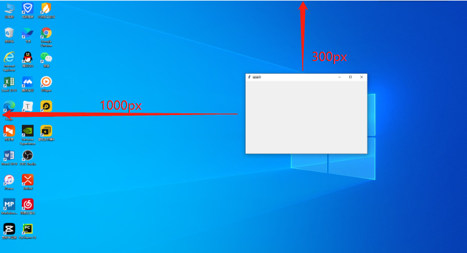

代码很简单只有5行：
- 第一行是导入tkinter
- 第二行是调用TK()方法初始化一个主窗口实例命名为主窗口
- 第三行是调用title()方法设置标题文字
- 第四行是调用用geometry()方法设置窗口的大小与位置
- 第五行则是调用mainloop()将窗口置于主循环中，除非用户关闭，否则程序始终处于运行状态。

这里我们主要看下第四行 geometry()方法:

这个方法设置的单位是像素，'500x300' 表示创建一个宽500像素，高300像素的窗口。这里注意啦注意中间的乘号是小写字母x，不是* 。

这里位置可以用加号+设置，也可以通过减号设置。如果X前面是+号则是表示窗口距离屏幕左边的距离，如果是-号则是表示窗口距离屏幕右边的距离，Y前面是+号则是表示窗口距离屏幕上方的距离，-号则表示窗口距离屏幕下方的距离。

其实平时设置位置一般都是加号+居多，减号-的方式相对较少。大家平时用只需要使用加号+的方式设置布局就可以了。

这里注意一点，如果要设置位置必须同时设置X跟Y的值，不能只设置其中一个，会报错。下面这种方法是不可取的。 上代码：

```python
main_window.geometry('500x300+1000')  # 错误！
```

上面我们创建了一个空白的窗口，窗口里没有任何东西，也没什么交互，所以要想实现交互，我们就需要往窗口里添加tkinter的重要组成-控件。

我们上一篇是在窗口添加了一个按钮，并且点击按钮会弹出对话框。我们回顾下代码：

运行下看看，一个带按钮的窗口就出现了。

点下按钮：

```python
import tkinter as tk  # 导入tkinter模块
import win32api
import win32con

def show_message():
    win32api.MessageBox(0, "跟我学Python搞副业", "我是渣男教父", win32con.MB_OK | win32con.MB_ICONWARNING)

main_window = tk.Tk()  # 创建根窗体
main_window.title('消消乐')  # 设置窗口标题
main_window.geometry('500x300+1000+300')  # 大小为500*300，x坐标为1000，y坐标为300

my_button = tk.Button(main_window, text='点我显示消息', command=show_message)
# 默认布局显示按钮
my_button.pack()

main_window.mainloop()  # 放入主循环
```


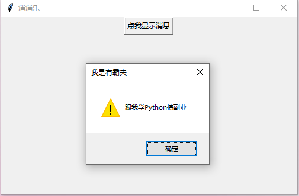

## 常用控件

tkinter 提供了各种控件，如按钮、标签和文本框都是属于控件的一种。

目前tkinter 有19种控件，如下列表:

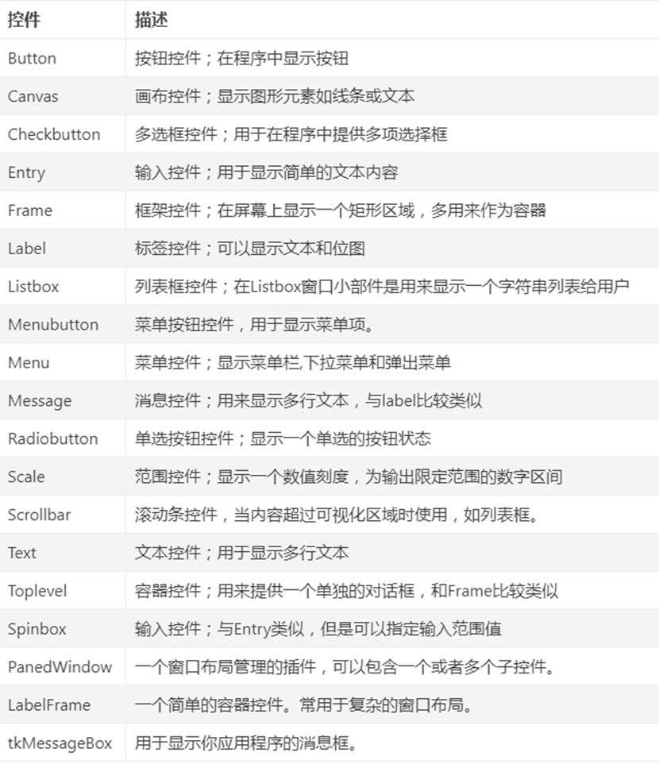

在窗体上呈现的可视化控件，通常包括尺寸、颜色、字体、相对位置、浮雕样式、图标样式和悬停光标形状等共同属性。不同的控件由于形状和功能不同，又有其特征属性。在初始化根窗体和根窗体主循环之间，可实例化窗体控件，并设置其属性。父容器可为根窗体或其他容器控件实例。常见的控件共同属性如下表：

## Label-标签控件

Label是标签控件，这个控件非常实用。一般用于显示简单的文本和位图。

我们现在将前面的空白窗口完善下，加上一个Label显示下微信看看:

```python
import tkinter as tk  # 导入tkinter模块

main_window = tk.Tk()  # 创建根窗体
main_window.title('消消乐')  # 设置窗口标题
main_window.geometry('500x300+1000+300')  # 大小为500*300，x坐标为1000，y坐标为300

my_label = tk.Label(main_window, text='我是渣男教父',
                    bg='#d3fbfb',
                    fg='red',
                    font=('华文新魏', 32),
                    width=20,
                    height=2)
my_label.pack()

main_window.mainloop()  # 放入主循环
```

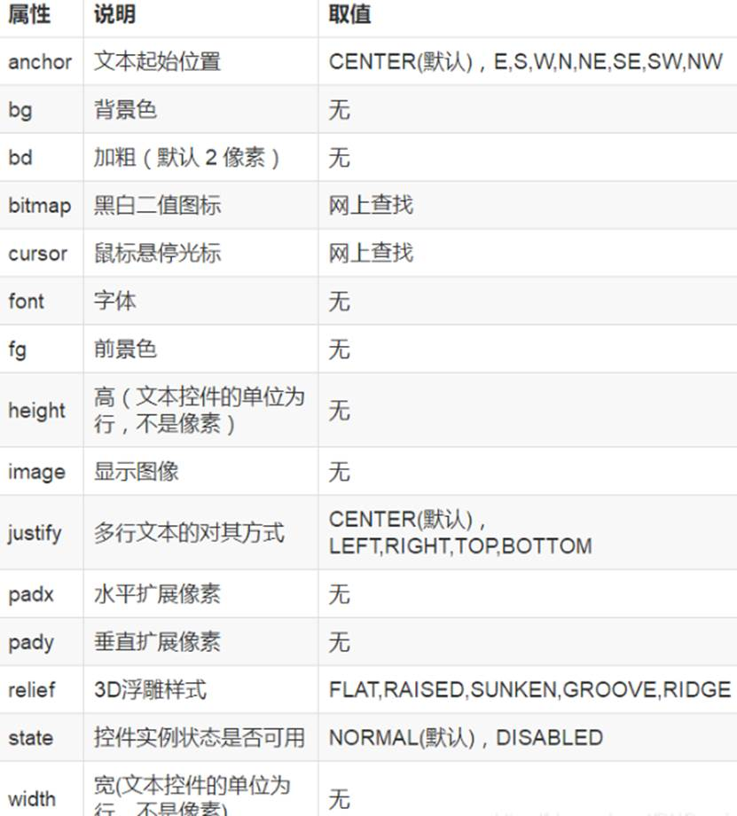

运行下看看：

其中，标签实例【my_label】在父容器main_window中实例化，具有代码中所示的text（文本）、bg（背景色）、fg(前景色)、font（字体）、width（宽，默认以字符为单位）、height（高，默认以字符为单位）等一系列属性。

在实例化控件时，实例的属性可以"属性=属性值"的形式枚举列出，不区分先后次序。比如："text='我是第一个标签'"显示标签的文本内容，"bg='#d3fbfb'"设置背景色为十六进制数RGB色 #d3fbfb等等。属性值通常用文本形式表示。

看了这么多属性描述可能会觉得信息量较大，这是为了展示下标签具有哪些属性，其实平时用我们还可以简单设置text属性就可以了，也够用了，如果有特殊需求再根据上面表里的属性再详细调整，接下来我再添加一个简单的[我是标签2] 的Label 控件：

运行下大家看下效果：

```python
import tkinter as tk  # 导入tkinter模块

main_window = tk.Tk()  # 创建根窗体
main_window.title('消消乐')  # 设置窗口标题
main_window.geometry('500x300+1000+300')  # 大小为500*300，x坐标为1000，y坐标为300

my_label = tk.Label(main_window, text='我是渣男教父',
                    bg='#d3fbfb',
                    fg='red',
                    font=('华文新魏', 32),
                    width=20,
                    height=2)
my_label.pack()

my_label2 = tk.Label(main_window, text='Python创富就找我')
my_label2.pack()

main_window.mainloop()  # 放入主循环
```

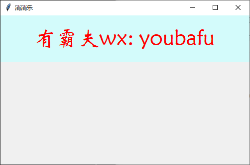

上面提到了Label还能载入图片，可以通过tkinter.PhotoImage()来显示图片。这里我们也演示一下：

运行下看看：

```python
import tkinter as tk  # 导入tkinter模块

main_window = tk.Tk()  # 创建根窗体
main_window.title('消消乐')  # 设置窗口标题
main_window.geometry('500x300+1000+300')  # 大小为500*300，x坐标为1000，y坐标为300

my_label = tk.Label(main_window, text='我是渣男教父',
                    bg='#d3fbfb',
                    fg='red',
                    font=('华文新魏', 32),
                    width=20,
                    height=2)
my_label.pack()

my_label2 = tk.Label(main_window, text='讲课就是好')
my_label2.pack()

image_path = r'E:\girl.png'
image = tk.PhotoImage(file=image_path)  # file设置显示图片的路径
my_image = tk.Label(main_window, image=image)  # image属性指定显示的图片
my_image.pack()

main_window.mainloop()  # 放入主循环
```

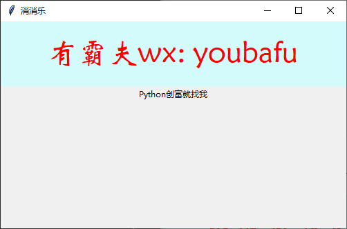

注意官方文档说tkinter.PhotoImage()仅支持 GIF and PGM/PPM 文件格式(实测PNG图片也支持), 但是不支持其他BMP，JPG等一些图片格式，不过也可以通过导入PIL库来显示其他格式的图片，这里就不详细展开了，可以自己课后试下。

大家可能关注到了，标签是实例化以后，都有调用到pack()方法，这是一个布局方法，会将控件从上到下的顺序依次排列控件，这里暂不详细介绍，等我们学习完另外两个控件后老师再来介绍这几种布局方法。

## Button-按钮控件

Button主要是为响应鼠标单击事件触发运行程序所设的，故其除控件共有属性外，属性command是最为重要的属性。通常将按钮要触发执行的程序以函数形式预先定义，然后可以用以下两种方法调用函数。

1. **直接调用函数**。参数表达式为 `command=函数名`，注意函数名后面不要加括号，也不能传递参数。如`command=run1`：
2. **利用匿名函数调用函数和传递参数**。参数的表达式为"command=lambda":函数名（参数列表）。比如"command=lambda:run2(inp1.get(),inp2.get())"。

我们上面已经举了一个例子通过点击按钮弹出一个对话框，也是使用的第一种直接调用函数的方式。平时第一种方法也用得比较多，第二种利用匿名函数调用函数和传递参数的形式相对来说用得较少，这里就不细说。

我们着重强化下第一种调用函数的方法。上面我们也学习了Label的用法，那我们结合下Label和Button写一个简单的例子，当点击Button的时候，Label框中显示1-100之间的随机数。上代码：

```python
import random
import tkinter as tk  # 导入tkinter模块

def random_number():
    num = random.randint(1, 100)
    my_label['text'] = str(num)

main_window = tk.Tk()  # 创建根窗体
main_window.title('消消乐')  # 设置窗口标题
main_window.geometry('500x300+1000+300')  # 大小为500*300，x坐标为1000，y坐标为300

my_label = tk.Label(main_window, text='带你Python创富',
                    bg='#d3fbfb',
                    fg='red',
                    font=('华文新魏', 32),
                    width=20,
                    height=2)
my_label.pack()

my_button = tk.Button(main_window, text='点我随机数', command=random_number)
my_button.pack()

main_window.mainloop()  # 放入主循环
```

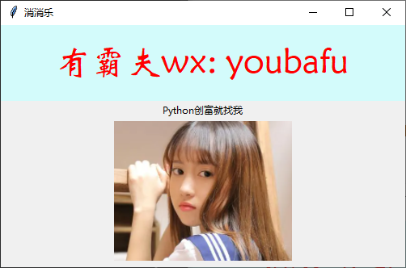

运行下看看：

点击按钮，上面Label控件中就可以显示随机数了。

Button按钮的状态有：'normal','active','disabled'

注意：当Button 状态为disabled时，按钮点击是无效的。 上代码：

```python
my_button = tk.Button(main_window, text='点我随机数', state=tk.DISABLED, command=random_number)
```

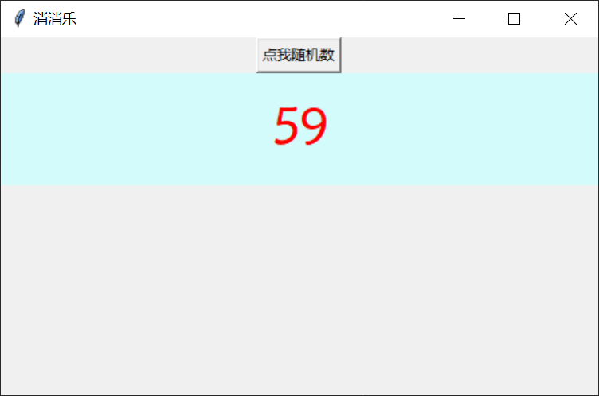

## Text-文本框

Text文本框控件一般用于显示多行文本。

文本框的常用方法如下：

### 设置Text的内容

使用insert方法设置Text的内容，insert方法的格式：insert(位置，字符串)

位置一般用字符串表示：
- `text.insert('end', s)` - 该方法是将字符串s插入到text的末尾，原来的内容不变；
- `text.insert('insert', s)` - 该方法是将字符串s插入到鼠标点击的地方；
- `text.insert('0.0', s)` - 该方法是将字符串s插入文本框开头；

'end'和'insert' 在tkinter都有定义，也可以通过tkinter调用：
- `text.insert(tkinter.END, s)`
- `text.insert(tkinter.INSERT, s)`

这里再跟大家说个小技巧，我们按住Ctrl后点击tkinter.END可以查看下它的声明，其实它就是'end'。

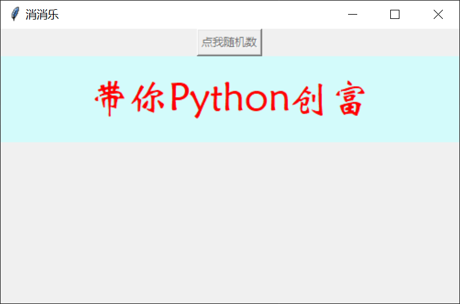

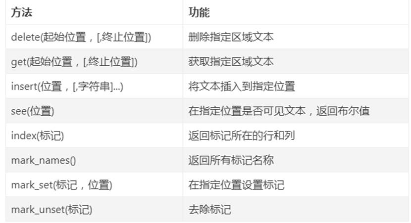

我们写个小例子看看：

```python
import tkinter as tk  # 导入tkinter模块

main_window = tk.Tk()  # 创建根窗体
main_window.title('消消乐')  # 设置窗口标题
main_window.geometry('500x300+1000+300')  # 大小为500*300，x坐标为1000，y坐标为300

my_text = tk.Text(main_window)
my_text.pack()

my_text.insert('insert', "我是渣男教父，")  # 鼠标点击处插入
my_text.insert('0.0', "带你Python创富，")  # 文本框开头插入
my_text.insert(tk.END, "wx:youbafu，")  # 文本框末尾插入

main_window.mainloop()  # 放入主循环
```

### 获取Text文本内容

使用 `text.get('0.0','end')` 获取text中现有的全部内容；

直接上代码看看：

```python
import tkinter as tk  # 导入tkinter模块

main_window = tk.Tk()  # 创建根窗体
main_window.title('消消乐')  # 设置窗口标题
main_window.geometry('500x300+1000+300')  # 大小为500*300，x坐标为1000，y坐标为300

my_text = tk.Text(main_window)
my_text.pack()

my_text.insert('insert', "我是渣男教父，")  # 鼠标点击处插入
my_text.insert('0.0', "带你Python创富，")  # 文本框末尾插入
my_text.insert(tk.END, "wx:youbafu，")  # 文本框末尾插入

print(my_text.get('0.0', 'end'))

main_window.mainloop()  # 放入主循环
```


### 删除Text文本内容

使用 `text.delete('1.0','end')`：该方法是将text文本内的内容全部清空。

我们结合Button写个小例子, 点击按钮清空文本框中的内容：

```python
import tkinter as tk  # 导入tkinter模块

def clear_text():
    my_text.delete('1.0', 'end')

main_window = tk.Tk()  # 创建根窗体
main_window.title('消消乐')  # 设置窗口标题
main_window.geometry('500x300+1000+300')  # 大小为500*300，x坐标为1000，y坐标为300

my_button = tk.Button(main_window, text='清空文本框', command=clear_text)
my_button.pack()

my_text = tk.Text(main_window)
my_text.pack()

my_text.insert('insert', "我是渣男教父，")  # 鼠标点击处插入
my_text.insert('0.0', "带你Python创富，")  # 文本框末尾插入
my_text.insert(tk.END, "wx:youbafu，")  # 文本框末尾插入

main_window.mainloop()  # 放入主循环
```

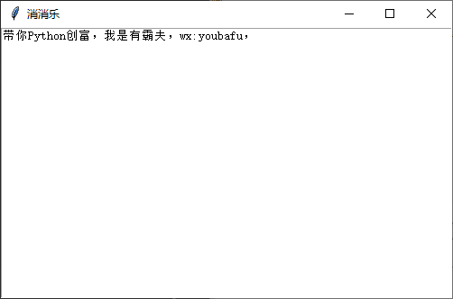

这里需要注意获取时间()的函数必须放在主窗口.mainloop() 之前，否则它是不会执行的。

## 控件布局

控件的布局通常有pack() 、 place()和grid() 三种方法。

### pack()方法

Pack（）是一种简单的布局方法，如果不加参数的默认方式，将按布局语句的先后，以最小占用空间的方式自上而下地排列控件实例，并且保持控件本身的最小尺寸。

运行看效果：

```python
import tkinter as tk  # 导入tkinter模块

main_window = tk.Tk()  # 创建根窗体
main_window.title('消消乐')  # 设置窗口标题
main_window.geometry('500x300+1000+300')  # 大小为500*300，x坐标为1000，y坐标为300

my_label = tk.Label(main_window, text='我是渣男教父', bg='red')
my_label.pack()

my_label2 = tk.Label(main_window, text='微信:youbafu', bg='blue', fg='white')
my_label2.pack()

my_button = tk.Button(main_window, text='跟紧我！！！')
my_button.pack()

main_window.mainloop()  # 放入主循环
```

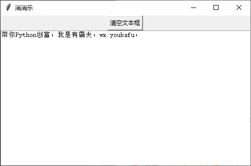

### place()方法

place（）方法是根据控件实例在父容器中的绝对或相对位置参数进行布局。其常用布局参数如下：

- x,y：控件实例在根窗体中水平和垂直方向上的其实位置（单位为像素）。注意，根窗体左上角为0,0,水平向右，垂直向下为正方向。
- relx,rely：控件实例在根窗体中水平和垂直方向上起始布局的相对位置。即相对于根窗体宽和高的比例位置，取值在0.0~1.0 之间。
- height,width：控件实例本身的高度和宽度（单位为像素）。
- relheight,relwidth：控件实例相对于根窗体的高度和宽度比例，取值在0.0~1.0 之间。

利用place()方法配合relx,rely和relheight,relwidth参数所得的到的界面可自适应根窗体尺寸的大小。place()方法与grid()方法可以混合使用。 上代码：

```python
import tkinter as tk  # 导入tkinter模块

main_window = tk.Tk()  # 创建根窗体
main_window.title('消消乐')  # 设置窗口标题
main_window.geometry('500x300+1000+300')  # 大小为500*300，x坐标为1000，y坐标为300

text_box = tk.Text(main_window, bg='#d3fbfb', fg='red')
text_box.insert(tk.END, "我的水平起始位置相对窗体 0.2，垂直起始位置为绝对位置 80 像素，我的高度是窗体高度的0.4，宽度是200像素")
text_box.place(relx=0.2, y=80, relheight=0.4, width=200)

main_window.mainloop()
```

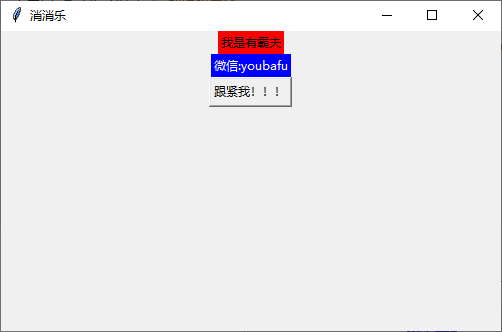

### grid()方法

grid()方法是基于网格的布局。先虚拟一个二维表格，再在该表格中布局控件实例。由于在虚拟表格的单元中所布局的控件实例大小不一，单元格也没有固定或均一的大小，因此其仅用于布局的定位。pack()方法与grid()方法不能混合使用。

我们本次课程暂时没用到Grid布局，这里就不细表了。

## 多线程

多线程类似于同时执行多个不同程序，多线程运行有如下优点：

- 使用线程可以把占据长时间的程序中的任务放到后台去处理。
- 用户界面可以更加吸引人，比如用户点击了一个按钮去触发某些事件的处理，可以弹出一个进度条来显示处理的进度。
- 程序的运行速度可能加快。
- 在一些等待的任务实现上如用户输入、文件读写和网络收发数据等，线程就比较有用了。在这种情况下我们可以释放一些珍贵的资源如内存占用等等。

每个独立的线程有一个程序运行的入口、顺序执行序列和程序的出口。但是线程不能够独立执行，必须依存在应用程序中，由应用程序提供多个线程执行控制。

### 线程模块 threading

Python3 线程中常用的两个模块为：_thread 和 threading(推荐使用)

thread 模块已被废弃。用户可以使用 threading 模块代替。所以，在 Python3 中不能再使用"thread" 模块。为了兼容性，Python3 将 thread 重命名为 "_thread"。

_thread 提供了低级别的、原始的线程以及一个简单的锁，它相比于 threading 模块的功能还是比较有限的。

threading 模块除了包含 _thread 模块中的所有方法外，还提供的其他方法：

- `threading.currentThread()`: 返回当前的线程变量。
- `threading.enumerate()`: 返回一个包含正在运行的线程的list。正在运行指线程启动后、结束前，不包括启动前和终止后的线程。

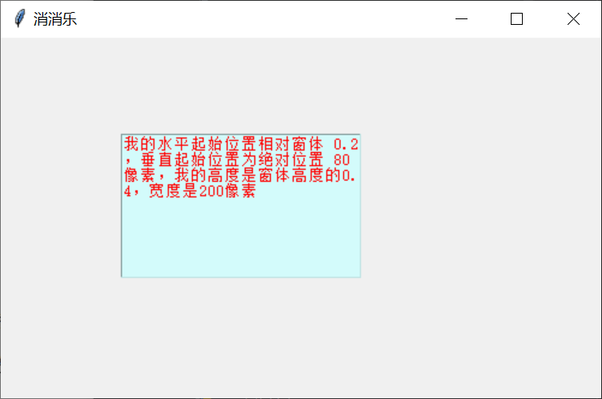

- `threading.activeCount()`: 返回正在运行的线程数量，与len(threading.enumerate())有相同的结果。

除了使用方法外，线程模块同样提供了Thread类来处理线程，Thread类提供了以下方法:

- `run()`: 用以表示线程活动的方法。
- `start()`: 启动线程活动。
- `join([time])`: 等待至线程中止。这阻塞调用线程直至线程的join()方法被调用中止-正常退出或者抛出未处理的异常-或者是可选的超时发生。
- `isAlive()`: 返回线程是否活动的。
- `getName()`: 返回线程名。
- `setName()`: 设置线程名。

我们可以通过直接从 threading.Thread 继承创建一个新的子类，并实例化后调用 start() 方法启动新线程，即它调用了线程的 run() 方法：

```python
import threading  # 导入threading模块
import tkinter as tk  # 导入tkinter模块
import time
import datetime

# 定义线程
class MyThread(threading.Thread):
    def __init__(self, seconds):
        threading.Thread.__init__(self)
        self.max_run_seconds = seconds
    
    def run(self):
        while self.max_run_seconds > 0:
            countdown(self.max_run_seconds)
            time.sleep(1)
            self.max_run_seconds -= 1

# 开启游戏线程
def start_thread():
    my_text.insert(tk.END, '渣男教父时间开始：\n')
    my_text.update()
    operation_thread = MyThread(10)
    operation_thread.start()

def countdown(seconds):
    my_text.insert(tk.END, str(seconds) + '\n')
    my_text.update()

main_window = tk.Tk()  # 创建根窗体
main_window.title('消消乐')  # 设置窗口标题
main_window.geometry('500x300+1000+300')  # 大小为500*300，x坐标为1000，y坐标为300

my_text = tk.Text(main_window)
my_text.pack()

timer_thread = MyThread(10)
timer_thread.start()

main_window.mainloop()  # 放入主循环
```

运行一下：

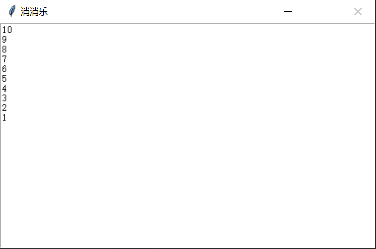

## 统合知识点

前面学习了用户图形界面，我们现在结合所学的知识来做一个比较复杂的小案例，把函数，界面，跟线程都复习一下。要求是这样的：使用GUI创建一个界面有开始跟结束按钮，跟一个Text控件，点开始就在Text框中输出当前时间和运行中，当前时间一直要在第一行，点停止则结束输出时间。右上角显示一个颜值Label标签，颜值随着时间随机改变。

实现代码如下：

```python
import datetime
import time
import random
import threading
import tkinter as tk
from tkinter.messagebox import askyesno

main_window = tk.Tk()
log_output = tk.Text(main_window)
beauty_label = tk.Label(main_window, text='渣男教父的颜值：\n100')
need_run = True

# 初始化界面
```

## 练习题

1. **（多选题）** Label控件可以通过tkinter.PhotoImage()方法直接载入下面哪些图像：
   - A、animal.png
   - B、girl.bmp
   - C、dog.jpg
   - D、cat.gif

2. **（单选题）** Text控件中现在已有文本'我是渣男教父，'，我们能通过以下哪段代码在文本的最后面插入'带你python创富' 这个字符串：
   - A、text.insert('insert', '带你python创富')
   - B、text.insert(tkinter.INSERT, '带你python创富')
   - C、text.insert('end', '带你python创富')
   - D、text.insert('0.0', '带你python创富')

3. **（单选题）** 我们在横线上填入哪个选项，可以使主窗口显示出来：
   - A、start
   - B、mainloop
   - C、begin
   - D、finish

```python
import tkinter as tk

main_window = tk.Tk()
main_window.title('知识星球见')
main_window.geometry('200x300')
main_window.______()
```